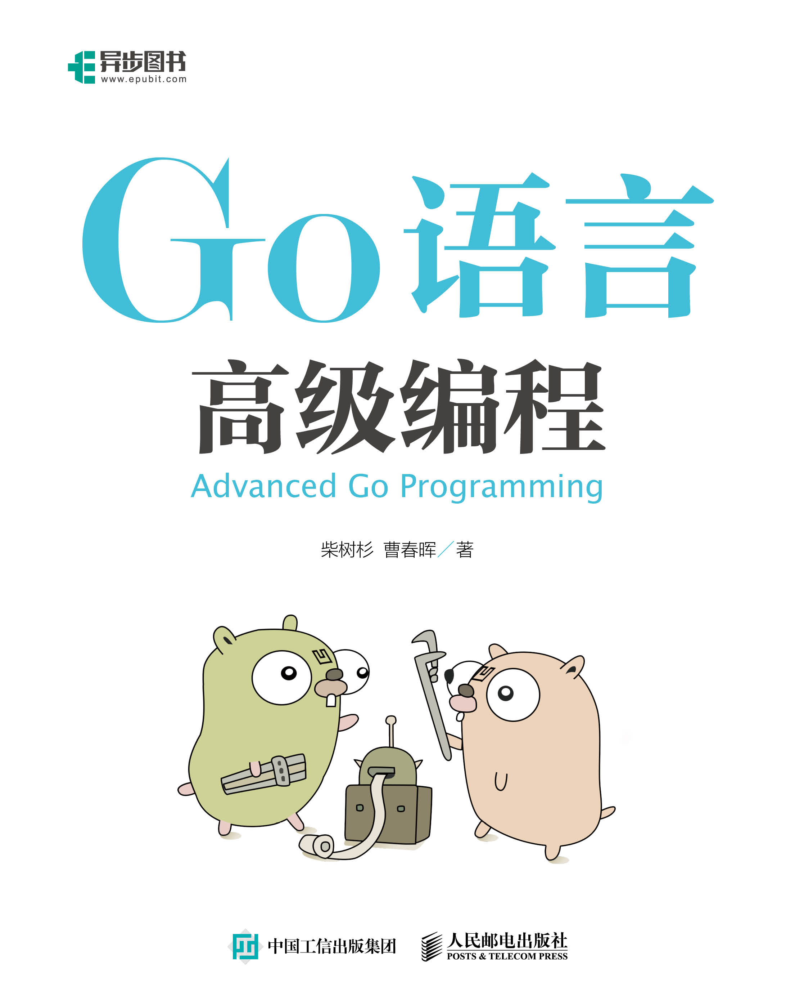

# Go语言高级编程 (Advanced Go Programming)

*推广: [《WebAssembly标准入门》开始预售了，欢迎关注！](https://github.com/chai2010/awesome-wasm-zh/blob/master/webassembly-primer.md)([京东购买](https://item.jd.com/12499372.html))*

*推广: 欢迎关注 [光谷码农·每日新闻](https://guanggu-coder.cn/)*

----

本书涵盖CGO、Go汇编语言、RPC实现、Web框架实现、分布式系统等高阶主题，针对Go语言有一定经验想深入了解Go语言各种高级用法的开发人员。对于刚学习Go语言的读者，建议先从[《Go语言圣经》](https://github.com/golang-china/gopl-zh)开始系统学习Go语言的基础知识。如果希望了解Go2的最新动向，可以参考[《Go2编程指南》](https://github.com/chai2010/go2-book)。

- 作者：柴树杉，Github [@chai2010](https://github.com/chai2010)，Twitter [@chaishushan](https://twitter.com/chaishushan)，主页 https://chai2010.cn/about
- 作者：曹春晖，Github [@cch123](https://github.com/cch123)，主页 [xargin](http://xargin.com)
- 网址：https://github.com/chai2010/advanced-go-programming-book
- Star历史：https://starcharts.herokuapp.com/chai2010/advanced-go-programming-book.svg

## 在线阅读

- [SUMMARY.md](SUMMARY.md)
- https://chai2010.cn/advanced-go-programming-book/
- https://www.gitbook.com/book/chai2010/advanced-go-programming-book/

## 相关文章

1. [GopherChina 2019大会推荐书单来啦](https://zhuanlan.zhihu.com/p/63910336)
1. [深入Go的底层，带你走近一群有追求的人](https://mp.weixin.qq.com/s/obnnVkO2EiFnuXk_AIDHWw)

## 相关报告

1. [Go语言简介](https://talks.godoc.org/github.com/chai2010/awesome-go-zh/chai2010/chai2010-golang-intro.slide) - [chai2010](https://github.com/chai2010/awesome-go-zh/tree/master/chai2010) 武汉·黄鹤会 2018/12/16
1. [GIAC: 2018 - Go 语言将要走向何方？](https://github.com/chai2010/awesome-go-zh/blob/master/chai2010/giac2018) - [chai2010](https://github.com/chai2010/awesome-go-zh/tree/master/chai2010) 上海·GIAC全球互联网架构大会 2018/11/23
1. [Go语言并发编程](https://talks.godoc.org/github.com/chai2010/awesome-go-zh/chai2010/chai2010-golang-concurrency.slide) - [chai2010](https://github.com/chai2010/awesome-go-zh/tree/master/chai2010) 武汉·光谷猫友会 2018/09/16, [整理01](https://mp.weixin.qq.com/s/UaY9gJU85dq-dXlOhLYY1Q)/[整理02](https://mp.weixin.qq.com/s/_aKNO-H11GEDA-l0rycfQQ)
1. 深入CGO编程: https://github.com/chai2010/gopherchina2018-cgo-talk

## 关注微信公众号 (guanggu-coder)

## 开发者头条号

https://toutiao.io/subjects/318517

## 版权声明

 Go语言高级编程 由 <a xmlns:cc="http://creativecommons.org/ns#" href="https://github.com/chai2010/advanced-go-programming-book" property="cc:attributionName" rel="cc:attributionURL">柴树杉，曹春晖</a> 采用 <a rel="license" href="http://creativecommons.org/licenses/by-nc-nd/4.0/">知识共享 署名-非商业性使用-禁止演绎 4.0 国际 许可协议</a>进行许可。

严禁任何商业行为使用或引用该文档的全部或部分内容！

欢迎大家提供建议！

----

## 鸣谢

感谢大家提供 PR！以下排名不分先后：

<!--
1. get contributors.json
https://api.github.com/repos/chai2010/advanced-go-programming-book/contributors

2. go run gen_contributors.go
3. replace contributors table
-->

| [ <b>fuwensun</b>](https://github.com/fuwensun) | [ <b>qichengzx</b>](https://github.com/qichengzx) | [ <b>lewgun</b>](https://github.com/lewgun) | [ <b>LaoK996</b>](https://github.com/LaoK996) | [ <b>plpan</b>](https://github.com/plpan) | [ <b>xiaoliwang</b>](https://github.com/xiaoliwang) | [ <b>barryz</b>](https://github.com/barryz) |
| :---: | :---: | :---: | :---: | :---: | :---: | :---: |
| [ <b>alphayan</b>](https://github.com/alphayan) | [ <b>leobuzhi</b>](https://github.com/leobuzhi) | [ <b>iikira</b>](https://github.com/iikira) | [ <b>fognome</b>](https://github.com/fognome) | [ <b>darren</b>](https://github.com/darren) | [ <b>jiayx</b>](https://github.com/jiayx) | [ <b>orangle</b>](https://github.com/orangle) |
| [ <b>yangtaooo</b>](https://github.com/yangtaooo) | [ <b>bcb51</b>](https://github.com/bcb51) | [ <b>mathrobot</b>](https://github.com/mathrobot) | [ <b>7535</b>](https://github.com/7535) | [ <b>cloverstd</b>](https://github.com/cloverstd) | [ <b>douglarek</b>](https://github.com/douglarek) | [ <b>RealDeanZhao</b>](https://github.com/RealDeanZhao) |
| [ <b>yyt030</b>](https://github.com/yyt030) | [ <b>yuqaf1989</b>](https://github.com/yuqaf1989) | [ <b>BeccaBecca</b>](https://github.com/BeccaBecca) | [ <b>cloudzhou</b>](https://github.com/cloudzhou) | [ <b>ezioruan</b>](https://github.com/ezioruan) | [ <b>hacknode</b>](https://github.com/hacknode) | [ <b>Frozen-Shadow</b>](https://github.com/Frozen-Shadow) |

----

https://api.github.com/repos/chai2010/advanced-go-programming-book/contributors
