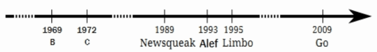

# 1.1 Go语言创世纪

Go语言最初由Google公司的Robert Griesemer、Ken Thompson和Rob Pike三个大牛于2007年开始设计发明，设计新语言的最初的洪荒之力来自于对超级复杂的C++11特性的吹捧报告的鄙视，最终的目标是设计网络和多核时代的C语言。到2008年中期，语言的大部分特性设计已经完成，并开始着手实现编译器和运行时，大约在这一年Russ Cox作为主力开发者加入。到了2009年，Go语言已经逐步趋于稳定。同年9月，Go语言正式发布并开源了代码。

Go语言很多时候被描述为“类C语言”，或者是“21世纪的C语言”。从各种角度看，Go语言确实是从C语言继承了相似的表达式语法、控制流结构、基础数据类型、调用参数传值、指针等诸多编程思想，还有彻底继承和发扬了C语言简单直接的暴力编程哲学等。图1-1是《Go语言圣经》中给出的Go语言的基因图谱，我们可以从中看到有哪些编程语言对Go语言产生了影响。


*图 1-1 Go语言基因族谱*

首先看基因图谱的左边一支。可以明确看出Go语言的并发特性是由贝尔实验室的Hoare于1978年发布的CSP理论演化而来。其后，CSP并发模型在Squeak/NewSqueak和Alef等编程语言中逐步完善并走向实际应用，最终这些设计经验被消化并吸收到了Go语言中。业界比较熟悉的Erlang编程语言的并发编程模型也是CSP理论的另一种实现。

再看基因图谱的中间一支。中间一支主要包含了Go语言中面向对象和包特性的演化历程。Go语言中包和接口以及面向对象等特性则继承自Niklaus Wirth所设计的Pascal语言以及其后所衍生的相关编程语言。其中包的概念、包的导入和声明等语法主要来自于Modula-2编程语言，面向对象特性所提供的方法的声明语法等则来自于Oberon编程语言。最终Go语言演化出了自己特有的支持鸭子面向对象模型的隐式接口等诸多特性。

最后是基因图谱的右边一支，这是对C语言的致敬。Go语言是对C语言最彻底的一次扬弃，不仅仅是语法和C语言有着很多差异，最重要的是舍弃了C语言中灵活但是危险的指针运算。而且，Go语言还重新设计了C语言中部分不太合理运算符的优先级，并在很多细微的地方都做了必要的打磨和改变。当然，C语言中少即是多、简单直接的暴力编程哲学则被Go语言更彻底地发扬光大了（Go语言居然只有25个关键字，sepc语言规范还不到50页)）。

Go语言其它的一些特性零散地来自于其他一些编程语言；比如iota语法是从APL语言借鉴，词法作用域与嵌套函数等特性来自于Scheme语言（和其他很多编程语言）。Go语言中也有很多自己发明创新的设计。比如Go语言的切片为轻量级动态数组提供了有效的随机存取的性能，这可能会让人联想到链表的底层的共享机制。还有Go语言新发明的defer语句（Ken发明）也是神来之笔。

## 1.1.1 来自贝尔实验室特有基因

作为Go语言标志性的并发编程特性则来自于贝尔实验室的Tony Hoare于1978年发表的鲜为外界所知的关于并发研究的基础文献：顺序通信进程（communicating sequential processes ，缩写为CSP）。在最初的CSP论文中，程序只是一组没有中间共享状态的平行运行的处理过程，它们之间使用管道进行通信和控制同步。Tony Hoare的CSP并发模型只是一个用于描述并发性基本概念的描述语言，它并不是一个可以编写可执行程序的通用编程语言。

CSP并发模型最经典的实际应用是来自爱立信发明的Erlang编程语言。不过在Erlang将CSP理论作为并发编程模型的同时，同样来自贝尔实验室的Rob Pike以及其同事也在不断尝试将CSP并发模型引入当时的新发明的编程语言中。他们第一次尝试引入CSP并发特性的编程语言叫Squeak（老鼠的叫声），是一个用于提供鼠标和键盘事件处理的编程语言，在这个语言中管道是静态创建的。然后是改进版的Newsqueak语言（新版老鼠的叫声），新提供了类似C语言语句和表达式的语法，还有类似Pascal语言的推导语法。Newsqueak是一个带垃圾回收的纯函数式语言，它再次针对键盘、鼠标和窗口事件管理。但是在Newsqueak语言中管道已经是动态创建的，管道属于第一类值、可以保存到变量中。然后是Alef编程语言（Alef也是C语言之父Ritchie比较喜爱的编程语言），Alef语言试图将Newsqueak语言改造为系统编程语言，但是因为缺少垃圾回收机制而导致并发编程很痛苦（这也是继承C语言手工管理内存的代价）。在Aelf语言之后还有一个叫Limbo的编程语言（地狱的意思），这是一个运行在虚拟机中的脚本语言。Limbo语言是Go语言最接近的祖先，它和Go语言有着最接近的语法。到设计Go语言时，Rob Pike在CSP并发编程模型的实践道路上已经积累了几十年的经验，关于Go语言并发编程的特性完全是信手拈来，新编程语言的到来也是水到渠成了。

图1-2展示了Go语言库早期代码库日志可以看出最直接的演化历程（Git用`git log --before={2008-03-03} --reverse`命令查看）。


*图 1-2 Go语言开发日志*

从早期提交日志中也可以看出，Go语言是从Ken Thompson发明的B语言、Dennis M. Ritchie发明的C语言逐步演化过来的，它首先是C语言家族的成员，因此很多人将Go语言称为21世纪的C语言。

图1-3是Go语言中来自贝尔实验室特有并发编程基因的演化过程：



*图 1-3 Go语言并发演化历史*

纵观整个贝尔实验室的编程语言的发展进程，从B语言、C语言、Newsqueak、Alef、Limbo语言一路走来，Go语言继承了来着贝尔实验室的半个世纪的软件设计基因，终于完成了C语言革新的使命。纵观这几年来的发展趋势，Go语言已经成为云计算、云存储时代最重要的基础编程语言。

## 1.1.2 你好, 世界

按照惯例，介绍所有编程语言的第一个程序都是“Hello, World!”。虽然本教假设读者已经了解了Go语言，但是我们还是不想打破这个惯例（因为这个传统正是从Go语言的前辈C语言传承而来的）。下面的代码展示的Go语言程序输出的是中文“你好, 世界!”。

```Go
package main

import "fmt"

func main() {
	fmt.Println("你好, 世界!")
}
```

将以上代码保存到`hello.go`文件中。因为代码中有非ASCII的中文字符，我们需要将文件的编码显式指定为无BOM的UTF8编码格式（源文件采用UTF8编码是Go语言规范所要求的）。然后进入命令行并切换到`hello.go`文件所在的目录。目前我们可以将Go语言当作脚本语言，在命令行中直接输入`go run hello.go`来运行程序。如果一切正常的话。应该可以在命令行看到输出"你好, 世界!"的结果。

现在，让我们简单介绍一下程序。所有的Go程序，都是由最基本的函数和变量构成，函数和变量被组织到一个个单独的Go源文件中，这些源文件再按照作者的意图组织成合适的package，最终这些package再有机地组成一个完整的Go语言程序。其中，函数用于包含一系列的语句(指明要执行的操作序列)，以及执行操作时存放数据的变量。我们这个程序中函数的名字是main。虽然Go语言中，函数的名字没有太多的限制，但是main包中的main函数默认是每一个可执行程序的入口。而package则用于包装和组织相关的函数、变量和常量。在使用一个package之前，我们需要使用import语句导入包。例如，我们这个程序中导入了fmt包（fmt是format单词的缩写，表示格式化相关的包），然后我们才可以使用fmt包中的Println函数。

而双引号包含的“你好, 世界!”则是Go语言的字符串面值常量。和C语言中的字符串不同，Go语言中的字符串内容是不可变更的。在以字符串作为参数传递给fmt.Println函数时，字符串的内容并没有被复制——传递的仅仅是字符串的地址和长度（字符串的结构在`reflect.StringHeader`中定义）。在Go语言中，函数参数都是以复制的方式(不支持以引用的方式)传递（比较特殊的是，Go语言闭包函数对外部变量是以引用的方式使用）。

