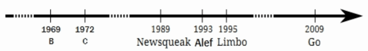
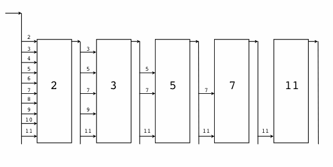
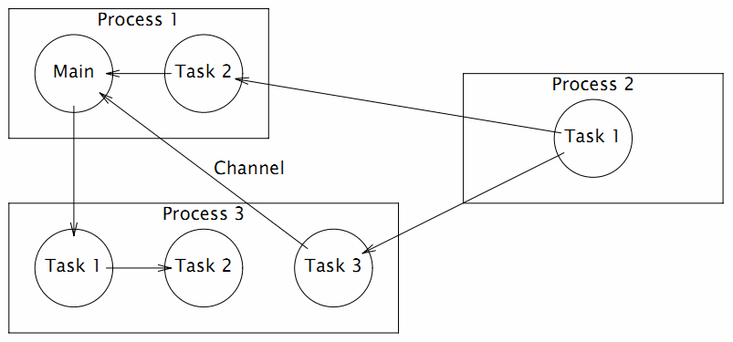

# 1.2 Hello, World 的革命

在创世纪章节中我们简单介绍了 Go 语言的演化基因族谱，对其中来自于贝尔实验室的特有并发编程基因做了重点介绍，最后引出了 Go 语言版的“Hello, World”程序。其实“Hello, World”程序是展示各种语言特性的最好的例子，是通向该语言的一个窗口。这一节我们将沿着各个编程语言演化的时间轴，简单回顾下“Hello, World”程序是如何逐步演化到目前的 Go 语言形式、最终完成它的革命使命的。



*图 1-4 Go 语言并发演化历史*

## 1.2.1 B 语言 - Ken Thompson, 1972

首先是 B 语言，B 语言是 Go 语言之父贝尔实验室的 *Ken Thompson* 早年间开发的一种通用的程序设计语言，设计目的是为了用于辅助 UNIX 系统的开发。但是因为B语言缺乏灵活的类型系统导致使用比较困难。后来，*Ken Thompson* 的同事 *Dennis Ritchie* 以 B 语言为基础开发出了 C 语言，C 语言提供了丰富的类型，极大地增加了语言的表达能力。到目前为止它依然是世界上最常用的程序语言之一。而B语言自从被它取代之后，则就只存在于各种文献之中，成为了历史。

目前见到的 B 语言版本的“Hello World”，一般认为是来自于 *Brian W. Kernighan* 编写的 B 语言入门教程（Go 核心代码库中的第一个提交者名字正是 *Brian W. Kernighan*），程序如下：

```c
main() {
	extrn a, b, c;
	putchar(a); putchar(b); putchar(c);
	putchar('!*n');
}
a 'hell';
b 'o, w';
c 'orld';
```

由于 B 语言缺乏灵活的数据类型，只能分别以 `a`、`b`、`c` 全局变量来定义要输出的内容，并且每个变量的长度必须对齐到了 4 个字节（有一种写汇编语言的感觉）。然后通过多次调用 `putchar` 函数输出字符，最后的 `'!*n'` 表示输出一个换行的意思。

总体来说，B 语言简单，功能也比较简陋。

## 1.2.2 C 语言 - Dennis Ritchie, 1974 ~ 1989

C 语言是由 *Dennis Ritchie* 在 B 语言的基础上改进而来，它增加了丰富的数据类型，并最终实现了用它重写 UNIX 的伟大目标。C 语言可以说是现代 IT 行业最重要的软件基石，目前主流的操作系统几乎全部是由 C 语言开发的，许多基础系统软件也是 C 语言开发的。C 系家族的编程语言占据统治地位达几十年之久，半个多世纪以来依然充满活力。

在 *Brian W. Kernighan* 于 1974 年左右编写的 C 语言入门教程中，出现了第一个 C 语言版本的“Hello World”程序。这给后来大部分编程语言教程都以“Hello World”为第一个程序提供了惯例。第一个 C 语言版本的“Hello World”程序如下：

```c
main()
{
	printf("hello, world");
}
```

关于这个程序，有几点需要说明的：首先是 `main` 函数因为没有明确返回值类型，默认返回 `int` 类型；其次 `printf` 函数默认不需要导入函数声明即可以使用；最后 `main` 没有明确返回语句，但默认返回 0 值。在这个程序出现时，C 语言还远未标准化，我们看到的是上古时代的 C 语言语法：函数不用写返回值，函数参数也可以忽略，使用 `printf` 时不需要包含头文件等。

这个例子同样出现在了 1978 年出版的《C 程序设计语言》第一版中，作者正是 *Brian W. Kernighan* 和 *Dennis M. Ritchie*（简称 *K&R*）。书中的“Hello World”末尾增加了一个换行输出：

```c
main()
{
	printf("hello, world\n");
}
```

这个例子在字符串末尾增加了一个换行，C 语言的 `\n` 换行比 B 语言的 `'!*n'` 换行看起来要简洁了一些。

在 *K&R* 的教程面世 10 年之后的 1988 年，《C 程序设计语言》第二版终于出版了。此时 ANSI C 语言的标准化草案已经初步完成，但正式版本的文档尚未发布。不过书中的“Hello World”程序根据新的规范增加了 `#include <stdio.h>` 头文件包含语句，用于包含`printf`函数的声明（新的 C89 标准中，仅仅是针对`printf`函数而言，依然可以不用声明函数而直接使用）。

```c
#include <stdio.h>

main()
{
	printf("hello, world\n");
}
```

然后到了 1989 年，ANSI C 语言第一个国际标准发布，一般被称为 C89。C89 是流行最广泛的一个 C 语言标准，目前依然被大量使用。《C 程序设计语言》第二版的也再次印刷新版本，并针对新发布的 C89 规范建议，给 `main` 函数的参数增加了 `void` 输入参数说明，表示没有输入参数的意思。

```c
#include <stdio.h>

main(void)
{
	printf("hello, world\n");
}
```

至此，C 语言本身的进化基本完成。后面的 C92、C99、C11 都只是针对一些语言细节做了完善。因为各种历史因素， C89 依然是使用最广泛的标准。

## 1.2.3 Newsqueak - Rob Pike, 1989

Newsqueak 是 *Rob Pike* 发明的老鼠语言的第二代，是他用于实践 CSP 并发编程模型的战场。Newsqueak 是新的 squeak 语言的意思，其中 squeak 是老鼠吱吱吱的叫声，也可以看作是类似鼠标点击的声音。Squeak 是一个提供鼠标和键盘事件处理的编程语言，Squeak语言的管道是静态创建的。改进版的 Newsqueak 语言则提供了类似 C 语言语句和表达式的语法和类似 Pascal 语言的推导语法。Newsqueak 是一个带自动垃圾回收的纯函数式语言，它再次针对键盘、鼠标和窗口事件管理。但是在 Newsqueak 语言中管道是动态创建的，属于第一类值，因此可以保存到变量中。

Newsqueak 类似脚本语言，内置了一个 `print` 函数，它的“Hello World”程序看不出什么特色：

```go
print("Hello,", "World", "\n");
```

从上面的程序中，除了猜测 `print` 函数可以支持多个参数外，我们很难看到 Newsqueak 语言相关的特性。由于 Newsqueak 语言和 Go 语言相关的特性主要是并发和管道。因此，我们这里通过一个并发版本的“素数筛”算法来略窥 Newsqueak 语言的特性。“素数筛”的原理如图：



*图 1-5 素数筛*

Newsqueak 语言并发版本的“素数筛”程序如下：

```go
// 向管道输出从 2 开始的自然数序列
counter := prog(c:chan of int) {
	i := 2;
	for(;;) {
		c <-= i++;
	}
};

// 针对 listen 管道获取的数列，过滤掉是 prime 倍数的数
// 新的序列输出到 send 管道
filter := prog(prime:int, listen, send:chan of int) {
	i:int;
	for(;;) {
		if((i = <-listen)%prime) {
			send <-= i;
		}
	}
};

// 主函数
// 每个管道第一个流出的数必然是素数
// 然后基于这个新的素数构建新的素数过滤器
sieve := prog() of chan of int {
	c := mk(chan of int);
	begin counter(c);
	prime := mk(chan of int);
	begin prog(){
		p:int;
		newc:chan of int;
		for(;;){
			prime <-= p =<- c;
			newc = mk();
			begin filter(p, c, newc);
			c = newc;
		}
	}();
	become prime;
};

// 启动素数筛
prime := sieve();
```

其中 `counter` 函数用于向管道输出原始的自然数序列，每个 `filter` 函数对象则对应每一个新的素数过滤管道，这些素数过滤管道根据当前的素数筛子将输入管道流入的数列筛选后重新输出到输出管道。`mk(chan of int)` 用于创建管道，类似 Go 语言的 `make(chan int)` 语句；`begin filter(p, c, newc)` 关键字启动素数筛的并发体，类似 Go 语言的 `go filter(p, c, newc)` 语句；`become` 用于返回函数结果，类似 `return` 语句。

Newsqueak 语言中并发体和管道的语法和 Go 语言已经比较接近了，后置的类型声明和 Go 语言的语法也很相似。

## 1.2.4 Alef - Phil Winterbottom, 1993

在 Go 语言出现之前，Alef 语言是作者心中比较完美的并发语言，Alef 语法和运行时基本是无缝兼容 C 语言。Alef 语言中的对线程和进程的并发体都提供了支持，其中 `proc receive(c)` 用于启动一个进程，`task receive(c)` 用于启动一个线程，它们之间通过管道 `c` 进行通讯。不过由于 Alef 缺乏内存自动回收机制，导致并发体的内存资源管理异常复杂。而且 Alef 语言只在 Plan9 系统中提供过短暂的支持，其它操作系统并没有实际可以运行的 Alef 开发环境。而且 Alef 语言只有《Alef 语言规范》和《Alef 编程向导》两个公开的文档，因此在贝尔实验室之外关于 Alef 语言的讨论并不多。

由于 Alef 语言同时支持进程和线程并发体，而且在并发体中可以再次启动更多的并发体，导致了 Alef 的并发状态会异常复杂。同时 Alef 没有自动垃圾回收机制（Alef 因为保留的 C 语言灵活的指针特性，也导致了自动垃圾回收机制实现比较困难），各种资源充斥于不同的线程和进程之间，导致并发体的内存资源管理异常复杂。Alef 语言全部继承了 C 语言的语法，可以认为是增强了并发语法的 C 语言。下图是 Alef 语言文档中展示的一个可能的并发体状态：



*图 1-6 Alef 并发模型*

Alef 语言并发版本的“Hello World”程序如下：

```c
#include <alef.h>

void receive(chan(byte*) c) {
	byte *s;
	s = <- c;
	print("%s\n", s);
	terminate(nil);
}

void main(void) {
	chan(byte*) c;
	alloc c;
	proc receive(c);
	task receive(c);
	c <- = "hello proc or task";
	c <- = "hello proc or task";
	print("done\n");
	terminate(nil);
}
```

程序开头的 `#include <alef.h>` 语句用于包含 Alef 语言的运行时库。`receive` 是一个普通函数，程序中用作每个并发体的入口函数；`main` 函数中的 `alloc c` 语句先创建一个 `chan(byte*)` 类型的管道，类似 Go 语言的 `make(chan []byte)` 语句；然后分别以进程和线程的方式启动 `receive` 函数；启动并发体之后，`main` 函数向 `c` 管道发送了两个字符串数据； 而进程和线程状态运行的 `receive` 函数会以不确定的顺序先后从管道收到数据后，然后分别打印字符串；最后每个并发体都通过调用 `terminate(nil)` 来结束自己。

Alef 的语法和 C 语言基本保持一致，可以认为它是在 C 语言的语法基础上增加了并发编程相关的特性，可以看作是另一个维度的 C++ 语言。

## 1.2.5 Limbo - Sean Dorward, Phil Winterbottom, Rob Pike, 1995

Limbo（地狱）是用于开发运行在小型计算机上的分布式应用的编程语言，它支持模块化编程，编译期和运行时的强类型检查，进程内基于具有类型的通信管道，原子性垃圾收集和简单的抽象数据类型。Limbo 被设计为：即便是在没有硬件内存保护的小型设备上，也能安全运行。Limbo 语言主要运行在 Inferno 系统之上。

Limbo 语言版本的“Hello World”程序如下：

```go
implement Hello;

include "sys.m"; sys: Sys;
include "draw.m";

Hello: module
{
	init: fn(ctxt: ref Draw->Context, args: list of string);
};

init(ctxt: ref Draw->Context, args: list of string)
{
	sys = load Sys Sys->PATH;
	sys->print("hello, world\n");
}
```

从这个版本的“Hello World”程序中，我们已经可以发现很多 Go 语言特性的雏形。第一句 `implement Hello;` 基本对应 Go 语言的 `package Hello` 包声明语句。然后是 `include "sys.m"; sys: Sys;` 和 `include "draw.m";` 语句用于导入其它的模块，类似 Go 语言的 `import "sys"` 和 `import "draw"` 语句。然后 Hello 包模块还提供了模块初始化函数 `init`，并且函数的参数的类型也是后置的，不过 Go 语言的初始化函数是没有参数的。

## 1.2.6 Go 语言 - 2007~2009

贝尔实验室后来经历了多次动荡，包括 *Ken Thompson* 在内的 Plan9 项目原班人马最终加入了 Google 公司。在发明 Limbo 等前辈语言诞生十多年之后，在 2007 年底，Go 语言三个最初的作者因为偶然的因素聚集到一起批斗 C++（传说是 C++ 语言的布道师在 Google 公司到处鼓吹的 C++11 各种牛逼特性彻底惹恼了他们），他们终于抽出了 20% 的自由时间创造了 Go 语言。最初的 Go 语言规范从 2008 年 3 月开始编写，最初的 Go 程序也是直接编译到 C 语言然后再二次编译为机器码。到了 2008 年 5 月，Google 公司的领导们终于发现了 Go 语言的巨大潜力，从而开始全力支持这个项目（Google 的创始人甚至还贡献了`func`关键字），让他们可以将全部工作时间投入到 Go 语言的设计和开发中。在 Go 语言规范初版完成之后，Go 语言的编译器终于可以直接生成机器码了。

### 1.2.6.1 hello.go - 2008 年 6 月

```go
package main

func main() int {
	print "hello, world\n";
	return 0;
}
```

这是初期 Go 语言程序正式开始测试的版本。其中内置的用于调试的 `print` 语句已经存在，不过是以命令的方式使用。入口 `main` 函数还和 C 语言中的 `main` 函数一样返回 `int` 类型的值，而且需要 `return` 显式地返回值。每个语句末尾的分号也还存在。

### 1.2.6.2 hello.go - 2008 年 6 月 27 日

```go
package main

func main() {
	print "hello, world\n";
}
```

入口函数 `main` 已经去掉了返回值，程序默认通过隐式调用 `exit(0)` 来返回。Go 语言朝着简单的方向逐步进化。

### 1.2.6.3 hello.go - 2008 年 8 月 11 日

```go
package main

func main() {
	print("hello, world\n");
}
```

用于调试的内置的 `print` 由开始的命令改为普通的内置函数，使得语法更加简单一致。

### 1.2.6.4 hello.go - 2008 年 10 月 24 日

```go
package main

import "fmt"

func main() {
	fmt.printf("hello, world\n");
}
```

作为 C 语言中招牌的 `printf` 格式化函数已经移植了到了 Go 语言中，函数放在 `fmt` 包中（`fmt` 是格式化单词 `format` 的缩写）。不过 `printf` 函数名的开头字母依然是小写字母，采用大写字母表示导出的特性还没有出现。

### 1.2.6.5 hello.go - 2009年1月15日

```go
package main

import "fmt"

func main() {
	fmt.Printf("hello, world\n");
}
```

Go 语言开始采用是否大小写首字母来区分符号是否可以被导出。大写字母开头表示导出的公共符号，小写字母开头表示包内部的私有符号。国内用户需要注意的是，汉字中没有大小写字母的概念，因此以汉字开头的符号目前是无法导出的（针对问题中国用户已经给出相关建议，等 Go2 之后或许会调整对汉字的导出规则）。

### 1.2.6.7 hello.go - 2009 年 12 月 11 日

```go
package main

import "fmt"

func main() {
	fmt.Printf("hello, world\n")
}
```

Go 语言终于移除了语句末尾的分号。这是 Go 语言在 2009 年 11 月 10 号正式开源之后第一个比较重要的语法改进。从 1978 年 C 语言教程第一版引入的分号分割的规则到现在，Go 语言的作者们花了整整 32 年终于移除了语句末尾的分号。在这 32 年的演化的过程中必然充满了各种八卦故事，我想这一定是 Go 语言设计者深思熟虑的结果（现在 Swift 等新的语言也是默认忽略分号的，可见分号确实并不是那么的重要）。

## 1.2.7 你好, 世界! - V2.0

在经过半个世纪的涅槃重生之后，Go 语言不仅仅打印出了 Unicode 版本的“Hello, World”，而且可以方便地向全球用户提供打印服务。下面版本通过 `http` 服务向每个访问的客户端打印中文的“你好, 世界!”和当前的时间信息。

```go
package main

import (
	"fmt"
	"log"
	"net/http"
	"time"
)

func main() {
	fmt.Println("Please visit http://127.0.0.1:12345/")
	http.HandleFunc("/", func(w http.ResponseWriter, req *http.Request) {
		s := fmt.Sprintf("你好, 世界! -- Time: %s", time.Now().String())
		fmt.Fprintf(w, "%v\n", s)
		log.Printf("%v\n", s)
	})
	if err := http.ListenAndServe(":12345", nil); err != nil {
		log.Fatal("ListenAndServe: ", err)
	}
}
```

我们通过Go语言标准库自带的 `net/http` 包构造了一个独立运行的 http 服务。其中 `http.HandleFunc("/", ...)` 针对 `/` 根路径请求注册了响应处理函数。在响应处理函数中，我们依然使用 `fmt.Fprintf` 格式化输出函数实现了通过 http 协议向请求的客户端打印格式化的字符串，同时通过标准库的日志包在服务器端也打印相关字符串。最后通过 `http.ListenAndServe` 函数调用来启动 http 服务。

至此，Go 语言终于完成了从单机单核时代的 C 语言到 21 世纪互联网时代多核环境的通用编程语言的蜕变。
