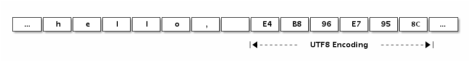
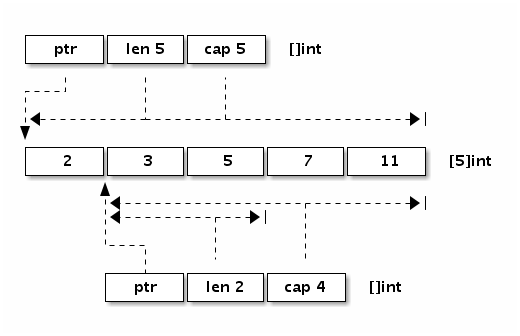

# 1.3 数组、字符串和切片

在主流的编程语言中数组及其相关的数据结构是使用得最为频繁的，只有在它(们)不能满足时才会考虑链表、hash表（hash表可以看作是数组和链表的混合体）和更复杂的自定义数据结构。

Go语言中数组、字符串和切片三者是密切相关的数据结构。这三种数据类型，在底层原始数据有着相同的内存结构，在上层，因为语法的限制而有着不同的行为表现。首先，Go语言的数组是一种值类型，虽然数组的元素可以被修改，但是数组本身的赋值和函数传参都是以整体复制的方式处理的。Go语言字符串底层数据也是对应的字节数组，但是字符串的只读属性禁止了在程序中对底层字节数组的元素的修改。字符串赋值只是复制了数据地址和对应的长度，而不会导致底层数据的复制。切片的行为更为灵活，切片的结构和字符串结构类似，但是解除了只读限制。切片的底层数据虽然也是对应数据类型的数组，但是每个切片还有独立的长度和容量信息，切片赋值和函数传参数时也是将切片头信息部分按传值方式处理。因为切片头含有底层数据的指针，所以它的赋值也不会导致底层数据的复制。其实Go语言的赋值和函数传参规则很简单，除了闭包函数以引用的方式对外部变量访问之外，其它赋值和函数传参数都是以传值的方式处理。要理解数组、字符串和切片三种不同的处理方式的原因需要详细了解它们的底层数据结构。

## 1.3.1 数组

数组是一个由固定长度的特定类型元素组成的序列，一个数组可以由零个或多个元素组成。数组的长度是数组类型的组成部分。因为数组的长度是数组类型的一个部分，不同长度或不同类型的数据组成的数组都是不同的类型，因此在Go语言中很少直接使用数组（不同长度的数组因为类型不同无法直接赋值）。和数组对应的类型是切片，切片是可以动态增长和收缩的序列，切片的功能也更加灵活，但是要理解切片的工作原理还是要先理解数组。

我们先看看数组有哪些定义方式:

```go
var a [3]int                    // 定义长度为3的int型数组, 元素全部为0
var b = [...]int{1, 2, 3}       // 定义长度为3的int型数组, 元素为 1, 2, 3
var c = [...]int{2: 3, 1: 2}    // 定义长度为3的int型数组, 元素为 0, 2, 3
var d = [...]int{1, 2, 4: 5, 6} // 定义长度为6的int型数组, 元素为 1, 2, 0, 0, 5, 6
```

第一种方式是定义一个数组变量的最基本的方式，数组的长度明确指定，数组中的每个元素都以零值初始化。

第二种方式定义数组，可以在定义的时候顺序指定全部元素的初始化值，数组的长度根据初始化元素的数目自动计算。

第三种方式是以索引的方式来初始化数组的元素，因此元素的初始化值出现顺序比较随意。这种初始化方式和`map[int]Type`类型的初始化语法类似。数组的长度以出现的最大的索引为准，没有明确初始化的元素依然用0值初始化。

第四种方式是混合了第二种和第三种的初始化方式，前面两个元素采用顺序初始化，第三第四个元素零值初始化，第五个元素通过索引初始化，最后一个元素跟在前面的第五个元素之后采用顺序初始化。

数组的内存结构比较简单。比如下面是一个`[4]int{2,3,5,7}`数组值对应的内存结构：


*图 1-7 数组布局*


Go语言中数组是值语义。一个数组变量即表示整个数组，它并不是隐式的指向第一个元素的指针（比如C语言的数组），而是一个完整的值。当一个数组变量被赋值或者被传递的时候，实际上会复制整个数组。如果数组较大的话，数组的赋值也会有较大的开销。为了避免复制数组带来的开销，可以传递一个指向数组的指针，但是数组指针并不是数组。

```go
var a = [...]int{1, 2, 3} // a 是一个数组
var b = &a                // b 是指向数组的指针

fmt.Println(a[0], a[1])   // 打印数组的前2个元素
fmt.Println(b[0], b[1])   // 通过数组指针访问数组元素的方式和数组类似

for i, v := range b {     // 通过数组指针迭代数组的元素
	fmt.Println(i, v)
}
```

其中`b`是指向`a`数组的指针，但是通过`b`访问数组中元素的写法和`a`类似的。还可以通过`for range`来迭代数组指针指向的数组元素。其实数组指针类型除了类型和数组不同之外，通过数组指针操作数组的方式和通过数组本身的操作类似，而且数组指针赋值时只会拷贝一个指针。但是数组指针类型依然不够灵活，因为数组的长度是数组类型的组成部分，指向不同长度数组的数组指针类型也是完全不同的。

可以将数组看作一个特殊的结构体，结构的字段名对应数组的索引，同时结构体成员的数目是固定的。内置函数`len`可以用于计算数组的长度，`cap`函数可以用于计算数组的容量。不过对于数组类型来说，`len`和`cap`函数返回的结果始终是一样的，都是对应数组类型的长度。

我们可以用`for`循环来迭代数组。下面常见的几种方式都可以用来遍历数组：

```go
	for i := range a {
		fmt.Printf("a[%d]: %d\n", i, a[i])
	}
	for i, v := range b {
		fmt.Printf("b[%d]: %d\n", i, v)
	}
	for i := 0; i < len(c); i++ {
		fmt.Printf("c[%d]: %d\n", i, c[i])
	}
```

用`for range`方式迭代的性能可能会更好一些，因为这种迭代可以保证不会出现数组越界的情形，每轮迭代对数组元素的访问时可以省去对下标越界的判断。

用`for range`方式迭代，还可以忽略迭代时的下标:

```go
	var times [5][0]int
	for range times {
		fmt.Println("hello")
	}
```

其中`times`对应一个`[5][0]int`类型的数组，虽然第一维数组有长度，但是数组的元素`[0]int`大小是0，因此整个数组占用的内存大小依然是0。没有付出额外的内存代价，我们就通过`for range`方式实现了`times`次快速迭代。

数组不仅仅可以用于数值类型，还可以定义字符串数组、结构体数组、函数数组、接口数组、管道数组等等：

```go
// 字符串数组
var s1 = [2]string{"hello", "world"}
var s2 = [...]string{"你好", "世界"}
var s3 = [...]string{1: "世界", 0: "你好", }

// 结构体数组
var line1 [2]image.Point
var line2 = [...]image.Point{image.Point{X: 0, Y: 0}, image.Point{X: 1, Y: 1}}
var line3 = [...]image.Point{{0, 0}, {1, 1}}

// 图像解码器数组
var decoder1 [2]func(io.Reader) (image.Image, error)
var decoder2 = [...]func(io.Reader) (image.Image, error){
	png.Decode,
	jpeg.Decode,
}

// 接口数组
var unknown1 [2]interface{}
var unknown2 = [...]interface{}{123, "你好"}

// 管道数组
var chanList = [2]chan int{}
```

我们还可以定义一个空的数组：

```go
var d [0]int       // 定义一个长度为0的数组
var e = [0]int{}   // 定义一个长度为0的数组
var f = [...]int{} // 定义一个长度为0的数组
```

长度为0的数组在内存中并不占用空间。空数组虽然很少直接使用，但是可以用于强调某种特有类型的操作时避免分配额外的内存空间，比如用于管道的同步操作：

```go
	c1 := make(chan [0]int)
	go func() {
		fmt.Println("c1")
		c1 <- [0]int{}
	}()
	<-c1
```

在这里，我们并不关心管道中传输数据的真实类型，其中管道接收和发送操作只是用于消息的同步。对于这种场景，我们用空数组来作为管道类型可以减少管道元素赋值时的开销。当然一般更倾向于用无类型的匿名结构体代替：

```go
	c2 := make(chan struct{})
	go func() {
		fmt.Println("c2")
		c2 <- struct{}{} // struct{}部分是类型, {}表示对应的结构体值
	}()
	<-c2
```

我们可以用`fmt.Printf`函数提供的`%T`或`%#v`谓词语法来打印数组的类型和详细信息：

```go
	fmt.Printf("b: %T\n", b)  // b: [3]int
	fmt.Printf("b: %#v\n", b) // b: [3]int{1, 2, 3}
```

在Go语言中，数组类型是切片和字符串等结构的基础。以上数组的很多操作都可以直接用于字符串或切片中。

## 1.3.2 字符串

一个字符串是一个不可改变的字节序列，字符串通常是用来包含人类可读的文本数据。和数组不同的是，字符串的元素不可修改，是一个只读的字节数组。每个字符串的长度虽然也是固定的，但是字符串的长度并不是字符串类型的一部分。由于Go语言的源代码要求是UTF8编码，导致Go源代码中出现的字符串面值常量一般也是UTF8编码的。源代码中的文本字符串通常被解释为采用UTF8编码的Unicode码点（rune）序列。因为字节序列对应的是只读的字节序列，因此字符串可以包含任意的数据，包括byte值0。我们也可以用字符串表示GBK等非UTF8编码的数据，不过这种时候将字符串看作是一个只读的二进制数组更准确，因为`for range`等语法并不能支持非UTF8编码的字符串的遍历。

Go语言字符串的底层结构在`reflect.StringHeader`中定义：

```go
type StringHeader struct {
	Data uintptr
	Len  int
}
```

字符串结构由两个信息组成：第一个是字符串指向的底层字节数组，第二个是字符串的字节的长度。字符串其实是一个结构体，因此字符串的赋值操作也就是`reflect.StringHeader`结构体的复制过程，并不会涉及底层字节数组的复制。在前面数组一节提到的`[2]string`字符串数组对应的底层结构和`[2]reflect.StringHeader`对应的底层结构是一样的，可以将字符串数组看作一个结构体数组。

我们可以看看字符串“Hello, world”本身对应的内存结构：


*图 1-8 字符串布局*


分析可以发现，“Hello, world”字符串底层数据和以下数组是完全一致的：

```go
var data = [...]byte{
	'h', 'e', 'l', 'l', 'o', ',', ' ', 'w', 'o', 'r', 'l', 'd',
}
```

字符串虽然不是切片，但是支持切片操作，不同位置的切片底层也访问的同一块内存数据（因为字符串是只读的，相同的字符串面值常量通常是对应同一个字符串常量）：

```go
s := "hello, world"
hello := s[:5]
world := s[7:]

s1 := "hello, world"[:5]
s2 := "hello, world"[7:]
```

字符串和数组类似，内置的`len`函数返回字符串的长度。也可以通过`reflect.StringHeader`结构访问字符串的长度（这里只是为了演示字符串的结构，并不是推荐的做法）：

```go
fmt.Println("len(s):", (*reflect.StringHeader)(unsafe.Pointer(&s)).Len)   // 12
fmt.Println("len(s1):", (*reflect.StringHeader)(unsafe.Pointer(&s1)).Len) // 5
fmt.Println("len(s2):", (*reflect.StringHeader)(unsafe.Pointer(&s2)).Len) // 5
```

根据Go语言规范，Go语言的源文件都是采用UTF8编码。因此，Go源文件中出现的字符串面值常量一般也是UTF8编码的（对于转义字符，则没有这个限制）。提到Go字符串时，我们一般都会假设字符串对应的是一个合法的UTF8编码的字符序列。可以用内置的`print`调试函数或`fmt.Print`函数直接打印，也可以用`for range`循环直接遍历UTF8解码后的Unicode码点值。

下面的“Hello, 世界”字符串中包含了中文字符，可以通过打印转型为字节类型来查看字符底层对应的数据：

```go
fmt.Printf("%#v\n", []byte("Hello, 世界"))
```

输出的结果是：

```go
[]byte{0x48, 0x65, 0x6c, 0x6c, 0x6f, 0x2c, 0x20, 0xe4, 0xb8, 0x96, 0xe7, \
0x95, 0x8c}
```

分析可以发现`0xe4, 0xb8, 0x96`对应中文“世”，`0xe7, 0x95, 0x8c`对应中文“界”。我们也可以在字符串面值中直指定UTF8编码后的值（源文件中全部是ASCII码，可以避免出现多字节的字符）。

```go
fmt.Println("\xe4\xb8\x96") // 打印: 世
fmt.Println("\xe7\x95\x8c") // 打印: 界
```

下图展示了“Hello, 世界”字符串的内存结构布局:



*图 1-9 字符串布局*

Go语言的字符串中可以存放任意的二进制字节序列，而且即使是UTF8字符序列也可能会遇到坏的编码。如果遇到一个错误的UTF8编码输入，将生成一个特别的Unicode字符‘\uFFFD’，这个字符在不同的软件中的显示效果可能不太一样，在印刷中这个符号通常是一个黑色六角形或钻石形状，里面包含一个白色的问号‘�’。

下面的字符串中，我们故意损坏了第一字符的第二和第三字节，因此第一字符将会打印为“�”，第二和第三字节则被忽略，后面的“abc”依然可以正常解码打印（错误编码不会向后扩散是UTF8编码的优秀特性之一）。

```go
fmt.Println("\xe4\x00\x00\xe7\x95\x8cabc") // �界abc
```

不过在`for range`迭代这个含有损坏的UTF8字符串时，第一字符的第二和第三字节依然会被单独迭代到，不过此时迭代的值是损坏后的0：

```go
for i, c := range "\xe4\x00\x00\xe7\x95\x8cabc" {
	fmt.Println(i, c)
}
// 0 65533  // \uFFFD, 对应 �
// 1 0      // 空字符
// 2 0      // 空字符
// 3 30028  // 界
// 6 97     // a
// 7 98     // b
// 8 99     // c
```

如果不想解码UTF8字符串，想直接遍历原始的字节码，可以将字符串强制转为`[]byte`字节序列后再行遍历（这里的转换一般不会产生运行时开销）：

```go
for i, c := range []byte("世界abc") {
	fmt.Println(i, c)
}
```

或者是采用传统的下标方式遍历字符串的字节数组：

```go
const s = "\xe4\x00\x00\xe7\x95\x8cabc"
for i := 0; i < len(s); i++ {
	fmt.Printf("%d %x\n", i, s[i])
}
```

Go语言除了`for range`语法对UTF8字符串提供了特殊支持外，还对字符串和`[]rune`类型的相互转换提供了特殊的支持。

```go
fmt.Printf("%#v\n", []rune("世界"))      		// []int32{19990, 30028}
fmt.Printf("%#v\n", string([]rune{'世', '界'})) // 世界
```

从上面代码的输出结果来看，我们可以发现`[]rune`其实是`[]int32`类型，这里的`rune`只是`int32`类型的别名，并不是重新定义的类型。`rune`用于表示每个Unicode码点，目前只使用了21个bit位。

字符串相关的强制类型转换主要涉及到`[]byte`和`[]rune`两种类型。每个转换都可能隐含重新分配内存的代价，最坏的情况下它们的运算时间复杂度都是`O(n)`。不过字符串和`[]rune`的转换要更为特殊一些，因为一般这种强制类型转换要求两个类型的底层内存结构要尽量一致，显然它们底层对应的`[]byte`和`[]int32`类型是完全不同的内部布局，因此这种转换可能隐含重新分配内存的操作。

下面分别用伪代码简单模拟Go语言对字符串内置的一些操作，这样对每个操作的处理的时间复杂度和空间复杂度都会有较明确的认识。

**`for range`对字符串的迭代模拟实现**

```go
func forOnString(s string, forBody func(i int, r rune)) {
	for i := 0; len(s) > 0; {
		r, size := utf8.DecodeRuneInString(s)
		forBody(i, r)
		s = s[size:]
		i += size
	}
}
```

`for range`迭代字符串时，每次解码一个Unicode字符，然后进入`for`循环体，遇到崩坏的编码并不会导致迭代停止。

**`[]byte(s)`转换模拟实现**

```go
func str2bytes(s string) []byte {
	p := make([]byte, len(s))
	for i := 0; i < len(s); i++ {
		c := s[i]
		p[i] = c
	}
	return p
}
```

模拟实现中新创建了一个切片，然后将字符串的数组逐一复制到了切片中，这是为了保证字符串只读的语义。当然，在将字符串转为`[]byte`时，如果转换后的变量并没有被修改的情形，编译器可能会直接返回原始的字符串对应的底层数据。

**`string(bytes)`转换模拟实现**

```go
func bytes2str(s []byte) (p string) {
	data := make([]byte, len(s))
	for i, c := range s {
		data[i] = c
	}

	hdr := (*reflect.StringHeader)(unsafe.Pointer(&p))
	hdr.Data = uintptr(unsafe.Pointer(&data[0]))
	hdr.Len = len(s)

	return p
}
```

因为Go语言的字符串是只读的，无法直接同构构造底层字节数组生成字符串。在模拟实现中通过`unsafe`包获取了字符串的底层数据结构，然后将切片的数据逐一复制到了字符串中，这同样是为了保证字符串只读的语义不会受切片的影响。如果转换后的字符串在生命周期中原始的`[]byte`的变量并不会发生变化，编译器可能会直接基于`[]byte`底层的数据构建字符串。

**`[]rune(s)`转换模拟实现**

```go
func str2runes(s string) []rune{
	var p []int32
	for len(s)>0 {
        r,size:=utf8.DecodeRuneInString(s)
        p=append(p,int32(r))
        s=s[size:]
        }
        return []rune(p)
}
```

因为底层内存结构的差异，字符串到`[]rune`的转换必然会导致重新分配`[]rune`内存空间，然后依次解码并复制对应的Unicode码点值。这种强制转换并不存在前面提到的字符串和字节切片转化时的优化情况。

**`string(runes)`转换模拟实现**

```go
func runes2string(s []int32) string {
	var p []byte
	buf := make([]byte, 3)
	for _, r := range s {
		n := utf8.EncodeRune(buf, r)
		p = append(p, buf[:n]...)
	}
	return string(p)
}
```

同样因为底层内存结构的差异，`[]rune`到字符串的转换也必然会导致重新构造字符串。这种强制转换并不存在前面提到的优化情况。

## 1.3.3 切片(slice)

简单地说，切片就是一种简化版的动态数组。因为动态数组的长度是不固定，切片的长度自然也就不能是类型的组成部分了。数组虽然有适用它们的地方，但是数组的类型和操作都不够灵活，因此在Go代码中数组使用的并不多。而切片则使用得相当广泛，理解切片的原理和用法是一个Go程序员的必备技能。

我们先看看切片的结构定义，`reflect.SliceHeader`：

```go
type SliceHeader struct {
	Data uintptr
	Len  int
	Cap  int
}
```

可以看出切片的开头部分和Go字符串是一样的，但是切片多了一个`Cap`成员表示切片指向的内存空间的最大容量（对应元素的个数，而不是字节数）。下图是`x := []int{2,3,5,7,11}`和`y := x[1:3]`两个切片对应的内存结构。



*图 1-10 切片布局*


让我们看看切片有哪些定义方式：

```go
var (
	a []int               // nil切片, 和 nil 相等, 一般用来表示一个不存在的切片
	b = []int{}           // 空切片, 和 nil 不相等, 一般用来表示一个空的集合
	c = []int{1, 2, 3}    // 有3个元素的切片, len和cap都为3
	d = c[:2]             // 有2个元素的切片, len为2, cap为3
	e = c[0:2:cap(c)]     // 有2个元素的切片, len为2, cap为3
	f = c[:0]             // 有0个元素的切片, len为0, cap为3
	g = make([]int, 3)    // 有3个元素的切片, len和cap都为3
	h = make([]int, 2, 3) // 有2个元素的切片, len为2, cap为3
	i = make([]int, 0, 3) // 有0个元素的切片, len为0, cap为3
)
```

和数组一样，内置的`len`函数返回切片中有效元素的长度，内置的`cap`函数返回切片容量大小，容量必须大于或等于切片的长度。也可以通过`reflect.SliceHeader`结构访问切片的信息（只是为了说明切片的结构，并不是推荐的做法）。切片可以和`nil`进行比较，只有当切片底层数据指针为空时切片本身为`nil`，这时候切片的长度和容量信息将是无效的。如果有切片的底层数据指针为空，但是长度和容量不为0的情况，那么说明切片本身已经被损坏了（比如直接通过`reflect.SliceHeader`或`unsafe`包对切片作了不正确的修改）。

遍历切片的方式和遍历数组的方式类似：

```go
	for i := range a {
		fmt.Printf("a[%d]: %d\n", i, a[i])
	}
	for i, v := range b {
		fmt.Printf("b[%d]: %d\n", i, v)
	}
	for i := 0; i < len(c); i++ {
		fmt.Printf("c[%d]: %d\n", i, c[i])
	}
```

其实除了遍历之外，只要是切片的底层数据指针、长度和容量没有发生变化的话，对切片的遍历、元素的读取和修改都和数组是一样的。在对切片本身赋值或参数传递时，和数组指针的操作方式类似，只是复制切片头信息（`reflect.SliceHeader`），并不会复制底层的数据。对于类型，和数组的最大不同是，切片的类型和长度信息无关，只要是相同类型元素构成的切片均对应相同的切片类型。

如前所说，切片是一种简化版的动态数组，这是切片类型的灵魂。除了构造切片和遍历切片之外，添加切片元素、删除切片元素都是切片处理中经常遇到的问题。


**添加切片元素**

内置的泛型函数`append`可以在切片的尾部追加`N`个元素：

```go
var a []int
a = append(a, 1)               // 追加1个元素
a = append(a, 1, 2, 3)         // 追加多个元素, 手写解包方式
a = append(a, []int{1,2,3}...) // 追加一个切片, 切片需要解包
```

不过要注意的是，在容量不足的情况下，`append`的操作会导致重新分配内存，可能导致巨大的内存分配和复制数据代价。即使容量足够，依然需要用`append`函数的返回值来更新切片本身，因为新切片的长度已经发生了变化。

除了在切片的尾部追加，我们还可以在切片的开头添加元素：

```go
var a = []int{1,2,3}
a = append([]int{0}, a...)        // 在开头添加1个元素
a = append([]int{-3,-2,-1}, a...) // 在开头添加1个切片
```

在开头一般都会导致内存的重新分配，而且会导致已有的元素全部复制1次。因此，从切片的开头添加元素的性能一般要比从尾部追加元素的性能差很多。

由于`append`函数返回新的切片，也就是它支持链式操作。我们可以将多个`append`操作组合起来，实现在切片中间插入元素：

```go
var a []int
a = append(a[:i], append([]int{x}, a[i:]...)...)     // 在第i个位置插入x
a = append(a[:i], append([]int{1,2,3}, a[i:]...)...) // 在第i个位置插入切片
```

每个添加操作中的第二个`append`调用都会创建一个临时切片，并将`a[i:]`的内容复制到新创建的切片中，然后将临时创建的切片再追加到`a[:i]`。

可以用`copy`和`append`组合可以避免创建中间的临时切片，同样是完成添加元素的操作：

```go
a = append(a, 0)     // 切片扩展1个空间
copy(a[i+1:], a[i:]) // a[i:]向后移动1个位置
a[i] = x             // 设置新添加的元素
```

第一句`append`用于扩展切片的长度，为要插入的元素留出空间。第二句`copy`操作将要插入位置开始之后的元素向后挪动一个位置。第三句真实地将新添加的元素赋值到对应的位置。操作语句虽然冗长了一点，但是相比前面的方法，可以减少中间创建的临时切片。

用`copy`和`append`组合也可以实现在中间位置插入多个元素(也就是插入一个切片):

```go
a = append(a, x...)       // 为x切片扩展足够的空间
copy(a[i+len(x):], a[i:]) // a[i:]向后移动len(x)个位置
copy(a[i:], x)            // 复制新添加的切片
```

稍显不足的是，在第一句扩展切片容量的时候，扩展空间部分的元素复制是没有必要的。没有专门的内置函数用于扩展切片的容量，`append`本质是用于追加元素而不是扩展容量，扩展切片容量只是`append`的一个副作用。

**删除切片元素**

根据要删除元素的位置有三种情况：从开头位置删除，从中间位置删除，从尾部删除。其中删除切片尾部的元素最快：

```go
a = []int{1, 2, 3}
a = a[:len(a)-1]   // 删除尾部1个元素
a = a[:len(a)-N]   // 删除尾部N个元素
```

删除开头的元素可以直接移动数据指针：

```go
a = []int{1, 2, 3}
a = a[1:] // 删除开头1个元素
a = a[N:] // 删除开头N个元素
```

删除开头的元素也可以不移动数据指针，但是将后面的数据向开头移动。可以用`append`原地完成（所谓原地完成是指在原有的切片数据对应的内存区间内完成，不会导致内存空间结构的变化）：

```go
a = []int{1, 2, 3}
a = append(a[:0], a[1:]...) // 删除开头1个元素
a = append(a[:0], a[N:]...) // 删除开头N个元素
```

也可以用`copy`完成删除开头的元素：

```go
a = []int{1, 2, 3}
a = a[:copy(a, a[1:])] // 删除开头1个元素
a = a[:copy(a, a[N:])] // 删除开头N个元素
```

对于删除中间的元素，需要对剩余的元素进行一次整体挪动，同样可以用`append`或`copy`原地完成：

```go
a = []int{1, 2, 3, ...}

a = append(a[:i], a[i+1:]...) // 删除中间1个元素
a = append(a[:i], a[i+N:]...) // 删除中间N个元素

a = a[:i+copy(a[i:], a[i+1:])]  // 删除中间1个元素
a = a[:i+copy(a[i:], a[i+N:])]  // 删除中间N个元素
```

删除开头的元素和删除尾部的元素都可以认为是删除中间元素操作的特殊情况。

**切片内存技巧**

在本节开头的数组部分我们提到过有类似`[0]int`的空数组，空数组一般很少用到。但是对于切片来说，`len`为`0`但是`cap`容量不为`0`的切片则是非常有用的特性。当然，如果`len`和`cap`都为`0`的话，则变成一个真正的空切片，虽然它并不是一个`nil`值的切片。在判断一个切片是否为空时，一般通过`len`获取切片的长度来判断，一般很少将切片和`nil`值做直接的比较。

比如下面的`TrimSpace`函数用于删除`[]byte`中的空格。函数实现利用了0长切片的特性，实现高效而且简洁。


```go
func TrimSpace(s []byte) []byte {
	b := s[:0]
	for _, x := range s {
		if x != ' ' {
			b = append(b, x)
		}
	}
	return b
}
```

其实类似的根据过滤条件原地删除切片元素的算法都可以采用类似的方式处理（因为是删除操作不会出现内存不足的情形）：

```go
func Filter(s []byte, fn func(x byte) bool) []byte {
	b := s[:0]
	for _, x := range s {
		if !fn(x) {
			b = append(b, x)
		}
	}
	return b
}
```

切片高效操作的要点是要降低内存分配的次数，尽量保证`append`操作不会超出`cap`的容量，降低触发内存分配的次数和每次分配内存大小。


**避免切片内存泄漏**

如前面所说，切片操作并不会复制底层的数据。底层的数组会被保存在内存中，直到它不再被引用。但是有时候可能会因为一个小的内存引用而导致底层整个数组处于被使用的状态，这会延迟自动内存回收器对底层数组的回收。

例如，`FindPhoneNumber`函数加载整个文件到内存，然后搜索第一个出现的电话号码，最后结果以切片方式返回。

```go
func FindPhoneNumber(filename string) []byte {
	b, _ := ioutil.ReadFile(filename)
	return regexp.MustCompile("[0-9]+").Find(b)
}
```

这段代码返回的`[]byte`指向保存整个文件的数组。因为切片引用了整个原始数组，导致自动垃圾回收器不能及时释放底层数组的空间。一个小的需求可能导致需要长时间保存整个文件数据。这虽然这并不是传统意义上的内存泄漏，但是可能会拖慢系统的整体性能。

要修复这个问题，可以将感兴趣的数据复制到一个新的切片中（数据的传值是Go语言编程的一个哲学，虽然传值有一定的代价，但是换取的好处是切断了对原始数据的依赖）：

```go
func FindPhoneNumber(filename string) []byte {
	b, _ := ioutil.ReadFile(filename)
	b = regexp.MustCompile("[0-9]+").Find(b)
	return append([]byte{}, b...)
}
```

类似的问题，在删除切片元素时可能会遇到。假设切片里存放的是指针对象，那么下面删除末尾的元素后，被删除的元素依然被切片底层数组引用，从而导致不能及时被自动垃圾回收器回收（这要依赖回收器的实现方式）：

```go
var a []*int{ ... }
a = a[:len(a)-1]    // 被删除的最后一个元素依然被引用, 可能导致GC操作被阻碍
```

保险的方式是先将需要自动内存回收的元素设置为`nil`，保证自动回收器可以发现需要回收的对象，然后再进行切片的删除操作：

```go
var a []*int{ ... }
a[len(a)-1] = nil // GC回收最后一个元素内存
a = a[:len(a)-1]  // 从切片删除最后一个元素
```

当然，如果切片存在的周期很短的话，可以不用刻意处理这个问题。因为如果切片本身已经可以被GC回收的话，切片对应的每个元素自然也就是可以被回收的了。


**切片类型强制转换**

为了安全，当两个切片类型`[]T`和`[]Y`的底层原始切片类型不同时，Go语言是无法直接转换类型的。不过安全都是有一定代价的，有时候这种转换是有它的价值的——可以简化编码或者是提升代码的性能。比如在64位系统上，需要对一个`[]float64`切片进行高速排序，我们可以将它强制转为`[]int`整数切片，然后以整数的方式进行排序（因为`float64`遵循IEEE754浮点数标准特性，当浮点数有序时对应的整数也必然是有序的）。

下面的代码通过两种方法将`[]float64`类型的切片转换为`[]int`类型的切片：

```go
// +build amd64 arm64

import "sort"

var a = []float64{4, 2, 5, 7, 2, 1, 88, 1}

func SortFloat64FastV1(a []float64) {
	// 强制类型转换
	var b []int = ((*[1 << 20]int)(unsafe.Pointer(&a[0])))[:len(a):cap(a)]

	// 以int方式给float64排序
	sort.Ints(b)
}

func SortFloat64FastV2(a []float64) {
	// 通过 reflect.SliceHeader 更新切片头部信息实现转换
	var c []int
	aHdr := (*reflect.SliceHeader)(unsafe.Pointer(&a))
	cHdr := (*reflect.SliceHeader)(unsafe.Pointer(&c))
	*cHdr = *aHdr

	// 以int方式给float64排序
	sort.Ints(c)
}
```

第一种强制转换是先将切片数据的开始地址转换为一个较大的数组的指针，然后对数组指针对应的数组重新做切片操作。中间需要`unsafe.Pointer`来连接两个不同类型的指针传递。需要注意的是，Go语言实现中非0大小数组的长度不得超过2GB，因此需要针对数组元素的类型大小计算数组的最大长度范围（`[]uint8`最大2GB，`[]uint16`最大1GB，以此类推，但是`[]struct{}`数组的长度可以超过2GB）。

第二种转换操作是分别取到两个不同类型的切片头信息指针，任何类型的切片头部信息底层都是对应`reflect.SliceHeader`结构，然后通过更新结构体方式来更新切片信息，从而实现`a`对应的`[]float64`切片到`c`对应的`[]int`类型切片的转换。

通过基准测试，我们可以发现用`sort.Ints`对转换后的`[]int`排序的性能要比用`sort.Float64s`排序的性能好一点。不过需要注意的是，这个方法可行的前提是要保证`[]float64`中没有NaN和Inf等非规范的浮点数（因为浮点数中NaN不可排序，正0和负0相等，但是整数中没有这类情形）。

