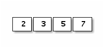
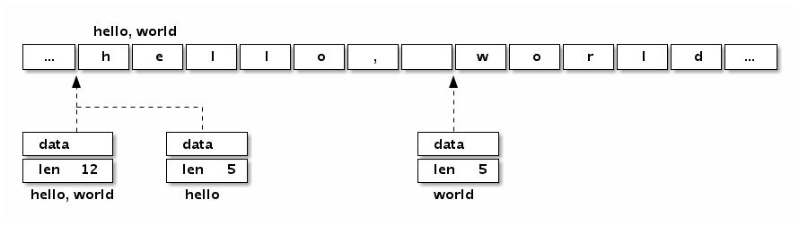

# 1.3 Arrays, strings, and slices

Arrays and their associated data structures are the most frequently used in mainstream programming languages. Only when they are not satisfied will they consider linked lists and hash tables (hash tables can be thought of as a mixture of arrays and linked lists). And more complex custom data structures.

Arrays, strings, and slices in the Go language are closely related data structures. These three data types have the same memory structure in the underlying raw data, and have different behaviors in the upper layer due to grammatical constraints. First, the Go language array is a value type. Although the elements of the array can be modified, the assignment of the array itself and the function arguments are handled as a whole. The underlying data of the Go language string is also the corresponding byte array, but the read-only property of the string prohibits modification of the elements of the underlying byte array in the program. String assignment simply copies the data address and the corresponding length without causing the underlying data to be copied. Slices are more flexible, and the structure of the slice is similar to the string structure, but the read-only limit is removed. Although the underlying data of the slice is also an array corresponding to the data type, each slice has independent length and capacity information. When the slice assignment and the function pass parameters, the slice header information is also processed by the value. Because the slice header contains a pointer to the underlying data, its assignment does not cause the underlying data to be copied. In fact, the assignment of Go language and the rules of function passing parameters are very simple. Except that the closure function accesses external variables by reference, other assignments and function parameters are processed by value. The reasons for understanding the three different ways of handling arrays, strings, and slices require a detailed understanding of their underlying data structures.

## 1.3.1 Array

An array is a sequence of fixed-length elements of a particular type, and an array can consist of zero or more elements. The length of the array is part of the array type. Because the length of an array is a part of an array type, arrays of different lengths or different types of data are of different types, so arrays are rarely used directly in the Go language (arrays of different lengths cannot be directly assigned because of different types). The type corresponding to the array is a slice, the slice is a sequence that can grow and shrink dynamically, and the function of the slice is more flexible, but to understand how the slice works, you must first understand the array.

Let's first look at how the array is defined:

```go
Var a [3]int // defines an int array of length 3, all elements are 0
Var b = [...]int{1, 2, 3} // Define an int array of length 3 with elements 1, 2, 3
Var c = [...]int{2: 3, 1: 2} // Define an int array of length 3 with elements 0, 2, 3
Var d = [...]int{1, 2, 4: 5, 6} // Define an int array of length 6, with elements 1, 2, 0, 0, 5, 6
```

The first way is to define the most basic way of an array variable. The length of the array is explicitly specified, and each element in the array is initialized with a zero value.

The second way is to define an array, which can specify the initialization values ​​of all elements in the order of definition. The length of the array is automatically calculated according to the number of initialization elements.

The third way is to initialize the elements of the array in an indexed manner, so the initialization values ​​of the elements appear in a random order. This initialization is similar to the initialization syntax of the `map[int]Type` type. The length of the array is based on the largest index that appears, and elements that are not explicitly initialized are still initialized with a value of 0.

The fourth way is to mix the second and third initialization methods, the first two elements are initialized sequentially, the third and fourth elements are initialized with zero values, the fifth element is initialized by index, and the last element is followed by The fifth element is then initialized in order.

The memory structure of an array is relatively simple. For example, the following is a memory structure corresponding to the `[4]int{2,3,5,7}` array value:



*Figure 1-7 Array layout*


Arrays in the Go language are value semantics. An array variable represents the entire array. It is not an implicit pointer to the first element (such as an array of C), but a complete value. When an array variable is assigned or passed, the entire array is actually copied. If the array is large, the assignment of the array will also have a large overhead. To avoid the overhead of copying an array, you can pass a pointer to an array, but the array pointer is not an array.

```go
Var a = [...]int{1, 2, 3} // a is an array
Var b = &a // b is a pointer to an array

fmt.Println(a[0], a[1]) // Print the first 2 elements of the array
fmt.Println(b[0], b[1]) // Access array elements through array pointers in a similar way to arrays

For i, v := range b { // iterate over the elements of the array by array pointers
fmt.Println(i, v)
}
```

Where `b` is a pointer to the `a` array, but the way to access the elements in the array via `b` is similar to `a`. You can also iterate through the array elements pointed to by the array pointer by `for range`. In fact, the array pointer type is different from the type and array. The operation of the array by the array pointer is similar to the operation of the array itself, and only one pointer is copied when the array pointer is assigned. But the array pointer type is still not flexible enough, because the length of the array is part of the array type, and the array pointer type to arrays of different lengths is completely different.

You can think of an array as a special structure. The field name of the structure corresponds to the index of the array, and the number of structure members is fixed. The built-in function `len` can be used to calculate the length of an array, and the `cap` function can be used to calculate the capacity of an array. However, for array types, the results returned by the `len` and `cap` functions are always the same, and are the length of the corresponding array type.

We can iterate over the array with a `for` loop. The following common ways can be used to traverse an array:

```go
For i := range a {
fmt.Printf("a[%d]: %d\n", i, a[i])
}
For i, v := range b {
fmt.Printf("b[%d]: %d\n", i, v)
}
For i := 0; i < len(c); i++ {
fmt.Printf("c[%d]: %d\n", i, c[i])
}
```

The performance of iteration with the `for range` method may be better, because this iteration guarantees that there will be no out-of-bounds arrays. Each round of iterations accessing array elements can eliminate the need to cross-border judgments.

Iterating with the `for range` method also ignores the subscripts at the time of iteration:

```go
Var times [5][0]int
For range times {
fmt.Println("hello")
}
```

Where `times` corresponds to an array of type `[5][0]int`, although the first dimension has a length, but the size of the array's `[0]int` is 0, so the memory size of the entire array is still 0. Without paying extra memory, we implemented `times` times of fast iterations by `for range`.

Arrays can be used not only for numeric types, but also for string arrays, struct arrays, function arrays, interface arrays, pipe arrays, and more:

```go
// string array
Var s1 = [2]string{"hello", "world"}
Var s2 = [...]string{"Hello", "World"}
Var s3 = [...]string{1: "world", 0: "hello", }

// structure array
Var line1 [2]image.Point
Var line2 = [...]image.Point{image.Point{X: 0, Y: 0}, image.Point{X: 1, Y: 1}}
Var line3 = [...]image.Point{{0, 0}, {1, 1}}

// image decoder array
Var decoder1 [2]func(io.Reader) (image.Image, error)
Var decoder2 = [...]func(io.Reader) (image.Image, error){
png.Decode,
jpeg.Decode,
}

// interface array
Var unknown1 [2]interface{}
Var unknown2 = [...]interface{}{123, "Hello"}

// pipe array
Var chanList = [2]chan int{}
```

We can also define an empty array:

```go
Var d [0]int // define an array of length 0
Var e = [0]int{} // define an array of length 0
Var f = [...]int{} // define an array of length 0
```

An array of length 0 does not take up space in memory. Empty arrays are rarely used directly, but can be used to emphasize the allocation of extra memory space when emphasizing a particular type of operation, such as synchronization operations for pipes:

```go
C1 := make(chan [0]int)
Go func() {
fmt.Println("c1")
C1 <- [0]int{}
}()
<-c1
```

Here, we don't care about the real type of data being transferred in the pipeline, where the pipeline receiving and sending operations are only used for message synchronization. For this scenario, we use an empty array as the pipe type to reduce the overhead of pipe element assignment. Of course, it is generally preferred to replace it with an untyped anonymous structure:

```go
C2 := make(chan struct{})
Go func() {
fmt.Println("c2")
C2 <- struct{}{} // The struct{} part is a type, and {} represents the corresponding structure value.
}()
<-c2
```

We can use the `%T` or `%#v` predicate provided by the `fmt.Printf` function to print the type and details of the array:

```go
fmt.Printf("b: %T\n", b) // b: [3]int
fmt.Printf("b: %#v\n", b) // b: [3]int{1, 2, 3}
```

In Go, array types are the basis for structures such as slices and strings. Many of the above arrays can be used directly in strings or slices.

## 1.3.2 String

A string is an unchangeable sequence of bytes, and a string is usually used to contain human-readable text data. Unlike arrays, elements of a string are not modifiable and are a read-only byte array. The length of each string is fixed, but the length of the string is not part of the string type. Since the source code requirement of the Go language is UTF8 encoding, the string denomination constants appearing in the Go source code are generally UTF8 encoded. The text string in the source code is usually interpreted as a Unicode codepoint sequence encoded in UTF8. Because the byte sequence corresponds to a read-only sequence of bytes, the string can contain arbitrary data, including a byte value of zero. We can also use string to represent non-UTF8 encoded data such as GBK, but it is more accurate to treat the string as a read-only binary array at this time, because the `for range` syntax does not support non-UTF8 encoded strings. Traversal.

The underlying structure of the Go language string is defined in `reflect.StringHeader`:

```go
Type StringHeader struct {
Data uintptr
Len int
}
```

The string structure consists of two pieces of information: the first is the underlying byte array pointed to by the string, and the second is the length of the string's bytes. A string is actually a structure, so the assignment of a string is the copy of the `reflect.StringHeader` structure, and does not involve the copying of the underlying byte array. The underlying structure corresponding to the `[2]string` string array mentioned in the previous array section is the same as the underlying structure corresponding to `[2]reflect.StringHeader`, and the string array can be treated as an array of structures.

We can look at the memory structure corresponding to the string "Hello, world" itself:



*Figure 1-8 String layout*


Analysis can be found that the underlying data of the "Hello, world" string is exactly the same as the following array:

```go
Var data = [...]byte{
'h', 'e', ​​'l', 'l', 'o', ',', ' ', 'w', 'o', 'r', 'l', 'd',
}
```

The string is not a slice, but it Is to support the slicing operation, the same piece of memory data accessed by the underlying slice at different locations (because the string is read-only, the same string denomination constant usually corresponds to the same string constant):

```go
s := "hello, world"
Hello := s[:5]
World := s[7:]

S1 := "hello, world"[:5]
S2 := "hello, world"[7:]
```

Strings are similar to arrays, and the built-in `len` function returns the length of the string. You can also access the length of the string via the `reflect.StringHeader` structure (this is just to demonstrate the structure of the string, not recommended):

```go
fmt.Println("len(s):", (*reflect.StringHeader)(unsafe.Pointer(&s)).Len) // 12
fmt.Println("len(s1):", (*reflect.StringHeader)(unsafe.Pointer(&s1)).Len) // 5
fmt.Println("len(s2):", (*reflect.StringHeader)(unsafe.Pointer(&s2)).Len) // 5
```

According to the Go language specification, the source files of the Go language are encoded in UTF8. Therefore, string literal constants that appear in Go source files are also generally UTF8 encoded (for escaped characters, there is no such restriction). When referring to a Go string, we generally assume that the string corresponds to a legal UTF8 encoded sequence of characters. You can print directly with the built-in `print` debug function or the `fmt.Print` function, or you can use the `for range` loop to traverse the UTF8 decoded Unicode code point value directly.

The following "Hello, World" string contains Chinese characters, which can be converted to byte types by printing to see the data corresponding to the underlying characters:

```go
fmt.Printf("%#v\n", []byte("Hello, World"))
```

The output is:

```go
[]byte{0x48, 0x65, 0x6c, 0x6c, 0x6f, 0x2c, 0x20, 0xe4, 0xb8, 0x96, 0xe7, \
0x95, 0x8c}
```

Analysis can be found that `0xe4, 0xb8, 0x96` corresponds to Chinese "World", `0xe7, 0x95, 0x8c` corresponds to Chinese "boundary". We can also specify UTF8 encoded values ​​directly in the string face value (all ASCII codes in the source file can avoid multi-byte characters).

```go
fmt.Println("\xe4\xb8\x96") // Print: World
fmt.Println("\xe7\x95\x8c") // Print:
```

The following figure shows the memory structure layout of the "Hello, World" string:


*Figure 1-9 String layout*

Any string of binary bytes can be stored in the Go language string, and even UTF8 character sequences may encounter bad encoding. If you encounter an incorrect UTF8 encoded input, a special Unicode character '\uFFFD' will be generated. This character may look different in different software. In printing this symbol is usually a black hexagon or diamond. Shape, which contains a white question mark ' '.

In the following string, we intentionally corrupt the second and third bytes of the first character, so the first character will be printed as " ", the second and third bytes will be ignored, followed by "abc" It is still possible to decode the print normally (error coding does not spread backwards is one of the excellent features of UTF8 encoding).

```go
fmt.Println("\xe4\x00\x00\xe7\x95\x8cabc") // bound abc
```

However, when the `for range` is iterated over the corrupted UTF8 string, the second and third bytes of the first character will still be iterated separately, but the value of the iteration is 0 after the corruption:

```go
For i, c := range "\xe4\x00\x00\xe7\x95\x8cabc" {
fmt.Println(i, c)
}
// 0 65533 // \uFFFD, corresponding
// 1 0 // null character
// 2 0 // null character
// 3 30028 // bounds
// 6 97 // a
// 7 98 // b
// 8 99 // c
```

If you don't want to decode the UTF8 string and want to traverse the original bytecode directly, you can force the string to be converted to a `[]byte` byte sequence and then traverse it (the conversion here usually does not generate runtime overhead):

```go
For i, c := range []byte("world abc") {
fmt.Println(i, c)
}
```

Or use a traditional subscript to traverse the byte array of the string:

```go
Const s = "\xe4\x00\x00\xe7\x95\x8cabc"
For i := 0; i < len(s); i++ {
fmt.Printf("%d %x\n", i, s[i])
}
```

In addition to the `for range` syntax, the Go language provides special support for UTF8 strings. It also provides special support for the conversion of strings and `[]rune` types.

```go
fmt.Printf("%#v\n", []rune("world")) // []int32{19990, 30028}
fmt.Printf("%#v\n", string([]rune{'世', '界'}))) // World
```

From the output of the above code, we can find that `[]rune` is actually a `[]int32` type, where `rune` is just an alias for the `int32` type, not a redefined type. `rune` is used to represent each Unicode code point, and currently only 21 bits are used.

String-dependent casts are mainly related to `[]byte` and `[]rune`. Each conversion may imply the cost of reallocating memory. In the worst case, their computation time complexity is `O(n)`. However, the conversion of strings and `[]rune` is more special, because in general such casts require two types of underlying memory structures to be as consistent as possible, apparently their corresponding underlying `[]byte` and `[] The int32` type is a completely different internal layout, so this conversion may imply the operation of reallocating memory.

In the following, the pseudo-code is used to simply simulate some operations built into the Go language on the string, so that the time complexity and space complexity of each operation will have a clearer understanding.

**`for range` Iterative simulation of strings **

```go
Func forOnString(s string, forBody func(i int, r rune)) {
For i := 0; len(s) > 0; {
r, size := utf8.DecodeRuneInString(s)
forBody(i, r)
s = s[size:]
i += size
}
}
```

`for range` When iterating a string, each time you decode a Unicode character, and then enter the `for` loop body, encountering the collapsed code does not cause the iteration to stop.

**`[byte(s)` conversion simulation implementation**

```go
Func str2bytes(s string) []byte {
p := make([]byte, len(s))
For i := 0; i < len(s); i++ {
c := s[i]
p[i] = c
}
Return p
}
```

A new slice is created in the simulation implementation, and then an array of strings is copied into the slice one by one, in order to guarantee the semantics of the string read-only. Of course, when converting a string to `[]byte`, if the converted variable is not modified, the compiler may directly return the underlying data corresponding to the original string.

**`string(bytes)` conversion simulation implementation**

```go
Func bytes2str(s []byte) (p string) {
Data := make([]byte, len(s))
For i, c := range s {
Data[i] = c
}

Hdr := (*reflect.StringHeader)(unsafe.Pointer(&p))
hdr.Data = uintptr(unsafe.Pointer(&data[0]))
hdr.Len = len(s)

Return p
}
```

Because the Go language string is read-only, it is not possible to directly construct the underlying byte array to generate a string. In the simulation implementation, the underlying data structure of the string is obtained by the `unsafe` package, and then the sliced ​​data is copied into the string one by one, which is also to ensure that the semantics of the string read-only are not affected by the slice. If the converted string's original `[]byte` variable does not change during the lifetime, the compiler may construct the string directly based on the underlying data of `[]byte`.

**`[rune(s)` conversion simulation implementation**

```go
Func str2runes(s string) []rune{
Var p []int32
For len(s)>0 {
        r,size:=utf8.DecodeRuneInString(s)
        p=append(p,int32(r))
        s=s[size:]
        }
        Return []rune(p)
}
```

Because of the difference in the underlying memory structure, the conversion of strings to `[]rune` will inevitably result in reallocation of the `[]rune` memory space, and then sequentially decode and copy the corresponding Unicode code point values. This cast does not have the optimizations of the string and byte slice conversions mentioned earlier.

**`string(runes)` conversion simulation implementation**

```go
Func runes2string(s []int32) string {
Var p []byte
Buf := make([]byte, 3)
For _, r := range s {
n := utf8.EncodeRune(buf, r)
p = append(p, buf[:n]...)
}
Return string(p)
}
```

Also because of the difference in the underlying memory structure, the conversion of `[]rune` to a string will inevitably lead to the reconstruction of the string. This type of coercion does not have the optimization described above.

## 1.3.3 Slice

Simply put, slicing is a simplified version of a dynamic array. Because the length of the dynamic array is not fixed, the length of the slice naturally cannot be part of the type. Arrays have places where they apply, but array types and operations are not flexible enough, so arrays are not used much in Go code. Slices are used quite extensively, and understanding the principles and usage of slices is a must-have skill for Go programmers.

Let's take a look at the structure definition of the slice, `reflect.SliceHeader`:

```go
Type SliceHeader struct {
Data uintptr
Len int
Cap int
}
```

It can be seen that the beginning of the slice is the same as the Go string, but the slice has an extra `Cap` member indicating the maximum size of the memory space pointed to by the slice (the number of corresponding elements, not the number of bytes). The following figure shows the memory structure corresponding to the two slices of `x := []int{2,3,5,7,11}` and `y := x[1:3]`.


*Figure 1-10 Slice layout*


Let's see how the slices are defined:

```go
Var (
a []int // nil slice, equal to nil, generally used to represent a slice that does not exist
b = []int{} // empty slice, not equal to nil, generally used to represent an empty collection
c = []int{1, 2, 3} // There are 3 elements of the slice, both len and cap are 3
d = c[:2] // There are 2 elements of the slice, len is 2, cap is 3
e = c[0:2:cAp(c)] // There are 2 elements of the slice, len is 2, cap is 3
f = c[:0] // There are 0 elements of the slice, len is 0, cap is 3
g = make([]int, 3) // There are 3 elements of the slice, both len and cap are 3
h = make([]int, 2, 3) // There are 2 elements of the slice, len is 2, cap is 3
i = make([]int, 0, 3) // Slice with 0 elements, len is 0, cap is 3
)
```

Like the array, the built-in `len` function returns the length of the valid element in the slice. The built-in `cap` function returns the slice size, which must be greater than or equal to the length of the slice. It is also possible to access the information of the slice through the `reflect.SliceHeader` structure (just to illustrate the structure of the slice, it is not recommended). Slices can be compared to `nil`. The slice itself is `nil` when the underlying data pointer is empty, and the length and capacity information of the slice will be invalid. If the underlying data pointer of the slice is empty, but the length and capacity are not 0, then the slice itself has been corrupted (for example, the slice was incorrectly modified directly by the `reflect.SliceHeader` or `unsafe` package. ).

Traversing slices is similar to traversing arrays:

```go
For i := range a {
fmt.Printf("a[%d]: %d\n", i, a[i])
}
For i, v := range b {
fmt.Printf("b[%d]: %d\n", i, v)
}
For i := 0; i < len(c); i++ {
fmt.Printf("c[%d]: %d\n", i, c[i])
}
```

In fact, in addition to traversal, as long as the underlying data pointer, length and capacity of the slice have not changed, the traversal of the slice, the reading and modification of the elements are the same as the array. When assigning values ​​or passing parameters to the slice itself, it operates in the same way as an array pointer, except that the slice header information (`reflect.SliceHeader`) is copied and the underlying data is not copied. For types, the biggest difference from an array is that the type of the slice is independent of the length information, as long as the slices of the same type of elements correspond to the same slice type.

As mentioned before, slicing is a simplified version of a dynamic array, which is the soul of the slice type. In addition to constructing slices and traversing slices, adding slice elements and deleting slice elements are common problems in slice processing.


**Add slice elements**

The built-in generic function `append` can append `N` elements to the end of the slice:

```go
Var a []int
a = append(a, 1) // append 1 element
a = append(a, 1, 2, 3) // append multiple elements, handwritten unpacking
a = append(a, []int{1,2,3}...) // append a slice, the slice needs to be unpacked
```

However, it should be noted that in the case of insufficient capacity, the operation of `append` will result in reallocation of memory, which may result in huge memory allocation and copy data cost. Even if the capacity is sufficient, you still need to update the slice itself with the return value of the `append` function, because the length of the new slice has changed.

In addition to appending at the end of the slice, we can also add elements at the beginning of the slice:

```go
Var a = []int{1,2,3}
a = append([]int{0}, a...) // Add 1 element at the beginning
a = append([]int{-3,-2,-1}, a...) // Add 1 slice at the beginning
```

At the beginning, it usually causes memory to be reallocated, and it will cause all existing elements to be copied once. Therefore, the performance of adding elements from the beginning of a slice is generally much worse than the performance of appending elements from the tail.

Since the `append` function returns a new slice, that is, it supports chained operations. We can combine multiple `append` operations to insert elements in the middle of the slice:

```go
Var a []int
a = append(a[:i], append([]int{x}, a[i:]...)...) // Insert x in the ith position
a = append(a[:i], append([]int{1,2,3}, a[i:]...)...) // Insert a slice at the ith position
```

The second `append` call in each add operation creates a temporary slice and copies the contents of `a[i:]` into the newly created slice, then appends the temporarily created slice to `a[ :i]`.

You can use the combination of `copy` and `append` to avoid creating intermediate temporary slices, as well as completing the addition of elements:

```go
a = append(a, 0) // slice expands 1 space
Copy(a[i+1:], a[i:]) // a[i:] moves backward by 1 position
a[i] = x // set the newly added element
```

The first sentence `append` is used to extend the length of the slice, leaving room for the element to be inserted. The second sentence `copy` operation will move the element after the start of the position to a position backward. The third sentence truly assigns the newly added element to the corresponding position. Although the operation statement is a bit more verbose, it can reduce the temporary slice created in the middle compared to the previous method.

It is also possible to insert multiple elements in the middle position (that is, insert a slice) by using the combination of `copy` and `append`:

```go
a = append(a, x...) // expand enough space for x slices
Copy(a[i+len(x):], a[i:]) // a[i:] moves len(x) positions backwards
Copy(a[i:], x) // Copy the newly added slice
```

Slightly insufficient is that when the first sentence expands the slice capacity, element copying in the extended space portion is not necessary. There are no specialized built-in functions for extending the capacity of slices. The `append` essence is for appending elements instead of expanding capacity. Expanding slice capacity is only a side effect of `append`.

**Delete slice elements**

There are three cases depending on where you want to delete an element: from the beginning, from the middle, and from the tail. The element that removes the tail of the slice is the fastest:

```go
a = []int{1, 2, 3}
a = a[:len(a)-1] // remove the trailing 1 element
a = a[:len(a)-N] // remove the tail N elements
```

Deleting the leading element directly moves the data pointer:

```go
a = []int{1, 2, 3}
a = a[1:] // delete the first 1 element
a = a[N:] // delete the first N elements
```

You can also remove the data pointer without moving the leading element, but move the following data to the beginning. Can be completed with `append` (the so-called in-situ completion refers to the completion of the memory segment corresponding to the original slice data, does not lead to changes in the memory space structure):

```go
a = []int{1, 2, 3}
a = append(a[:0], a[1:]...) // delete the first 1 element
a = append(a[:0], a[N:]...) // delete the first N elements
```

You can also delete the first element with `copy`:

```go
a = []int{1, 2, 3}
a = a[:copy(a, a[1:])] // delete the first 1 element
a = a[:copy(a, a[N:])] // delete the first N elements
```

For deleting the middle element, you need to move the remaining elements one time. You can also use 'append` or `copy` to complete the original:

```go
a = []int{1, 2, 3, ...}

a = append(a[:i], a[i+1:]...) // remove the middle 1 element
a = append(a[:i], a[i+N:]...) // remove the middle N elements

a = a[:i+copy(a[i:], a[i+1:])] // remove the middle 1 element
a = a[:i+copy(a[i:], a[i+N:])] // Remove the middle N elements
```

Deleting the leading element and removing the trailing element can be considered special cases of deleting the intermediate element.

**Slice memory tips**

In the array section at the beginning of this section we mentioned that there are empty arrays like `[0]int`, which are rarely used. But for slices, `len` is `0` but `cap` is not a `0` slice which is a very useful feature. Of course, if both `len` and `cap` are `0`, it becomes a true empty slice, although it is not a slice of the `nil` value. When judging whether a slice is empty, it is generally judged by the length of the slice obtained by `len`, and it is generally rare to directly compare the slice with the value of `nil`.

For example, the `TrimSpace` function below is used to remove spaces in `[]byte`. The function implementation takes advantage of the 0-long slice feature to achieve efficiency and simplicity.


```go
Func TrimSpace(s []byte) []byte {
b := s[:0]
For _, x := range s {
If x != ' ' {
b = append(b, x)
}
}
Return b
}
```

In fact, similar algorithms for deleting slice elements in-situ according to filter conditions can be handled in a similar way (because there is no memory shortage in the delete operation):

```go
Func Filter(s []byte, fn func(x byte) bool) []byte {
b := s[:0]
For _, x := range s {
If !fn(x) {
b = append(b, x)
}
}
Return b
}
```

The main point of efficient operation of slicing is to reduce the number of memory allocations. Try to ensure that the `append` operation does not exceed the capacity of `cap`, reduce the number of times the memory allocation is triggered and the size of the memory allocated each time.


** Avoid slicing memory leaks**

As mentioned earlier, the slicing operation does not copy the underlying data. The underlying array will be stored in memory until it is no longer referenced. But sometimes the entire underlying array may be in a state of being used because of a small memory reference, which delays the automatic memory recycler from reclaiming the underlying array.

For example, the `FindPhoneNumber` function loads the entire file into memory, then searches for the first occurrence of the phone number, and the final result is returned in slices.

```go
Func FindPhoneNumber(filename string) []byte {
b, _ := ioutil.ReadFile(filename)
Return regexp.MustCompile("[0-9]+").Find(b)
}
```

The `[]byte` returned by this code points to an array that holds the entire file. Because the slice references the entire original array, the automatic garbage collector cannot release the space of the underlying array in time. A small demand can result in the need to save the entire file data for a long time. Although this is not a memory leak in the traditional sense, it may slow down the overall performance of the system.

To fix this problem, you can copy the data of interest into a new slice (the value of the data is a philosophy of Go programming, although the value of the value has a certain price, but the benefit of the exchange is to cut off the original data. rely):

```go
Func FindPhoneNumber(filename string) []byte {
b, _ := ioutil.ReadFile(filename)
b = regexp.MustCompile("[0-9]+").Find(b)
Return append([]byte{}, b...)
}
```

A similar problem may be encountered when deleting slice elements. Assuming that the pointer object is stored in the slice, after deleting the last element, the deleted element is still referenced by the underlying array of the slice, which may not be recycled by the automatic garbage collector in time (this depends on the implementation of the recycler):

```go
Var a []*int{ ... }
a = a[:len(a)-1] // The last element to be deleted is still referenced, possibly causing GC operations to be blocked
```

The insurance method is to first set the element that needs automatic memory recycling to `nil`, to ensure that the automatic recycler can find the object that needs to be recycled, and then delete the slice:

```go
Var a []*int{ ... }
a[len(a)-1] = nil // GC recycles the last element memory
a = a[:len(a)-1] //Remove the last element from the slice
```

Of course, if the period of the slice is very short, you can not deal with this problem deliberately. Because if the slice itself can already be recycled by the GC, each element corresponding to the slice can naturally be recycled.


**Slice type cast**

For security, when the underlying primitive slice types of the two slice types `[]T` and `[]Y` are different, the Go language cannot directly convert the type. However, security comes at a price. Sometimes this conversion has its value - it can simplify coding or improve the performance of the code. For example, on a 64-bit system, you need to sort a `[]float64` slice at high speed. We can cast it to a `[]int` integer slice and then sort it by integer (because `float64` follows IEEE754 float The standard feature of points, when the floating point number is ordered, the corresponding integer must also be ordered).

The following code converts a slice of type `[]float64` into a slice of type `[]int` in two ways:

```go
// +build amd64 arm64

Import "sort"

Var a = []float64{4, 2, 5, 7, 2, 1, 88, 1}

Func SortFloat64FastV1(a []float64) {
// Forced type conversion
Var b []int = ((*[1 << 20]int)(unsafe.Pointer(&a[0])))[:len(a):cap(a)]

// Sort float64 in int
sort.Ints(b)
}

Func SortFloat64FastV2(a []float64) {
// Convert the slice header information by reflect.SliceHeader
Var c []int
aHdr := (*reflect.SliceHeader)(unsafe.Pointer(&a))
cHdr := (*reflect.SliceHeader)(unsafe.Pointer(&c))
*cHdr = *aHdr

// Sort float64 in int
sort.Ints(c)
}
```

The first type of cast is to first convert the start address of the slice data into a pointer to a larger array, and then re-slice the array corresponding to the array pointer. In the middle you need `unsafe.Pointer` to connect two different types of pointers. It should be noted that the length of the non-zero size array in the Go language implementation must not exceed 2GB, so you need to calculate the maximum length range of the array for the type size of the array elements (`[]uint8`maximum 2GB, `[]uint16` max 1GB, And so on, but the length of the `[]struct{}` array can exceed 2GB).

The second conversion operation is to take two different types of slice header information pointers respectively, and the bottom layer of any type of slice header information corresponds to the `reflect.SliceHeader` structure, and then update the slice information by updating the structure mode, thereby realizing The ``]float64` corresponding to `a` is sliced ​​to the ``]int` type slice corresponding to `c`.

Through benchmarking, we can see that the performance of sorting ``ort`` with `sort.Ints` is better than sorting with `sort.Float64s`. However, it should be noted that the premise of this method is to ensure that there are no non-canonical floating point numbers such as NaN and Inf in `[]float64` (because NaN is not sortable in floating point numbers, positive 0 and negative 0 are equal, but there is no integer Such a situation).