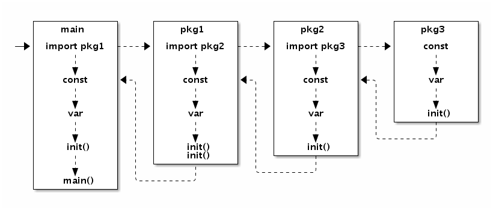

# 1.4 函数、方法和接口

函数对应操作序列，是程序的基本组成元素。Go语言中的函数有具名和匿名之分：具名函数一般对应于包级的函数，是匿名函数的一种特例，当匿名函数引用了外部作用域中的变量时就成了闭包函数，闭包函数是函数式编程语言的核心。方法是绑定到一个具体类型的特殊函数，Go语言中的方法是依托于类型的，必须在编译时静态绑定。接口定义了方法的集合，这些方法依托于运行时的接口对象，因此接口对应的方法是在运行时动态绑定的。Go语言通过隐式接口机制实现了鸭子面向对象模型。

Go语言程序的初始化和执行总是从`main.main`函数开始的。但是如果`main`包导入了其它的包，则会按照顺序将它们包含进`main`包里（这里的导入顺序依赖具体实现，一般可能是以文件名或包路径名的字符串顺序导入）。如果某个包被多次导入的话，在执行的时候只会导入一次。当一个包被导入时，如果它还导入了其它的包，则先将其它的包包含进来，然后创建和初始化这个包的常量和变量,再调用包里的`init`函数，如果一个包有多个`init`函数的话，调用顺序未定义(实现可能是以文件名的顺序调用)，同一个文件内的多个`init`则是以出现的顺序依次调用（`init`不是普通函数，可以定义有多个，所以也不能被其它函数调用）。最后，当`main`包的所有包级常量、变量被创建和初始化完成，并且`init`函数被执行后，才会进入`main.main`函数，程序开始正常执行。下图是Go程序函数启动顺序的示意图：



*图 1-11 包初始化流程*


要注意的是，在`main.main`函数执行之前所有代码都运行在同一个goroutine，也就是程序的主系统线程中。因此，如果某个`init`函数内部用go关键字启动了新的goroutine的话，新的goroutine只有在进入`main.main`函数之后才可能被执行到。

## 1.4.1 函数

在Go语言中，函数是第一类对象，我们可以将函数保持到变量中。函数主要有具名和匿名之分，包级函数一般都是具名函数，具名函数是匿名函数的一种特例。当然，Go语言中每个类型还可以有自己的方法，方法其实也是函数的一种。

```go
// 具名函数
func Add(a, b int) int {
	return a+b
}

// 匿名函数
var Add = func(a, b int) int {
	return a+b
}
```

Go语言中的函数可以有多个参数和多个返回值，参数和返回值都是以传值的方式和被调用者交换数据。在语法上，函数还支持可变数量的参数，可变数量的参数必须是最后出现的参数，可变数量的参数其实是一个切片类型的参数。

```go
// 多个参数和多个返回值
func Swap(a, b int) (int, int) {
	return b, a
}

// 可变数量的参数
// more 对应 []int 切片类型
func Sum(a int, more ...int) int {
	for _, v := range more {
		a += v
	}
	return a
}
```

当可变参数是一个空接口类型时，调用者是否解包可变参数会导致不同的结果：

```go
func main() {
	var a = []interface{}{123, "abc"}

	Print(a...) // 123 abc
	Print(a)    // [123 abc]
}

func Print(a ...interface{}) {
	fmt.Println(a...)
}
```

第一个`Print`调用时传入的参数是`a...`，等价于直接调用`Print(123, "abc")`。第二个`Print`调用传入的是未解包的`a`，等价于直接调用`Print([]interface{}{123, "abc"})`。

不仅函数的参数可以有名字，也可以给函数的返回值命名：

```go
func Find(m map[int]int, key int) (value int, ok bool) {
	value, ok = m[key]
	return
}
```

如果返回值命名了，可以通过名字来修改返回值，也可以通过`defer`语句在`return`语句之后修改返回值：

```go
func Inc() (v int) {
	defer func(){ v++ } ()
	return 42
}
```

其中`defer`语句延迟执行了一个匿名函数，因为这个匿名函数捕获了外部函数的局部变量`v`，这种函数我们一般叫闭包。闭包对捕获的外部变量并不是传值方式访问，而是以引用的方式访问。

闭包的这种引用方式访问外部变量的行为可能会导致一些隐含的问题：

```go
func main() {
	for i := 0; i < 3; i++ {
		defer func(){ println(i) } ()
	}
}
// Output:
// 3
// 3
// 3
```

因为是闭包，在`for`迭代语句中，每个`defer`语句延迟执行的函数引用的都是同一个`i`迭代变量，在循环结束后这个变量的值为3，因此最终输出的都是3。

修复的思路是在每轮迭代中为每个`defer`函数生成独有的变量。可以用下面两种方式：

```go
func main() {
	for i := 0; i < 3; i++ {
		i := i // 定义一个循环体内局部变量i
		defer func(){ println(i) } ()
	}
}

func main() {
	for i := 0; i < 3; i++ {
		// 通过函数传入i
		// defer 语句会马上对调用参数求值
		defer func(i int){ println(i) } (i)
	}
}
```

第一种方法是在循环体内部再定义一个局部变量，这样每次迭代`defer`语句的闭包函数捕获的都是不同的变量，这些变量的值对应迭代时的值。第二种方式是将迭代变量通过闭包函数的参数传入，`defer`语句会马上对调用参数求值。两种方式都是可以工作的。不过一般来说,在`for`循环内部执行`defer`语句并不是一个好的习惯，此处仅为示例，不建议使用。

Go语言中，如果以切片为参数调用函数时，有时候会给人一种参数采用了传引用的方式的假象：因为在被调用函数内部可以修改传入的切片的元素。其实，任何可以通过函数参数修改调用参数的情形，都是因为函数参数中显式或隐式传入了指针参数。函数参数传值的规范更准确说是只针对数据结构中固定的部分传值，例如字符串或切片对应结构体中的指针和字符串长度结构体传值，但是并不包含指针间接指向的内容。将切片类型的参数替换为类似`reflect.SliceHeader`结构体就很好理解切片传值的含义了：

```go
func twice(x []int) {
	for i := range x {
		x[i] *= 2
	}
}

type IntSliceHeader struct {
	Data []int
	Len  int
	Cap  int
}

func twice(x IntSliceHeader) {
	for i := 0; i < x.Len; i++ {
		x.Data[i] *= 2
	}
}
```

因为切片中的底层数组部分是通过隐式指针传递(指针本身依然是传值的，但是指针指向的却是同一份的数据)，所以被调用函数是可以通过指针修改掉调用参数切片中的数据。除了数据之外，切片结构还包含了切片长度和切片容量信息，这2个信息也是传值的。如果被调用函数中修改了`Len`或`Cap`信息的话，就无法反映到调用参数的切片中，这时候我们一般会通过返回修改后的切片来更新之前的切片。这也是为何内置的`append`必须要返回一个切片的原因。

Go语言中，函数还可以直接或间接地调用自己，也就是支持递归调用。Go语言函数的递归调用深度逻辑上没有限制，函数调用的栈是不会出现溢出错误的，因为Go语言运行时会根据需要动态地调整函数栈的大小。每个goroutine刚启动时只会分配很小的栈（4或8KB，具体依赖实现），根据需要动态调整栈的大小，栈最大可以达到GB级（依赖具体实现，在目前的实现中，32位体系结构为250MB,64位体系结构为1GB）。在Go1.4以前，Go的动态栈采用的是分段式的动态栈，通俗地说就是采用一个链表来实现动态栈，每个链表的节点内存位置不会发生变化。但是链表实现的动态栈对某些导致跨越链表不同节点的热点调用的性能影响较大，因为相邻的链表节点它们在内存位置一般不是相邻的，这会增加CPU高速缓存命中失败的几率。为了解决热点调用的CPU缓存命中率问题，Go1.4之后改用连续的动态栈实现，也就是采用一个类似动态数组的结构来表示栈。不过连续动态栈也带来了新的问题：当连续栈动态增长时，需要将之前的数据移动到新的内存空间，这会导致之前栈中全部变量的地址发生变化。虽然Go语言运行时会自动更新引用了地址变化的栈变量的指针，但最重要的一点是要明白Go语言中指针不再是固定不变的了（因此不能随意将指针保持到数值变量中，Go语言的地址也不能随意保存到不在GC控制的环境中，因此使用CGO时不能在C语言中长期持有Go语言对象的地址）。

因为，Go语言函数的栈会自动调整大小，所以普通Go程序员已经很少需要关心栈的运行机制的。在Go语言规范中甚至故意没有讲到栈和堆的概念。我们无法知道函数参数或局部变量到底是保存在栈中还是堆中，我们只需要知道它们能够正常工作就可以了。看看下面这个例子：

```go
func f(x int) *int {
	return &x
}

func g() int {
	x = new(int)
	return *x
}
```

第一个函数直接返回了函数参数变量的地址——这似乎是不可以的，因为如果参数变量在栈上的话，函数返回之后栈变量就失效了，返回的地址自然也应该失效了。但是Go语言的编译器和运行时比我们聪明的多，它会保证指针指向的变量在合适的地方。第二个函数，内部虽然调用`new`函数创建了`*int`类型的指针对象，但是依然不知道它具体保存在哪里。对于有C/C++编程经验的程序员需要强调的是：不用关心Go语言中函数栈和堆的问题，编译器和运行时会帮我们搞定；同样不要假设变量在内存中的位置是固定不变的，指针随时可能会变化，特别是在你不期望它变化的时候。

## 1.4.2 方法

方法一般是面向对象编程(OOP)的一个特性，在C++语言中方法对应一个类对象的成员函数，是关联到具体对象上的虚表中的。但是Go语言的方法却是关联到类型的，这样可以在编译阶段完成方法的静态绑定。一个面向对象的程序会用方法来表达其属性对应的操作，这样使用这个对象的用户就不需要直接去操作对象，而是借助方法来做这些事情。面向对象编程(OOP)进入主流开发领域一般认为是从C++开始的，C++就是在兼容C语言的基础之上支持了class等面向对象的特性。然后Java编程则号称是纯粹的面向对象语言，因为Java中函数是不能独立存在的，每个函数都必然是属于某个类的。

面向对象编程更多的只是一种思想，很多号称支持面向对象编程的语言只是将经常用到的特性内置到语言中了而已。Go语言的祖先C语言虽然不是一个支持面向对象的语言，但是C语言的标准库中的File相关的函数也用到了的面向对象编程的思想。下面我们实现一组C语言风格的File函数：

```go
// 文件对象
type File struct {
	fd int
}

// 打开文件
func OpenFile(name string) (f *File, err error) {
	// ...
}

// 关闭文件
func CloseFile(f *File) error {
	// ...
}

// 读文件数据
func ReadFile(f *File, offset int64, data []byte) int {
	// ...
}
```

其中`OpenFile`类似构造函数用于打开文件对象，`CloseFile`类似析构函数用于关闭文件对象，`ReadFile`则类似普通的成员函数，这三个函数都是普通的函数。`CloseFile`和`ReadFile`作为普通函数，需要占用包级空间中的名字资源。不过`CloseFile`和`ReadFile`函数只是针对`File`类型对象的操作，这时候我们更希望这类函数和操作对象的类型紧密绑定在一起。

Go语言中的做法是，将`CloseFile`和`ReadFile`函数的第一个参数移动到函数名的开头：

```go
// 关闭文件
func (f *File) CloseFile() error {
	// ...
}

// 读文件数据
func (f *File) ReadFile(offset int64, data []byte) int {
	// ...
}
```

这样的话，`CloseFile`和`ReadFile`函数就成了`File`类型独有的方法了（而不是`File`对象方法）。它们也不再占用包级空间中的名字资源，同时`File`类型已经明确了它们操作对象，因此方法名字一般简化为`Close`和`Read`：

```go
// 关闭文件
func (f *File) Close() error {
	// ...
}

// 读文件数据
func (f *File) Read(offset int64, data []byte) int {
	// ...
}
```

将第一个函数参数移动到函数前面，从代码角度看虽然只是一个小的改动，但是从编程哲学角度来看，Go语言已经是进入面向对象语言的行列了。我们可以给任何自定义类型添加一个或多个方法。每种类型对应的方法必须和类型的定义在同一个包中，因此是无法给`int`这类内置类型添加方法的（因为方法的定义和类型的定义不在一个包中）。对于给定的类型，每个方法的名字必须是唯一的，同时方法和函数一样也不支持重载。

方法是由函数演变而来，只是将函数的第一个对象参数移动到了函数名前面了而已。因此我们依然可以按照原始的过程式思维来使用方法。通过叫方法表达式的特性可以将方法还原为普通类型的函数：

```go
// 不依赖具体的文件对象
// func CloseFile(f *File) error
var CloseFile = (*File).Close

// 不依赖具体的文件对象
// func ReadFile(f *File, offset int64, data []byte) int
var ReadFile = (*File).Read

// 文件处理
f, _ := OpenFile("foo.dat")
ReadFile(f, 0, data)
CloseFile(f)
```

在有些场景更关心一组相似的操作：比如`Read`读取一些数组，然后调用`Close`关闭。此时的环境中，用户并不关心操作对象的类型，只要能满足通用的`Read`和`Close`行为就可以了。不过在方法表达式中，因为得到的`ReadFile`和`CloseFile`函数参数中含有`File`这个特有的类型参数，这使得`File`相关的方法无法和其它不是`File`类型但是有着相同`Read`和`Close`方法的对象无缝适配。这种小困难难不倒我们Go语言码农，我们可以通过结合闭包特性来消除方法表达式中第一个参数类型的差异：

```go
// 先打开文件对象
f, _ := OpenFile("foo.dat")

// 绑定到了 f 对象
// func Close() error
var Close = func() error {
	return (*File).Close(f)
}

// 绑定到了 f 对象
// func Read(offset int64, data []byte) int
var Read = func(offset int64, data []byte) int {
	return (*File).Read(f, offset, data)
}

// 文件处理
Read(0, data)
Close()
```

这刚好是方法值也要解决的问题。我们用方法值特性可以简化实现：

```go
// 先打开文件对象
f, _ := OpenFile("foo.dat")

// 方法值: 绑定到了 f 对象
// func Close() error
var Close = f.Close

// 方法值: 绑定到了 f 对象
// func Read(offset int64, data []byte) int
var Read = f.Read

// 文件处理
Read(0, data)
Close()
```

Go语言不支持传统面向对象中的继承特性，而是以自己特有的组合方式支持了方法的继承。Go语言中，通过在结构体内置匿名的成员来实现继承：

```go
import "image/color"

type Point struct{ X, Y float64 }

type ColoredPoint struct {
	Point
	Color color.RGBA
}
```

虽然我们可以将`ColoredPoint`定义为一个有三个字段的扁平结构的结构体，但是我们这里将`Point`嵌入到`ColoredPoint`来提供`X`和`Y`这两个字段。

```go
var cp ColoredPoint
cp.X = 1
fmt.Println(cp.Point.X) // "1"
cp.Point.Y = 2
fmt.Println(cp.Y)       // "2"
```

通过嵌入匿名的成员，我们不仅可以继承匿名成员的内部成员，而且可以继承匿名成员类型所对应的方法。我们一般会将Point看作基类，把ColoredPoint看作是它的继承类或子类。不过这种方式继承的方法并不能实现C++中虚函数的多态特性。所有继承来的方法的接收者参数依然是那个匿名成员本身，而不是当前的变量。

```go
type Cache struct {
	m map[string]string
	sync.Mutex
}

func (p *Cache) Lookup(key string) string {
	p.Lock()
	defer p.Unlock()

	return p.m[key]
}
```

`Cache`结构体类型通过嵌入一个匿名的`sync.Mutex`来继承它的`Lock`和`Unlock`方法. 但是在调用`p.Lock()`和`p.Unlock()`时, `p`并不是`Lock`和`Unlock`方法的真正接收者, 而是会将它们展开为`p.Mutex.Lock()`和`p.Mutex.Unlock()`调用. 这种展开是编译期完成的, 并没有运行时代价.

在传统的面向对象语言(eg.C++或Java)的继承中，子类的方法是在运行时动态绑定到对象的，因此基类实现的某些方法看到的`this`可能不是基类类型对应的对象，这个特性会导致基类方法运行的不确定性。而在Go语言通过嵌入匿名的成员来“继承”的基类方法，`this`就是实现该方法的类型的对象，Go语言中方法是编译时静态绑定的。如果需要虚函数的多态特性，我们需要借助Go语言接口来实现。

## 1.4.3 接口

Go语言之父Rob Pike曾说过一句名言：那些试图避免白痴行为的语言最终自己变成了白痴语言（Languages that try to disallow idiocy become themselves idiotic）。一般静态编程语言都有着严格的类型系统，这使得编译器可以深入检查程序员有没有作出什么出格的举动。但是，过于严格的类型系统却会使得编程太过繁琐，让程序员把大好的青春都浪费在了和编译器的斗争中。Go语言试图让程序员能在安全和灵活的编程之间取得一个平衡。它在提供严格的类型检查的同时，通过接口类型实现了对鸭子类型的支持，使得安全动态的编程变得相对容易。

Go的接口类型是对其它类型行为的抽象和概括；因为接口类型不会和特定的实现细节绑定在一起，通过这种抽象的方式我们可以让对象更加灵活和更具有适应能力。很多面向对象的语言都有相似的接口概念，但Go语言中接口类型的独特之处在于它是满足隐式实现的鸭子类型。所谓鸭子类型说的是：只要走起路来像鸭子、叫起来也像鸭子，那么就可以把它当作鸭子。Go语言中的面向对象就是如此，如果一个对象只要看起来像是某种接口类型的实现，那么它就可以作为该接口类型使用。这种设计可以让你创建一个新的接口类型满足已经存在的具体类型却不用去破坏这些类型原有的定义；当我们使用的类型来自于不受我们控制的包时这种设计尤其灵活有用。Go语言的接口类型是延迟绑定，可以实现类似虚函数的多态功能。

接口在Go语言中无处不在，在“Hello world”的例子中，`fmt.Printf`函数的设计就是完全基于接口的，它的真正功能由`fmt.Fprintf`函数完成。用于表示错误的`error`类型更是内置的接口类型。在C语言中，`printf`只能将几种有限的基础数据类型打印到文件对象中。但是Go语言灵活接口特性，`fmt.Fprintf`却可以向任何自定义的输出流对象打印，可以打印到文件或标准输出、也可以打印到网络、甚至可以打印到一个压缩文件；同时，打印的数据也不仅仅局限于语言内置的基础类型，任意隐式满足`fmt.Stringer`接口的对象都可以打印，不满足`fmt.Stringer`接口的依然可以通过反射的技术打印。`fmt.Fprintf`函数的签名如下：

```go
func Fprintf(w io.Writer, format string, args ...interface{}) (int, error)
```

其中`io.Writer`用于输出的接口，`error`是内置的错误接口，它们的定义如下：

```go
type io.Writer interface {
	Write(p []byte) (n int, err error)
}

type error interface {
	Error() string
}
```

我们可以通过定制自己的输出对象，将每个字符转为大写字符后输出：

```go
type UpperWriter struct {
	io.Writer
}

func (p *UpperWriter) Write(data []byte) (n int, err error) {
	return p.Writer.Write(bytes.ToUpper(data))
}

func main() {
	fmt.Fprintln(&UpperWriter{os.Stdout}, "hello, world")
}
```

当然，我们也可以定义自己的打印格式来实现将每个字符转为大写字符后输出的效果。对于每个要打印的对象，如果满足了`fmt.Stringer`接口，则默认使用对象的`String`方法返回的结果打印：

```go
type UpperString string

func (s UpperString) String() string {
	return strings.ToUpper(string(s))
}

type fmt.Stringer interface {
	String() string
}

func main() {
	fmt.Fprintln(os.Stdout, UpperString("hello, world"))
}
```

Go语言中，对于基础类型（非接口类型）不支持隐式的转换，我们无法将一个`int`类型的值直接赋值给`int64`类型的变量，也无法将`int`类型的值赋值给底层是`int`类型的新定义命名类型的变量。Go语言对基础类型的类型一致性要求可谓是非常的严格，但是Go语言对于接口类型的转换则非常的灵活。对象和接口之间的转换、接口和接口之间的转换都可能是隐式的转换。可以看下面的例子：

```go
var (
	a io.ReadCloser = (*os.File)(f) // 隐式转换, *os.File 满足 io.ReadCloser 接口
	b io.Reader     = a             // 隐式转换, io.ReadCloser 满足 io.Reader 接口
	c io.Closer     = a             // 隐式转换, io.ReadCloser 满足 io.Closer 接口
	d io.Reader     = c.(io.Reader) // 显式转换, io.Closer 不满足 io.Reader 接口
)
```

有时候对象和接口之间太灵活了，导致我们需要人为地限制这种无意之间的适配。常见的做法是定义一个含特殊方法来区分接口。比如`runtime`包中的`Error`接口就定义了一个特有的`RuntimeError`方法，用于避免其它类型无意中适配了该接口：

```go
type runtime.Error interface {
	error

	// RuntimeError is a no-op function but
	// serves to distinguish types that are run time
	// errors from ordinary errors: a type is a
	// run time error if it has a RuntimeError method.
	RuntimeError()
}
```

在protobuf中，`Message`接口也采用了类似的方法，也定义了一个特有的`ProtoMessage`，用于避免其它类型无意中适配了该接口：

```go
type proto.Message interface {
	Reset()
	String() string
	ProtoMessage()
}
```

不过这种做法只是君子协定，如果有人刻意伪造一个`proto.Message`接口也是很容易的。再严格一点的做法是给接口定义一个私有方法。只有满足了这个私有方法的对象才可能满足这个接口，而私有方法的名字是包含包的绝对路径名的，因此只能在包内部实现这个私有方法才能满足这个接口。测试包中的`testing.TB`接口就是采用类似的技术：

```go
type testing.TB interface {
	Error(args ...interface{})
	Errorf(format string, args ...interface{})
	...

	// A private method to prevent users implementing the
	// interface and so future additions to it will not
	// violate Go 1 compatibility.
	private()
}
```

不过这种通过私有方法禁止外部对象实现接口的做法也是有代价的：首先是这个接口只能包内部使用，外部包正常情况下是无法直接创建满足该接口对象的；其次，这种防护措施也不是绝对的，恶意的用户依然可以绕过这种保护机制。

在前面的方法一节中我们讲到，通过在结构体中嵌入匿名类型成员，可以继承匿名类型的方法。其实这个被嵌入的匿名成员不一定是普通类型，也可以是接口类型。我们可以通过嵌入匿名的`testing.TB`接口来伪造私有的`private`方法，因为接口方法是延迟绑定，编译时`private`方法是否真的存在并不重要。

```go
package main

import (
	"fmt"
	"testing"
)

type TB struct {
	testing.TB
}

func (p *TB) Fatal(args ...interface{}) {
	fmt.Println("TB.Fatal disabled!")
}

func main() {
	var tb testing.TB = new(TB)
	tb.Fatal("Hello, playground")
}
```

我们在自己的`TB`结构体类型中重新实现了`Fatal`方法，然后通过将对象隐式转换为`testing.TB`接口类型（因为内嵌了匿名的`testing.TB`对象，因此是满足`testing.TB`接口的），然后通过`testing.TB`接口来调用我们自己的`Fatal`方法。

这种通过嵌入匿名接口或嵌入匿名指针对象来实现继承的做法其实是一种纯虚继承，我们继承的只是接口指定的规范，真正的实现在运行的时候才被注入。比如，我们可以模拟实现一个gRPC的插件：

```go
type grpcPlugin struct {
	*generator.Generator
}

func (p *grpcPlugin) Name() string { return "grpc" }

func (p *grpcPlugin) Init(g *generator.Generator) {
	p.Generator = g
}

func (p *grpcPlugin) GenerateImports(file *generator.FileDescriptor) {
	if len(file.Service) == 0 {
		return
	}

	p.P(`import "google.golang.org/grpc"`)
	// ...
}
```

构造的`grpcPlugin`类型对象必须满足`generate.Plugin`接口（在"github.com/golang/protobuf/protoc-gen-go/generator"包中）：

```go
type Plugin interface {
	// Name identifies the plugin.
	Name() string
	// Init is called once after data structures are built but before
	// code generation begins.
	Init(g *Generator)
	// Generate produces the code generated by the plugin for this file,
	// except for the imports, by calling the generator's methods
	// P, In, and Out.
	Generate(file *FileDescriptor)
	// GenerateImports produces the import declarations for this file.
	// It is called after Generate.
	GenerateImports(file *FileDescriptor)
}
```

`generate.Plugin`接口对应的`grpcPlugin`类型的`GenerateImports`方法中使用的`p.P(...)`函数却是通过`Init`函数注入的`generator.Generator`对象实现。这里的`generator.Generator`对应一个具体类型，但是如果`generator.Generator`是接口类型的话我们甚至可以传入直接的实现。

Go语言通过几种简单特性的组合，就轻易就实现了鸭子面向对象和虚拟继承等高级特性，真的是不可思议。
