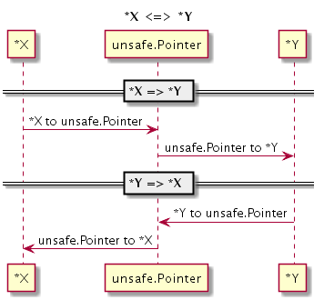
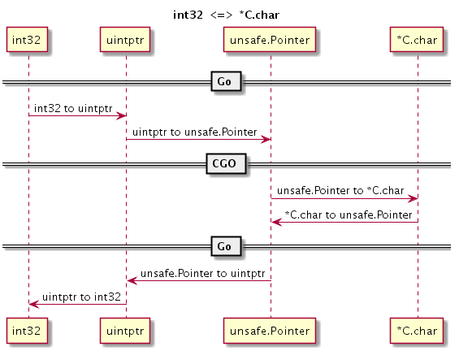

# 2.3 类型转换

最初 CGO 是为了达到方便从 Go 语言函数调用 C 语言函数（用 C 语言实现 Go 语言声明的函数）以复用 C 语言资源这一目的而出现的（因为 C 语言还会涉及回调函数，自然也会涉及到从 C 语言函数调用 Go 语言函数（用 Go 语言实现 C 语言声明的函数））。现在，它已经演变为 C 语言和 Go 语言双向通讯的桥梁。要想利用好 CGO 特性，自然需要了解此二语言类型之间的转换规则，这是本节要讨论的问题。

## 2.3.1 数值类型

在 Go 语言中访问 C 语言的符号时，一般是通过虚拟的 “C” 包访问，比如 `C.int` 对应 C 语言的 `int` 类型。有些 C 语言的类型是由多个关键字组成，但通过虚拟的 “C” 包访问 C 语言类型时名称部分不能有空格字符，比如 `unsigned int` 不能直接通过 `C.unsigned int` 访问。因此 CGO 为 C 语言的基础数值类型都提供了相应转换规则，比如 `C.uint` 对应 C 语言的 `unsigned int`。

Go 语言中数值类型和 C 语言数据类型基本上是相似的，以下是它们的对应关系表 2-1 所示。

C 语言类型               | CGO 类型      | Go 语言类型
---------------------- | ----------- | ---------
char                   | C.char      | byte
singed char            | C.schar     | int8
unsigned char          | C.uchar     | uint8
short                  | C.short     | int16
unsigned short         | C.ushort     | uint16
int                    | C.int       | int32
unsigned int           | C.uint      | uint32
long                   | C.long      | int32
unsigned long          | C.ulong     | uint32
long long int          | C.longlong  | int64
unsigned long long int | C.ulonglong | uint64
float                  | C.float     | float32
double                 | C.double    | float64
size_t                 | C.size_t    | uint

*表 2-1 Go 语言和 C 语言类型对比*

需要注意的是，虽然在 C 语言中 `int`、`short` 等类型没有明确定义内存大小，但是在 CGO 中它们的内存大小是确定的。在 CGO 中，C 语言的 `int` 和 `long` 类型都是对应 4 个字节的内存大小，`size_t` 类型可以当作 Go 语言 `uint` 无符号整数类型对待。

CGO 中，虽然 C 语言的 `int` 固定为 4 字节的大小，但是 Go 语言自己的 `int` 和 `uint` 却在 32 位和 64 位系统下分别对应 4 个字节和 8 个字节大小。如果需要在 C 语言中访问 Go 语言的 `int` 类型，可以通过 `GoInt` 类型访问，`GoInt` 类型在 CGO 工具生成的 `_cgo_export.h` 头文件中定义。其实在 `_cgo_export.h` 头文件中，每个基本的 Go 数值类型都定义了对应的 C 语言类型，它们一般都是以单词 Go 为前缀。下面是 64 位环境下，`_cgo_export.h` 头文件生成的 Go 数值类型的定义，其中 `GoInt` 和 `GoUint` 类型分别对应 `GoInt64` 和 `GoUint64`：

```c
typedef signed char GoInt8;
typedef unsigned char GoUint8;
typedef short GoInt16;
typedef unsigned short GoUint16;
typedef int GoInt32;
typedef unsigned int GoUint32;
typedef long long GoInt64;
typedef unsigned long long GoUint64;
typedef GoInt64 GoInt;
typedef GoUint64 GoUint;
typedef float GoFloat32;
typedef double GoFloat64;
```

除了 `GoInt` 和 `GoUint` 之外，我们并不推荐直接访问 `GoInt32`、`GoInt64` 等类型。更好的做法是通过 C 语言的 C99 标准引入的 `<stdint.h>` 头文件。为了提高 C 语言的可移植性，在 `<stdint.h>` 文件中，不但每个数值类型都提供了明确内存大小，而且和 Go 语言的类型命名更加一致。Go 语言类型 `<stdint.h>` 头文件类型对比如表 2-2 所示。

C 语言类型 | CGO 类型     | Go 语言类型
-------- | ---------- | ---------
int8_t   | C.int8_t   | int8
uint8_t  | C.uint8_t  | uint8
int16_t  | C.int16_t  | int16
uint16_t | C.uint16_t | uint16
int32_t  | C.int32_t  | int32
uint32_t | C.uint32_t | uint32
int64_t  | C.int64_t  | int64
uint64_t | C.uint64_t | uint64

*表 2-2 `<stdint.h>` 类型对比*

前文说过，如果 C 语言的类型是由多个关键字组成，则无法通过虚拟的 “C” 包直接访问(比如 C 语言的 `unsigned short` 不能直接通过 `C.unsigned short` 访问)。但是，在 `<stdint.h>` 中通过使用 C 语言的 `typedef` 关键字将 `unsigned short` 重新定义为 `uint16_t` 这样一个单词的类型后，我们就可以通过 `C.uint16_t` 访问原来的 `unsigned short` 类型了。对于比较复杂的 C 语言类型，推荐使用 `typedef` 关键字提供一个规则的类型命名，这样更利于在 CGO 中访问。

## 2.3.2 Go 字符串和切片

在 CGO 生成的 `_cgo_export.h` 头文件中还会为 Go 语言的字符串、切片、字典、接口和管道等特有的数据类型生成对应的 C 语言类型：

```c
typedef struct {const char *p; GoInt n;} GoString;
typedef void *GoMap;
typedef void *GoChan;
typedef struct {void *t; void *v;} GoInterface;
typedef struct {void *data; GoInt len; GoInt cap;} GoSlice;
```

不过需要注意的是，其中只有字符串和切片在 CGO 中有一定的使用价值，因为 CGO 为他们的某些 GO 语言版本的操作函数生成了 C 语言版本，因此二者可以在 Go 调用 C 语言函数时马上使用; 而 CGO 并未针对其他的类型提供相关的辅助函数，且 Go 语言特有的内存模型导致我们无法保持这些由 Go 语言管理的内存指针，所以它们 C 语言环境并无使用的价值。

在导出的 C 语言函数中我们可以直接使用 Go 字符串和切片。假设有以下两个导出函数：

```go
//export helloString
func helloString(s string) {}

//export helloSlice
func helloSlice(s []byte) {}
```

CGO 生成的 `_cgo_export.h` 头文件会包含以下的函数声明：

```c
extern void helloString(GoString p0);
extern void helloSlice(GoSlice p0);
```

不过需要注意的是，如果使用了 GoString 类型则会对 `_cgo_export.h` 头文件产生依赖，而这个头文件是动态输出的。

Go1.10 针对 Go 字符串增加了一个 `_GoString_` 预定义类型，可以降低在 cgo 代码中可能对 `_cgo_export.h` 头文件产生的循环依赖的风险。我们可以调整 helloString 函数的 C 语言声明为：

```c
extern void helloString(_GoString_ p0);
```

因为 `_GoString_` 是预定义类型，我们无法通过此类型直接访问字符串的长度和指针等信息。Go1.10 同时也增加了以下两个函数用于获取字符串结构中的长度和指针信息：

```c
size_t _GoStringLen(_GoString_ s);
const char *_GoStringPtr(_GoString_ s);
```

更严谨的做法是为 C 语言函数接口定义严格的头文件，然后基于稳定的头文件实现代码。

## 2.3.3 结构体、联合、枚举类型

C 语言的结构体、联合、枚举类型不能作为匿名成员被嵌入到 Go 语言的结构体中。在 Go 语言中，我们可以通过 `C.struct_xxx` 来访问 C 语言中定义的 `struct xxx` 结构体类型。结构体的内存布局按照 C 语言的通用对齐规则，在 32 位 Go 语言环境 C 语言结构体也按照 32 位对齐规则，在 64 位 Go 语言环境按照 64 位的对齐规则。对于指定了特殊对齐规则的结构体，无法在 CGO 中访问。

结构体的简单用法如下：

```go
/*
struct A {
	int i;
	float f;
};
*/
import "C"
import "fmt"

func main() {
	var a C.struct_A
	fmt.Println(a.i)
	fmt.Println(a.f)
}
```

如果结构体的成员名字中碰巧是 Go 语言的关键字，可以通过在成员名开头添加下划线来访问：

```go
/*
struct A {
	int type; // type 是 Go 语言的关键字
};
*/
import "C"
import "fmt"

func main() {
	var a C.struct_A
	fmt.Println(a._type) // _type 对应 type
}
```

但是如果有 2 个成员：一个是以 Go 语言关键字命名，另一个刚好是以下划线和 Go 语言关键字命名，那么以 Go 语言关键字命名的成员将无法访问（被屏蔽）：

```go
/*
struct A {
	int   type;  // type 是 Go 语言的关键字
	float _type; // 将屏蔽 CGO 对 type 成员的访问
};
*/
import "C"
import "fmt"

func main() {
	var a C.struct_A
	fmt.Println(a._type) // _type 对应 _type
}
```

C 语言结构体中位字段对应的成员无法在 Go 语言中访问，如果需要操作位字段成员，需要通过在 C 语言中定义辅助函数来完成。对应零长数组的成员，无法在 Go 语言中直接访问数组的元素，但其中零长的数组成员所在位置的偏移量依然可以通过 `unsafe.Offsetof(a.arr)` 来访问。

```go
/*
struct A {
	int   size: 10; // 位字段无法访问
	float arr[];    // 零长的数组也无法访问
};
*/
import "C"
import "fmt"

func main() {
	var a C.struct_A
	fmt.Println(a.size) // 错误: 位字段无法访问
	fmt.Println(a.arr)  // 错误: 零长的数组也无法访问
}
```

在 C 语言中，我们无法直接访问 Go 语言定义的结构体类型。

对于联合类型，我们可以通过 `C.union_xxx` 来访问 C 语言中定义的 `union xxx` 类型。但是 Go 语言中并不支持 C 语言联合类型，它们会被转为对应大小的字节数组。

```go
/*
#include <stdint.h>

union B1 {
	int i;
	float f;
};

union B2 {
	int8_t i8;
	int64_t i64;
};
*/
import "C"
import "fmt"

func main() {
	var b1 C.union_B1;
	fmt.Printf("%T\n", b1) // [4]uint8

	var b2 C.union_B2;
	fmt.Printf("%T\n", b2) // [8]uint8
}
```

如果需要操作 C 语言的联合类型变量，一般有三种方法：第一种是在 C 语言中定义辅助函数；第二种是通过 Go 语言的 "encoding/binary" 手工解码成员 (需要注意大端小端问题)；第三种是使用 `unsafe` 包强制转型为对应类型 (这是性能最好的方式)。下面展示通过 `unsafe` 包访问联合类型成员的方式：

```go
/*
#include <stdint.h>

union B {
	int i;
	float f;
};
*/
import "C"
import "fmt"

func main() {
	var b C.union_B;
	fmt.Println("b.i:", *(*C.int)(unsafe.Pointer(&b)))
	fmt.Println("b.f:", *(*C.float)(unsafe.Pointer(&b)))
}
```

虽然 `unsafe` 包访问最简单、性能也最好，但是对于有嵌套联合类型的情况处理会导致问题复杂化。对于复杂的联合类型，推荐通过在 C 语言中定义辅助函数的方式处理。

对于枚举类型，我们可以通过 `C.enum_xxx` 来访问 C 语言中定义的 `enum xxx` 结构体类型。

```go
/*
enum C {
	ONE,
	TWO,
};
*/
import "C"
import "fmt"

func main() {
	var c C.enum_C = C.TWO
	fmt.Println(c)
	fmt.Println(C.ONE)
	fmt.Println(C.TWO)
}
```

在 C 语言中，枚举类型底层对应 `int` 类型，支持负数类型的值。我们可以通过 `C.ONE`、`C.TWO` 等直接访问定义的枚举值。

## 2.3.4 数组、字符串和切片

在 C 语言中，数组名其实对应于一个指针，指向特定类型特定长度的一段内存，但是这个指针不能被修改；当把数组名传递给一个函数时，实际上传递的是数组第一个元素的地址。为了讨论方便，我们将一段特定长度的内存统称为数组。C 语言的字符串是一个 char 类型的数组，字符串的长度需要根据表示结尾的 NULL 字符的位置确定。C 语言中没有切片类型。

在 Go 语言中，数组是一种值类型，而且数组的长度是数组类型的一个部分。Go 语言字符串对应一段长度确定的只读 byte 类型的内存。Go 语言的切片则是一个简化版的动态数组。


Go 语言和 C 语言的数组、字符串和切片之间的相互转换可以简化为 Go 语言的切片和 C 语言中指向一定长度内存的指针之间的转换。

CGO 的 C 虚拟包提供了以下一组函数，用于 Go 语言和 C 语言之间数组和字符串的双向转换：

```go
// Go string to C string
// The C string is allocated in the C heap using malloc.
// It is the caller's responsibility to arrange for it to be
// freed, such as by calling C.free (be sure to include stdlib.h
// if C.free is needed).
func C.CString(string) *C.char

// Go []byte slice to C array
// The C array is allocated in the C heap using malloc.
// It is the caller's responsibility to arrange for it to be
// freed, such as by calling C.free (be sure to include stdlib.h
// if C.free is needed).
func C.CBytes([]byte) unsafe.Pointer

// C string to Go string
func C.GoString(*C.char) string

// C data with explicit length to Go string
func C.GoStringN(*C.char, C.int) string

// C data with explicit length to Go []byte
func C.GoBytes(unsafe.Pointer, C.int) []byte
```

其中 `C.CString` 针对输入的 Go 字符串，克隆一个 C 语言格式的字符串；返回的字符串由 C 语言的 `malloc` 函数分配，不使用时需要通过 C 语言的 `free` 函数释放。`C.CBytes` 函数的功能和 `C.CString` 类似，用于从输入的 Go 语言字节切片克隆一个 C 语言版本的字节数组，同样返回的数组需要在合适的时候释放。`C.GoString` 用于将从 NULL 结尾的 C 语言字符串克隆一个 Go 语言字符串。`C.GoStringN` 是另一个字符数组克隆函数。`C.GoBytes` 用于从 C 语言数组，克隆一个 Go 语言字节切片。

该组辅助函数都是以克隆的方式运行。当 Go 语言字符串和切片向 C 语言转换时，克隆的内存由 C 语言的 `malloc` 函数分配，最终可以通过 `free` 函数释放。当 C 语言字符串或数组向 Go 语言转换时，克隆的内存由 Go 语言分配管理。通过该组转换函数，转换前和转换后的内存依然在各自的语言环境中，它们并没有跨越 Go 语言和 C 语言。克隆方式实现转换的优点是接口和内存管理都很简单，缺点是克隆需要分配新的内存和复制操作都会导致额外的开销。

在 `reflect` 包中有字符串和切片的定义：

```go
type StringHeader struct {
    Data uintptr
    Len  int
}

type SliceHeader struct {
    Data uintptr
    Len  int
    Cap  int
}
```

如果不希望单独分配内存，可以在 Go 语言中直接访问 C 语言的内存空间：

```go
/*
#include <string.h>
char arr[10];
char *s = "Hello";
*/
import "C"
import (
	"reflect"
	"unsafe"
)
func main() {
	// 通过 reflect.SliceHeader 转换
	var arr0 []byte
	var arr0Hdr = (*reflect.SliceHeader)(unsafe.Pointer(&arr0))
	arr0Hdr.Data = uintptr(unsafe.Pointer(&C.arr[0]))
	arr0Hdr.Len = 10
	arr0Hdr.Cap = 10

	// 通过切片语法转换
	arr1 := (*[31]byte)(unsafe.Pointer(&C.arr[0]))[:10:10]

	var s0 string
	var s0Hdr = (*reflect.StringHeader)(unsafe.Pointer(&s0))
	s0Hdr.Data = uintptr(unsafe.Pointer(C.s))
	s0Hdr.Len = int(C.strlen(C.s))

	sLen := int(C.strlen(C.s))
    	s1 := string((*[31]byte)(unsafe.Pointer(C.s))[:sLen:sLen])
}
```

因为 Go 语言的字符串是只读的，用户需要自己保证 Go 字符串在使用期间，底层对应的 C 字符串内容不会发生变化、内存不会被提前释放掉。

在 CGO 中，会为字符串和切片生成和上面结构对应的 C 语言版本的结构体：

```c
typedef struct {const char *p; GoInt n;} GoString;
typedef struct {void *data; GoInt len; GoInt cap;} GoSlice;
```

在 C 语言中可以通过 `GoString` 和 `GoSlice` 来访问 Go 语言的字符串和切片。如果是 Go 语言中数组类型，可以将数组转为切片后再行转换。如果字符串或切片对应的底层内存空间由 Go 语言的运行时管理，那么在 C 语言中不能长时间保存 Go 内存对象。

关于 CGO 内存模型的细节在稍后章节中会详细讨论。

## 2.3.5 指针间的转换

在 C 语言中，不同类型的指针是可以显式或隐式转换的，如果是隐式只是会在编译时给出一些警告信息。但是 Go 语言对于不同类型的转换非常严格，任何 C 语言中可能出现的警告信息在 Go 语言中都可能是错误！指针是 C 语言的灵魂，指针间的自由转换也是 cgo 代码中经常要解决的第一个重要的问题。

在 Go 语言中两个指针的类型完全一致则不需要转换可以直接通用。如果一个指针类型是用 type 命令在另一个指针类型基础之上构建的，换言之两个指针底层是相同完全结构的指针，那么我我们可以通过直接强制转换语法进行指针间的转换。但是 cgo 经常要面对的是 2 个完全不同类型的指针间的转换，原则上这种操作在纯 Go 语言代码是严格禁止的。

cgo 存在的一个目的就是打破 Go 语言的禁止，恢复 C 语言应有的指针的自由转换和指针运算。以下代码演示了如何将 X 类型的指针转化为 Y 类型的指针：

```go
var p *X
var q *Y

q = (*Y)(unsafe.Pointer(p)) // *X => *Y
p = (*X)(unsafe.Pointer(q)) // *Y => *X
```

为了实现 X 类型指针到 Y 类型指针的转换，我们需要借助 `unsafe.Pointer` 作为中间桥接类型实现不同类型指针之间的转换。`unsafe.Pointer` 指针类型类似 C 语言中的 `void*` 类型的指针。

下面是指针间的转换流程的示意图：



*图 2-1 X 类型指针转 Y 类型指针*


任何类型的指针都可以通过强制转换为 `unsafe.Pointer` 指针类型去掉原有的类型信息，然后再重新赋予新的指针类型而达到指针间的转换的目的。

## 2.3.6 数值和指针的转换

不同类型指针间的转换看似复杂，但是在 cgo 中已经算是比较简单的了。在 C 语言中经常遇到用普通数值表示指针的场景，也就是说如何实现数值和指针的转换也是 cgo 需要面对的一个问题。

为了严格控制指针的使用，Go 语言禁止将数值类型直接转为指针类型！不过，Go 语言针对 `unsafe.Pointr` 指针类型特别定义了一个 uintptr 类型。我们可以 uintptr 为中介，实现数值类型到 `unsafe.Pointr` 指针类型到转换。再结合前面提到的方法，就可以实现数值和指针的转换了。

下面流程图演示了如何实现 int32 类型到 C 语言的 `char*` 字符串指针类型的相互转换：



*图 2-2 int32 和 `char*` 指针转换*


转换分为几个阶段，在每个阶段实现一个小目标：首先是 int32 到 uintptr 类型，然后是 uintptr 到 `unsafe.Pointr` 指针类型，最后是 `unsafe.Pointr` 指针类型到 `*C.char` 类型。

## 2.3.7 切片间的转换

在 C 语言中数组也一种指针，因此两个不同类型数组之间的转换和指针间转换基本类似。但是在 Go 语言中，数组或数组对应的切片都不再是指针类型，因此我们也就无法直接实现不同类型的切片之间的转换。

不过 Go 语言的 reflect 包提供了切片类型的底层结构，再结合前面讨论到不同类型之间的指针转换技术就可以实现 `[]X` 和 `[]Y` 类型的切片转换：

```go
var p []X
var q []Y

pHdr := (*reflect.SliceHeader)(unsafe.Pointer(&p))
qHdr := (*reflect.SliceHeader)(unsafe.Pointer(&q))

pHdr.Data = qHdr.Data
pHdr.Len = qHdr.Len * unsafe.Sizeof(q[0]) / unsafe.Sizeof(p[0])
pHdr.Cap = qHdr.Cap * unsafe.Sizeof(q[0]) / unsafe.Sizeof(p[0])
```

不同切片类型之间转换的思路是先构造一个空的目标切片，然后用原有的切片底层数据填充目标切片。如果 X 和 Y 类型的大小不同，需要重新设置 Len 和 Cap 属性。需要注意的是，如果 X 或 Y 是空类型，上述代码中可能导致除 0 错误，实际代码需要根据情况酌情处理。

下面演示了切片间的转换的具体流程：


*图 2-3 X 类型切片转 Y 类型切片*


针对 CGO 中常用的功能，作者封装了 "github.com/chai2010/cgo" 包，提供基本的转换功能，具体的细节可以参考实现代码。
