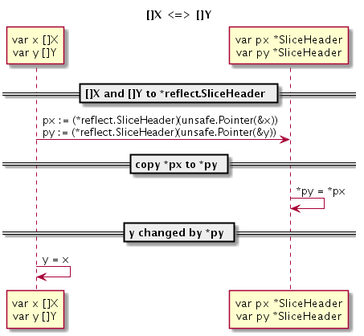

# 2.3 Type Conversion

Originally, CGO was created to facilitate the use of C language functions (functions that implement Go language declarations in C language) to reuse C language resources (because C language also involves callback functions, naturally It involves calling Go language functions from C language functions (functions that implement C language declarations in Go)). Now, it has evolved into a bridge between two-way communication between C and Go. In order to take advantage of the CGO feature, it is natural to understand the conversion rules between the two language types. This is the problem to be discussed in this section.

## 2.3.1 Numerical types

When accessing C language symbols in Go language, it is usually accessed through a virtual "C" package, such as `C.int` corresponding to the C language's `int` type. Some C language types are composed of multiple keywords, but when accessing C language types through virtual "C" packages, the name part cannot have white space characters. For example, `unsigned int` cannot be accessed directly through `C.unsigned int`. Therefore, CGO provides corresponding conversion rules for the basic numeric types of C language, such as `C.uint` corresponding to C's `unsigned int`.

The numeric type and the C language data type in the Go language are basically similar, and the following is the correspondence between them in Table 2-1.

C language type | CGO type | Go language type
---------------------- | ----------- | ---------
Char | C.char | byte
Singed char | C.schar | int8
Unsigned char | C.uchar | uint8
Short | C.short | int16
Unsigned short | C.ushort | uint16
Int | C.int | int32
Unsigned int | C.uint | uint32
Long | C.long | int32
Unsigned long | C.ulong | uint32
Long long int | C.longlong | int64
Unsigned long long int | C.ulonglong | uint64
Float | C.float | float32
Double | C.double | float64
Size_t | C.size_t | uint

*Table 2-1 Comparison of Go language and C language type*

It should be noted that although the types of `int`, `short`, etc. in the C language do not explicitly define the memory size, their memory size is determined in CGO. In CGO, the C's `int` and `long` types all correspond to a 4-byte memory size, and the `size_t` type can be treated as a Go language `uint` unsigned integer type.

In CGO, although the C language 'int` is fixed to a size of 4 bytes, the Go language's own `int` and `uint` correspond to 4 bytes and 8 bytes respectively under 32-bit and 64-bit systems. size. If you need to access the Go language's `int` type in the C language, you can access it with the `GoInt` type, and the `GoInt` type is defined in the `_cgo_export.h` header file generated by the CGO tool. In fact, in the `_cgo_export.h` header file, each basic Go value type defines the corresponding C language type, which are generally prefixed with the word Go. The following is a definition of the Go value type generated by the `_cgo_export.h` header file in a 64-bit environment, where the `GoInt` and `GoUint` types correspond to `GoInt64` and `GoUint64` respectively:

```c
Typedef signed char GoInt8;
Typedef unsigned char GoUint8;
Typedef short GoInt16;
Typedef unsigned short GoUint16;
Typedef int GoInt32;
Typedef unsigned int GoUint32;
Typedef long long GoInt64;
Typedef unsigned long long GoUint64;
Typedef GoInt64 GoInt;
Typedef GoUint64 GoUint;
Typedef float GoFloat32;
Typedef double GoFloat64;
```

In addition to `GoInt` and `GoUint`, we do not recommend direct access to `GoInt32`, `GoInt64` and other types. A better approach is to use the `<stdint.h>` header file introduced by the C language C99 standard. In order to improve the portability of C language, not only does each numeric type provide explicit memory size in the `<stdint.h>` file, but it is more consistent with the type name of the Go language. The Go language type `<stdint.h>` header file type pair is shown in Table 2-2.

C language type | CGO type | Go language type
-------- | ---------- | ---------
Int8_t | C.int8_t | int8
Uint8_t | C.uint8_t | uint8
Int16_t | C.int16_t | int16
Uint16_t | C.uint16_t | uint16
Int32_t | C.int32_t | int32
Uint32_t | C.uint32_t | uint32
Int64_t | C.int64_t | int64
Uint64_t | C.uint64_t | uint64

*Table 2-2 `<stdint.h>` Type Comparison*

As mentioned above, if the C language type is composed of multiple keywords, it cannot be accessed directly through the virtual "C" package (for example, the C language `unsigned short` cannot be accessed directly through `C.unsigned short`). However, after ``resigned short` is redefined as `uint16_t` in the `<stdint.h>` by the C type 'typedef` keyword, we can access the original by `C.uint16_t` The `unsigned short` type. For more complex C language types, it is recommended to use the `typedef` keyword to provide a type name for the rule, which is more convenient for access in CGO.

## 2.3.2 Go string and slice

In the `_cgo_export.h` header file generated by CGO, the corresponding C language type is also generated for the unique data types of Go language strings, slices, dictionaries, interfaces, and pipes:

```c
Typedef struct { const char *p; GoInt n; } GoString;
Typedef void *GoMap;
Typedef void *GoChan;
Typedef struct { void *t; void *v; } GoInterface;
Typedef struct { void *data; GoInt len; GoInt cap; } GoSlice;
```

However, it should be noted that only strings and slices have some value in CGO, because CGO generates C language versions for some of their GO language versions of the operation functions, so both can call C language functions in Go. It is used immediately; CGO does not provide related helper functions for other types, and the Go language-specific memory model prevents us from maintaining these memory pointers managed by the Go language, so their C-language environment has no value to use.

In the exported C language function we can directly use Go strings and slices. Suppose you have the following two export functions:

```go
//export helloString
Func helloString(s string) {}

//export helloSlice
Func helloSlice(s []byte) {}
```

The `_cgo_export.h` header file generated by CGO will contain the following function declarations:

```c
Extern void helloString(GoString p0);
Extern void helloSlice(GoSlice p0);
```

However, it should be noted that if the GoString type is used, it will have a dependency on the `_cgo_export.h` header file, which is dynamically output.

Go1.10 adds a `_GoString_` predefined type to the Go string to reduce the risk of circular dependencies on the `_cgo_export.h` header file in cgo code. We can adjust the C language declaration of the helloString function to:

```c
Extern void helloString(_GoString_ p0);
```

Because `_GoString_` is a predefined type, we can't directly access the length and pointer of the string through this type. Go1.10 also adds the following two functions to get the length and pointer information in the string structure:

```c
Size_t _GoStringLen(_GoString_ s);
Const char *_GoStringPtr(_GoString_ s);
```

A more rigorous approach is to define strict header files for C language function interfaces and then implement the code based on stable header files.

## 2.3.3 Structure, union, enumeration type

The structure, union, and enumeration types of the C language cannot be embedded as an anonymous member into the structure of the Go language. In Go, we can access the `struct xxx` structure type defined in C by `C.struct_xxx`. The memory layout of the structure follows the general alignment rules of the C language. In the 32-bit Go language environment, the C language structure also follows the 32-bit alignment rule, and the 64-bit Go language environment follows the 64-bit alignment rule. For structures that have special alignment rules specified, they cannot be accessed in CGO.

The simple usage of the structure is as follows:

```go
/*
Struct A {
Int i;
Float f;
};
*/
Import "C"
Import "fmt"

Func main() {
Var a C.struct_A
fmt.Println(a.i)
fmt.Println(a.f)
}
```

If the member name of the structure happens to be a keyword in the Go language, you can access it by adding an underscore at the beginning of the member name:

```go
/*
Struct A {
Int type; // type is the keyword for the Go language
};
*/
Import "C"
Import "fmt"

Func main() {
Var a C.struct_A
fmt.Println(a._type) // _type corresponds to type
}
```

But if there are 2 members: one is named after the Go language keyword, and the other is just the underscore and the Go language keyword, then members named after the Go language keyword will not be accessible (blocked):

```go
/*
Struct A {
Int type; // type is the keyword for the Go language
Float _type; // will block CGO access to type members
};
*/
Import "C"
Import "fmt"

Func main() {
Var a C.struct_A
fmt.Println(a._type) // _type corresponds to _type
}
```

Members corresponding to the bit field in the C language structure cannot be accessed in the Go language. If you need to manipulate the bit field members, you need to define the helper function in the C language. For members of a zero-length array, the elements of the array cannot be directly accessed in the Go language, but the offset of the position of the zero-length array member can still be accessed by `unsafe.Offsetof(a.arr)`.

```go
/*
Struct A {
Int size: 10; // bit field cannot be accessed
Float arr[]; // Zero-length arrays are also inaccessible
};
*/
Import "C"
Import "fmt"

Func main() {
Var a C.struct_A
fmt.Println(a.size) // Error: Bit field cannot be accessed
fmt.Println(a.arr) // Error: Zero-length array is also inaccessible
}
```

In the C language, we can't directly access the structure type defined by the Go language.

For the union type, we can access the `union xxx` type defined in the C language by `C.union_xxx`. However, the C language union types are not supported in the Go language, and they are converted to byte arrays of corresponding sizes.

```go
/*
#include <stdint.h>

Union B1 {
Int i;
Float f;
};

Union B2 {
Int8_t i8;
Int64_t i64;
};
*/
Import "C"
Import "fmt"

Func main() {
Var b1 C.union_B1;
fmt.Printf("%T\n", b1) // [4]uint8

Var b2 C.union_B2;
fmt.Printf("%T\n", b2) // [8]uint8
}
```

If you need to manipulate the C type joint type variable, there are generally three methods: the first is to define the helper function in the C language; the second is to manually decode the member through the "encoding/binary" of the Go language (note the big endian Problem); the third is to use the `unsafe` package to cast to the corresponding type (this is the best way to perform). The following shows how to access federated type members via the `unsafe` package:

```go
/*
#include <stdint.h>

Union B {
Int i;
Float f;
};
*/
Import "C"
Import "fmt"

Func main() {
Var b C.union_B;
fmt.Println("b.i:", *(*C.int)(unsafe.Pointer(&b)))
fmt.Println("b.f:", *(*C.float)(unsafe.Pointer(&b)))
}
```

Although the `unsafe` package is the easiest to access and the best in performance, it can complicate the problem when dealing with nested union types. For complex union types, it is recommended to handle them by defining helper functions in the C language.

For enumerated types, we can access the `enum xxx` structure type defined in C by `C.enum_xxx`.

```go
/*
Enum C {
ONE,
TWO,
};
*/
Import "C"
Import "fmt"

Func main() {
Var c C.enum_C = C.TWO
fmt.Println(c)
fmt.Println(C.ONE)
fmt.Println(C.TWO)
}
```

In C, the underlying type of the enumeration type corresponds to the `int` type, which supports values ​​of negative types. We can directly access the defined enumeration values ​​through `C.ONE`, `C.TWO`, etc.

## 2.3.4 Arrays, strings, and slices

In C, the array name actually corresponds to a pointer to a piece of memory of a specific length of a particular type, but this pointer cannot be modified; when passing the array name to a function, it actually passes the first element of the array. address. For the sake of discussion, we will refer to a certain length of memory as an array. The C language string is an array of char type, and the length of the string needs to be determined according to the position of the NULL character indicating the end. There is no slice type in C language.

In Go, an array is a value type, and the length of the array is a part of the array type. The Go language string corresponds to a certain length of read-only byte type memory. The slice of the Go language is a simplified version of the dynamic array.


The conversion between Go and C arrays, strings, and slices can be simplified to convert between Go slices and C pointers pointing to a certain length of memory.

CGO's C virtual package provides the following set of functions for bidirectional conversion of arrays and strings between Go and C:

```go
// Go string to C string
// The C string is allocated in the C heap using malloc.
// It is the caller's responsibility to arrange for it to be
// freed, such as by calling C.free (be sure to include stdlib.h
// if C.free is needed).
Func C.CString(string) *C.char

// Go []byte slice to C array
// The C array is allocated in the C heap using malloc.
// It is the caller's responsibility to arrange for it to be
// freed, such as by calling C.free (be sure to include stdlib.h
// if C.free is needed).
Func C.CBytes([]byte) unsafe.Pointer

// C string to Go string
Func C.GoString(*C.char) string

// C data with explicit length to Go string
Func C.GoStringN(*C.char, C.int) string

// C data with explicit length to Go []byte
Func C.GoBytes(unsafe.Pointer, C.int) []byte
```

Where `C.CString` is a string of C language format for the input Go string; the returned string is allocated by the C language's `malloc` function, and needs to be released by the C language's `free` function when not in use. The function of the `C.CBytes` function is similar to `C.CString`, which is used to clone a C language version of a byte array from the input Go language byte slice. The same returned array needs to be released at the appropriate time. `C.GoString` is used to clone a C language string from a NULL-terminated C language string. `C.GoStringN` is another character array clone function. `C.GoBytes` is used to clone a Go language byte slice from a C language array.

This set of helper functions is run in clone mode. When the Go language string and slice are converted to C, the cloned memory is allocated by the C language's `malloc` function, which can be finally released by the `free` function. When a C language string or array is converted to Go, the cloned memory is managed by the Go language. With this set of conversion functions, the pre-conversion and post-conversion memory is still in their respective locales, and they do not span Go and C languages. The advantage of cloning mode conversion is that interface and memory management are very simple. The disadvantage is that cloning needs to allocate new memory and copy operations will result in additional overhead.

There are string and slice definitions in the `reflect` package:

```go
Type StringHeader struct {
    Data uintptr
    Len int
}

Type SliceHeader struct {
    Data uintptr
    Len int
    Cap int
}
```

If you don't want to allocate memory separately, you can directly access the memory space of the C language in the Go language:

```go
/*
#include <string.h>
Char arr[10];
Char *s = "Hello";
*/
Import "C"
Import (
"reflect"
"unsafe"
)
Func main() {
// Convert by reflect.SliceHeader
Var arr0 []byte
Var arr0Hdr = (*reflect.SliceHeader)(unsafe.Pointer(&arr0))
arr0Hdr.Data = uintptr(unsafe.Pointer(&C.arr[0]))
arr0Hdr.Len = 10
arr0Hdr.Cap = 10

// Convert by slice syntax
Arr1 := (*[31]byte)(unsafe.Pointer(&C.arr[0]))[:10:10]

Var s0 string
Var s0Hdr = (*reflect.StringHeader)(unsafe.Pointer(&s0))
s0Hdr.Data = uintptr(unsafe.Pointer(C.s))
s0Hdr.Len = int(C.strlen(C.s))

sLen := int(C.strlen(C.s))
    S1 := string((*[31]byte)(unsafe.Pointer(C.s))[:sLen:sLen])
}
```

Because the Go language string is read-only, the user needs to ensure that the contents of the underlying C string will not change during the use of the Go string, and the memory will not be released in advance.

In CGO, the C language version of the structure corresponding to the above structure is generated for strings and slices:

```c
Typedef struct { const char *p; GoInt n; } GoString;
Typedef struct { void *data; GoInt len; GoInt cap; } GoSlice;
```

In the C language, you can access the strings and slices of the Go language with `GoString` and `GoSlice`. If it is an array type in Go, you can convert the array to a slice and then convert it. If the underlying memory space corresponding to a string or slice is managed by the runtime of the Go language, the Go memory object cannot be saved for a long time in the C language.

Details on the CGO memory model are discussed in more detail in later chapters.

## 2.3.5 Conversion between pointers

In C language, different types of pointers can be explicitly or implicitly converted. If it is implicit, it will only give some warning information at compile time. But the Go language is very strict for different types of conversions, and any warning messages that may appear in the C language may be wrong in the Go language! Pointers are the soul of C language, and the free conversion between pointers is also the first important problem that is often solved in cgo code.

In the Go language, the two pointers are exactly the same type and can be directly used without conversion. If a pointer type is built on top of another pointer type with the type command, in other words, the underlying two pointers are pointers of the same full structure, then we can convert between pointers by direct cast syntax. However, cgo often has to deal with the conversion between two completely different types of pointers. In principle, this operation is strictly prohibited in pure Go language code.

One of the purposes of cgo is to break the prohibition of the Go language and restore the free conversion and pointer operations of the pointers that the C language should have. The following code demonstrates how to convert a pointer of type X to a pointer of type Y:

```go
Var p *X
Var q *Y

q = (*Y)(unsafe.Pointer(p)) // *X => *Y
p = (*X)(unsafe.Pointer(q)) // *Y => *X
```

In order to convert the X type pointer to the Y type pointer, we need to use `unsafe.Pointer` as the intermediate bridge type to implement conversion between different types of pointers. The `unsafe.Pointer` pointer type is similar to the pointer of the `void*` type in C language.

The following is a schematic diagram of the conversion process between pointers:


*Figure 2-1 X type pointer to Y type pointer *


Any type of pointer can be cast to the `unsafe.Pointer` pointer type to remove the original type information, and then re-assigned a new pointer type to achieve the purpose of the conversion between pointers.

## 2.3.6 Conversion of values ​​and pointers

The conversion between different types of pointers seems complicated, but it is relatively simple in cgo. In the C language, I often encounter scenes that use ordinary values ​​to represent pointers. That is to say, how to implement numeric and pointer conversion is also a problem that cgo needs to face.A problem.

In order to strictly control the use of pointers, Go language prohibits the conversion of numeric types directly into pointer types! However, the Go language specifically defines a uintptr type for the `unsafe.Pointr` pointer type. We can use uintptr as an intermediary to implement numeric types to `unsafe.Pointr` pointer types to conversions. Combined with the previously mentioned methods, the conversion of values ​​and pointers can be achieved.

The following flow chart demonstrates how to convert the inchar32 type to the C language's `char*` string pointer type:


*Figure 2-2 int32 and `char*` pointer conversion*


The conversion is divided into several stages, and a small goal is implemented in each stage: first the int32 to uintptr type, then the uintptr to the `unsafe.Pointr` pointer type, and finally the `unsafe.Pointr` pointer type to `*C.char `Type.

## 2.3.7 Conversion between slices

Arrays are also a kind of pointer in C language, so the conversion between two different types of arrays is basically similar to the conversion between pointers. However, in the Go language, the slice corresponding to an array or an array is no longer a pointer type, so we cannot directly convert between different types of slices.

However, the Go reflection package provides the underlying structure of the slice type, and the slice conversion of the `[]X` and `[]Y` types can be implemented by combining the pointer conversion techniques discussed above between different types:

```go
Var p []X
Var q []Y

pHdr := (*reflect.SliceHeader)(unsafe.Pointer(&p))
qHdr := (*reflect.SliceHeader)(unsafe.Pointer(&q))

pHdr.Data = qHdr.Data
pHdr.Len = qHdr.Len * unsafe.Sizeof(q[0]) / unsafe.Sizeof(p[0])
pHdr.Cap = qHdr.Cap * unsafe.Sizeof(q[0]) / unsafe.Sizeof(p[0])
```

The idea of ​​converting between different slice types is to construct an empty target slice first, and then fill the target slice with the original slice underlying data. If the X and Y types are different in size, you need to reset the Len and Cap properties. It should be noted that if X or Y is a null type, the above code may cause a divide-by-zero error, and the actual code needs to be handled as appropriate.

The following shows the specific flow of the conversion between slices:



*Figure 2-3 X type slice to Y type slice *


For the features commonly used in CGO, the author encapsulates the "github.com/chai2010/cgo" package, which provides basic conversion functions. For details, refer to the implementation code.