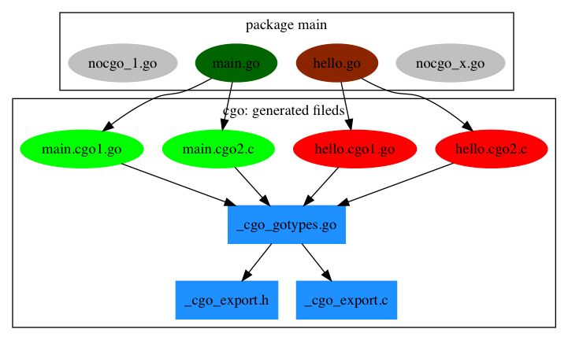

# 2.5. 内部机制

对于刚刚接触CGO用户来说，CGO的很多特性类似魔法。CGO特性主要是通过一个叫cgo的命令行工具来辅助输出Go和C之间的桥接代码。本节我们尝试从生成的代码分析Go语言和C语言函数直接相互调用的流程。

## CGO生成的中间文件

要了解CGO技术的底层秘密首先需要了解CGO生成了哪些中间文件。我们可以在构建一个cgo包时增加一个`-work`输出中间生成文件所在的目录并且在构建完成时保留中间文件。如果是比较简单的cgo代码我们也可以直接通过手工调用`go tool cgo`命令来查看生成的中间文件。

在一个Go源文件中，如果出现了`import "C"`指令则表示将调用cgo命令生成对应的中间文件。下图是cgo生成的中间文件的简单示意图：

包中有4个Go文件，其中nocgo开头的文件中没有`import "C"`指令，其它的2个文件则包含了cgo代码。cgo命令会为每个包含了cgo代码的Go文件创建2个中间文件，比如 main.go 会分别创建 main.cgo1.go 和 main.cgo2.c 两个中间文件。然后会为整个包创建一个 `_cgo_gotypes.go` Go文件，其中包含Go语言部分辅助代码。此外还会创建一个 `_cgo_export.h` 和 `_cgo_export.c` 文件，对应Go语言导出到C语言的类型和函数。

## Go调用C函数

TODO

## C调用Go函数

TODO
