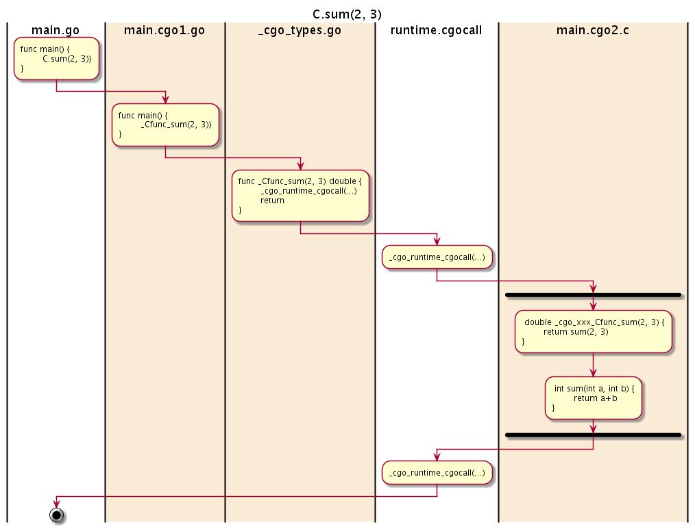

# 2.5 内部机制

对于刚刚接触CGO用户来说，CGO的很多特性类似魔法。CGO特性主要是通过一个叫cgo的命令行工具来辅助输出Go和C之间的桥接代码。本节我们尝试从生成的代码分析Go语言和C语言函数直接相互调用的流程。

## 2.5.1 CGO生成的中间文件

要了解CGO技术的底层秘密首先需要了解CGO生成了哪些中间文件。我们可以在构建一个cgo包时增加一个`-work`输出中间生成文件所在的目录并且在构建完成时保留中间文件。如果是比较简单的cgo代码我们也可以直接通过手工调用`go tool cgo`命令来查看生成的中间文件。

在一个Go源文件中，如果出现了`import "C"`指令则表示将调用cgo命令生成对应的中间文件。下图是cgo生成的中间文件的简单示意图：


*图 2-4 cgo生成的中间文件*


包中有4个Go文件，其中nocgo开头的文件中没有`import "C"`指令，其它的2个文件则包含了cgo代码。cgo命令会为每个包含了cgo代码的Go文件创建2个中间文件，比如 main.go 会分别创建 main.cgo1.go 和 main.cgo2.c 两个中间文件。然后会为整个包创建一个 `_cgo_gotypes.go` Go文件，其中包含Go语言部分辅助代码。此外还会创建一个 `_cgo_export.h` 和 `_cgo_export.c` 文件，对应Go语言导出到C语言的类型和函数。

## 2.5.2 Go调用C函数

Go调用C函数是CGO最常见的应用场景，我们将从最简单的例子入手分析Go调用C函数的详细流程。

具体代码如下（main.go）：

```go
package main

//int sum(int a, int b) { return a+b; }
import "C"

func main() {
	println(C.sum(1, 1))
}
```

首先构建并运行该例子没有错误。然后通过cgo命令行工具在_obj目录生成中间文件：

```
$ go tool cgo main.go
```

查看_obj目录生成中间文件：

```
$ ls _obj | awk '{print $NF}'
_cgo_.o
_cgo_export.c
_cgo_export.h
_cgo_flags
_cgo_gotypes.go
_cgo_main.c
main.cgo1.go
main.cgo2.c
```

其中`_cgo_.o`、`_cgo_flags`和`_cgo_main.c`文件和我们的代码没有直接的逻辑关联，可以暂时忽略。

我们先查看`main.cgo1.go`文件，它是main.go文件展开虚拟C包相关函数和变量后的Go代码：

```go
package main

//int sum(int a, int b) { return a+b; }
import _ "unsafe"

func main() {
	println((_Cfunc_sum)(1, 1))
}
```

其中`C.sum(1, 1)`函数调用被替换成了`(_Cfunc_sum)(1, 1)`。每一个`C.xxx`形式的函数都会被替换为`_Cfunc_xxx`格式的纯Go函数，其中前缀`_Cfunc_`表示这是一个C函数，对应一个私有的Go桥接函数。

`_Cfunc_sum`函数在cgo生成的`_cgo_gotypes.go`文件中定义：

```go
//go:cgo_unsafe_args
func _Cfunc_sum(p0 _Ctype_int, p1 _Ctype_int) (r1 _Ctype_int) {
	_cgo_runtime_cgocall(_cgo_506f45f9fa85_Cfunc_sum, uintptr(unsafe.Pointer(&p0)))
	if _Cgo_always_false {
		_Cgo_use(p0)
		_Cgo_use(p1)
	}
	return
}
```

`_Cfunc_sum`函数的参数和返回值`_Ctype_int`类型对应`C.int`类型，命名的规则和`_Cfunc_xxx`类似，不同的前缀用于区分函数和类型。

其中`_cgo_runtime_cgocall`对应`runtime.cgocall`函数，函数的声明如下：

```go
func runtime.cgocall(fn, arg unsafe.Pointer) int32
```

第一个参数是C语言函数的地址，第二个参数是存放C语言函数对应的参数结构体的地址。

在这个例子中，被传入C语言函数`_cgo_506f45f9fa85_Cfunc_sum`也是cgo生成的中间函数。函数在`main.cgo2.c`定义：

```c
void _cgo_506f45f9fa85_Cfunc_sum(void *v) {
	struct {
		int p0;
		int p1;
		int r;
		char __pad12[4];
	} __attribute__((__packed__)) *a = v;
	char *stktop = _cgo_topofstack();
	__typeof__(a->r) r;
	_cgo_tsan_acquire();
	r = sum(a->p0, a->p1);
	_cgo_tsan_release();
	a = (void*)((char*)a + (_cgo_topofstack() - stktop));
	a->r = r;
}
```

这个函数参数只有一个void范型的指针，函数没有返回值。真实的sum函数的函数参数和返回值均通过唯一的参数指针类实现。

`_cgo_506f45f9fa85_Cfunc_sum`函数的指针指向的结构为：

```c
	struct {
		int p0;
		int p1;
		int r;
		char __pad12[4];
	} __attribute__((__packed__)) *a = v;
```

其中p0成员对应sum的第一个参数，p1成员对应sum的第二个参数，r成员，`__pad12`用于填充结构体保证对齐CPU机器字的整倍数。

然后从参数指向的结构体获取调用参数后开始调用真实的C语言版sum函数，并且将返回值保持到结构体内返回值对应的成员。

因为Go语言和C语言有着不同的内存模型和函数调用规范。其中`_cgo_topofstack`函数相关的代码用于C函数调用后恢复调用栈。`_cgo_tsan_acquire`和`_cgo_tsan_release`则是用于扫描CGO相关的函数则是对CGO相关函数的指针做相关检查。


`C.sum`的整个调用流程图如下：



*图 2-5 调用C函数*

其中`runtime.cgocall`函数是实现Go语言到C语言函数跨界调用的关键。更详细的细节可以参考 https://golang.org/src/cmd/cgo/doc.go 内部的代码注释和 `runtime.cgocall` 函数的实现。

## 2.5.3 C调用Go函数

在简单分析了Go调用C函数的流程后，我们现在来分析C反向调用Go函数的流程。同样，我们现构造一个Go语言版本的sum函数，文件名同样为`main.go`：

```
package main

//int sum(int a, int b);
import "C"

//export sum
func sum(a, b C.int) C.int {
	return a + b
}

func main() {}
```

CGO的语法细节不在赘述。为了在C语言中使用sum函数，我们需要将Go代码编译为一个C静态库：

```
$ go build -buildmode=c-archive -o sum.a main.go
```

如果没有错误的话，以上编译命令将生成一个`sum.a`静态库和`sum.h`头文件。其中`sum.h`头文件将包含sum函数的声明，静态库中将包含sum函数的实现。

要分析生成的C语言版sum函数的调用流程，同样需要分析cgo生成的中间文件：

```
$ go tool cgo main.go
```

_obj目录还是生成类似的中间文件。为了查看方便，我们刻意忽略了无关的几个文件：

```
$ ls _obj | awk '{print $NF}'
_cgo_export.c
_cgo_export.h
_cgo_gotypes.go
main.cgo1.go
main.cgo2.c
```

其中`_cgo_export.h`文件的内容和生成C静态库时产生的`sum.h`头文件是同一个文件，里面同样包含sum函数的声明。

既然C语言是主调用者，我们需要先从C语言版sum函数的实现开始分析。C语言版本的sum函数在生成的`_cgo_export.c`文件中（该文件包含的是Go语言导出函数对应的C语言函数实现）：

```c
int sum(int p0, int p1)
{
	__SIZE_TYPE__ _cgo_ctxt = _cgo_wait_runtime_init_done();
	struct {
		int p0;
		int p1;
		int r0;
		char __pad0[4];
	} __attribute__((__packed__)) a;
	a.p0 = p0;
	a.p1 = p1;
	_cgo_tsan_release();
	crosscall2(_cgoexp_8313eaf44386_sum, &a, 16, _cgo_ctxt);
	_cgo_tsan_acquire();
	_cgo_release_context(_cgo_ctxt);
	return a.r0;
}
```

sum函数的内容采用和前面类似的技术，将sum函数的参数和返回值打包到一个结构体中，然后通过`runtime/cgo.crosscall2`函数将结构体传给`_cgoexp_8313eaf44386_sum`函数执行。

`runtime/cgo.crosscall2`函数采用汇编语言实现，它对应的函数声明如下：

```go
func runtime/cgo.crosscall2(
	fn func(a unsafe.Pointer, n int32, ctxt uintptr),
	a unsafe.Pointer, n int32,
	ctxt uintptr,
)
```

其中关键的是fn和a，fn是中间代理函数的指针，a是对应调用参数和返回值的结构体指针。

中间的`_cgoexp_8313eaf44386_sum`代理函数在`_cgo_gotypes.go`文件：

```go
func _cgoexp_8313eaf44386_sum(a unsafe.Pointer, n int32, ctxt uintptr) {
	fn := _cgoexpwrap_8313eaf44386_sum
	_cgo_runtime_cgocallback(**(**unsafe.Pointer)(unsafe.Pointer(&fn)), a, uintptr(n), ctxt);
}

func _cgoexpwrap_8313eaf44386_sum(p0 _Ctype_int, p1 _Ctype_int) (r0 _Ctype_int) {
	return sum(p0, p1)
}
```

内部将sum的包装函数`_cgoexpwrap_8313eaf44386_sum`作为函数指针，然后由`_cgo_runtime_cgocallback`函数完成C语言到Go函数的回调工作。


`_cgo_runtime_cgocallback`函数对应`runtime.cgocallback`函数，函数的类型如下：

```go
func runtime.cgocallback(fn, frame unsafe.Pointer, framesize, ctxt uintptr)
```

参数分别是函数指针，函数参数和返回值对应结构体的指针，函数调用帧大小和上下文参数。

整个调用流程图如下：


*图 2-6 调用导出的Go函数*

其中`runtime.cgocallback`函数是实现C语言到Go语言函数跨界调用的关键。更详细的细节可以参考相关函数的实现。

