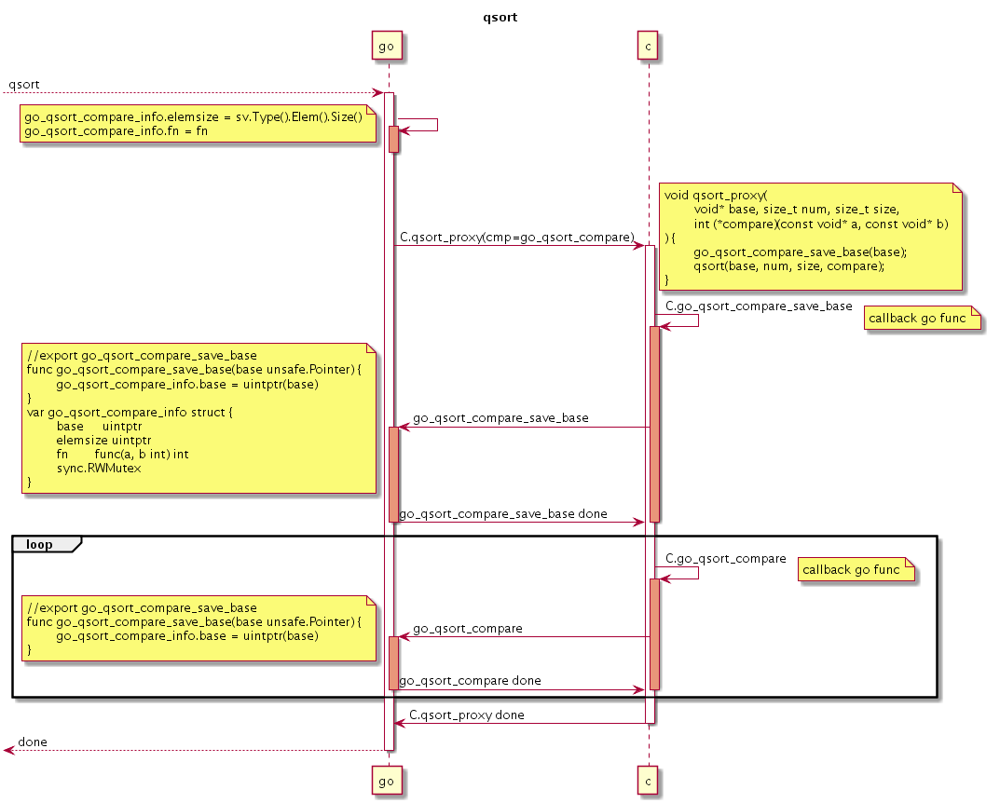

# 2.6. 实战: 封装qsort

qsort快速排序函数是C语言的高阶函数，支持用于自定义排序比较函数，可以对任意类型的数组进行排序。本节我们尝试基于C语言的qsort函数封装一个Go语言版本的qsort函数。

## 认识qsort函数

qosrt快速排序函数有`<stdlib.h>`标准库提供，函数的声明如下：

```c
void qsort(
	void* base, size_t num, size_t size,
	int (*cmp)(const void*, const void*)
);
```

其中base参数是要排序数组的首个元素的地址，num是数组中元素的个数，size是数组中每个元素的大小。最关键是cmp比较函数，用于对数组中任意两个元素进行排序。cmp排序函数的两个指针参数分别是要比较的两个元素的地址，如果第一个参数对应元素大于第二个参数对应的元素将返回结果大于0，如果两个元素相等则返回0，如果第一个元素小于第二个元素则返回结果小于0。

下面的例子是用C语言的qsort对一个int类型的数组进行排序：

```c
#include <stdio.h>
#include <stdlib.h>

#define DIM(x) (sizeof(x)/sizeof((x)[0]))

static int cmp(const void* a, const void* b) {
	const int* pa = (int*)a;
	const int* pb = (int*)b;
	return *pa - *pb;
}

int main() {
	int values[] = { 42, 8, 109, 97, 23, 25 };
	int i;

	qsort(values, DIM(values), sizeof(values[0]), cmp);

	for(i = 0; i < DIM(values); i++) {
		printf ("%d ",values[i]);
	}
	return 0;
}
```

## 用于Go固定类型数组的排序

```go
/*
#include <stdlib.h>

static int compare(const void* a, const void* b) {
	const int* pa = (int*)a;
	const int* pb = (int*)b;
	return *pa - *pb;
}

static void qsort_proxy(int* values, size_t len, size_t elemsize) {
	qsort(values, len, sizeof(values[0]), compare);
}
*/
import "C"

import "unsafe"
import "fmt"

func main() {
	values := []int32{ 42, 9, 101, 95, 27, 25 };
	C.qsort_proxy(
		(*C.int)(unsafe.Pointer(&values[0])),
		C.size_t(len(values)),
		C.size_t(unsafe.Sizeof(values[0])),
	)
	fmt.Println(values)
}
```

因为 compare 函数固定了元素的大小，导致只能针对特点的数值类型排序。

## 在Go中自传入比较函数

```go
/*
extern int go_qsort_compare(void* a, void* b);

static int compare(const void* a, const void* b) {
	return go_qsort_compare((void*)(a), (void*)(b));
}
*/
import "C"

//export go_qsort_compare
func go_qsort_compare(a, b unsafe.Pointer) C.int {
	pa := (*C.int)(a)
	pb := (*C.int)(b)
	return C.int(*pa - *pb)
}
```

```go
/*
#include <stdlib.h>

typedef int (*qsort_cmp_func_t)(const void* a, const void* b);
extern int go_qsort_compare(void* a, void* b);
*/
import "C"

func main() {
    values := []int32{42, 9, 101, 95, 27, 25}

    C.qsort(unsafe.Pointer(&values[0]),
        C.size_t(len(values)), C.size_t(unsafe.Sizeof(values[0])),
        (C.qsort_cmp_func_t)(unsafe.Pointer(C.go_qsort_compare)),
    )
}
```

直接传入Go导出的比较函数，需要进行一次类型转换（因为参数少了const修饰）。


```go
import "C"

//export go_qsort_compare
func go_qsort_compare(a, b unsafe.Pointer) C.int {
    return go_qsort_compare_info.fn(a, b)
}

var go_qsort_compare_info struct {
    fn func(a, b unsafe.Pointer) C.int
    sync.RWMutex
}
```

```go
func main() {
    values := []int32{42, 9, 101, 95, 27, 25}

    go_qsort_compare_info.Lock()
    defer go_qsort_compare_info.Unlock()
    go_qsort_compare_info.fn = func(a, b unsafe.Pointer) C.int {
        pa := (*C.int)(a)
        pb := (*C.int)(b)
        return C.int(*pa - *pb)
    }

    C.qsort(unsafe.Pointer(&values[0]),
        C.size_t(len(values)), C.size_t(unsafe.Sizeof(values[0])),
        (C.qsort_cmp_func_t)(unsafe.Pointer(C.go_qsort_compare)),
    )
}
```

```go
func qsort(values []int32, fn func(a, b unsafe.Pointer) C.int) {
    go_qsort_compare_info.Lock()
    defer go_qsort_compare_info.Unlock()

    go_qsort_compare_info.fn = fn

    C.qsort(
        unsafe.Pointer(&values[0]),
        C.size_t(len(values)),
        C.size_t(unsafe.Sizeof(values[0])),
        (C.qsort_cmp_func_t)(unsafe.Pointer(C.go_qsort_compare)),
    )
}
```


## Go比较函数类型的简化

## 适配更多数组类型

```go
func qsort(slice interface{}, fn func(a, b unsafe.Pointer) C.int) {
    sv := reflect.ValueOf(slice)
    if sv.Kind() != reflect.Slice {
        panic("not slice type")
    }

    go_qsort_compare_info.Lock()
    defer go_qsort_compare_info.Unlock()
    go_qsort_compare_info.fn = fn

    C.qsort(
        unsafe.Pointer(unsafe.Pointer(sv.Index(0).Addr().Pointer())),
        C.size_t(sv.Len()), C.size_t(sv.Type().Elem().Size()),
        (C.qsort_cmp_func_t)(unsafe.Pointer(C.go_qsort_compare)),
    )
}
```

```go
func qsort(slice interface{}, fn func(a, b int) int) {
    ...
}
```


```go
/*
#include <stdlib.h>

extern int  go_qsort_compare(void* a, void* b);
extern void go_qsort_compare_save_base(void* base);

static void qsort_proxy(
    void* base, size_t num, size_t size,
    int (*compar)(const void* a, const void* b)
) {
    go_qsort_compare_save_base(base); // 保存数组地址
    qsort(base, num, size, compar);
}
*/
import "C"
```

```go
//export go_qsort_compare_save_base
func go_qsort_compare_save_base(base unsafe.Pointer) {
    go_qsort_compare_info.base = uintptr(base)
}

var go_qsort_compare_info struct {
    base     uintptr
    elemsize uintptr
    fn       func(a, b int) int
    sync.RWMutex
}
```

```go
//export go_qsort_compare
func go_qsort_compare(a, b unsafe.Pointer) C.int {
    var (
        // array memory is locked
        base     = go_qsort_compare_info.base
        elemsize = go_qsort_compare_info.elemsize
    )

    i := int((uintptr(a) - base) / elemsize)
    j := int((uintptr(b) - base) / elemsize)

    return C.int(go_qsort_compare_info.fn(i, j))
}
```

```go
func main() {
    values := []int64{42, 9, 101, 95, 27, 25}

    qsort(values, func(i, j int) int {
        return int(values[i] - values[j])
    })
}

func qsort(slice interface{}, fn func(a, b int) int) {
    ...
}
```


