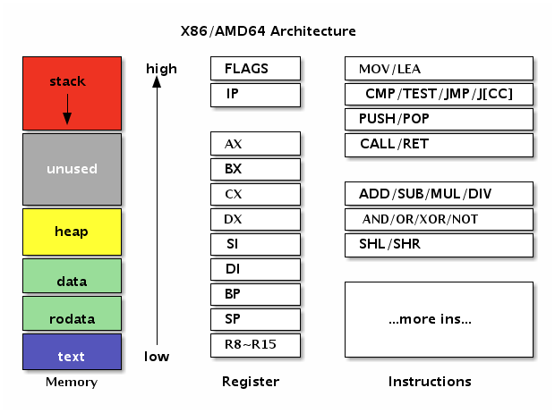
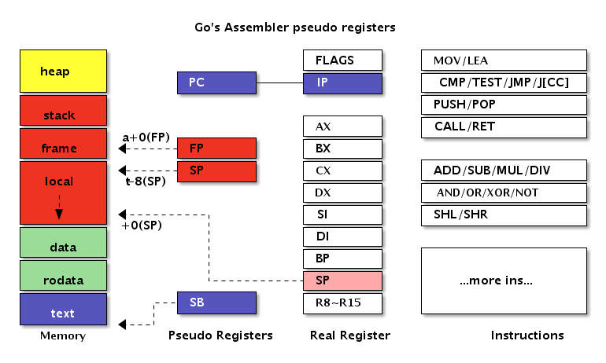

# 3.2 计算机结构

汇编语言是直面计算机的编程语言，因此理解计算机结构是掌握汇编语言的前提。当前流行的计算机基本采用的是冯·诺伊曼计算机体系结构（在某些特殊领域还有哈佛体系架构）。冯·诺依曼结构也称为普林斯顿结构，采用的是一种将程序指令和数据存储在一起的存储结构。冯·诺伊曼计算机中的指令和数据存储器其实指的是计算机中的内存，然后在配合 CPU 处理器就组成了一个最简单的计算机了。

汇编语言其实是一种非常简单的编程语言，因为它面向的计算机模型就是非常简单的。让人觉得汇编语言难学主要有几个原因：不同类型的 CPU 都有自己的一套指令；即使是相同的 CPU，32 位和 64 位的运行模式依然会有差异；不同的汇编工具同样有自己特有的汇编指令；不同的操作系统和高级编程语言和底层汇编的调用规范并不相同。本节将描述几个有趣的汇编语言模型，最后精简出一个适用于 AMD64 架构的精简指令集，以便于 Go 汇编语言的学习。


## 3.2.1 图灵机和 BF 语言

图灵机是由图灵提出的一种抽象计算模型。机器有一条无限长的纸带，纸带分成了一个一个的小方格，每个方格有不同的颜色，这类似于计算机中的内存。同时机器有一个探头在纸带上移来移去，类似于通过内存地址来读写内存上的数据。机器头有一组内部计算状态，还有一些固定的程序（更像一个哈佛结构）。在每个时刻，机器头都要从当前纸带上读入一个方格信息，然后根据自己的内部状态和当前要执行的程序指令将信息输出到纸带方格上，同时更新自己的内部状态并进行移动。

图灵机虽然不容易编程，但是非常容易理解。有一种极小化的 BrainFuck 计算机语言，它的工作模式和图灵机非常相似。BrainFuck 由 Urban Müller 在 1993 年创建的，简称为 BF 语言。Müller 最初的设计目标是建立一种简单的、可以用最小的编译器来实现的、符合图灵完全思想的编程语言。这种语言由八种状态构成，早期为 Amiga 机器编写的编译器（第二版）只有 240 个字节大小！

就象它的名字所暗示的，brainfuck 程序很难读懂。尽管如此，brainfuck 图灵机一样可以完成任何计算任务。虽然 brainfuck 的计算方式如此与众不同，但它确实能够正确运行。这种语言基于一个简单的机器模型，除了指令，这个机器还包括：一个以字节为单位、被初始化为零的数组、一个指向该数组的指针（初始时指向数组的第一个字节）、以及用于输入输出的两个字节流。这是一种按照图灵完备的语言，它的主要设计思路是：用最小的概念实现一种 “简单” 的语言。BrainFuck 语言只有八种符号，所有的操作都由这八种符号的组合来完成。

下面是这八种状态的描述，其中每个状态由一个字符标识：

| 字符 | C 语言类比          | 含义 |
| --- | ----------------- | ------ |
| `>` | `++ptr;`          | 指针加一 |
| `<` | `--ptr;`          | 指针减一 |
| `+` | `++*ptr;`         | 指针指向的字节的值加一 |
| `-` | `--*ptr;`         | 指针指向的字节的值减一 |
| `.` | `putchar(*ptr);`  | 输出指针指向的单元内容（ASCⅡ 码） |
| `,` | `*ptr = getch();` | 输入内容到指针指向的单元（ASCⅡ 码） |
| `[` | `while(*ptr) {}`  | 如果指针指向的单元值为零，向后跳转到对应的 `]` 指令的次一指令处 |
| `]` |                   | 如果指针指向的单元值不为零，向前跳转到对应的 `[` 指令的次一指令处 |

下面是一个 brainfuck 程序，向标准输出打印 "hi" 字符串：

```
++++++++++[>++++++++++<-]>++++.+.
```

理论上我们可以将 BF 语言当作目标机器语言，将其它高级语言编译为 BF 语言后就可以在 BF 机器上运行了。

## 3.2.2 人力资源机器游戏

《人力资源机器》（Human Resource Machine）是一款设计精良汇编语言编程游戏。在游戏中，玩家扮演一个职员角色，来模拟人力资源机器的运行。通过完成上司给的每一份任务来实现晋升的目标，完成任务的途径就是用游戏提供的 11 个机器指令编写正确的汇编程序，最终得到正确的输出结果。人力资源机器的汇编语言可以认为是跨平台、跨操作系统的通用的汇编语言，因为在 macOS、Windows、Linux 和 iOS 上该游戏的玩法都是完全一致的。

人力资源机器的机器模型非常简单：`INBOX` 命令对应输入设备，`OUTBOX` 对应输出设备，玩家小人对应一个寄存器，临时存放数据的地板对应内存，然后是数据传输、加减、跳转等基本的指令。总共有 11 个机器指令:

| 名称      | 解释 |
| -------- | --- |
| `INBOX`    | 从输入通道取一个整数数据，放到手中 (寄存器) |
| `OUTBOX`   | 将手中（寄存器）的数据放到输出通道，然后手中将没有数据（此时有些指令不能运行） |
| `COPYFROM` | 将地板上某个编号的格子中的数据复制到手中（手中之前的数据作废），地板格子必须有数据 |
| `COPYTO`   | 将手中（寄存器）的数据复制到地板上某个编号的格子中，手中的数据不变 |
| `ADD`      | 将手中（寄存器）的数据和某个编号对应的地板格子的数据相加，新数据放到手中（手中之前的数据作废） |
| `SUB`      | 将手中（寄存器）的数据和某个编号对应的地板格子的数据相减，新数据放到手中（手中之前的数据作废） |
| `BUMP+`    | 自加一 |
| `BUMP-`    | 自减一 |
| `JUMP`     | 跳转 |
| `JUMP =0`  | 为零条件跳转 |
| `JUMP <0`  | 为负条件跳转 |

除了机器指令外，游戏中有些环节还提供类似寄存器的场所，用于存放临时的数据。人力资源机器游戏的机器指令主要分为以下几类：

- 输入/输出 (`INBOX`/`OUTBOX`): 输入后手中将只有 1 份新拿到的数据, 输出后手中将没有数据。
- 数据传输指令 (`COPYFROM`/`COPYTO`): 主要用于仅有的 1 个寄存器（手中）和内存之间的数据传输，传输时要确保源数据是有效的
- 算术相关 (`ADD`/`SUB`/`BUMP+`/`BUMP-`)
- 跳转指令: 如果是条件跳转，寄存器中必须要有数据

主流的处理器也有类似的指令。除了基本的算术和逻辑运算指令外，再配合有条件跳转指令就可以实现分支、循环等常见控制流结构了。

下图是某一层的任务：将输入数据的 0 剔除，非 0 的数据依次输出，右边部分是解决方案。


*图 3-1 人力资源机器*


整个程序只有一个输入指令、一个输出指令和两个跳转指令共四个指令：

```
LOOP:
	INBOX
	JUMP-if-zero LOOP
	OUTBOX
	JUMP LOOP
```

首先通过 `INBOX` 指令读取一个数据包；然后判断包裹的数据是否为 `0`，如果是 `0` 的话就跳转到开头继续读取下一个数据包；否则将输出数据包，然后再跳转到开头。以此循环无休止地处理数据包裹，直到任务完成晋升到更高一级的岗位，然后处理类似的但更复杂的任务。


## 3.2.3 X86-64 体系结构

X86 其实是是 80X86 的简称（后面三个字母），包括 Intel 8086、80286、80386 以及 80486 等指令集合，因此其架构被称为 x86 架构。x86-64 是 AMD 公司于 1999 年设计的 x86 架构的 64 位拓展，向后兼容于 16 位及 32 位的 x86 架构。X86-64 目前正式名称为 AMD64，也就是 Go 语言中 GOARCH 环境变量指定的 AMD64。如果没有特殊说明的话，本章中的汇编程序都是针对 64 位的 X86-64 环境。

在使用汇编语言之前必须要了解对应的 CPU 体系结构。下面是 X86/AMD 架构图：



*图 3-2 AMD64 架构*


左边是内存部分是常见的内存布局。其中 text 一般对应代码段，用于存储要执行指令数据，代码段一般是只读的。然后是 rodata 和 data 数据段，数据段一般用于存放全局的数据，其中 rodata 是只读的数据段。而 heap 段则用于管理动态的数据，stack 段用于管理每个函数调用时相关的数据。在汇编语言中一般重点关注 text 代码段和 data 数据段，因此 Go 汇编语言中专门提供了对应 TEXT 和 DATA 命令用于定义代码和数据。

中间是 X86 提供的寄存器。寄存器是 CPU 中最重要的资源，每个要处理的内存数据原则上需要先放到寄存器中才能由 CPU 处理，同时寄存器中处理完的结果需要再存入内存。X86 中除了状态寄存器 FLAGS 和指令寄存器 IP 两个特殊的寄存器外，还有 AX、BX、CX、DX、SI、DI、BP、SP 几个通用寄存器。在 X86-64 中又增加了八个以 R8-R15 方式命名的通用寄存器。因为历史的原因 R0-R7 并不是通用寄存器，它们只是 X87 开始引入的 MMX 指令专有的寄存器。在通用寄存器中 BP 和 SP 是两个比较特殊的寄存器：其中 BP 用于记录当前函数帧的开始位置，和函数调用相关的指令会隐式地影响 BP 的值；SP 则对应当前栈指针的位置，和栈相关的指令会隐式地影响 SP 的值；而某些调试工具需要 BP 寄存器才能正常工作。

右边是 X86 的指令集。CPU 是由指令和寄存器组成，指令是每个 CPU 内置的算法，指令处理的对象就是全部的寄存器和内存。我们可以将每个指令看作是 CPU 内置标准库中提供的一个个函数，然后基于这些函数构造更复杂的程序的过程就是用汇编语言编程的过程。


## 3.2.4 Go 汇编中的伪寄存器

Go 汇编为了简化汇编代码的编写，引入了 PC、FP、SP、SB 四个伪寄存器。四个伪寄存器加其它的通用寄存器就是 Go 汇编语言对 CPU 的重新抽象，该抽象的结构也适用于其它非 X86 类型的体系结构。

四个伪寄存器和 X86/AMD64 的内存和寄存器的相互关系如下图：



*图 3-3 Go 汇编的伪寄存器*


在 AMD64 环境，伪 PC 寄存器其实是 IP 指令计数器寄存器的别名。伪 FP 寄存器对应的是函数的帧指针，一般用来访问函数的参数和返回值。伪 SP 栈指针对应的是当前函数栈帧的底部（不包括参数和返回值部分），一般用于定位局部变量。伪 SP 是一个比较特殊的寄存器，因为还存在一个同名的 SP 真寄存器。真 SP 寄存器对应的是栈的顶部，一般用于定位调用其它函数的参数和返回值。

当需要区分伪寄存器和真寄存器的时候只需要记住一点：伪寄存器一般需要一个标识符和偏移量为前缀，如果没有标识符前缀则是真寄存器。比如 `(SP)`、`+8(SP)` 没有标识符前缀为真 SP 寄存器，而 `a(SP)`、`b+8(SP)` 有标识符为前缀表示伪寄存器。

## 3.2.5 X86-64 指令集

很多汇编语言的教程都会强调汇编语言是不可移植的。严格来说汇编语言是在不同的 CPU 类型、或不同的操作系统环境、或不同的汇编工具链下是不可移植的，而在同一种 CPU 中运行的机器指令是完全一样的。汇编语言这种不可移植性正是其普及的一个极大的障碍。虽然 CPU 指令集的差异是导致不好移植的较大因素，但是汇编语言的相关工具链对此也有不可推卸的责任。而源自 Plan9 的 Go 汇编语言对此做了一定的改进：首先 Go 汇编语言在相同 CPU 架构上是完全一致的，也就是屏蔽了操作系统的差异；同时 Go 汇编语言将一些基础并且类似的指令抽象为相同名字的伪指令，从而减少不同 CPU 架构下汇编代码的差异（寄存器名字和数量的差异是一直存在的）。本节的目的也是找出一个较小的精简指令集，以简化 Go 汇编语言的学习。

X86 是一个极其复杂的系统，有人统计 x86-64 中指令有将近一千个之多。不仅仅如此，X86 中的很多单个指令的功能也非常强大，比如有论文证明了仅仅一个 `MOV` 指令就可以构成一个图灵完备的系统。以上这是两种极端情况，太多的指令和太少的指令都不利于汇编程序的编写，但是也从侧面体现了 `MOV` 指令的重要性。

通用的基础机器指令大概可以分为数据传输指令、算术运算和逻辑运算指令、控制流指令和其它指令等几类。因此我们可以尝试精简出一个 X86-64 指令集，以便于 Go 汇编语言的学习。

因此我们先看看重要的 MOV 指令。其中 MOV 指令可以用于将字面值移动到寄存器、字面值移到内存、寄存器之间的数据传输、寄存器和内存之间的数据传输。需要注意的是，MOV 传输指令的内存操作数只能有一个，可以通过某个临时寄存器达到类似目的。最简单的是忽略符号位的数据传输操作，386 和 AMD64 指令一样，不同的 1、2、4 和 8 字节宽度有不同的指令：

| Data Type   | 386/AMD64   | Comment       |
| ----------- | ----------- | ------------- |
| `[1]byte`   | MOVB        | B => Byte     |
| `[2]byte`   | MOVW        | W => Word     |
| `[4]byte`   | MOVL        | L => Long     |
| `[8]byte`   | MOVQ        | Q => Quadword |

MOV 指令它不仅仅用于在寄存器和内存之间传输数据，而且还可以用于处理数据的扩展和截断操作。当数据宽度和寄存器的宽度不同又需要处理符号位时，386 和 AMD64 有各自不同的指令：

| Data Type | 386     | AMD64   | Comment       |
| --------- | ------- | ------- | ------------- |
| `int8`      | MOVBLSX | MOVBQSX | sign extend   |
| `uint8`     | MOVBLZX | MOVBQZX | zero extend   |
| `int16`     | MOVWLSX | MOVWQSX | sign extend   |
| `uint16`    | MOVWLZX | MOVWQZX | zero extend   |

比如当需要将一个 `int64` 类型的数据转为 `bool` 类型时，则需要使用 `MOVBQZX` 指令处理。

基础算术指令有 `ADD`、`SUB`、`MUL`、`DIV` 等指令。其中 `ADD`、`SUB`、`MUL`、`DIV` 用于加、减、乘、除运算，最终结果存入目标寄存器。基础的逻辑运算指令有 `AND`、`OR` 和 `NOT` 等几个指令，对应逻辑与、或和取反等几个指令。

| 名称    | 解释 |
| ------ | --- |
| `ADD`    | 加法 |
| `SUB`    | 减法 |
| `MUL`    | 乘法 |
| `DIV`    | 除法 |
| `AND`    | 逻辑与 |
| `OR`     | 逻辑或 |
| `NOT`    | 逻辑取反 |

其中算术和逻辑指令是顺序编程的基础。通过逻辑比较影响状态寄存器，再结合有条件跳转指令就可以实现更复杂的分支或循环结构。需要注意的是 `MUL` 和 `DIV` 等乘除法指令可能隐含使用了某些寄存器，指令细节请查阅相关手册。

控制流指令有 `CMP`、`JMP-if-x`、`JMP`、`CALL`、`RET` 等指令。`CMP` 指令用于两个操作数做减法，根据比较结果设置状态寄存器的符号位和零位，可以用于有条件跳转的跳转条件。`JMP-if-x` 是一组有条件跳转指令，常用的有 `JL`、`JLZ`、`JE`、`JNE`、`JG`、`JGE` 等指令，对应小于、小于等于、等于、不等于、大于和大于等于等条件时跳转。`JMP` 指令则对应无条件跳转，将要跳转的地址设置到 IP 指令寄存器就实现了跳转。而 `CALL` 和 `RET` 指令分别为调用函数和函数返回指令。

| 名称      | 解释 |
| -------- | --- |
| `JMP`      | 无条件跳转 |
| `JMP-if-x` | 有条件跳转，`JL`、`JLZ`、`JE`、`JNE`、`JG`、`JGE` |
| `CALL`     | 调用函数 |
| `RET`      | 函数返回 |

无条件和有条件调整指令是实现分支和循环控制流的基础指令。理论上，我们也可以通过跳转指令实现函数的调用和返回功能。不过因为目前函数已经是现代计算机中的一个最基础的抽象，因此大部分的 CPU 都针对函数的调用和返回提供了专有的指令和寄存器。

其它比较重要的指令有 `LEA`、`PUSH`、`POP` 等几个。其中 LEA 指令将标准参数格式中的内存地址加载到寄存器（而不是加载内存位置的内容）。`PUSH` 和 `POP` 分别是压栈和出栈指令，通用寄存器中的 `SP` 为栈指针，栈是向低地址方向增长的。

| 名称 |  解释  |
| ---- | ------ |
| `LEA`  | 取地址 |
| `PUSH` | 压栈   |
| `POP`  | 出栈   |

当需要通过间接索引的方式访问数组或结构体等某些成员对应的内存时，可以用 LEA 指令先对目前内存取地址，然后在操作对应内存的数据。而栈指令则可以用于函数调整自己的栈空间大小。

最后需要说明的是，Go 汇编语言可能并没有支持全部的 CPU 指令。如果遇到没有支持的 CPU 指令，可以通过 Go 汇编语言提供的 BYTE 命令将真实的 CPU 指令对应的机器码填充到对应的位置。完整的 X86 指令在 [https://github.com/golang/arch/blob/master/x86/x86.csv](https://github.com/golang/arch/blob/master/x86/x86.csv) 文件定义。同时 Go 汇编还正对一些指令定义了别名，具体可以参考这里 [https://golang.org/src/cmd/internal/obj/x86/anames.go](https://golang.org/src/cmd/internal/obj/x86/anames.go)。

