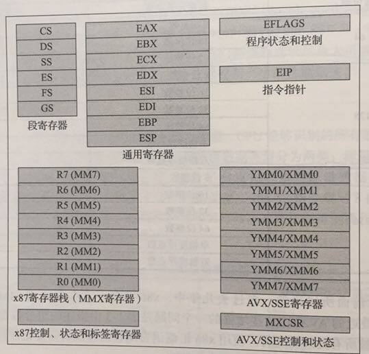
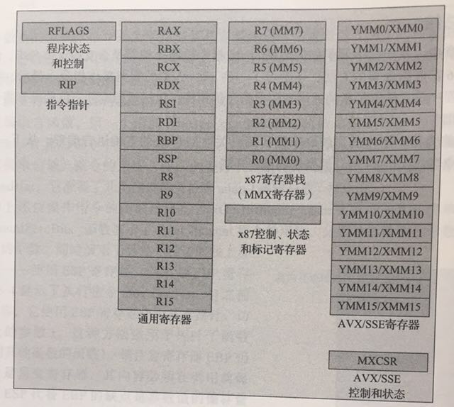

# 3.2. 计算机结构(Doing)

汇编语言是直面计算机的编程语言，因此理解计算机结构是掌握汇编语言的前提。当前流行的计算机基本采用的是冯·诺伊曼计算机体系结构（在某些特殊领域还有哈佛体系架构）。冯·诺依曼结构也称为普林斯顿结构，采用的是一种将程序指令和数据存储在一起的存储结构。冯·诺伊曼计算机中的指令和数据存储器其实指的是计算机中的内存，然后在配合CPU处理器就组成了一个最简单的计算机了。

汇编语言其实是一种非常简单的编程语言，因为它面向的计算机模型就是非常简单的。让人觉得汇编语言难学主要有几个原因：不同类型的CPU都有自己的一套指令；即是是相同的CPU，32位和64位的运行模式依然会有差异；不同的汇编工具同样有自己特有的汇编指令；不同的操作系统和高级编程语言和底层汇编的调用规范并不相同。本节将描述几个有趣的汇编语言模型，最后精简出一个适用于AMD64架构的精简指令集，以便于Go汇编语言的学习。


## 图灵机和BF语言

图灵机是由图灵提出的一种抽象计算模型。机器有一条无限长的纸带，纸带分成了一个一个的小方格，每个方格有不同的颜色，这类似于计算机中的内存。同时机器有一个探头头在纸带上移来移去，类似于通过内存地址来读写内存上的数据。机器头有一组内部计算状态，还有一些固定的程序（更像一个哈佛结构）。在每个时刻，机器头都要从当前纸带上读入一个方格信息，然后根据自己的内部状态和当前要执行的程序指令将信息输出到纸带方格上，同时更新自己的内部状态并进行移动。

图灵机虽然不容易编程，但是非常容易理解。有一种极小化的BrainFuck计算机语言，它的工作模式和图灵机非常相似。BrainFuck由Urban Müller在1993年创建的，简称为BF语言。Müller最初的设计目标是建立一种简单的、可以用最小的编译器来实现的、符合图灵完全思想的编程语言。这种语言由八种状态构成，早期为Amiga机器编写的编译器（第二版）只有240个字节大小！

就象它的名字所暗示的，brainfuck程序很难读懂。尽管如此，brainfuck图灵机一样可以完成任何计算任务。虽然brainfuck的计算方式如此与众不同，但它确实能够正确运行。这种语言基于一个简单的机器模型，除了指令，这个机器还包括：一个以字节为单位、被初始化为零的数组、一个指向该数组的指针（初始时指向数组的第一个字节）、以及用于输入输出的两个字节流。这种 语言，是一种按照“Turing complete（完整图灵机）”思想设计的语言，它的主要设计思路是：用最小的概念实现一种“简单”的语言，BrainF**k 语言只有八种符号，所有的操作都由这八种符号的组合来完成。

下面是这八种状态的描述，其中每个状态由一个字符标识：

| 字符 | C语言类比          | 含义
| --- | ----------------- | ------
| `>` | `++ptr;`          | 指针加一
| `<` | `--ptr;`          | 指针减一
| `+` | `++*ptr;`         | 指针指向的字节的值加一
| `-` | `--*ptr;`         | 指针指向的字节的值减一
| `.` | `putchar(*ptr);`  | 输出指针指向的单元内容（ASCⅡ码）
| `,` | `*ptr = getch();` | 输入内容到指针指向的单元（ASCⅡ码）
| `[` | `while(*ptr) {}`  | 如果指针指向的单元值为零，向后跳转到对应的 `]` 指令的次一指令处
| `]` |                   | 如果指针指向的单元值不为零，向前跳转到对应的 `[` 指令的次一指令处

下面是一个 brainfuck 程序，向标准输出打印"hi"字符串：

```
++++++++++[>++++++++++<-]>++++.+.
```

理论上我们可以将BF语言当作目标机器语言，将其它高级语言编译为BF语言后就可以在BF机器上运行了。

## 人力资源机器游戏

《人力资源机器》（Hunman Resource Machine）是一款设计精良汇编语言编程游戏。在游戏中，玩家扮演一个职员角色，来模拟人力资源机器的运行。通过完成上司给的每一份任务来实现晋升的目标，完成任务的途径就是用游戏提供的11个机器指令编写正确的汇编程序，最终得到正确的输出结果。人力资源机器的汇编语言可以认为是跨平台、跨操作系统的通用的汇编语言，因为在macOS、Windows、Linux和iOS上该游戏的玩法都是完全一致的。

人力资源机器的机器模型非常简单：INBOX命令对应输入设备，OUTBOX对应输出设备，玩家小人对应一个寄存器，临时存放数据的地板对应内存，然后是数据传输、加减、跳转等几本的指令。总共有11个机器指令:

| 名称      | 解释 |
| -------- | ---
| INBOX    | 从输入通道取一个整数数据，放到手中(寄存器)
| OUTBOX   | 将手中（寄存器）的数据放到输出通道，然后手中将没有数据（此时有些指令不能运行）
| COPYFROM | 将地板上某个编号的格子中的数据复制到手中（手中之前的数据作废），地板格子必须有数据
| COPYTO   | 将手中（寄存器）的数据复制到地板上某个编号的格子中，手中的数据不变
| ADD      | 将手中（寄存器）的数据和某个编号对应的地板格子的数据相加，新数据放到手中（手中之前的数据作废）
| SUB      | 将手中（寄存器）的数据和某个编号对应的地板格子的数据相减，新数据放到手中（手中之前的数据作废）
| BUMP+    | 自加一
| BUMP-    | 自减一
| JUMP     | 跳转
| JUMP =0  | 为零条件跳转
| JUMP <0  | 为负条件跳转

除了机器指令外，游戏中有些环节还提供类似寄存器的场所，用于存放临时的数据。人力资源机器游戏的机器指令主要分有以下几类：

- 输入/输出(INBOX, OUTBOX): 输入后手中将只有1份新拿到的数据, 输出后手中将没有数据。
- 数据传输指令(COPYFROM/COPYTO): 主要用于仅有的1个寄存器（手中）和内存之间的数据传输，传输时要确保源数据是有效的
- 算术相关(ADD/SUB/BUMP+/BUMP-)
- 跳转指令: 如果是条件跳转，寄存器中必须要有数据

主流的处理器也有类似的指令。除了基本的算术和逻辑预算指令外，在配合有条件跳转指令就可以实现分支、循环等常见控制流结构了。

下图是某一层的任务：将输入数据的0剔除，非0的数据依次输出，右边部分是解决方案。


整个程序只有一个输入指令、一个输出指令和两个跳转指令共四个指令：

```
LOOP:
	INBOX
	JUMP-if-zero LOOP
	OUTBOX
	JUMP LOOP
```

首先通过INBOX指令读取一个数据包；然后判断包裹的数据是否为0，如果是0的话就跳转到开头继续读取下一个数据包；否则将输出数据包，然后再跳转到开头。以此循环无休止地处理数据包裹，直到任务完成晋升到更高一级的岗位，然后处理类似的但更复杂的任务。


## 精简X86-64指令集

X86其实是是80X86的简称（后面三个字母），包括Intel 8086、80286、80386以及80486等指令集合，因此其架构被称为x86架构。x86-64是AMD公司于1999年设计的x86架构的64位拓展，向后兼容于16位及32位的x86架构。X86-64目前正式名称为AMD64，也就是Go语言中GOARCH环境变量指定的AMD64。如果没有特殊说明的话，本章中的汇编程序都是针对64位的X86-64环境。

很多汇编语言的教程都会强调汇编语言是不可移植的。严格来说很多汇编语言在不同的CPU类型、或不同的操作系统环境、或不同的汇编工具链下是不可移植的。而这种不可移植性正是汇编语言普及的一个极大的障碍。虽然CPU指令集的差异是导致不好移植的较大因素，但是汇编语言的相关工具链对此也有不可推卸的责任。而源自Plan9的Go汇编语言对此做了一定的改进：首先Go汇编语言在相同CPU架构上是完全一致的，也就是屏蔽了操作系统的差异；同时Go汇编语言将一些基础并且类似的指令抽象为相同名字的伪指令，从而减少不同CPU架构下汇编代码的差异（当然，寄存器名字和数量的差异是一直存在的）。本节的目的也是找出一个较小的精简指令集，以简化Go汇编语言学习的目的。

X86是一个极其复杂的系统，有人统计x86-64中指令有将近一千个之多。不仅仅如此，X86中的很多单个指令的功能也非常强大，比如有论文证明了仅仅一个MOV指令就可以构成一个图灵完备的系统。以上这是两种极端情况，太多的指令和太少的指令都不利于汇编程序的编写。因此我们将尝试精简出一个X86-64指令集，以便于Go汇编语言的学习。

再次之前我们件简单看下X86和X86-64的结构图：





<!-- TODO: 合并两个图 -->

其中最重要的部分是指令指针、标题标志和通用寄存器部分。对比可以发现X86和X86-64结构还是比较相似的，只是64位CPU的通用寄存器更多一些而已。因为历史原因，X86中的前8个通用寄存器并不是以数字顺序命名，它们是以AX、BX、CX、DX、SI、DI、BP、SP方式命名。而X86-64新增加的8个通用寄存器则是以R8-R15方式命名。其中R0-R7并不是通用寄存器，它们之上X87开始引入的MMX指令专有的寄存器。在通用寄存器中BP和SP是两个比较特殊的寄存器：其中BP用于记录当前函数帧的开始位置，和函数调用相关的指令会隐式地影响SP的值；SP则对应当前栈指针的位置，和栈相关的指令会隐式地影响SP的值。

我们可以尝试用一个结构体来类比简化的X86结构：

```go
type X86CPU struct {
	Flag           uint
	AX, BX, CX, DX int
	SP             uintptr
	IP             uintptr
	Memery         [...]int
}
```

其中Flag对应计算机的内部状态标志，我们一般不会直接读取Flag，只有在一些特殊的场景才会需要直接操作（比如操作系统中进程切换时保存和恢复状态）。

TODO

<!--
指令类型:
1. 数据传输: LEA/MOVQ
2. 算术运算: +-*/%
4. 逻辑运算 and or
5. 跳转: JMP, 有条件跳转
6. 函数调用
7. 栈操作

寄存器：AX, BX, CX, DX, SP, PC

位运算的本质：每个bit是一个独立的元素，不会影响其它bit结果，可以看作是一个bit数组。
配合if/else可以实现bit置0/1，取反。

逻辑运算：and 用乘法模拟，or 用加法模拟
乘法是：加法和for模拟

-->
