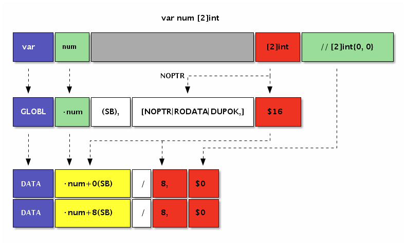
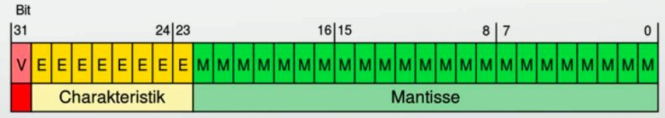
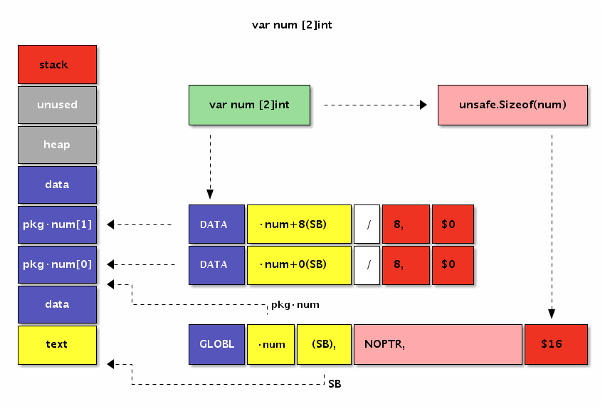

# 3.3 常量和全局变量

程序中的一切变量的初始值都直接或间接地依赖常量或常量表达式生成。在Go语言中很多变量是默认零值初始化的，但是Go汇编中定义的变量最好还是手工通过常量初始化。有了常量之后，就可以衍生定义全局变量，并使用常量组成的表达式初始化其它各种变量。本节将简单讨论Go汇编语言中常量和全局变量的用法。

## 3.3.1 常量

Go汇编语言中常量以$美元符号为前缀。常量的类型有整数常量、浮点数常量、字符常量和字符串常量等几种类型。以下是几种类型常量的例子：

```
$1           // 十进制
$0xf4f8fcff  // 十六进制
$1.5         // 浮点数
$'a'         // 字符
$"abcd"      // 字符串
```

其中整数类型常量默认是十进制格式，也可以用十六进制格式表示整数常量。所有的常量最终都必须和要初始化的变量内存大小匹配。

对于数值型常量，可以通过常量表达式构成新的常量：

```
$2+2      // 常量表达式
$3&1<<2   // == $4
$(3&1)<<2 // == $4
```

其中常量表达式中运算符的优先级和Go语言保持一致。

Go汇编语言中的常量其实不仅仅只有编译时常量，还包含运行时常量。比如包中全局的变量和全局函数在运行时地址也是固定不变的，这里地址不会改变的包变量和函数的地址也是一种汇编常量。

下面是本章第一节用汇编定义的字符串代码：

```
GLOBL ·NameData(SB),$8
DATA  ·NameData(SB)/8,$"gopher"

GLOBL ·Name(SB),$16
DATA  ·Name+0(SB)/8,$·NameData(SB)
DATA  ·Name+8(SB)/8,$6
```

其中`$·NameData(SB)`也是以$美元符号为前缀，因此也可以将它看作是一个常量，它对应的是NameData包变量的地址。在汇编指令中，我们也可以通过LEA指令来获取NameData变量的地址。


## 3.3.2 全局变量

在Go语言中，变量根据作用域和生命周期有全局变量和局部变量之分。全局变量是包一级的变量，全局变量一般有着较为固定的内存地址，声明周期跨越整个程序运行时间。而局部变量一般是函数内定义的的变量，只有在函数被执行的时间才被在栈上创建，当函数调用完成后将回收（暂时不考虑闭包对局部变量捕获的问题）。

从Go汇编语言角度来看，全局变量和局部变量有着非常大的差异。在Go汇编中全局变量和全局函数更为相似，都是通过一个人为定义的符号来引用对应的内存，区别只是内存中存放是数据还是要执行的指令。因为在冯诺伊曼系统结构的计算机中指令也是数据，而且指令和数据存放在统一编址的内存中。因为指令和数据并没有本质的差别，因此我们甚至可以像操作数据那样动态生成指令（这是所有JIT技术的原理）。而局部变量则需在了解了汇编函数之后，才能通过SP栈空间来隐式定义。

在Go汇编语言中，内存是通过SB伪寄存器定位。SB是Static base pointer的缩写，意为静态内存的开始地址。我们可以将SB想象为一个和内容容量有相同大小的字节数组，所有的静态全局符号通常可以通过SB加一个偏移量定位，而我们定义的符号其实就是相对于SB内存开始地址偏移量。对于SB伪寄存器，全局变量和全局函数的符号并没有任何区别。

要定义全局变量，首先要声明一个变量对应的符号，以及变量对应的内存大小。导出变量符号的语法如下：

```
GLOBL symbol(SB), width
```

GLOBL汇编指令用于定义名为symbol的变量，变量对应的内存宽度为width，内存宽度部分必须用常量初始化。下面的代码通过汇编定义一个int32类型的count变量：

```
GLOBL ·count(SB),$4
```

其中符号`·count`以中点开头表示是当前包的变量，最终符号名为被展开为`path/to/pkg.count`。count变量的大小是4个字节，常量必须以$美元符号开头。内存的宽度必须是2的指数倍，编译器最终会保证变量的真实地址对齐到机器字倍数。需要注意的是，在Go汇编中我们无法为count变量指定具体的类型。在汇编中定义全局变量时，我们只关心变量的名字和内存大小，变量最终的类型只能在Go语言中声明。

变量定义之后，我们可以通过DATA汇编指令指定对应内存中的数据，语法如下：

```
DATA symbol+offset(SB)/width, value
```

具体的含义是从symbol+offset偏移量开始，width宽度的内存，用value常量对应的值初始化。DATA初始化内存时，width必须是1、2、4、8几个宽度之一，因为再大的内存无法一次性用一个uint64大小的值表示。

对于int32类型的count变量来说，我们既可以逐个字节初始化，也可以一次性初始化：

```
DATA ·count+0(SB)/1,$1
DATA ·count+1(SB)/1,$2
DATA ·count+2(SB)/1,$3
DATA ·count+3(SB)/1,$4

// or

DATA ·count+0(SB)/4,$0x04030201
```

因为X86处理器是小端序，因此用十六进制0x04030201初始化全部的4个字节，和用1、2、3、4逐个初始化4个字节是一样的效果。

最后还需要在Go语言中声明对应的变量（和C语言头文件声明变量的作用类似），这样垃圾回收器会根据变量的类型来管理其中的指针相关的内存数据。


### 3.3.2.1 数组类型

汇编中数组也是一种非常简单的类型。Go语言中数组是一种有着扁平内存结构的基础类型。因此`[2]byte`类型和`[1]uint16`类型有着相同的内存结构。只有当数组和结构体结合之后情况才会变的稍微复杂。

下面我们尝试用汇编定义一个`[2]int`类型的数组变量num：

```go
var num [2]int
```

然后在汇编中定义一个对应16字节大小的变量，并用零值进行初始化：

```
GLOBL ·num(SB),$16
DATA ·num+0(SB)/8,$0
DATA ·num+8(SB)/8,$0
```

下图是Go语句和汇编语句定义变量时的对应关系：



*图 3-4 变量定义*


汇编代码中并不需要NOPTR标志，因为Go编译器会从Go语言语句声明的`[2]int`类型中推导出该变量内部没有指针数据。


### 3.3.2.2 bool型变量

Go汇编语言定义变量无法指定类型信息，因此需要先通过Go语言声明变量的类型。以下是在Go语言中声明的几个bool类型变量：

```go
var (
	boolValue  bool
	trueValue  bool
	falseValue bool
)
```

在Go语言中声明的变量不能含有初始化语句。然后下面是amd64环境的汇编定义：

```
GLOBL ·boolValue(SB),$1   // 未初始化

GLOBL ·trueValue(SB),$1   // var trueValue = true
DATA ·trueValue(SB)/1,$1  // 非 0 均为 true

GLOBL ·falseValue(SB),$1  // var falseValue = true
DATA ·falseValue(SB)/1,$0
```

bool类型的内存大小为1个字节。并且汇编中定义的变量需要手工指定初始化值，否则将可能导致产生未初始化的变量。当需要将1个字节的bool类型变量加载到8字节的寄存器时，需要使用MOVBQZX指令将不足的高位用0填充。

### 3.3.2.3 int型变量

所有的整数类型均有类似的定义的方式，比较大的差异是整数类型的内存大小和整数是否是有符号。下面是声明的int32和uint32类型变量：

```go
var int32Value int32

var uint32Value uint32
```

在Go语言中声明的变量不能含有初始化语句。然后下面是amd64环境的汇编定义：

```
GLOBL ·int32Value(SB),$4
DATA ·int32Value+0(SB)/1,$0x01  // 第0字节
DATA ·int32Value+1(SB)/1,$0x02  // 第1字节
DATA ·int32Value+2(SB)/2,$0x03  // 第3-4字节

GLOBL ·uint32Value(SB),$4
DATA ·uint32Value(SB)/4,$0x01020304 // 第1-4字节
```

汇编定义变量时初始化数据并不区分整数是否有符号。只有在CPU指令处理该寄存器数据时，才会根据指令的类型来取分数据的类型或者是否带有符号位。

### 3.3.2.4 float型变量

Go汇编语言通常无法区分变量是否是浮点数类型，与之相关的浮点数机器指令会将变量当作浮点数处理。Go语言的浮点数遵循IEEE754标准，有float32单精度浮点数和float64双精度浮点数之分。

IEEE754标准中，最高位1bit为符号位，然后是指数位（指数为采用移码格式表示），然后是有效数部分（其中小数点左边的一个bit位被省略）。下图是IEEE754中float32类型浮点数的bit布局：



*图 3-5 IEEE754浮点数结构*


IEEE754浮点数还有一些奇妙的特性：比如有正负两个0；除了无穷大和无穷小Inf还有非数NaN；同时如果两个浮点数有序那么对应的有符号整数也是有序的（反之则不一定成立，因为浮点数中存在的非数是不可排序的）。浮点数是程序中最难琢磨的角落，因为程序中很多手写的浮点数字面值常量根本无法精确表达，浮点数计算涉及到的误差舍入方式可能也的随机的。

下面是在Go语言中声明两个浮点数（如果没有在汇编中定义变量，那么声明的同时也会定义变量）。

```go
var float32Value float32

var float64Value float64
```

然后在汇编中定义并初始化上面声明的两个浮点数：

```
GLOBL ·float32Value(SB),$4
DATA ·float32Value+0(SB)/4,$1.5      // var float32Value = 1.5

GLOBL ·float64Value(SB),$8
DATA ·float64Value(SB)/8,$0x01020304 // bit 方式初始化
```

我们在上一节精简的算术指令中都是针对整数，如果要通过整数指令处理浮点数的加减法必须根据浮点数的运算规则进行：先对齐小数点，然后进行整数加减法，最后再对结果进行归一化并处理精度舍入问题。不过在目前的主流CPU中，都提针对浮点数提供了专有的计算指令。

### 3.3.2.5 string类型变量

从Go汇编语言角度看，字符串只是一种结构体。string的头结构定义如下：

```go
type reflect.StringHeader struct {
	Data uintptr
	Len  int
}
```

在amd64环境中StringHeader有16个字节大小，因此我们先在Go代码声明字符串变量，然后在汇编中定义一个16字节大小的变量：

```go
var helloworld string
```

```
GLOBL ·helloworld(SB),$16
```

同时我们可以为字符串准备真正的数据。在下面的汇编代码中，我们定义了一个text当前文件内的私有变量（以`<>`为后缀名），内容为“Hello World!”：

```
GLOBL text<>(SB),NOPTR,$16
DATA text<>+0(SB)/8,$"Hello Wo"
DATA text<>+8(SB)/8,$"rld!"
```

虽然`text<>`私有变量表示的字符串只有12个字符长度，但是我们依然需要将变量的长度扩展为2的指数倍数，这里也就是16个字节的长度。其中`NOPTR`表示`text<>`不包含指针数据。

然后使用text私有变量对应的内存地址对应的常量来初始化字符串头结构体中的Data部分，并且手工指定Len部分为字符串的长度：

```
DATA ·helloworld+0(SB)/8,$text<>(SB) // StringHeader.Data
DATA ·helloworld+8(SB)/8,$12         // StringHeader.Len
```

需要注意的是，字符串是只读类型，要避免在汇编中直接修改字符串底层数据的内容。

### 3.3.2.6 slice类型变量

slice变量和string变量相似，只不过是对应的是切片头结构体而已。切片头的结构如下：

```go
type reflect.SliceHeader struct {
	Data uintptr
	Len  int
	Cap  int
}
```

对比可以发现，切片的头的前2个成员字符串是一样的。因此我们可以在前面字符串变量的基础上，再扩展一个Cap成员就成了切片类型了：

```go
var helloworld []byte
```

```
GLOBL ·helloworld(SB),$24            // var helloworld []byte("Hello World!")
DATA ·helloworld+0(SB)/8,$text<>(SB) // StringHeader.Data
DATA ·helloworld+8(SB)/8,$12         // StringHeader.Len
DATA ·helloworld+16(SB)/8,$16        // StringHeader.Cap

GLOBL text<>(SB),$16
DATA text<>+0(SB)/8,$"Hello Wo"      // ...string data...
DATA text<>+8(SB)/8,$"rld!"          // ...string data...
```

因为切片和字符串的相容性，我们可以将切片头的前16个字节临时作为字符串使用，这样可以省去不必要的转换。

### 3.3.2.7 map/channel类型变量

map/channel等类型并没有公开的内部结构，它们只是一种未知类型的指针，无法直接初始化。在汇编代码中我们只能为类似变量定义并进行0值初始化：

```go
var m map[string]int

var ch chan int
```

```
GLOBL ·m(SB),$8  // var m map[string]int
DATA  ·m+0(SB)/8,$0

GLOBL ·ch(SB),$8 // var ch chan int
DATA  ·ch+0(SB)/8,$0
```

其实在runtime包中为汇编提供了一些辅助函数。比如在汇编中可以通过runtime.makemap和runtime.makechan内部函数来创建map和chan变量。辅助函数的签名如下：

```go
func makemap(mapType *byte, hint int, mapbuf *any) (hmap map[any]any)
func makechan(chanType *byte, size int) (hchan chan any)
```

需要注意的是，makemap是一种范型函数，可以创建不同类型的map，map的具体类型是通过mapType参数指定。


## 3.3.3 变量的内存布局

我们已经多次强调，在Go汇编语言中变量是没有类型的。因此在Go语言中有着不同类型的变量，底层可能对应的是相同的内存结构。深刻理解每个变量的内存布局是汇编编程时的必备条件。

首先查看前面已经见过的`[2]int`类型数组的内存布局：



*图 3-6 变量定义*


变量在data段分配空间，数组的元素地址依次从低向高排列。

然后再查看下标准库图像包中`image.Point`结构体类型变量的内存布局：


*图 3-7 结构体变量定义*


变量也时在data段分配空间，变量结构体成员的地址也是依次从低向高排列。

因此`[2]int`和`image.Point`类型底层有着近似相同的内存布局。

## 3.3.4 标识符规则和特殊标志

Go语言的标识符可以由绝对的包路径加标识符本身定位，因此不同包中的标识符即使同名也不会有问题。Go汇编是通过特殊的符号来表示斜杠和点符号，因为这样可以简化汇编器词法扫描部分代码的编写，只要通过字符串替换就可以了。

下面是汇编中常见的几种标识符的使用方式（通常也适用于函数标识符）：

```
GLOBL ·pkg_name1(SB),$1
GLOBL main·pkg_name2(SB),$1
GLOBL my/pkg·pkg_name(SB),$1
```

此外，Go汇编中可以定义仅当前文件可以访问的私有标识符（类似C语言中文件内static修饰的变量），以`<>`为后缀名：

```
GLOBL file_private<>(SB),$1
```

这样可以减少私有标识符对其它文件内标识符命名的干扰。

此外，Go汇编语言还在"textflag.h"文件定义了一些标志。其中用于变量的标志有DUPOK、RODATA和NOPTR几个。DUPOK表示该变量对应的标识符可能有多个，在链接时只选择其中一个即可（一般用于合并相同的常量字符串，减少重复数据占用的空间）。RODATA标志表示将变量定义在只读内存段，因此后续任何对此变量的修改操作将导致异常（recover也无法捕获）。NOPTR则表示此变量的内部不含指针数据，让垃圾回收器忽略对该变量的扫描。如果变量已经在Go代码中声明过的话，Go编译器会自动分析出该变量是否包含指针，这种时候可以不用手写NOPTR标志。

比如下面的例子是通过汇编来定义一个只读的int类型的变量：

```go
var const_id int // readonly
```

```
#include "textflag.h"

GLOBL ·const_id(SB),NOPTR|RODATA,$8
DATA  ·const_id+0(SB)/8,$9527
```

我们使用#include语句包含定义标志的"textflag.h"头文件（和C语言中预处理相同）。然后GLOBL汇编命令在定义变量时，给变量增加了NOPTR和RODATA两个标志（多个标志之间采用竖杠分割），表示变量中没有指针数据同时定义在只读数据段。

变量一般也叫可取地址的值，但是const_id虽然可以取地址，但是确实不能修改。不能修改的限制并不是由编译器提供，而是因为对该变量的修改会导致对只读内存段进行写，从而导致异常。

## 3.3.5 小结

以上我们初步展示了通过汇编定义全局变量的用法。但是真实的环境中我们并不推荐通过汇编定义变量——因为用Go语言定义变量更加简单和安全。在Go语言中定义变量，编译器可以帮助我们计算好变量的大小，生成变量的初始值，同时也包含了足够的类型信息。汇编语言的优势是挖掘机器的特性和性能，用汇编定义变量则无法发挥这些优势。因此在理解了汇编定义变量的用法后，建议大家谨慎使用。

