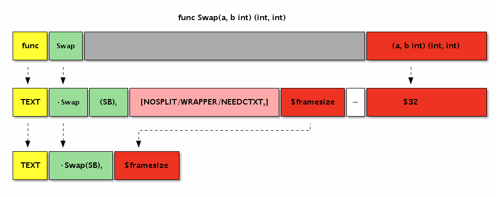
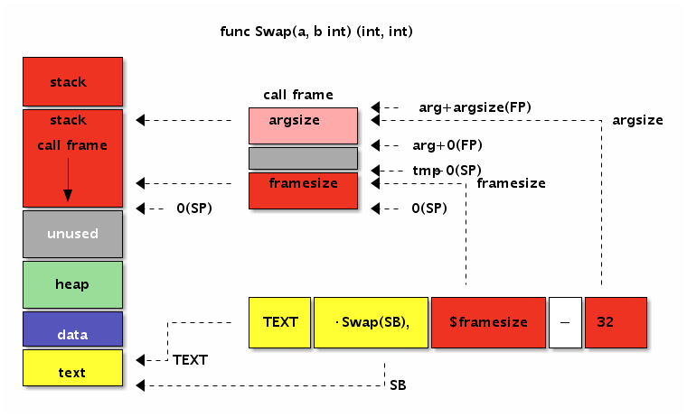
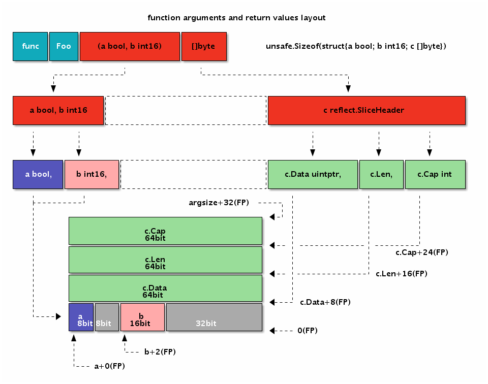

# 3.4 函数

终于到函数了！因为 Go 汇编语言中，可以也建议通过 Go 语言来定义全局变量，那么剩下的也就是函数了。只有掌握了汇编函数的基本用法，才能真正算是 Go 汇编语言入门。本章将简单讨论 Go 汇编中函数的定义和用法。

## 3.4.1 基本语法

函数标识符通过 TEXT 汇编指令定义，表示该行开始的指令定义在 TEXT 内存段。TEXT 语句后的指令一般对应函数的实现，但是对于 TEXT 指令本身来说并不关心后面是否有指令。因此 TEXT 和 LABEL 定义的符号是类似的，区别只是 LABEL 是用于跳转标号，但是本质上他们都是通过标识符映射一个内存地址。

函数的定义的语法如下：

```
TEXT symbol(SB), [flags,] $framesize[-argsize]
```

函数的定义部分由 5 个部分组成：TEXT 指令、函数名、可选的 flags 标志、函数帧大小和可选的函数参数大小。

其中 TEXT 用于定义函数符号，函数名中当前包的路径可以省略。函数的名字后面是 `(SB)`，表示是函数名符号相对于 SB 伪寄存器的偏移量，二者组合在一起最终是绝对地址。作为全局的标识符的全局变量和全局函数的名字一般都是基于 SB 伪寄存器的相对地址。标志部分用于指示函数的一些特殊行为，标志在 `textflag.h` 文件中定义，常见的 `NOSPLIT` 主要用于指示叶子函数不进行栈分裂。framesize 部分表示函数的局部变量需要多少栈空间，其中包含调用其它函数时准备调用参数的隐式栈空间。最后是可以省略的参数大小，之所以可以省略是因为编译器可以从 Go 语言的函数声明中推导出函数参数的大小。


我们首先从一个简单的 Swap 函数开始。Swap 函数用于交互输入的两个参数的顺序，然后通过返回值返回交换了顺序的结果。如果用 Go 语言中声明 Swap 函数，大概这样的：

```go
package main

//go:nosplit
func Swap(a, b int) (int, int)
```

下面是 main 包中 Swap 函数在汇编中两种定义方式：

```
// func Swap(a, b int) (int, int)
TEXT ·Swap(SB), NOSPLIT, $0-32

// func Swap(a, b int) (int, int)
TEXT ·Swap(SB), NOSPLIT, $0
```

下图是 Swap 函数几种不同写法的对比关系图：



*图 3-8 函数定义*


第一种是最完整的写法：函数名部分包含了当前包的路径，同时指明了函数的参数大小为 32 个字节（对应参数和返回值的 4 个 int 类型）。第二种写法则比较简洁，省略了当前包的路径和参数的大小。如果有 NOSPLIT 标注，会禁止汇编器为汇编函数插入栈分裂的代码。NOSPLIT 对应 Go 语言中的 `//go:nosplit` 注释。

目前可能遇到的函数标志有 NOSPLIT、WRAPPER 和 NEEDCTXT 几个。其中 NOSPLIT 不会生成或包含栈分裂代码，这一般用于没有任何其它函数调用的叶子函数，这样可以适当提高性能。WRAPPER 标志则表示这个是一个包装函数，在 panic 或 runtime.caller 等某些处理函数帧的地方不会增加函数帧计数。最后的 NEEDCTXT 表示需要一个上下文参数，一般用于闭包函数。

需要注意的是函数也没有类型，上面定义的 Swap 函数签名可以下面任意一种格式：

```
func Swap(a, b, c int) int
func Swap(a, b, c, d int)
func Swap() (a, b, c, d int)
func Swap() (a []int, d int)
// ...
```

对于汇编函数来说，只要是函数的名字和参数大小一致就可以是相同的函数了。而且在 Go 汇编语言中，输入参数和返回值参数是没有任何的区别的。

## 3.4.2 函数参数和返回值

对于函数来说，最重要的是函数对外提供的 API 约定，包含函数的名称、参数和返回值。当这些都确定之后，如何精确计算参数和返回值的大小是第一个需要解决的问题。

比如有一个 Swap 函数的签名如下：

```go
func Swap(a, b int) (ret0, ret1 int)
```

对于这个函数，我们可以轻易看出它需要 4 个 int 类型的空间，参数和返回值的大小也就是 32 个字节：

```
TEXT ·Swap(SB), $0-32
```

那么如何在汇编中引用这 4 个参数呢？为此 Go 汇编中引入了一个 FP 伪寄存器，表示函数当前帧的地址，也就是第一个参数的地址。因此我们以通过 `+0(FP)`、`+8(FP)`、`+16(FP)` 和 `+24(FP)` 来分别引用 a、b、ret0 和 ret1 四个参数。

但是在汇编代码中，我们并不能直接以 `+0(FP)` 的方式来使用参数。为了编写易于维护的汇编代码，Go 汇编语言要求，任何通过 FP 伪寄存器访问的变量必和一个临时标识符前缀组合后才能有效，一般使用参数对应的变量名作为前缀。


下图是 Swap 函数中参数和返回值在内存中的布局图：



*图 3-9 函数定义*

下面的代码演示了如何在汇编函数中使用参数和返回值：

```
TEXT ·Swap(SB), $0
	MOVQ a+0(FP), AX     // AX = a
	MOVQ b+8(FP), BX     // BX = b
	MOVQ BX, ret0+16(FP) // ret0 = BX
	MOVQ AX, ret1+24(FP) // ret1 = AX
	RET
```

从代码可以看出 a、b、ret0 和 ret1 的内存地址是依次递增的，FP 伪寄存器是第一个变量的开始地址。


## 3.4.3 参数和返回值的内存布局

如果是参数和返回值类型比较复杂的情况该如何处理呢？下面我们再尝试一个更复杂的函数参数和返回值的计算。比如有以下一个函数：

```go
func Foo(a bool, b int16) (c []byte)
```

函数的参数有不同的类型，而且返回值中含有更复杂的切片类型。我们该如何计算每个参数的位置和总的大小呢？

其实函数参数和返回值的大小以及对齐问题和结构体的大小和成员对齐问题是一致的，函数的第一个参数和第一个返回值会分别进行一次地址对齐。我们可以用类比思路将全部的参数和返回值以同样的顺序分别放到两个结构体中，将 FP 伪寄存器作为唯一的一个指针参数，而每个成员的地址也就是对应原来参数的地址。

用这样的策略可以很容易计算前面的 Foo 函数的参数和返回值的地址和总大小。为了便于描述我们定义一个 `Foo_args_and_returns` 临时结构体类型用于类比原始的参数和返回值：

```go
type Foo_args struct {
	a bool
	b int16
	c []byte
}
type Foo_returns struct {
	c []byte
}
```

然后将 Foo 原来的参数替换为结构体形式，并且只保留唯一的 FP 作为参数：

```go
func Foo(FP *SomeFunc_args, FP_ret *SomeFunc_returns) {
	// a = FP + offsetof(&args.a)
	_ = unsafe.Offsetof(FP.a) + uintptr(FP) // a
	// b = FP + offsetof(&args.b)

	// argsize = sizeof(args)
	argsize = unsafe.Offsetof(FP)

	// c = FP + argsize + offsetof(&return.c)
	_ = uintptr(FP) + argsize + unsafe.Offsetof(FP_ret.c)

	// framesize = sizeof(args) + sizeof(returns)
	_ = unsafe.Offsetof(FP) + unsafe.Offsetof(FP_ret)

	return
}
```

代码完全和 Foo 函数参数的方式类似。唯一的差异是每个函数的偏移量，通过 `unsafe.Offsetof` 函数自动计算生成。因为 Go 结构体中的每个成员已经满足了对齐要求，因此采用通用方式得到每个参数的偏移量也是满足对齐要求的。需要注意的是第一个返回值地址需要重新对齐机器字大小的倍数。

Foo 函数的参数和返回值的大小和内存布局：



*图 3-10 函数的参数*


下面的代码演示了 Foo 汇编函数参数和返回值的定位：

```
TEXT ·Foo(SB), $0
	MOVQ a+0(FP),       AX // a
	MOVQ b+2(FP),       BX // b
	MOVQ c_dat+8*1(FP), CX // c.Data
	MOVQ c_len+8*2(FP), DX // c.Len
	MOVQ c_cap+8*3(FP), DI // c.Cap
	RET
```

其中 a 和 b 参数之间出现了一个字节的空洞，b 和 c 之间出现了 4 个字节的空洞。出现空洞的原因是要保证每个参数变量地址都要对齐到相应的倍数。

## 3.4.4 函数中的局部变量

从 Go 语言函数角度讲，局部变量是函数内明确定义的变量，同时也包含函数的参数和返回值变量。但是从 Go 汇编角度看，局部变量是指函数运行时，在当前函数栈帧所对应的内存内的变量，不包含函数的参数和返回值（因为访问方式有差异）。函数栈帧的空间主要由函数参数和返回值、局部变量和被调用其它函数的参数和返回值空间组成。为了便于理解，我们可以将汇编函数的局部变量类比为 Go 语言函数中显式定义的变量，不包含参数和返回值部分。

为了便于访问局部变量，Go 汇编语言引入了伪 SP 寄存器，对应当前栈帧的底部。因为在当前栈帧时栈的底部是固定不变的，因此局部变量的相对于伪 SP 的偏移量也就是固定的，这可以简化局部变量的维护工作。SP 真伪寄存器的区分只有一个原则：如果使用 SP 时有一个临时标识符前缀就是伪 SP，否则就是真 SP 寄存器。比如 `a(SP)` 和 `b+8(SP)` 有 a 和 b 临时前缀，这里都是伪 SP，而前缀部分一般用于表示局部变量的名字。而 `(SP)` 和 `+8(SP)` 没有临时标识符作为前缀，它们都是真 SP 寄存器。

在 X86 平台，函数的调用栈是从高地址向低地址增长的，因此伪 SP 寄存器对应栈帧的底部其实是对应更大的地址。当前栈的顶部对应真实存在的 SP 寄存器，对应当前函数栈帧的栈顶，对应更小的地址。如果整个内存用 Memory 数组表示，那么 `Memory[0(SP):end-0(SP)]` 就是对应当前栈帧的切片，其中开始位置是真 SP 寄存器，结尾部分是伪 SP 寄存器。真 SP 寄存器一般用于表示调用其它函数时的参数和返回值，真 SP 寄存器对应内存较低的地址，所以被访问变量的偏移量是正数；而伪 SP 寄存器对应高地址，对应的局部变量的偏移量都是负数。

为了便于对比，我们将前面 Foo 函数的参数和返回值变量改成局部变量：

```go
func Foo() {
	var c []byte
	var b int16
	var a bool
}
```

然后通过汇编语言重新实现 Foo 函数，并通过伪 SP 来定位局部变量：

```
TEXT ·Foo(SB), $32-0
	MOVQ a-32(SP),      AX // a
	MOVQ b-30(SP),      BX // b
	MOVQ c_data-24(SP), CX // c.Data
	MOVQ c_len-16(SP),  DX // c.Len
	MOVQ c_cap-8(SP),   DI // c.Cap
	RET
```

Foo 函数有 3 个局部变量，但是没有调用其它的函数，因为对齐和填充的问题导致函数的栈帧大小为 32 个字节。因为 Foo 函数没有参数和返回值，因此参数和返回值大小为 0 个字节，当然这个部分可以省略不写。而局部变量中先定义的变量 c 离伪 SP 寄存器对应的地址最近，最后定义的变量 a 离伪 SP 寄存器最远。有两个因素导致出现这种逆序的结果：一个从 Go 语言函数角度理解，先定义的 c 变量地址要比后定义的变量的地址更大；另一个是伪 SP 寄存器对应栈帧的底部，而 X86 中栈是从高向低生长的，所以最先定义有着更大地址的 c 变量离栈的底部伪 SP 更近。

我们同样可以通过结构体来模拟局部变量的布局：

```go
func Foo() {
	var local [1]struct{
		a bool
		b int16
		c []byte
	}
	var SP = &local[1];

	_ = -(unsafe.Sizeof(local)-unsafe.Offsetof(local.a)) + uintptr(&SP) // a
	_ = -(unsafe.Sizeof(local)-unsafe.Offsetof(local.b)) + uintptr(&SP) // b
	_ = -(unsafe.Sizeof(local)-unsafe.Offsetof(local.c)) + uintptr(&SP) // c
}
```

我们将之前的三个局部变量挪到一个结构体中。然后构造一个 SP 变量对应伪 SP 寄存器，对应局部变量结构体的顶部。然后根据局部变量总大小和每个变量对应成员的偏移量计算相对于伪 SP 的距离，最终偏移量是一个负数。

通过这种方式可以处理复杂的局部变量的偏移，同时也能保证每个变量地址的对齐要求。当然，除了地址对齐外，局部变量的布局并没有顺序要求。对于汇编比较熟悉同学可以根据自己的习惯组织变量的布局。

下面是 Foo 函数的局部变量的大小和内存布局：


*图 3-11 函数的局部变量*


从图中可以看出 Foo 函数局部变量和前一个例子中参数和返回值的内存布局是完全一样的，这也是我们故意设计的结果。但是参数和返回值是通过伪 FP 寄存器定位的，FP 寄存器对应第一个参数的开始地址（第一个参数地址较低），因此每个变量的偏移量是正数。而局部变量是通过伪 SP 寄存器定位的，而伪 SP 寄存器对应的是第一个局部变量的结束地址（第一个局部变量地址较大），因此每个局部变量的偏移量都是负数。

## 3.4.5 调用其它函数

常见的用 Go 汇编实现的函数都是叶子函数，也就是被其它函数调用的函数，但是很少调用其它函数。这主要是因为叶子函数比较简单，可以简化汇编函数的编写；同时一般性能或特性的瓶颈也处于叶子函数。但是能够调用其它函数和能够被其它函数调用同样重要，否则 Go 汇编就不是一个完整的汇编语言。

在前文中我们已经学习了一些汇编实现的函数参数和返回值处理的规则。那么一个显然的问题是，汇编函数的参数是从哪里来的？答案同样明显，被调用函数的参数是由调用方准备的：调用方在栈上设置好空间和数据后调用函数，被调用方在返回前将返回值放在对应的位置，函数通过 RET 指令返回调用方函数之后，调用方再从返回值对应的栈内存位置取出结果。Go 语言函数的调用参数和返回值均是通过栈传输的，这样做的优点是函数调用栈比较清晰，缺点是函数调用有一定的性能损耗（Go 编译器是通过函数内联来缓解这个问题的影响）。

为了便于展示，我们先使用 Go 语言来构造三个逐级调用的函数：

```go
func main() {
	printsum(1, 2)
}

func printsum(a, b int) {
	var ret = sum(a, b)
	println(ret)
}

func sum(a, b int) int {
	return a+b
}
```

其中 main 函数通过字面值常量直接调用 printsum 函数，printsum 函数输出两个整数的和。而 printsum 函数内部又通过调用 sum 函数计算两个数的和，并最终调用打印函数进行输出。因为 printsum 既是被调用函数又是调用函数，所以它是我们要重点分析的函数。

下图展示了三个函数逐级调用时内存中函数参数和返回值的布局：


*图 3-12 函数帧*


为了便于理解，我们对真实的内存布局进行了简化。要记住的是调用函数时，被调用函数的参数和返回值内存空间都必须由调用者提供。因此函数的局部变量和为调用其它函数准备的栈空间总和就确定了函数帧的大小。调用其它函数前调用方要选择保存相关寄存器到栈中，并在调用函数返回后选择要恢复的寄存器进行保存。最终通过 CALL 指令调用函数的过程和调用我们熟悉的调用 println 函数输出的过程类似。

Go 语言中函数调用是一个复杂的问题，因为 Go 函数不仅仅要了解函数调用参数的布局，还会涉及到栈的跳转，栈上局部变量的生命周期管理。本节只是简单了解函数调用参数的布局规则，在后续的章节中会更详细的讨论函数的细节。

## 3.4.6 宏函数

宏函数并不是 Go 汇编语言所定义，而是 Go 汇编引入的预处理特性自带的特性。

在 C 语言中我们可以通过带参数的宏定义一个交换 2 个数的宏函数：

```c
#define SWAP(x, y) do{ int t = x; x = y; y = t; }while(0)
```

我们可以用类似的方式定义一个交换两个寄存器的宏：

```c
#define SWAP(x, y, t) MOVQ x, t; MOVQ y, x; MOVQ t, y
```

因为汇编语言中无法定义临时变量，我们增加一个参数用于临时寄存器。下面是通过 SWAP 宏函数交换 AX 和 BX 寄存器的值，然后返回结果：

```
// func Swap(a, b int) (int, int)
TEXT ·Swap(SB), $0-32
	MOVQ a+0(FP), AX // AX = a
	MOVQ b+8(FP), BX // BX = b

	SWAP(AX, BX, CX)     // AX, BX = b, a

	MOVQ AX, ret0+16(FP) // return
	MOVQ BX, ret1+24(FP) //
	RET
```

因为预处理器可以通过条件编译针对不同的平台定义宏的实现，这样可以简化平台带来的差异。

