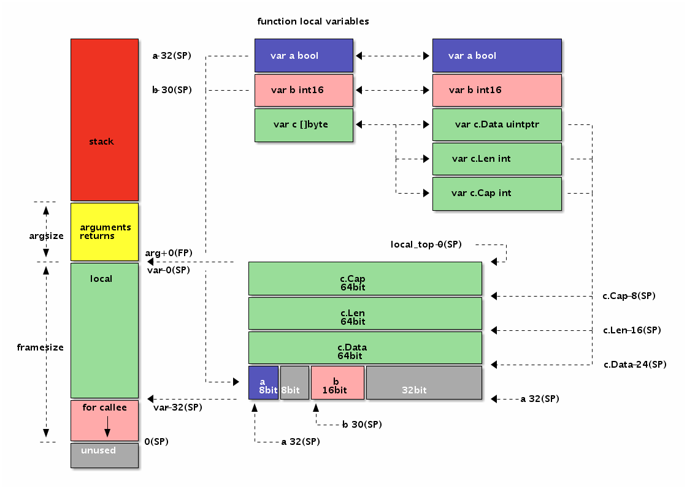
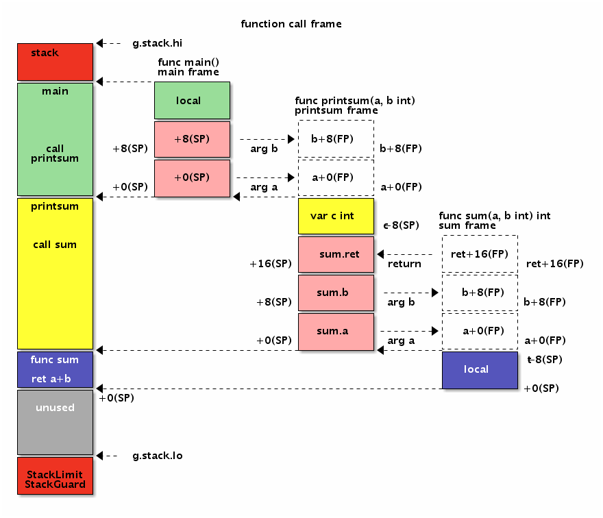

# 3.4 function

Finally arrived at the function! Because Go assembly language can also be recommended to define global variables through the Go language, then the rest is the function. Only by mastering the basic usage of assembly functions can you really get started with Go assembly language. This chapter will briefly discuss the definition and usage of functions in Go assembly.

## 3.4.1 Basic Grammar

The function identifier is defined by the TEXT assembly instruction, and the instruction indicating the start of the line is defined in the TEXT memory segment. The instruction after the TEXT statement generally corresponds to the implementation of the function, but for the TEXT instruction itself, it does not care whether there is an instruction later. So the symbols defined by TEXT and LABEL are similar, except that LABEL is used for jump labels, but essentially they all map a memory address by identifier.

The syntax for the definition of a function is as follows:

```
TEXT symbol(SB), [flags,] $framesize[-argsize]
```

The definition part of the function consists of five parts: the TEXT instruction, the function name, the optional flags flag, the function frame size, and the optional function parameter size.

Where TEXT is used to define the function symbol, the path of the current package in the function name can be omitted. The name of the function is followed by `(SB)`, which is the offset of the function name symbol from the SB pseudo-register. The two are combined to form an absolute address. The names of global variables and global functions that are global identifiers are generally based on the relative addresses of the SB pseudo-registers. The flag part is used to indicate some special behavior of the function. The flag is defined in the `textlags.h` file. The common `NOSPLIT` is mainly used to indicate that the leaf function does not split the stack. The framesize section indicates how much stack space is needed for a function's local variables, including the implicit stack space that is ready to call parameters when calling other functions. Finally, the size of the parameter that can be omitted can be omitted because the compiler can derive the size of the function parameter from the function declaration of the Go language.


Let's start with a simple Swap function. The Swap function is used to interactively input the order of the two parameters, and then returns the result of the exchanged order by the return value. If you declare a Swap function in Go, this is probably the case:

```go
Package main

//go:nosplit
Func Swap(a, b int) (int, int)
```

The following is the two definitions of the Swap function in the main package in the assembly:

```
// func Swap(a, b int) (int, int)
TEXT · Swap(SB), NOSPLIT, $0-32

// func Swap(a, b int) (int, int)
TEXT · Swap(SB), NOSPLIT, $0
```

The following figure is a comparison of several different ways of writing Swap functions:


*Figure 3-8 Function Definition*


The first is the most complete way of writing: the function name part contains the path of the current package, and indicates that the function's parameter size is 32 bytes (the four int types corresponding to the parameter and the return value). The second method is simpler, omitting the path and parameter size of the current package. If there is a NOSPLIT annotation, the assembler is prevented from inserting stack split code for the assembly function. NOSPLIT corresponds to the `//go:nosplit` annotation in Go.

The function flags that may be encountered so far are several NOSPLIT, WRAPPER, and NEEDCTXT. Where NOSPLIT does not generate or contain stack split code, which is typically used for leaf functions without any other function calls, which can improve performance appropriately. The WRAPPER flag indicates that this is a wrapper function that does not increment the function frame count in some processing function frames such as panic or runtime.caller. The last NEEDCTXT indicates that a context parameter is required, which is typically used for closure functions.

It should be noted that the function has no type. The Swap function signature defined above can be in any of the following formats:

```
Func Swap(a, b, c int) int
Func Swap(a, b, c, d int)
Func Swap() (a, b, c, d int)
Func Swap() (a []int, d int)
// ...
```

For the assembly function, as long as the name of the function and the size of the parameters are the same, it can be the same function. And in Go assembly language, there is no difference between input parameters and return value parameters.

## 3.4.2 Function parameters and return values

For functions, the most important is the API convention provided by the function, including the name, parameters, and return value of the function. When these are all determined, how to accurately calculate the size of the parameters and the return value is the first problem to be solved.

For example, the signature of a Swap function is as follows:

```go
Func Swap(a, b int) (ret0, ret1 int)
```

For this function, we can easily see that it requires 4 spaces of type int, and the size of the parameters and return value is 32 bytes:

```
TEXT · Swap(SB), $0-32
```

So how do you reference these four parameters in assembly? To this end, the Go assembly introduces an FP pseudo-register that represents the address of the current frame of the function, which is the address of the first parameter. Therefore, we refer to the four parameters a, b, ret0 and ret1 by `+0(FP)`, `+8(FP)`, `+16(FP)` and `+24(FP)` respectively.

But in assembly code, we can't use parameters directly in the way of `+0(FP)`. In order to write easy-to-maintain assembly code, Go assembly language requires that any variable accessed through the FP pseudo-register must be combined with a temporary identifier prefix to be valid. Generally, the variable name corresponding to the parameter is used as a prefix.


The following figure is the layout of the parameters and return values ​​in the Swap function in memory:


*Figure 3-9 Function Definition*

The following code demonstrates how to use parameters and return values ​​in an assembly function:

```
TEXT ·Swap(SB), $0
MOVQ a+0(FP), AX // AX = a
MOVQ b+8(FP), BX // BX = b
MOVQ BX, ret0+16(FP) // ret0 = BX
MOVQ AX, ret1+24(FP) // ret1 = AX
RET
```

It can be seen from the code that the memory addresses of a, b, ret0 and ret1 are sequentially incremented, and the FP pseudo-register is the start address of the first variable.


## 3.4.3 Memory layout of parameters and return values

What if the parameters and return types are more complicated? Let's try a more complicated calculation of function parameters and return values. For example, there is one of the following functions:

```go
Func Foo(a bool, b int16) (c []byte)
```

The arguments to the function have different types, and the return value contains more complex slice types. How do we calculate the position and total size of each parameter?

In fact, the size of the function parameters and the return value and the alignment problem are consistent with the size of the structure and the member alignment problem. The first parameter of the function and the first return value are aligned once. We can use the descendant idea to put all the parameters and return values ​​into the two structures in the same order. The FP pseudo-register is used as the only pointer parameter, and the address of each member is the address corresponding to the original parameter. .

With such a strategy, it is easy to calculate the address and total size of the parameters and return values ​​of the previous Foo function. For the sake of description we define a `Foo_args_and_returns` temporary structure type for degenerate the original parameters and return values:

```go
Type Foo_args struct {
a bool
b int16
c []byte
}
Type Foo_returns struct {
c []byte
}
```

Then replace Foo's original parameters with the struct form and leave only the unique FP as a parameter:

```go
Func Foo(FP *SomeFunc_args, FP_ret *SomeFunc_returns) {
// a = FP + offsetof(&args.a)
_ = unsafe.Offsetof(FP.a) + uintptr(FP) // a
// b = FP + offsetof(&args.b)

// argsize = sizeof(args)
Argsize = unsafe.Offsetof(FP)

// c = FP + argsize + offsetof(&return.c)
_ = uintptr(FP) + argsize + unsafe.Offsetof(FP_ret.c)

// framesize = sizeof(args) + sizeof(returns)
_ = unsafe.Offsetof(FP) + unsafe.Offsetof(FP_ret)

Return
}
```

The code is completely similar to the Foo function parameters. The only difference is the offset of each function, which is automatically calculated by the `unsafe.Offsetof` function. Since each member of the Go structure already satisfies the alignment requirements, the offset obtained for each parameter in a generic manner also satisfies the alignment requirements. The preamble notes that the first return value address needs to be realigned to a multiple of the machine word size.

The size and memory layout of the parameters and return values ​​of the Foo function:


*Figure 3-10 Function parameters *


The following code demonstrates the positioning of the Foo assembly function parameters and return values:

```
TEXT · Foo(SB), $0
MOVEQ a+0(FP), AX // a
MOVEQ b+2(FP), BX // b
MOVEQ c_dat+8*1(FP), CX // c.Data
MOVEQ c_len+8*2(FP), DX // c.Len
MOVEQ c_cap+8*3(FP), DI // c.Cap
RET
```

There is a one-byte gap between the a and b parameters, and a 4-byte gap between b and c. The reason for the hole is to ensure that each parameter variable address is aligned to the corresponding multiple.

## 3.4.4 Local variables in functions

From the perspective of Go language functions, local variables are well-defined variables within a function, as well as function parameters and return value variables. However, from the perspective of Go assembly, the local variable refers to the variable in the memory corresponding to the current function stack frame when the function is running, and does not include the function parameters and return values ​​(because the access methods are different). The space of the function stack frame is mainly composed of function parameters and return values, local variables, and parameters and return value spaces of other functions being called. For ease of understanding, we can compare the local variables of the assembly function to the variables explicitly defined in the Go language function, without the parameters and return value parts.

To facilitate access to local variables, Go assembly language introduces a pseudo SP register that corresponds to the bottom of the current stack frame. Because the bottom of the stack is fixed at the current stack frame, the offset of the local variable relative to the pseudo SP is fixed, which simplifies the maintenance of local variables. The SP authenticity register is distinguished by only one principle: if the SP is used, a temporary identifier prefix is ​​a pseudo SP, otherwise it is a true SP register. For example, `a(SP)` and `b+8(SP)` have temporary prefixes a and b, which are pseudo SPs, and the prefix part is generally used to indicate the name of a local variable. And `(SP)` and `+8(SP)` have no temporary identifiers as prefixes, they are all true SP registers.

On the X86 platform, the call stack of a function grows from a high address to a low address, so the pseudo SP register corresponds to a larger address at the bottom of the stack frame. The top of the current stack corresponds to the real SP register, corresponding to the top of the stack of the current function stack frame, corresponding to a smaller address. If the entire memory is represented by a Memory array, then `Memory[0(SP):end-0(SP)]` is the slice corresponding to the current stack frame, where the start position is the true SP register and the end is the pseudo SP register. The true SP register is generally used to indicate the parameters and return values ​​when calling other functions. The true SP register corresponds to the lower memory address, so the offset of the accessed variable is a positive number; and the pseudo SP register corresponds to the high address, the corresponding local variable. The offsets are all negative.

For the sake of comparison, we changed the parameters of the previous Foo function and the return value variable to local variables:

```go
Func Foo() {
Var c []byte
Var b int16
Var a bool
}
```

Then reimplement the Foo function through assembly language and locate the local variables with pseudo SP:

```
TEXT · Foo(SB), $32-0
MOVQ a-32(SP), AX // a
MOVQ b-30(SP), BX // b
MOVQ c_data-24(SP), CX // c.Data
MOVQ c_lEn-16(SP), DX // c.Len
MOVQ c_cap-8(SP), DI // c.Cap
RET
```

The Foo function has three local variables, but no other functions are called, because the alignment and padding problems cause the function's stack frame size to be 32 bytes. Because the Foo function has no parameters and return values, the parameter and return value is 0 bytes. Of course, this part can be omitted. The variable c first defined in the local variable is closest to the address corresponding to the pseudo SP register, and the last defined variable a is farthest from the pseudo SP register. There are two factors that lead to the result of this reverse order: one understands from the perspective of the Go language function that the first defined c variable address is larger than the address of the later defined variable; the other is that the pseudo SP register corresponds to the bottom of the stack frame, and The stack in X86 grows from high to low, so the first variable that defines a larger address is closer to the bottom pseudo SP of the stack.

We can also simulate the layout of local variables through structures:

```go
Func Foo() {
Var local [1]struct{
a bool
b int16
c []byte
}
Var SP = &local[1];

_ = -(unsafe.Sizeof(local)-unsafe.Offsetof(local.a)) + uintptr(&SP) // a
_ = -(unsafe.Sizeof(local)-unsafe.Offsetof(local.b)) + uintptr(&SP) // b
_ = -(unsafe.Sizeof(local)-unsafe.Offsetof(local.c)) + uintptr(&SP) // c
}
```

We moved the previous three local variables into a structure. Then construct an SP variable corresponding to the pseudo SP register, corresponding to the top of the local variable structure. The distance from the pseudo SP is then calculated based on the total size of the local variables and the offset of the corresponding member of each variable, the final offset being a negative number.

In this way, it is possible to handle the offset of complex local variables while also ensuring the alignment requirements of each variable address. Of course, in addition to address alignment, the layout of local variables is not ordered. For the assembly, the familiar students can organize the layout of the variables according to their own habits.

Here is the size and memory layout of the local variables of the Foo function:



*Figure 3-11 Local variables of the function*


It can be seen from the figure that the Foo function local variable is exactly the same as the memory layout of the parameter and return value in the previous example, which is the result of our deliberate design. However, the parameters and return values ​​are located by the pseudo FP register, which corresponds to the start address of the first parameter (the first parameter address is lower), so the offset of each variable is a positive number. The local variable is located by the pseudo SP register, and the pseudo SP register corresponds to the end address of the first local variable (the first local variable address is large), so the offset of each local variable is negative.

## 3.4.5 Calling other functions

Common functions implemented with Go assembly are leaf functions, which are functions called by other functions, but rarely call other functions. This is mainly because the leaf function is relatively simple and can simplify the writing of assembly functions; at the same time, the general performance or feature bottleneck is also in the leaf function. But being able to call other functions is as important as being able to be called by other functions, otherwise Go assembly is not a complete assembly language.

In the previous section we have learned some rules about the implementation of function parameters and return value processing. So an obvious question is, where does the argument to the assembly function come from? The answer is equally obvious. The parameters of the called function are prepared by the caller: the caller calls the function after setting the space and data on the stack. The callee puts the return value in the corresponding position before returning, and the function returns via the RET instruction. After the caller function, the caller fetches the result from the stack memory location corresponding to the return value. The calling parameters and return values ​​of the Go language function are transmitted through the stack. The advantage of this is that the function call stack is relatively clear. The disadvantage is that the function call has a certain performance loss (the Go compiler is used to alleviate this problem through function inlining). influences).

For the sake of presentation, let's use the Go language to construct three functions that are called step by step:

```go
Func main() {
Printsum(1, 2)
}

Func printsum(a, b int) {
Var ret = sum(a, b)
Println(ret)
}

Func sum(a, b int) int {
Return a+b
}
```

The main function directly calls the printsum function through a literal constant, and the printsum function outputs the sum of two integers. The printsum function internally calculates the sum of the two numbers by calling the sum function, and finally calls the print function to output. Because printsum is both a called function and a calling function, it is the function we want to focus on.

The following figure shows the layout of in-memory function parameters and return values ​​when three functions are called step by step:



*Figure 3-12 Function Frame*


For ease of understanding, we have simplified the real memory layout. The thing to remember is that when calling a function, the parameters of the called function and the return value memory space must be provided by the caller. Therefore, the size of the function frame is determined by the local variables of the function and the total stack space prepared for calling other functions. Before calling other functions, the caller should choose to save the relevant registers to the stack, and select the registers to be restored for saving after the callback function returns. The process of calling a function through the CALL instruction is similar to calling the familiar output of the println function.

The function call in the Go language is a complicated problem, because the Go function not only needs to understand the layout of the function call parameters, but also involves the jump of the stack and the lifecycle management of the local variables on the stack. This section is just a simple understanding of the layout rules for function call parameters. The details of the function are discussed in more detail in the following sections.

## 3.4.6 Macro function

Macro functions are not defined by Go assembly language, but are inherent in the preprocessing features introduced by Go assembly.

In C, we can define a macro function that exchanges 2 numbers with a macro with parameters:

```c
#define SWAP(x, y) do{ int t = x; x = y; y = t; }while(0)
```

We can define a macro that exchanges two registers in a similar way:

```c
#define SWAP(x, y, t) MOVQ x, t; MOVQ y, x; MOVQ t, y
```

Because temporary variables cannot be defined in assembly language, we add a parameter to the temporary register. The following is the exchange of the values ​​of the AX and BX registers through the SWAP macro function, and then returns the result:

```
// func Swap(a, b int) (int, int)
TEXT · Swap(SB), $0-32
MOVQ a+0(FP), AX // AX = a
MOVQ b+8(FP), BX // BX = b

SWAP(AX, BX, CX) // AX, BX = b, a

MOVQ AX, ret0+16(FP) // return
MOVQ BX, ret1+24(FP) //
RET
```

Because the preprocessor can conditionally compile macros for different platforms, this simplifies the differences that the platform brings.