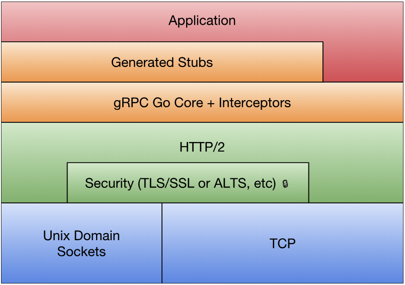

# 4.4 gRPC 入门

gRPC 是 Google 公司基于 Protobuf 开发的跨语言的开源 RPC 框架。gRPC 基于 HTTP/2 协议设计，可以基于一个 HTTP/2 连接提供多个服务，对于移动设备更加友好。本节将讲述 gRPC 的简单用法。

## 4.4.1 gRPC 技术栈

Go 语言的 gRPC 技术栈如图 4-1 所示：



*图 4-1 gRPC 技术栈*

最底层为 TCP 或 Unix Socket 协议，在此之上是 HTTP/2 协议的实现，然后在 HTTP/2 协议之上又构建了针对 Go 语言的 gRPC 核心库。应用程序通过 gRPC 插件生产的 Stub 代码和 gRPC 核心库通信，也可以直接和 gRPC 核心库通信。

## 4.4.2 gRPC 入门

如果从 Protobuf 的角度看，gRPC 只不过是一个针对 service 接口生成代码的生成器。我们在本章的第二节中手工实现了一个简单的 Protobuf 代码生成器插件，只不过当时生成的代码是适配标准库的 RPC 框架的。现在我们将学习 gRPC 的用法。

创建 hello.proto 文件，定义 HelloService 接口：

```proto
syntax = "proto3";

package main;

message String {
	string value = 1;
}

service HelloService {
	rpc Hello (String) returns (String);
}
```

使用 protoc-gen-go 内置的 gRPC 插件生成 gRPC 代码：

```
$ protoc --go_out=plugins=grpc:. hello.proto
```

gRPC 插件会为服务端和客户端生成不同的接口：

```go
type HelloServiceServer interface {
	Hello(context.Context, *String) (*String, error)
}

type HelloServiceClient interface {
	Hello(context.Context, *String, ...grpc.CallOption) (*String, error)
}
```

gRPC 通过 context.Context 参数，为每个方法调用提供了上下文支持。客户端在调用方法的时候，可以通过可选的 grpc.CallOption 类型的参数提供额外的上下文信息。

基于服务端的 HelloServiceServer 接口可以重新实现 HelloService 服务：

```go
type HelloServiceImpl struct{}

func (p *HelloServiceImpl) Hello(
	ctx context.Context, args *String,
) (*String, error) {
	reply := &String{Value: "hello:" + args.GetValue()}
	return reply, nil
}
```

gRPC 服务的启动流程和标准库的 RPC 服务启动流程类似：

```go
func main() {
	grpcServer := grpc.NewServer()
	RegisterHelloServiceServer(grpcServer, new(HelloServiceImpl))

	lis, err := net.Listen("tcp", ":1234")
	if err != nil {
		log.Fatal(err)
	}
	grpcServer.Serve(lis)
}
```

首先是通过 `grpc.NewServer()` 构造一个 gRPC 服务对象，然后通过 gRPC 插件生成的 RegisterHelloServiceServer 函数注册我们实现的 HelloServiceImpl 服务。然后通过 `grpcServer.Serve(lis)` 在一个监听端口上提供 gRPC 服务。

然后就可以通过客户端连接 gRPC 服务了：

```go
func main() {
	conn, err := grpc.Dial("localhost:1234", grpc.WithInsecure())
	if err != nil {
		log.Fatal(err)
	}
	defer conn.Close()

	client := NewHelloServiceClient(conn)
	reply, err := client.Hello(context.Background(), &String{Value: "hello"})
	if err != nil {
		log.Fatal(err)
	}
	fmt.Println(reply.GetValue())
}
```

其中 grpc.Dial 负责和 gRPC 服务建立连接，然后 NewHelloServiceClient 函数基于已经建立的连接构造 HelloServiceClient 对象。返回的 client 其实是一个 HelloServiceClient 接口对象，通过接口定义的方法就可以调用服务端对应的 gRPC 服务提供的方法。

gRPC 和标准库的 RPC 框架有一个区别，gRPC 生成的接口并不支持异步调用。不过我们可以在多个 Goroutine 之间安全地共享 gRPC 底层的 HTTP/2 连接，因此可以通过在另一个 Goroutine 阻塞调用的方式模拟异步调用。

## 4.4.3 gRPC 流

RPC 是远程函数调用，因此每次调用的函数参数和返回值不能太大，否则将严重影响每次调用的响应时间。因此传统的 RPC 方法调用对于上传和下载较大数据量场景并不适合。同时传统 RPC 模式也不适用于对时间不确定的订阅和发布模式。为此，gRPC 框架针对服务器端和客户端分别提供了流特性。

服务端或客户端的单向流是双向流的特例，我们在 HelloService 增加一个支持双向流的 Channel 方法：

```proto
service HelloService {
	rpc Hello (String) returns (String);

	rpc Channel (stream String) returns (stream String);
}
```

关键字 stream 指定启用流特性，参数部分是接收客户端参数的流，返回值是返回给客户端的流。

重新生成代码可以看到接口中新增加的 Channel 方法的定义：

```go
type HelloServiceServer interface {
	Hello(context.Context, *String) (*String, error)
	Channel(HelloService_ChannelServer) error
}
type HelloServiceClient interface {
	Hello(ctx context.Context, in *String, opts ...grpc.CallOption) (
		*String, error,
	)
	Channel(ctx context.Context, opts ...grpc.CallOption) (
		HelloService_ChannelClient, error,
	)
}
```

在服务端的 Channel 方法参数是一个新的 HelloService_ChannelServer 类型的参数，可以用于和客户端双向通信。客户端的 Channel 方法返回一个 HelloService_ChannelClient 类型的返回值，可以用于和服务端进行双向通信。

HelloService_ChannelServer 和 HelloService_ChannelClient 均为接口类型：

```go
type HelloService_ChannelServer interface {
	Send(*String) error
	Recv() (*String, error)
	grpc.ServerStream
}

type HelloService_ChannelClient interface {
	Send(*String) error
	Recv() (*String, error)
	grpc.ClientStream
}
```

可以发现服务端和客户端的流辅助接口均定义了 Send 和 Recv 方法用于流数据的双向通信。

现在我们可以实现流服务：

```go
func (p *HelloServiceImpl) Channel(stream HelloService_ChannelServer) error {
	for {
		args, err := stream.Recv()
		if err != nil {
			if err == io.EOF {
				return nil
			}
			return err
		}

		reply := &String{Value: "hello:" + args.GetValue()}

		err = stream.Send(reply)
		if err != nil {
			return err
		}
	}
}
```

服务端在循环中接收客户端发来的数据，如果遇到 io.EOF 表示客户端流被关闭，如果函数退出表示服务端流关闭。生成返回的数据通过流发送给客户端，双向流数据的发送和接收都是完全独立的行为。需要注意的是，发送和接收的操作并不需要一一对应，用户可以根据真实场景进行组织代码。

客户端需要先调用 Channel 方法获取返回的流对象：

```go
stream, err := client.Channel(context.Background())
if err != nil {
	log.Fatal(err)
}
```

在客户端我们将发送和接收操作放到两个独立的 Goroutine。首先是向服务端发送数据：

```go
go func() {
	for {
		if err := stream.Send(&String{Value: "hi"}); err != nil {
			log.Fatal(err)
		}
		time.Sleep(time.Second)
	}
}()
```

然后在循环中接收服务端返回的数据：

```go
for {
	reply, err := stream.Recv()
	if err != nil {
		if err == io.EOF {
			break
		}
		log.Fatal(err)
	}
	fmt.Println(reply.GetValue())
}
```

这样就完成了完整的流接收和发送支持。

## 4.4.4 发布和订阅模式

在前一节中，我们基于 Go 内置的 RPC 库实现了一个简化版的 Watch 方法。基于 Watch 的思路虽然也可以构造发布和订阅系统，但是因为 RPC 缺乏流机制导致每次只能返回一个结果。在发布和订阅模式中，由调用者主动发起的发布行为类似一个普通函数调用，而被动的订阅者则类似 gRPC 客户端单向流中的接收者。现在我们可以尝试基于 gRPC 的流特性构造一个发布和订阅系统。

发布订阅是一个常见的设计模式，开源社区中已经存在很多该模式的实现。其中 docker 项目中提供了一个 pubsub 的极简实现，下面是基于 pubsub 包实现的本地发布订阅代码：

```go
import (
	"github.com/moby/moby/pkg/pubsub"
)

func main() {
	p := pubsub.NewPublisher(100*time.Millisecond, 10)

	golang := p.SubscribeTopic(func(v interface{}) bool {
		if key, ok := v.(string); ok {
			if strings.HasPrefix(key, "golang:") {
				return true
			}
		}
		return false
	})
	docker := p.SubscribeTopic(func(v interface{}) bool {
		if key, ok := v.(string); ok {
			if strings.HasPrefix(key, "docker:") {
				return true
			}
		}
		return false
	})

	go p.Publish("hi")
	go p.Publish("golang: https://golang.org")
	go p.Publish("docker: https://www.docker.com/")
	time.Sleep(1)

	go func() {
		fmt.Println("golang topic:", <-golang)
	}()
	go func() {
		fmt.Println("docker topic:", <-docker)
	}()

	<-make(chan bool)
}
```

其中 `pubsub.NewPublisher` 构造一个发布对象，`p.SubscribeTopic()` 可以通过函数筛选感兴趣的主题进行订阅。

现在尝试基于 gRPC 和 pubsub 包，提供一个跨网络的发布和订阅系统。首先通过 Protobuf 定义一个发布订阅服务接口：

```protobuf
service PubsubService {
	rpc Publish (String) returns (String);
	rpc Subscribe (String) returns (stream String);
}
```

其中 Publish 是普通的 RPC 方法，Subscribe 则是一个单向的流服务。然后 gRPC 插件会为服务端和客户端生成对应的接口：

```go
type PubsubServiceServer interface {
	Publish(context.Context, *String) (*String, error)
	Subscribe(*String, PubsubService_SubscribeServer) error
}
type PubsubServiceClient interface {
	Publish(context.Context, *String, ...grpc.CallOption) (*String, error)
	Subscribe(context.Context, *String, ...grpc.CallOption) (
		PubsubService_SubscribeClient, error,
	)
}

type PubsubService_SubscribeServer interface {
	Send(*String) error
	grpc.ServerStream
}
```

因为 Subscribe 是服务端的单向流，因此生成的 PubsubService_SubscribeServer 接口中只有 Send 方法。

然后就可以实现发布和订阅服务了：

```go
type PubsubService struct {
	pub *pubsub.Publisher
}

func NewPubsubService() *PubsubService {
	return &PubsubService{
		pub: pubsub.NewPublisher(100*time.Millisecond, 10),
	}
}
```

然后是实现发布方法和订阅方法：

```go
func (p *PubsubService) Publish(
	ctx context.Context, arg *String,
) (*String, error) {
	p.pub.Publish(arg.GetValue())
	return &String{}, nil
}

func (p *PubsubService) Subscribe(
	arg *String, stream PubsubService_SubscribeServer,
) error {
	ch := p.pub.SubscribeTopic(func(v interface{}) bool {
		if key, ok := v.(string); ok {
			if strings.HasPrefix(key,arg.GetValue()) {
				return true
			}
		}
		return false
	})

	for v := range ch {
		if err := stream.Send(&String{Value: v.(string)}); err != nil {
			return err
		}
	}

	return nil
}
```

这样就可以从客户端向服务器发布信息了：

```go
func main() {
	conn, err := grpc.Dial("localhost:1234", grpc.WithInsecure())
	if err != nil {
		log.Fatal(err)
	}
	defer conn.Close()

	client := NewPubsubServiceClient(conn)

	_, err = client.Publish(
		context.Background(), &String{Value: "golang: hello Go"},
	)
	if err != nil {
		log.Fatal(err)
	}
	_, err = client.Publish(
		context.Background(), &String{Value: "docker: hello Docker"},
	)
	if err != nil {
		log.Fatal(err)
	}
}
```

然后就可以在另一个客户端进行订阅信息了：

```go
func main() {
	conn, err := grpc.Dial("localhost:1234", grpc.WithInsecure())
	if err != nil {
		log.Fatal(err)
	}
	defer conn.Close()

	client := NewPubsubServiceClient(conn)
	stream, err := client.Subscribe(
		context.Background(), &String{Value: "golang:"},
	)
	if err != nil {
		log.Fatal(err)
	}

	for {
		reply, err := stream.Recv()
		if err != nil {
			if err == io.EOF {
				break
			}
			log.Fatal(err)
		}

		fmt.Println(reply.GetValue())
	}
}
```

到此我们就基于 gRPC 简单实现了一个跨网络的发布和订阅服务。

