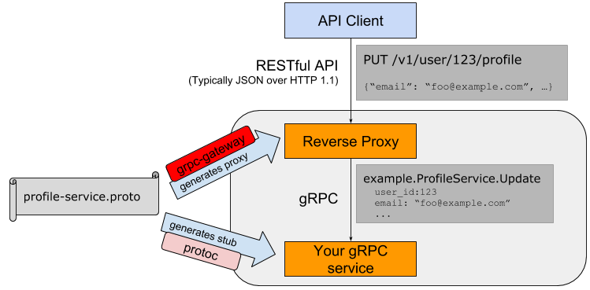

# 4.6 gRPC和Protobuf扩展

目前开源社区已经围绕Protobuf和gRPC开发出众多扩展，形成了庞大的生态。本节我们将简单介绍验证器和REST接口扩展。

## 4.6.1 验证器

到目前为止，我们接触的全部是第三版的Protobuf语法。第二版的Protobuf有个默认值特性，可以为字符串或数值类型的成员定义默认值。

我们采用第二版的Protobuf语法创建文件：

```protobuf
syntax = "proto2";

package main;

message Message {
	optional string name = 1 [default = "gopher"];
	optional int32 age = 2 [default = 10];
}
```

内置的默认值语法其实是通过Protobuf的扩展选项特性实现。在第三版的Protobuf中不再支持默认值特性，但是我们可以通过扩展选项自己模拟默认值特性。

下面是用proto3语法的扩展特性重新改写上述的proto文件：

```protobuf
syntax = "proto3";

package main;

import "google/protobuf/descriptor.proto";

extend google.protobuf.FieldOptions {
	string default_string = 50000;
	int32 default_int = 50001;
}

message Message {
	string name = 1 [(default_string) = "gopher"];
	int32 age = 2[(default_int) = 10];
}
```

其中成员后面的方括号内部的就是扩展语法。重新生成Go语言代码，里面会包含扩展选项相关的元信息：

```go
var E_DefaultString = &proto.ExtensionDesc{
	ExtendedType:  (*descriptor.FieldOptions)(nil),
	ExtensionType: (*string)(nil),
	Field:         50000,
	Name:          "main.default_string",
	Tag:           "bytes,50000,opt,name=default_string,json=defaultString",
	Filename:      "helloworld.proto",
}

var E_DefaultInt = &proto.ExtensionDesc{
	ExtendedType:  (*descriptor.FieldOptions)(nil),
	ExtensionType: (*int32)(nil),
	Field:         50001,
	Name:          "main.default_int",
	Tag:           "varint,50001,opt,name=default_int,json=defaultInt",
	Filename:      "helloworld.proto",
}
```

我们可以在运行时通过类似反射的技术解析出Message每个成员定义的扩展选项，然后从每个扩展的相关联的信息中解析出我们定义的默认值。

在开源社区中，github.com/mwitkow/go-proto-validators 已经基于Protobuf的扩展特性实现了功能较为强大的验证器功能。要使用该验证器首先需要下载其提供的代码生成插件：

```
$ go get github.com/mwitkow/go-proto-validators/protoc-gen-govalidators
```

然后基于go-proto-validators验证器的规则为Message成员增加验证规则：

```protobuf
syntax = "proto3";

package main;

import "github.com/mwitkow/go-proto-validators/validator.proto";

message Message {
	string important_string = 1 [
		(validator.field) = {regex: "^[a-z]{2,5}$"}
	];
	int32 age = 2 [
		(validator.field) = {int_gt: 0, int_lt: 100}
	];
}
```

在方括弧表示的成员扩展中，validator.field表示扩展是validator包中定义的名为field扩展选项。validator.field的类型是FieldValidator结构体，在导入的validator.proto文件中定义。

所有的验证规则都由validator.proto文件中的FieldValidator定义：

```protobuf
syntax = "proto2";
package validator;

import "google/protobuf/descriptor.proto";

extend google.protobuf.FieldOptions {
	optional FieldValidator field = 65020;
}

message FieldValidator {
	// Uses a Golang RE2-syntax regex to match the field contents.
	optional string regex = 1;
	// Field value of integer strictly greater than this value.
	optional int64 int_gt = 2;
	// Field value of integer strictly smaller than this value.
	optional int64 int_lt = 3;

	// ... more ...
}
```

从FieldValidator定义的注释中我们可以看到验证器扩展的一些语法：其中regex表示用于字符串验证的正则表达式，int_gt和int_lt表示数值的范围。

然后采用以下的命令生成验证函数代码：

```
protoc  \
	--proto_path=${GOPATH}/src \
	--proto_path=${GOPATH}/src/github.com/google/protobuf/src \
	--proto_path=. \
	--govalidators_out=. \
	hello.proto
```

以上的命令会调用protoc-gen-govalidators程序，生成一个独立的名为hello.validator.pb.go的文件：

```go
var _regex_Message_ImportantString = regexp.MustCompile("^[a-z]{2,5}$")

func (this *Message) Validate() error {
	if !_regex_Message_ImportantString.MatchString(this.ImportantString) {
		return go_proto_validators.FieldError("ImportantString", fmt.Errorf(
			`value '%v' must be a string conforming to regex "^[a-z]{2,5}$"`,
			this.ImportantString,
		))
	}
	if !(this.Age > 0) {
		return go_proto_validators.FieldError("Age", fmt.Errorf(
			`value '%v' must be greater than '0'`, this.Age,
		))
	}
	if !(this.Age < 100) {
		return go_proto_validators.FieldError("Age", fmt.Errorf(
			`value '%v' must be less than '100'`, this.Age,
		))
	}
	return nil
}
```

生成的代码为Message结构体增加了一个Validate方法，用于验证该成员是否满足Protobuf中定义的条件约束。无论采用何种类型，所有的Validate方法都用相同的签名，因此可以满足相同的验证接口。

通过生成的验证函数，并结合gRPC的截取器，我们可以很容易为每个方法的输入参数和返回值进行验证。

## 4.6.2 REST接口

gRPC服务一般用于集群内部通信，如果需要对外暴露服务一般会提供等价的REST接口。通过REST接口比较方便前端JavaScript和后端交互。开源社区中的grpc-gateway项目就实现了将gRPC服务转为REST服务的能力。

grpc-gateway的工作原理如下图：



*图 4-2 gRPC-Gateway工作流程*

通过在Protobuf文件中添加路由相关的元信息，通过自定义的代码插件生成路由相关的处理代码，最终将REST请求转给更后端的gRPC服务处理。

路由扩展元信息也是通过Protobuf的元数据扩展用法提供：

```protobuf
syntax = "proto3";

package main;

import "google/api/annotations.proto";

message StringMessage {
  string value = 1;
}

service RestService {
	rpc Get(StringMessage) returns (StringMessage) {
		option (google.api.http) = {
			get: "/get/{value}"
		};
	}
	rpc Post(StringMessage) returns (StringMessage) {
		option (google.api.http) = {
			post: "/post"
			body: "*"
		};
	}
}
```

我们首先为gRPC定义了Get和Post方法，然后通过元扩展语法在对应的方法后添加路由信息。其中“/get/{value}”路径对应的是Get方法，`{value}`部分对应参数中的value成员，结果通过json格式返回。Post方法对应“/post”路径，body中包含json格式的请求信息。

然后通过以下命令安装protoc-gen-grpc-gateway插件：

```
go get -u github.com/grpc-ecosystem/grpc-gateway/protoc-gen-grpc-gateway
```

再通过插件生成grpc-gateway必须的路由处理代码：

```
$ protoc -I/usr/local/include -I. \
	-I$GOPATH/src \
	-I$GOPATH/src/github.com/grpc-ecosystem/grpc-gateway/third_party/googleapis \
	--grpc-gateway_out=. \
	hello.proto
```

插件会为RestService服务生成对应的RegisterRestServiceHandlerFromEndpoint函数：

```go
func RegisterRestServiceHandlerFromEndpoint(
	ctx context.Context, mux *runtime.ServeMux, endpoint string,
	opts []grpc.DialOption,
) (err error) {
	...
}
```

RegisterRestServiceHandlerFromEndpoint函数用于将定义了Rest接口的请求转发到真正的gRPC服务。注册路由处理函数之后就可以启动Web服务了：

```go
func main() {
	ctx := context.Background()
	ctx, cancel := context.WithCancel(ctx)
	defer cancel()

	mux := runtime.NewServeMux()

	err := RegisterRestServiceHandlerFromEndpoint(
		ctx, mux, "localhost:5000",
		grpc.WithInsecure(),
	)
	if err != nil {
		log.Fatal(err)
	}

	http.ListenAndServe(":8080", mux)
}
```

首先通过runtime.NewServeMux()函数创建路由处理器，然后通过RegisterRestServiceHandlerFromEndpoint函数将RestService服务相关的REST接口中转到后面的gRPC服务。grpc-gateway提供的runtime.ServeMux类也实现了http.Handler接口，因此可以和标准库中的相关函数配合使用。

当gRPC和REST服务全部启动之后，就可以用curl请求REST服务了：

```
$ curl localhost:8080/get/gopher
{"value":"Get: gopher"}

$ curl localhost:8080/post -X POST --data '{"value":"grpc"}'
{"value":"Post: grpc"}
```

在对外公布REST接口时，我们一般还会提供一个Swagger格式的文件用于描述这个接口规范。

```
$ go get -u github.com/grpc-ecosystem/grpc-gateway/protoc-gen-swagger

$ protoc -I. \
  -I$GOPATH/src/github.com/grpc-ecosystem/grpc-gateway/third_party/googleapis \
  --swagger_out=. \
  hello.proto
```

然后会生成一个hello.swagger.json文件。这样的话就可以通过swagger-ui这个项目，在网页中提供REST接口的文档和测试等功能。

## 4.6.3 Nginx

最新的Nginx对gRPC提供了深度支持。可以通过Nginx将后端多个gRPC服务聚合到一个Nginx服务。同时Nginx也提供了为同一种gRPC服务注册多个后端的功能，这样可以轻松实现gRPC负载均衡的支持。Nginx的gRPC扩展是一个较大的主题，感兴趣的读者可以自行参考相关文档。

