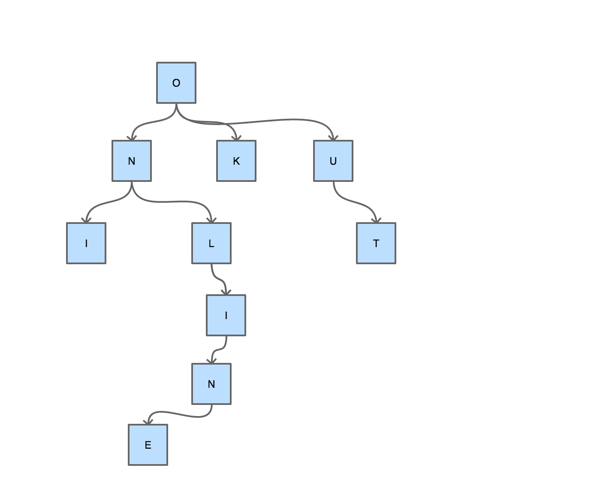
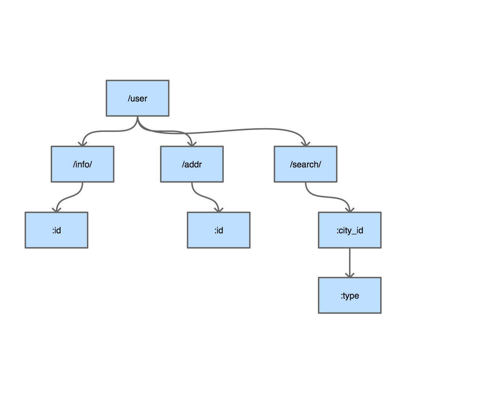
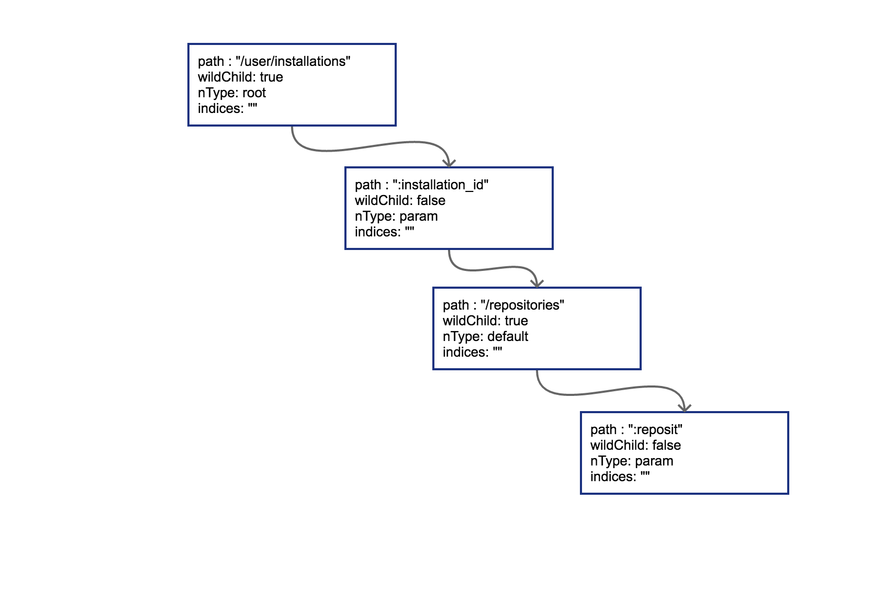
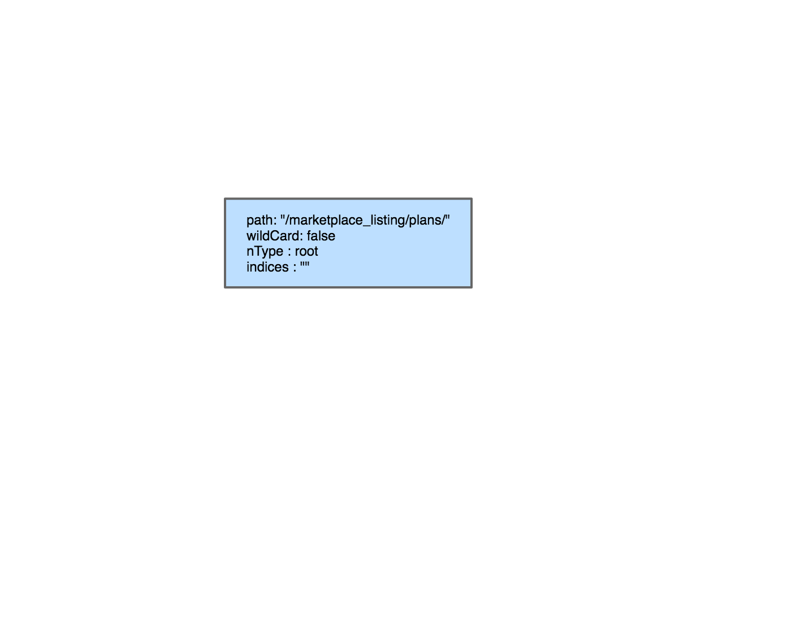
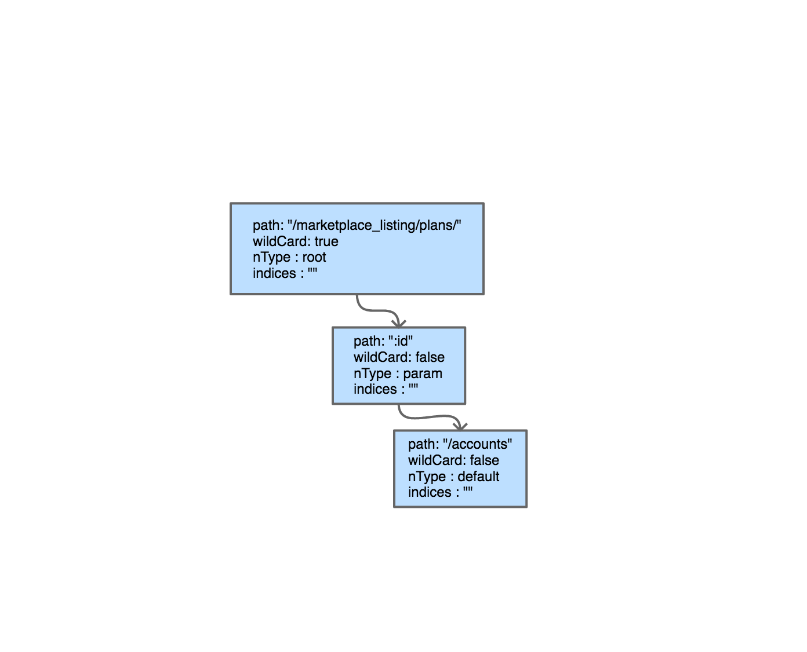
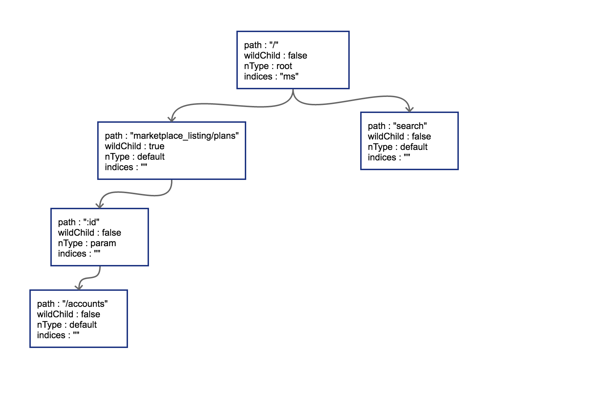
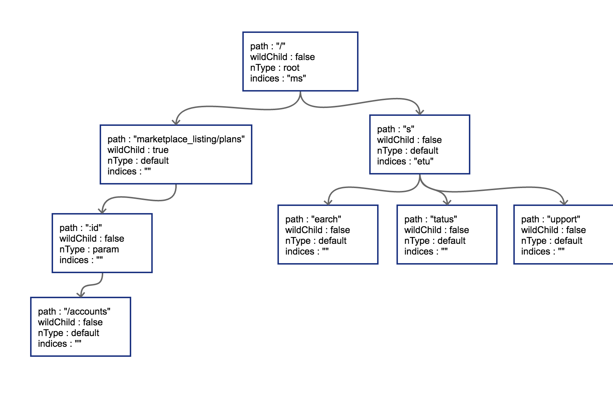

# 5.2 router 请求路由

在常见的 Web 框架中，router 是必备的组件。Go 语言圈子里 router 也时常被称为 `http` 的 multiplexer。在上一节中我们通过对 Burrow 代码的简单学习，已经知道如何用 `http` 标准库中内置的 mux 来完成简单的路由功能了。如果开发 Web 系统对路径中带参数没什么兴趣的话，用 `http` 标准库中的 `mux` 就可以。

RESTful 是几年前刮起的 API 设计风潮，在 RESTful 中除了 GET 和 POST 之外，还使用了 HTTP 协议定义的几种其它的标准化语义。具体包括：

```go
const (
	MethodGet     = "GET"
	MethodHead    = "HEAD"
	MethodPost    = "POST"
	MethodPut     = "PUT"
	MethodPatch   = "PATCH" // RFC 5789
	MethodDelete  = "DELETE"
	MethodConnect = "CONNECT"
	MethodOptions = "OPTIONS"
	MethodTrace   = "TRACE"
)
```

来看看 RESTful 中常见的请求路径：

```shell
GET /repos/:owner/:repo/comments/:id/reactions

POST /projects/:project_id/columns

PUT /user/starred/:owner/:repo

DELETE /user/starred/:owner/:repo
```

相信聪明的你已经猜出来了，这是 Github 官方文档中挑出来的几个 API 设计。RESTful 风格的 API 重度依赖请求路径。会将很多参数放在请求 URI 中。除此之外还会使用很多并不那么常见的 HTTP 状态码，不过本节只讨论路由，所以先略过不谈。

如果我们的系统也想要这样的 URI 设计，使用标准库的 `mux` 显然就力不从心了。

## 5.2.1 httprouter

较流行的开源 go Web 框架大多使用 httprouter，或是基于 httprouter 的变种对路由进行支持。前面提到的 Github 的参数式路由在 httprouter 中都是可以支持的。

因为 httprouter 中使用的是显式匹配，所以在设计路由的时候需要规避一些会导致路由冲突的情况，例如：

```
conflict:
GET /user/info/:name
GET /user/:id

no conflict:
GET /user/info/:name
POST /user/:id
```

简单来讲的话，如果两个路由拥有一致的 http 方法 (指 `GET`、`POST`、`PUT`、`DELETE`) 和请求路径前缀，且在某个位置出现了 A 路由是 wildcard（指 `:id` 这种形式）参数，B 路由则是普通字符串，那么就会发生路由冲突。路由冲突会在初始化阶段直接 panic：

```shell
panic: wildcard route ':id' conflicts with existing children in path '/user/:id'

goroutine 1 [running]:
github.com/cch123/httprouter.(*node).insertChild(0xc4200801e0, 0xc42004fc01, 0x126b177, 0x3, 0x126b171, 0x9, 0x127b668)
  /Users/caochunhui/go_work/src/github.com/cch123/httprouter/tree.go:256 +0x841
github.com/cch123/httprouter.(*node).addRoute(0xc4200801e0, 0x126b171, 0x9, 0x127b668)
  /Users/caochunhui/go_work/src/github.com/cch123/httprouter/tree.go:221 +0x22a
github.com/cch123/httprouter.(*Router).Handle(0xc42004ff38, 0x126a39b, 0x3, 0x126b171, 0x9, 0x127b668)
  /Users/caochunhui/go_work/src/github.com/cch123/httprouter/router.go:262 +0xc3
github.com/cch123/httprouter.(*Router).GET(0xc42004ff38, 0x126b171, 0x9, 0x127b668)
  /Users/caochunhui/go_work/src/github.com/cch123/httprouter/router.go:193 +0x5e
main.main()
  /Users/caochunhui/test/go_web/httprouter_learn2.go:18 +0xaf
exit status 2
```

还有一点需要注意，因为 httprouter 考虑到字典树的深度，在初始化时会对参数的数量进行限制，所以在路由中的参数数目不能超过 255，否则会导致 httprouter 无法识别后续的参数。不过这一点上也不用考虑太多，毕竟 URI 是人设计且给人来看的，相信没有长得夸张的 URI 能在一条路径中带有 200 个以上的参数。

除支持路径中的 wildcard 参数之外，httprouter 还可以支持 `*` 号来进行通配，不过 `*` 号开头的参数只能放在路由的结尾，例如下面这样：

```shell
Pattern: /src/*filepath

 /src/                     filepath = ""
 /src/somefile.go          filepath = "somefile.go"
 /src/subdir/somefile.go   filepath = "subdir/somefile.go"
```

这种设计在 RESTful 中可能不太常见，主要是为了能够使用 httprouter 来做简单的 HTTP 静态文件服务器。

除了正常情况下的路由支持，httprouter 也支持对一些特殊情况下的回调函数进行定制，例如 404 的时候：

```go
r := httprouter.New()
r.NotFound = http.HandlerFunc(func(w http.ResponseWriter, r *http.Request) {
	w.Write([]byte("oh no, not found"))
})
```

或者内部 panic 的时候：
```go
r.PanicHandler = func(w http.ResponseWriter, r *http.Request, c interface{}) {
	log.Printf("Recovering from panic, Reason: %#v", c.(error))
	w.WriteHeader(http.StatusInternalServerError)
	w.Write([]byte(c.(error).Error()))
}
```

目前开源界最为流行（star 数最多）的 Web 框架 [gin](https://github.com/gin-gonic/gin) 使用的就是 httprouter 的变种。

## 5.2.2 原理

httprouter 和众多衍生 router 使用的数据结构被称为压缩字典树（Radix Tree）。读者可能没有接触过压缩字典树，但对字典树（Trie Tree）应该有所耳闻。*图 5-1* 是一个典型的字典树结构：



*图 5-1 字典树*

字典树常用来进行字符串检索，例如用给定的字符串序列建立字典树。对于目标字符串，只要从根节点开始深度优先搜索，即可判断出该字符串是否曾经出现过，时间复杂度为 `O(n)`，n 可以认为是目标字符串的长度。为什么要这样做？字符串本身不像数值类型可以进行数值比较，两个字符串对比的时间复杂度取决于字符串长度。如果不用字典树来完成上述功能，要对历史字符串进行排序，再利用二分查找之类的算法去搜索，时间复杂度只高不低。可认为字典树是一种空间换时间的典型做法。

普通的字典树有一个比较明显的缺点，就是每个字母都需要建立一个孩子节点，这样会导致字典树的层数比较深，压缩字典树相对好地平衡了字典树的优点和缺点。是典型的压缩字典树结构：



*图 5-2 压缩字典树*

每个节点上不只存储一个字母了，这也是压缩字典树中 “压缩” 的主要含义。使用压缩字典树可以减少树的层数，同时因为每个节点上数据存储也比通常的字典树要多，所以程序的局部性较好（一个节点的 path 加载到 cache 即可进行多个字符的对比），从而对 CPU 缓存友好。

## 5.2.3 压缩字典树创建过程

我们来跟踪一下 httprouter 中，一个典型的压缩字典树的创建过程，路由设定如下：

```
PUT /user/installations/:installation_id/repositories/:repository_id

GET /marketplace_listing/plans/
GET /marketplace_listing/plans/:id/accounts
GET /search
GET /status
GET /support

补充路由：
GET /marketplace_listing/plans/ohyes
```

最后一条补充路由是我们臆想的，除此之外所有 API 路由均来自于 `api.github.com`。

### 5.2.3.1 root 节点创建

httprouter 的 Router 结构体中存储压缩字典树使用的是下述数据结构：

```go
// 略去了其它部分的 Router struct
type Router struct {
	// ...
	trees map[string]*node
	// ...
}
```

`trees` 中的 `key` 即为 HTTP 1.1 的 RFC 中定义的各种方法，具体有：

```shell
GET
HEAD
OPTIONS
POST
PUT
PATCH
DELETE
```

每一种方法对应的都是一棵独立的压缩字典树，这些树彼此之间不共享数据。具体到我们上面用到的路由，`PUT` 和 `GET` 是两棵树而非一棵。

简单来讲，某个方法第一次插入的路由就会导致对应字典树的根节点被创建，我们按顺序，先是一个 `PUT`：

```go
r := httprouter.New()
r.PUT("/user/installations/:installation_id/repositories/:reposit", Hello)
```

这样 `PUT` 对应的根节点就会被创建出来。把这棵 `PUT` 的树画出来：



*图 5-3 插入路由之后的压缩字典树*

radix 的节点类型为 `*httprouter.node`，为了说明方便，我们留下了目前关心的几个字段：

```
path: 当前节点对应的路径中的字符串

wildChild: 子节点是否为参数节点，即 wildcard node，或者说 :id 这种类型的节点

nType: 当前节点类型，有四个枚举值: 分别为 static/root/param/catchAll。
    static                   // 非根节点的普通字符串节点
    root                     // 根节点
    param                    // 参数节点，例如 :id
    catchAll                 // 通配符节点，例如 *anyway

indices：子节点索引，当子节点为非参数类型，即本节点的 wildChild 为 false 时，会将每个子节点的首字母放在该索引数组。说是数组，实际上是个 string。

```

当然，`PUT` 路由只有唯一的一条路径。接下来，我们以后续的多条 GET 路径为例，讲解子节点的插入过程。

### 5.2.3.2 子节点插入

当插入 `GET /marketplace_listing/plans` 时，类似前面 PUT 的过程，GET 树的结构如 *图 5-4*：



*图 5-4 插入第一个节点的压缩字典树*

因为第一个路由没有参数，path 都被存储到根节点上了。所以只有一个节点。

然后插入 `GET /marketplace_listing/plans/:id/accounts`，新的路径与之前的路径有共同的前缀，且可以直接在之前叶子节点后进行插入，那么结果也很简单，插入后的树结构见 *图 5-5*:



*图 5-5 插入第二个节点的压缩字典树*

由于 `:id` 这个节点只有一个字符串的普通子节点，所以 indices 还依然不需要处理。

上面这种情况比较简单，新的路由可以直接作为原路由的子节点进行插入。实际情况不会这么美好。

### 5.2.3.3 边分裂

接下来我们插入 `GET /search`，这时会导致树的边分裂，见 *图 5-6*。



*图 5-6 插入第三个节点，导致边分裂*

原有路径和新的路径在初始的 `/` 位置发生分裂，这样需要把原有的 root 节点内容下移，再将新路由 `search` 同样作为子节点挂在 root 节点之下。这时候因为子节点出现多个，root 节点的 indices 提供子节点索引，这时候该字段就需要派上用场了。"ms" 代表子节点的首字母分别为 m（marketplace）和 s（search）。

我们一口作气，把 `GET /status` 和 `GET /support` 也插入到树中。这时候会导致在 `search` 节点上再次发生分裂，最终结果见 *图 5-7*：



*图 5-7 插入所有路由后的压缩字典树*

### 5.2.3.4 子节点冲突处理

在路由本身只有字符串的情况下，不会发生任何冲突。只有当路由中含有 wildcard（类似 :id）或者 catchAll 的情况下才可能冲突。这一点在前面已经提到了。

子节点的冲突处理很简单，分几种情况：

1. 在插入 wildcard 节点时，父节点的 children 数组非空且 wildChild 被设置为 false。例如：`GET /user/getAll` 和 `GET /user/:id/getAddr`，或者 `GET /user/*aaa` 和 `GET /user/:id`。
2. 在插入 wildcard 节点时，父节点的 children 数组非空且 wildChild 被设置为 true，但该父节点的 wildcard 子节点要插入的 wildcard 名字不一样。例如：`GET /user/:id/info` 和 `GET /user/:name/info`。
3. 在插入 catchAll 节点时，父节点的 children 非空。例如：`GET /src/abc` 和 `GET /src/*filename`，或者 `GET /src/:id` 和 `GET /src/*filename`。
4. 在插入 static 节点时，父节点的 wildChild 字段被设置为 true。
5. 在插入 static 节点时，父节点的 children 非空，且子节点 nType 为 catchAll。

只要发生冲突，都会在初始化的时候 panic。例如，在插入我们臆想的路由 `GET /marketplace_listing/plans/ohyes` 时，出现第 4 种冲突情况：它的父节点 `marketplace_listing/plans/` 的 wildChild 字段为 true。
