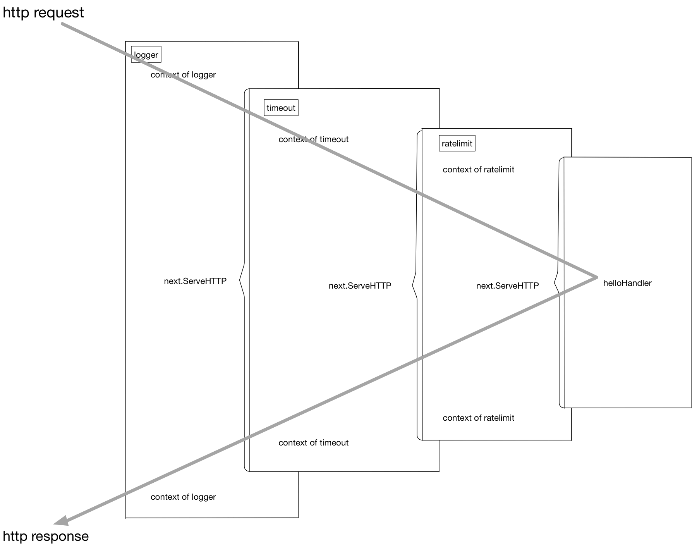
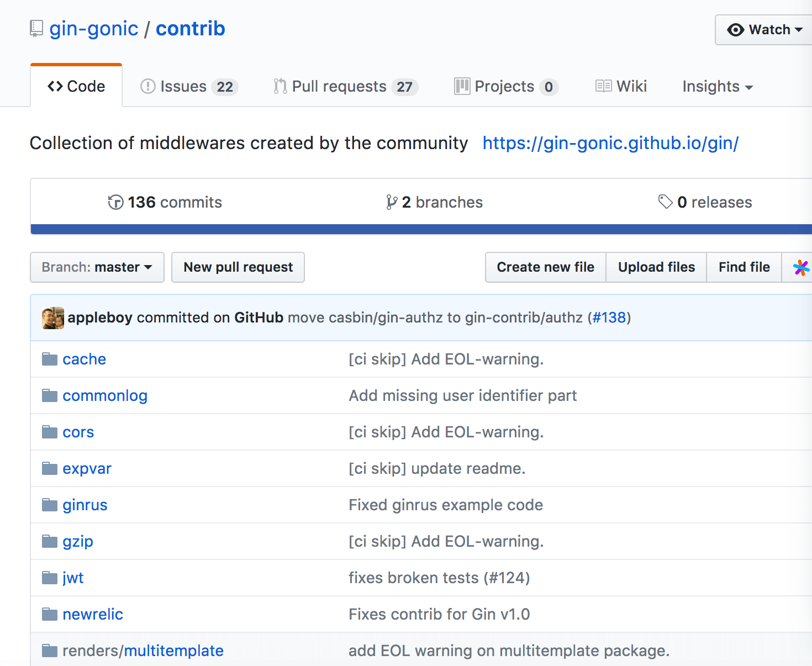

# 5.3 中间件

本章将对现在流行的Web框架中的中间件(middleware)技术原理进行分析，并介绍如何使用中间件技术将业务和非业务代码功能进行解耦。

## 5.3.1 代码泥潭

先来看一段代码：

```go
// middleware/hello.go
package main

func hello(wr http.ResponseWriter, r *http.Request) {
	wr.Write([]byte("hello"))
}

func main() {
	http.HandleFunc("/", hello)
	err := http.ListenAndServe(":8080", nil)
	...
}
```

这是一个典型的Web服务，挂载了一个简单的路由。我们的线上服务一般也是从这样简单的服务开始逐渐拓展开去的。

现在突然来了一个新的需求，我们想要统计之前写的hello服务的处理耗时，需求很简单，我们对上面的程序进行少量修改：

```go
// middleware/hello_with_time_elapse.go
var logger = log.New(os.Stdout, "", 0)

func hello(wr http.ResponseWriter, r *http.Request) {
	timeStart := time.Now()
	wr.Write([]byte("hello"))
	timeElapsed := time.Since(timeStart)
	logger.Println(timeElapsed)
}
```

这样便可以在每次接收到http请求时，打印出当前请求所消耗的时间。

完成了这个需求之后，我们继续进行业务开发，提供的API逐渐增加，现在我们的路由看起来是这个样子：

```go
// middleware/hello_with_more_routes.go
// 省略了一些相同的代码
package main

func helloHandler(wr http.ResponseWriter, r *http.Request) {
	// ...
}

func showInfoHandler(wr http.ResponseWriter, r *http.Request) {
	// ...
}

func showEmailHandler(wr http.ResponseWriter, r *http.Request) {
	// ...
}

func showFriendsHandler(wr http.ResponseWriter, r *http.Request) {
	timeStart := time.Now()
	wr.Write([]byte("your friends is tom and alex"))
	timeElapsed := time.Since(timeStart)
	logger.Println(timeElapsed)
}

func main() {
	http.HandleFunc("/", helloHandler)
	http.HandleFunc("/info/show", showInfoHandler)
	http.HandleFunc("/email/show", showEmailHandler)
	http.HandleFunc("/friends/show", showFriendsHandler)
	// ...
}

```

每一个handler里都有之前提到的记录运行时间的代码，每次增加新的路由我们也同样需要把这些看起来长得差不多的代码拷贝到我们需要的地方去。因为代码不太多，所以实施起来也没有遇到什么大问题。

渐渐的我们的系统增加到了30个路由和`handler`函数，每次增加新的handler，我们的第一件工作就是把之前写的所有和业务逻辑无关的周边代码先拷贝过来。

接下来系统安稳地运行了一段时间，突然有一天，老板找到你，我们最近找人新开发了监控系统，为了系统运行可以更加可控，需要把每个接口运行的耗时数据主动上报到我们的监控系统里。给监控系统起个名字吧，叫metrics。现在你需要修改代码并把耗时通过HTTP Post的方式发给metrics系统了。我们来修改一下`helloHandler()`：

```go
func helloHandler(wr http.ResponseWriter, r *http.Request) {
	timeStart := time.Now()
	wr.Write([]byte("hello"))
	timeElapsed := time.Since(timeStart)
	logger.Println(timeElapsed)
	// 新增耗时上报
	metrics.Upload("timeHandler", timeElapsed)
}
```

修改到这里，本能地发现我们的开发工作开始陷入了泥潭。无论未来对我们的这个Web系统有任何其它的非功能或统计需求，我们的修改必然牵一发而动全身。只要增加一个非常简单的非业务统计，我们就需要去几十个handler里增加这些业务无关的代码。虽然一开始我们似乎并没有做错，但是显然随着业务的发展，我们的行事方式让我们陷入了代码的泥潭。

## 5.3.2 使用中间件剥离非业务逻辑

我们来分析一下，一开始在哪里做错了呢？我们只是一步一步地满足需求，把我们需要的逻辑按照流程写下去呀？

我们犯的最大的错误，是把业务代码和非业务代码揉在了一起。对于大多数的场景来讲，非业务的需求都是在http请求处理前做一些事情，并且在响应完成之后做一些事情。我们有没有办法使用一些重构思路把这些公共的非业务功能代码剥离出去呢？回到刚开头的例子，我们需要给我们的`helloHandler()`增加超时时间统计，我们可以使用一种叫`function adapter`的方法来对`helloHandler()`进行包装：

```go

func hello(wr http.ResponseWriter, r *http.Request) {
	wr.Write([]byte("hello"))
}

func timeMiddleware(next http.Handler) http.Handler {
	return http.HandlerFunc(func(wr http.ResponseWriter, r *http.Request) {
		timeStart := time.Now()

		// next handler
		next.ServeHTTP(wr, r)

		timeElapsed := time.Since(timeStart)
		logger.Println(timeElapsed)
	})
}

func main() {
	http.Handle("/", timeMiddleware(http.HandlerFunc(hello)))
	err := http.ListenAndServe(":8080", nil)
	...
}
```

这样就非常轻松地实现了业务与非业务之间的剥离，魔法就在于这个`timeMiddleware`。可以从代码中看到，我们的`timeMiddleware()`也是一个函数，其参数为`http.Handler`，`http.Handler`的定义在`net/http`包中：

```go
type Handler interface {
	ServeHTTP(ResponseWriter, *Request)
}
```

任何方法实现了`ServeHTTP`，即是一个合法的`http.Handler`，读到这里你可能会有一些混乱，我们先来梳理一下http库的`Handler`，`HandlerFunc`和`ServeHTTP`的关系：

```go
type Handler interface {
	ServeHTTP(ResponseWriter, *Request)
}

type HandlerFunc func(ResponseWriter, *Request)

func (f HandlerFunc) ServeHTTP(w ResponseWriter, r *Request) {
	f(w, r)
}

```
只要你的handler函数签名是：

```go
func (ResponseWriter, *Request)
```

那么这个`handler`和`http.HandlerFunc()`就有了一致的函数签名，可以将该`handler()`函数进行类型转换，转为`http.HandlerFunc`。而`http.HandlerFunc`实现了`http.Handler`这个接口。在`http`库需要调用你的handler函数来处理http请求时，会调用`HandlerFunc()`的`ServeHTTP()`函数，可见一个请求的基本调用链是这样的：

```go
h = getHandler() => h.ServeHTTP(w, r) => h(w, r)
```

上面提到的把自定义`handler`转换为`http.HandlerFunc()`这个过程是必须的，因为我们的`handler`没有直接实现`ServeHTTP`这个接口。上面的代码中我们看到的HandleFunc(注意HandlerFunc和HandleFunc的区别)里也可以看到这个强制转换过程：

```go
func HandleFunc(pattern string, handler func(ResponseWriter, *Request)) {
	DefaultServeMux.HandleFunc(pattern, handler)
}

// 调用

func (mux *ServeMux) HandleFunc(pattern string, handler func(ResponseWriter, *Request)) {
	mux.Handle(pattern, HandlerFunc(handler))
}
```

知道handler是怎么一回事，我们的中间件通过包装handler，再返回一个新的handler就好理解了。

总结一下，我们的中间件要做的事情就是通过一个或多个函数对handler进行包装，返回一个包括了各个中间件逻辑的函数链。我们把上面的包装再做得复杂一些：

```go
customizedHandler = logger(timeout(ratelimit(helloHandler)))
```

这个函数链在执行过程中的上下文可以用*图 5-8*来表示。



*图 5-8 请求处理过程*

再直白一些，这个流程在进行请求处理的时候就是不断地进行函数压栈再出栈，有一些类似于递归的执行流：

```
[exec of logger logic]		   函数栈: []

[exec of timeout logic]		  函数栈: [logger]

[exec of ratelimit logic]		函数栈: [timeout/logger]

[exec of helloHandler logic]	 函数栈: [ratelimit/timeout/logger]

[exec of ratelimit logic part2]  函数栈: [timeout/logger]

[exec of timeout logic part2]	函数栈: [logger]

[exec of logger logic part2]	 函数栈: []
```

功能实现了，但在上面的使用过程中我们也看到了，这种函数套函数的用法不是很美观，同时也不具备什么可读性。

## 5.3.3 更优雅的中间件写法

上一节中解决了业务功能代码和非业务功能代码的解耦，但也提到了，看起来并不美观，如果需要修改这些函数的顺序，或者增删中间件还是有点费劲，本节我们来进行一些“写法”上的优化。

看一个例子：

```go
r = NewRouter()
r.Use(logger)
r.Use(timeout)
r.Use(ratelimit)
r.Add("/", helloHandler)
```

通过多步设置，我们拥有了和上一节差不多的执行函数链。胜在直观易懂，如果我们要增加或者删除中间件，只要简单地增加删除对应的`Use()`调用就可以了。非常方便。

从框架的角度来讲，怎么实现这样的功能呢？也不复杂：

```go
type middleware func(http.Handler) http.Handler

type Router struct {
	middlewareChain [] middleware
	mux map[string] http.Handler
}

func NewRouter() *Router{
	return &Router{}
}

func (r *Router) Use(m middleware) {
	r.middlewareChain = append(r.middlewareChain, m)
}

func (r *Router) Add(route string, h http.Handler) {
	var mergedHandler = h

	for i := len(r.middlewareChain) - 1; i >= 0; i-- {
		mergedHandler = r.middlewareChain[i](mergedHandler)
	}

	r.mux[route] = mergedHandler
}
```

注意代码中的`middleware`数组遍历顺序，和用户希望的调用顺序应该是"相反"的。应该不难理解。


## 5.3.4 哪些事情适合在中间件中做

以较流行的开源Go语言框架chi为例：

```
compress.go
  => 对http的响应体进行压缩处理
heartbeat.go
  => 设置一个特殊的路由，例如/ping，/healthcheck，用来给负载均衡一类的前置服务进行探活
logger.go
  => 打印请求处理处理日志，例如请求处理时间，请求路由
profiler.go
  => 挂载pprof需要的路由，如`/pprof`、`/pprof/trace`到系统中
realip.go
  => 从请求头中读取X-Forwarded-For和X-Real-IP，将http.Request中的RemoteAddr修改为得到的RealIP
requestid.go
  => 为本次请求生成单独的requestid，可一路透传，用来生成分布式调用链路，也可用于在日志中串连单次请求的所有逻辑
timeout.go
  => 用context.Timeout设置超时时间，并将其通过http.Request一路透传下去
throttler.go
  => 通过定长大小的channel存储token，并通过这些token对接口进行限流
```

每一个Web框架都会有对应的中间件组件，如果你有兴趣，也可以向这些项目贡献有用的中间件，只要合理一般项目的维护人也愿意合并你的Pull Request。

比如开源界很火的gin这个框架，就专门为用户贡献的中间件开了一个仓库，见*图 5-9*：



*图 5-9 gin的中间件仓库*

如果读者去阅读gin的源码的话，可能会发现gin的中间件中处理的并不是`http.Handler`，而是一个叫`gin.HandlerFunc`的函数类型，和本节中讲解的`http.Handler`签名并不一样。不过gin的`handler`也只是针对其框架的一种封装，中间件的原理与本节中的说明是一致的。

