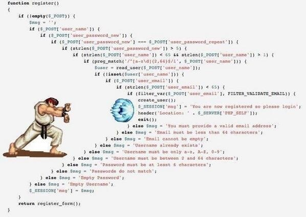
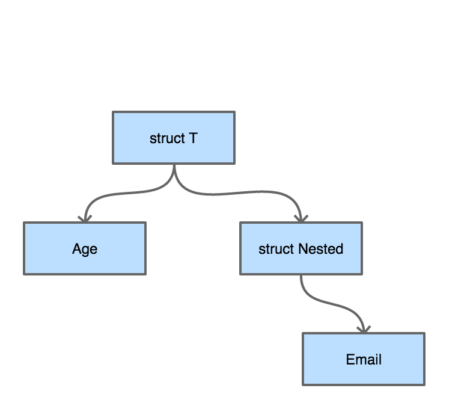

# 5.4 validator请求校验

社区里曾经有人用*图 5-10*来嘲笑PHP：



*图 5-10 validator流程*

这其实是一个语言无关的场景，需要进行字段校验的情况有很多，Web系统的Form或JSON提交只是一个典型的例子。我们用Go来写一个类似上图的校验示例。然后研究怎么一步步对其进行改进。

## 5.4.1 重构请求校验函数

假设我们的数据已经通过某个开源绑定库绑定到了具体的结构体上。

```go
type RegisterReq struct {
	Username       string   `json:"username"`
	PasswordNew    string   `json:"password_new"`
	PasswordRepeat string   `json:"password_repeat"`
	Email          string   `json:"email"`
}

func register(req RegisterReq) error{
	if len(req.Username) > 0 {
		if len(req.PasswordNew) > 0 && len(req.PasswordRepeat) > 0 {
			if req.PasswordNew == req.PasswordRepeat {
				if emailFormatValid(req.Email) {
					createUser()
					return nil
				} else {
					return errors.New("invalid email")
				}
			} else {
				return errors.New("password and reinput must be the same")
			}
		} else {
			return errors.New("password and password reinput must be longer than 0")
		}
	} else {
		return errors.New("length of username cannot be 0")
	}
}
```

我们用Go里成功写出了波动拳开路的箭头型代码。。这种代码一般怎么进行优化呢？

很简单，在《重构》一书中已经给出了方案：[Guard Clauses](https://refactoring.com/catalog/replaceNestedConditionalWithGuardClauses.html)。

```go
func register(req RegisterReq) error{
	if len(req.Username) == 0 {
		return errors.New("length of username cannot be 0")
	}

	if len(req.PasswordNew) == 0 || len(req.PasswordRepeat) == 0 {
		return errors.New("password and password reinput must be longer than 0")
	}

	if req.PasswordNew != req.PasswordRepeat {
		return errors.New("password and reinput must be the same")
	}

	if emailFormatValid(req.Email) {
		return errors.New("invalid email")
	}

	createUser()
	return nil
}
```

代码更清爽，看起来也不那么别扭了。这是比较通用的重构理念。虽然使用了重构方法使我们的校验过程代码看起来优雅了，但我们还是得为每一个`http`请求都去写这么一套差不多的`validate()`函数，有没有更好的办法来帮助我们解除这项体力劳动？答案就是validator。

## 5.4.2 用validator解放体力劳动

从设计的角度讲，我们一定会为每个请求都声明一个结构体。前文中提到的校验场景我们都可以通过validator完成工作。还以前文中的结构体为例。为了美观起见，我们先把json tag省略掉。

这里我们引入一个新的validator库：

> https://github.com/go-playground/validator

```go
import "gopkg.in/go-playground/validator.v9"

type RegisterReq struct {
	// 字符串的 gt=0 表示长度必须 > 0，gt = greater than
	Username       string   `validate:"gt=0"`
	// 同上
	PasswordNew    string   `validate:"gt=0"`
	// eqfield 跨字段相等校验
	PasswordRepeat string   `validate:"eqfield=PasswordNew"`
	// 合法 email 格式校验
	Email          string   `validate:"email"`
}

validate := validator.New()

func validate(req RegisterReq) error {
	err := validate.Struct(req)
	if err != nil {
		doSomething()
		return err
	}
	...
}

```

这样就不需要在每个请求进入业务逻辑之前都写重复的`validate()`函数了。本例中只列出了这个校验器非常简单的几个功能。

我们试着跑一下这个程序，输入参数设置为：

```go
//...

var req = RegisterReq {
	Username       : "Xargin",
	PasswordNew    : "ohno",
	PasswordRepeat : "ohn",
	Email          : "alex@abc.com",
}

err := validate(req)
fmt.Println(err)

// Key: 'RegisterReq.PasswordRepeat' Error:Field validation for
// 'PasswordRepeat' failed on the 'eqfield' tag
```

如果觉得这个`validator`提供的错误信息不够人性化，例如要把错误信息返回给用户，那就不应该直接显示英文了。可以针对每种tag进行错误信息定制，读者可以自行探索。

## 5.4.3 原理

从结构上来看，每一个结构体都可以看成是一棵树。假如我们有如下定义的结构体：

```go
type Nested struct {
	Email string `validate:"email"`
}
type T struct {
	Age	int `validate:"eq=10"`
	Nested Nested
}
```

把这个结构体画成一棵树，见*图 5-11*：



*图 5-11 validator 树*

从字段校验的需求来讲，无论我们采用深度优先搜索还是广度优先搜索来对这棵结构体树来进行遍历，都是可以的。

我们来写一个递归的深度优先搜索方式的遍历示例：

```go
package main

import (
	"fmt"
	"reflect"
	"regexp"
	"strconv"
	"strings"
)

type Nested struct {
	Email string `validate:"email"`
}
type T struct {
	Age	int `validate:"eq=10"`
	Nested Nested
}

func validateEmail(input string) bool {
	if pass, _ := regexp.MatchString(
		`^([\w\.\_]{2,10})@(\w{1,}).([a-z]{2,4})$`, input,
	); pass {
		return true
	}
	return false
}

func validate(v interface{}) (bool, string) {
	validateResult := true
	errmsg := "success"
	vt := reflect.TypeOf(v)
	vv := reflect.ValueOf(v)
	for i := 0; i < vv.NumField(); i++ {
		fieldVal := vv.Field(i)
		tagContent := vt.Field(i).Tag.Get("validate")
		k := fieldVal.Kind()

		switch k {
		case reflect.Int:
			val := fieldVal.Int()
			tagValStr := strings.Split(tagContent, "=")
			tagVal, _ := strconv.ParseInt(tagValStr[1], 10, 64)
			if val != tagVal {
				errmsg = "validate int failed, tag is: "+ strconv.FormatInt(
					tagVal, 10,
				)
				validateResult = false
			}
		case reflect.String:
			val := fieldVal.String()
			tagValStr := tagContent
			switch tagValStr {
			case "email":
				nestedResult := validateEmail(val)
				if nestedResult == false {
					errmsg = "validate mail failed, field val is: "+ val
					validateResult = false
				}
			}
		case reflect.Struct:
			// 如果有内嵌的 struct，那么深度优先遍历
			// 就是一个递归过程
			valInter := fieldVal.Interface()
			nestedResult, msg := validate(valInter)
			if nestedResult == false {
				validateResult = false
				errmsg = msg
			}
		}
	}
	return validateResult, errmsg
}

func main() {
	var a = T{Age: 10, Nested: Nested{Email: "abc@abc.com"}}

	validateResult, errmsg := validate(a)
	fmt.Println(validateResult, errmsg)
}
```

这里我们简单地对`eq=x`和`email`这两个tag进行了支持，读者可以对这个程序进行简单的修改以查看具体的validate效果。为了演示精简掉了错误处理和复杂情况的处理，例如`reflect.Int8/16/32/64`，`reflect.Ptr`等类型的处理，如果给生产环境编写校验库的话，请务必做好功能的完善和容错。

在前一小节中介绍的开源校验组件在功能上要远比我们这里的例子复杂的多。但原理很简单，就是用反射对结构体进行树形遍历。有心的读者这时候可能会产生一个问题，我们对结构体进行校验时大量使用了反射，而Go的反射在性能上不太出众，有时甚至会影响到我们程序的性能。这样的考虑确实有一些道理，但需要对结构体进行大量校验的场景往往出现在Web服务，这里并不一定是程序的性能瓶颈所在，实际的效果还是要从pprof中做更精确的判断。

如果基于反射的校验真的成为了你服务的性能瓶颈怎么办？现在也有一种思路可以避免反射：使用Go内置的Parser对源代码进行扫描，然后根据结构体的定义生成校验代码。我们可以将所有需要校验的结构体放在单独的包内。这就交给读者自己去探索了。
