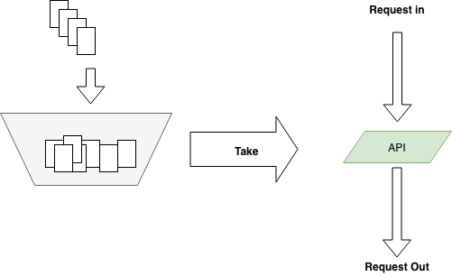

# 5.6 Ratelimit 服务流量限制

计算机程序可依据其瓶颈分为磁盘IO瓶颈型，CPU计算瓶颈型，网络带宽瓶颈型，分布式场景下有时候也会外部系统而导致自身瓶颈。

Web系统打交道最多的是网络，无论是接收，解析用户请求，访问存储，还是把响应数据返回给用户，都是要走网络的。在没有`epoll/kqueue`之类的系统提供的IO多路复用接口之前，多个核心的现代计算机最头痛的是C10k问题，C10k问题会导致计算机没有办法充分利用CPU来处理更多的用户连接，进而没有办法通过优化程序提升CPU利用率来处理更多的请求。

自从Linux实现了`epoll`，FreeBSD实现了`kqueue`，这个问题基本解决了，我们可以借助内核提供的API轻松解决当年的C10k问题，也就是说如今如果你的程序主要是和网络打交道，那么瓶颈一定在用户程序而不在操作系统内核。

随着时代的发展，编程语言对这些系统调用又进一步进行了封装，如今做应用层开发，几乎不会在程序中看到`epoll`之类的字眼，大多数时候我们就只要聚焦在业务逻辑上就好。Go 的 net 库针对不同平台封装了不同的syscall API，`http`库又是构建在`net`库之上，所以在Go语言中我们可以借助标准库，很轻松地写出高性能的`http`服务，下面是一个简单的`hello world`服务的代码：

```go
package main

import (
	"io"
	"log"
	"net/http"
)

func sayhello(wr http.ResponseWriter, r *http.Request) {
	wr.WriteHeader(200)
	io.WriteString(wr, "hello world")
}

func main() {
	http.HandleFunc("/", sayhello)
	err := http.ListenAndServe(":9090", nil)
	if err != nil {
		log.Fatal("ListenAndServe:", err)
	}
}
```

我们需要衡量一下这个Web服务的吞吐量，再具体一些，就是接口的QPS。借助wrk，在家用电脑 Macbook Pro上对这个 `hello world` 服务进行基准测试，Mac的硬件情况如下：

```shell
CPU: Intel(R) Core(TM) i5-5257U CPU @ 2.70GHz
Core: 2
Threads: 4

Graphics/Displays:
	  Chipset Model: Intel Iris Graphics 6100
		  Resolution: 2560 x 1600 Retina
	Memory Slots:
		  Size: 4 GB
		  Speed: 1867 MHz
		  Size: 4 GB
		  Speed: 1867 MHz
Storage:
		  Size: 250.14 GB (250,140,319,744 bytes)
		  Media Name: APPLE SSD SM0256G Media
		  Size: 250.14 GB (250,140,319,744 bytes)
		  Medium Type: SSD
```

测试结果：

```shell
~ ❯❯❯ wrk -c 10 -d 10s -t10 http://localhost:9090
Running 10s test @ http://localhost:9090
  10 threads and 10 connections
  Thread Stats   Avg	  Stdev	 Max   +/- Stdev
	Latency   339.99us	1.28ms  44.43ms   98.29%
	Req/Sec	 4.49k   656.81	 7.47k	73.36%
  449588 requests in 10.10s, 54.88MB read
Requests/sec:  44513.22
Transfer/sec:	  5.43MB

~ ❯❯❯ wrk -c 10 -d 10s -t10 http://localhost:9090
Running 10s test @ http://localhost:9090
  10 threads and 10 connections
  Thread Stats   Avg	  Stdev	 Max   +/- Stdev
	Latency   334.76us	1.21ms  45.47ms   98.27%
	Req/Sec	 4.42k   633.62	 6.90k	71.16%
  443582 requests in 10.10s, 54.15MB read
Requests/sec:  43911.68
Transfer/sec:	  5.36MB

~ ❯❯❯ wrk -c 10 -d 10s -t10 http://localhost:9090
Running 10s test @ http://localhost:9090
  10 threads and 10 connections
  Thread Stats   Avg	  Stdev	 Max   +/- Stdev
	Latency   379.26us	1.34ms  44.28ms   97.62%
	Req/Sec	 4.55k   591.64	 8.20k	76.37%
  455710 requests in 10.10s, 55.63MB read
Requests/sec:  45118.57
Transfer/sec:	  5.51MB
```

多次测试的结果在4万左右的QPS浮动，响应时间最多也就是40ms左右，对于一个Web程序来说，这已经是很不错的成绩了，我们只是照抄了别人的示例代码，就完成了一个高性能的`hello world`服务器，是不是很有成就感？

这还只是家用PC，线上服务器大多都是24核心起，32G内存+，CPU基本都是Intel i7。所以同样的程序在服务器上运行会得到更好的结果。

这里的`hello world`服务没有任何业务逻辑。真实环境的程序要复杂得多，有些程序偏网络IO瓶颈，例如一些CDN服务、Proxy服务；有些程序偏CPU/GPU瓶颈，例如登陆校验服务、图像处理服务；有些程序瓶颈偏磁盘，例如专门的存储系统，数据库。不同的程序瓶颈会体现在不同的地方，这里提到的这些功能单一的服务相对来说还算容易分析。如果碰到业务逻辑复杂代码量巨大的模块，其瓶颈并不是三下五除二可以推测出来的，还是需要从压力测试中得到更为精确的结论。

对于IO/Network瓶颈类的程序，其表现是网卡/磁盘IO会先于CPU打满，这种情况即使优化CPU的使用也不能提高整个系统的吞吐量，只能提高磁盘的读写速度，增加内存大小，提升网卡的带宽来提升整体性能。而CPU瓶颈类的程序，则是在存储和网卡未打满之前CPU占用率先到达100%，CPU忙于各种计算任务，IO设备相对则较闲。

无论哪种类型的服务，在资源使用到极限的时候都会导致请求堆积，超时，系统hang死，最终伤害到终端用户。对于分布式的Web服务来说，瓶颈还不一定总在系统内部，也有可能在外部。非计算密集型的系统往往会在关系型数据库环节失守，而这时候Web模块本身还远远未达到瓶颈。

不管我们的服务瓶颈在哪里，最终要做的事情都是一样的，那就是流量限制。

## 5.6.1 常见的流量限制手段

流量限制的手段有很多，最常见的：漏桶、令牌桶两种：

1. 漏桶是指我们有一个一直装满了水的桶，每过固定的一段时间即向外漏一滴水。如果你接到了这滴水，那么你就可以继续服务请求，如果没有接到，那么就需要等待下一滴水。
2. 令牌桶则是指匀速向桶中添加令牌，服务请求时需要从桶中获取令牌，令牌的数目可以按照需要消耗的资源进行相应的调整。如果没有令牌，可以选择等待，或者放弃。

这两种方法看起来很像，不过还是有区别的。漏桶流出的速率固定，而令牌桶只要在桶中有令牌，那就可以拿。也就是说令牌桶是允许一定程度的并发的，比如同一个时刻，有100个用户请求，只要令牌桶中有100个令牌，那么这100个请求全都会放过去。令牌桶在桶中没有令牌的情况下也会退化为漏桶模型。



*图 5-12 令牌桶*

实际应用中令牌桶应用较为广泛，开源界流行的限流器大多数都是基于令牌桶思想的。并且在此基础上进行了一定程度的扩充，比如`github.com/juju/ratelimit`提供了几种不同特色的令牌桶填充方式：

```go
func NewBucket(fillInterval time.Duration, capacity int64) *Bucket
```

默认的令牌桶，`fillInterval`指每过多长时间向桶里放一个令牌，`capacity`是桶的容量，超过桶容量的部分会被直接丢弃。桶初始是满的。

```go
func NewBucketWithQuantum(fillInterval time.Duration, capacity, quantum int64) *Bucket
```

和普通的`NewBucket()`的区别是，每次向桶中放令牌时，是放`quantum`个令牌，而不是一个令牌。

```go
func NewBucketWithRate(rate float64, capacity int64) *Bucket
```

这个就有点特殊了，会按照提供的比例，每秒钟填充令牌数。例如`capacity`是100，而`rate`是0.1，那么每秒会填充10个令牌。

从桶中获取令牌也提供了几个API：

```go
func (tb *Bucket) Take(count int64) time.Duration {}
func (tb *Bucket) TakeAvailable(count int64) int64 {}
func (tb *Bucket) TakeMaxDuration(count int64, maxWait time.Duration) (
	time.Duration, bool,
) {}
func (tb *Bucket) Wait(count int64) {}
func (tb *Bucket) WaitMaxDuration(count int64, maxWait time.Duration) bool {}
```

名称和功能都比较直观，这里就不再赘述了。相比于开源界更为有名的Google的Java工具库Guava中提供的ratelimiter，这个库不支持令牌桶预热，且无法修改初始的令牌容量，所以可能个别极端情况下的需求无法满足。但在明白令牌桶的基本原理之后，如果没办法满足需求，相信你也可以很快对其进行修改并支持自己的业务场景。

## 5.6.2 原理

从功能上来看，令牌桶模型就是对全局计数的加减法操作过程，但使用计数需要我们自己加读写锁，有小小的思想负担。如果我们对Go语言已经比较熟悉的话，很容易想到可以用buffered channel来完成简单的加令牌取令牌操作：

```go
var tokenBucket = make(chan struct{}, capacity)
```

每过一段时间向`tokenBucket`中添加`token`，如果`bucket`已经满了，那么直接放弃：

```go
fillToken := func() {
	ticker := time.NewTicker(fillInterval)
	for {
		select {
		case <-ticker.C:
			select {
			case tokenBucket <- struct{}{}:
			default:
			}
			fmt.Println("current token cnt:", len(tokenBucket), time.Now())
		}
	}
}
```

把代码组合起来：

```go
package main

import (
	"fmt"
	"time"
)

func main() {
	var fillInterval = time.Millisecond * 10
	var capacity = 100
	var tokenBucket = make(chan struct{}, capacity)

	fillToken := func() {
		ticker := time.NewTicker(fillInterval)
		for {
			select {
			case <-ticker.C:
				select {
				case tokenBucket <- struct{}{}:
				default:
				}
				fmt.Println("current token cnt:", len(tokenBucket), time.Now())
			}
		}
	}

	go fillToken()
	time.Sleep(time.Hour)
}

```

看看运行结果：

```shell
current token cnt: 98 2018-06-16 18:17:50.234556981 +0800 CST m=+0.981524018
current token cnt: 99 2018-06-16 18:17:50.243575354 +0800 CST m=+0.990542391
current token cnt: 100 2018-06-16 18:17:50.254628067 +0800 CST m=+1.001595104
current token cnt: 100 2018-06-16 18:17:50.264537143 +0800 CST m=+1.011504180
current token cnt: 100 2018-06-16 18:17:50.273613018 +0800 CST m=+1.020580055
current token cnt: 100 2018-06-16 18:17:50.2844406 +0800 CST m=+1.031407637
current token cnt: 100 2018-06-16 18:17:50.294528695 +0800 CST m=+1.041495732
current token cnt: 100 2018-06-16 18:17:50.304550145 +0800 CST m=+1.051517182
current token cnt: 100 2018-06-16 18:17:50.313970334 +0800 CST m=+1.060937371
```

在1s钟的时候刚好填满100个，没有太大的偏差。不过这里可以看到，Go的定时器存在大约0.001s的误差，所以如果令牌桶大小在1000以上的填充可能会有一定的误差。对于一般的服务来说，这一点误差无关紧要。

上面的令牌桶的取令牌操作实现起来也比较简单，简化问题，我们这里只取一个令牌：

```go
func TakeAvailable(block bool) bool{
	var takenResult bool
	if block {
		select {
		case <-tokenBucket:
			takenResult = true
		}
	} else {
		select {
		case <-tokenBucket:
			takenResult = true
		default:
			takenResult = false
		}
	}

	return takenResult
}
```

一些公司自己造的限流的轮子就是用上面这种方式来实现的，不过如果开源版 ratelimit 也如此的话，那我们也没什么可说的了。现实并不是这样的。

我们来思考一下，令牌桶每隔一段固定的时间向桶中放令牌，如果我们记下上一次放令牌的时间为 t1，和当时的令牌数k1，放令牌的时间间隔为ti，每次向令牌桶中放x个令牌，令牌桶容量为cap。现在如果有人来调用`TakeAvailable`来取n个令牌，我们将这个时刻记为t2。在t2时刻，令牌桶中理论上应该有多少令牌呢？伪代码如下：

```go
cur = k1 + ((t2 - t1)/ti) * x
cur = cur > cap ? cap : cur
```

我们用两个时间点的时间差，再结合其它的参数，理论上在取令牌之前就完全可以知道桶里有多少令牌了。那劳心费力地像本小节前面向channel里填充token的操作，理论上是没有必要的。只要在每次`Take`的时候，再对令牌桶中的token数进行简单计算，就可以得到正确的令牌数。是不是很像`惰性求值`的感觉？

在得到正确的令牌数之后，再进行实际的`Take`操作就好，这个`Take`操作只需要对令牌数进行简单的减法即可，记得加锁以保证并发安全。`github.com/juju/ratelimit`这个库就是这样做的。

## 5.6.3 服务瓶颈和 QoS

前面我们说了很多CPU瓶颈、IO瓶颈之类的概念，这种性能瓶颈从大多数公司都有的监控系统中可以比较快速地定位出来，如果一个系统遇到了性能问题，那监控图的反应一般都是最快的。

虽然性能指标很重要，但对用户提供服务时还应考虑服务整体的QoS。QoS全称是Quality of Service，顾名思义是服务质量。QoS包含有可用性、吞吐量、时延、时延变化和丢失等指标。一般来讲我们可以通过优化系统，来提高Web服务的CPU利用率，从而提高整个系统的吞吐量。但吞吐量提高的同时，用户体验是有可能变差的。用户角度比较敏感的除了可用性之外，还有时延。虽然你的系统吞吐量高，但半天刷不开页面，想必会造成大量的用户流失。所以在大公司的Web服务性能指标中，除了平均响应时延之外，还会把响应时间的95分位，99分位也拿出来作为性能标准。平均响应在提高CPU利用率没受到太大影响时，可能95分位、99分位的响应时间大幅度攀升了，那么这时候就要考虑提高这些CPU利用率所付出的代价是否值得了。

在线系统的机器一般都会保持CPU有一定的余裕。
