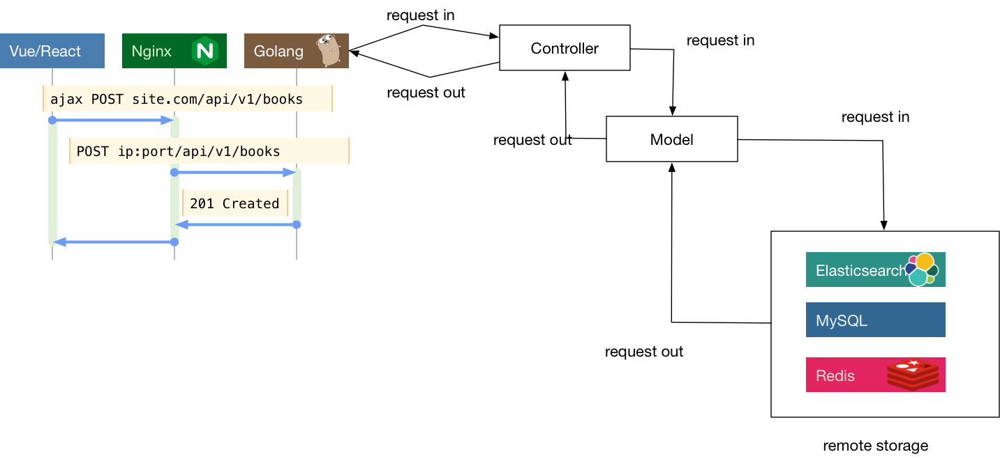
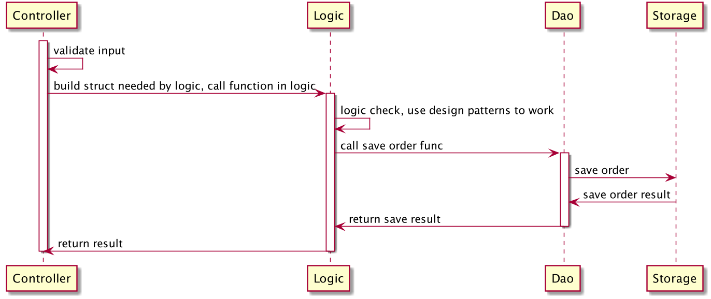
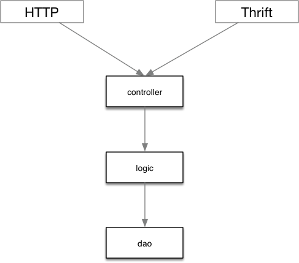
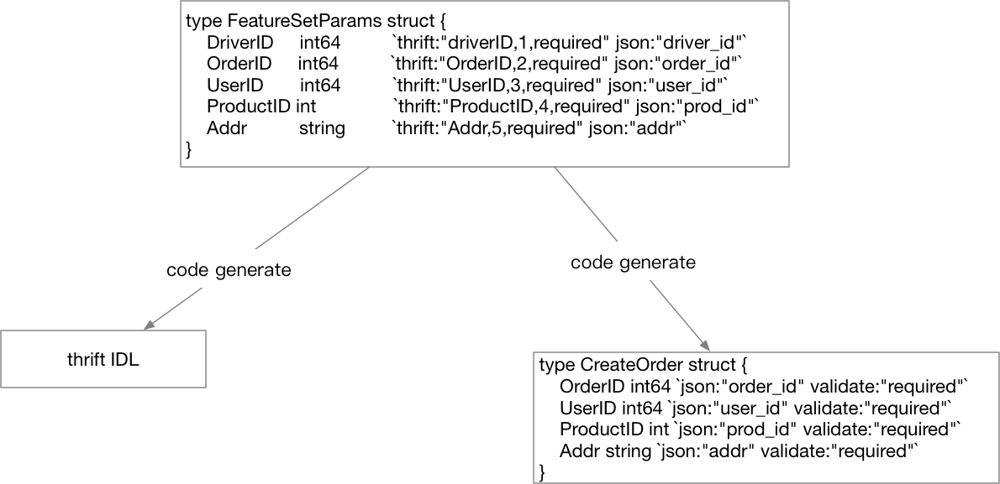
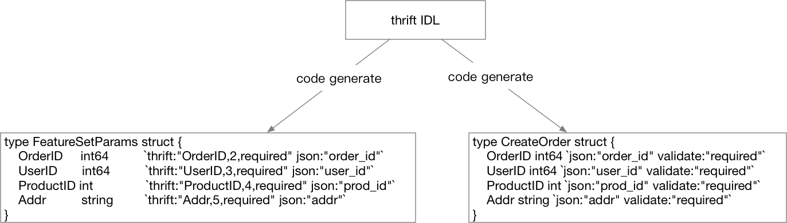
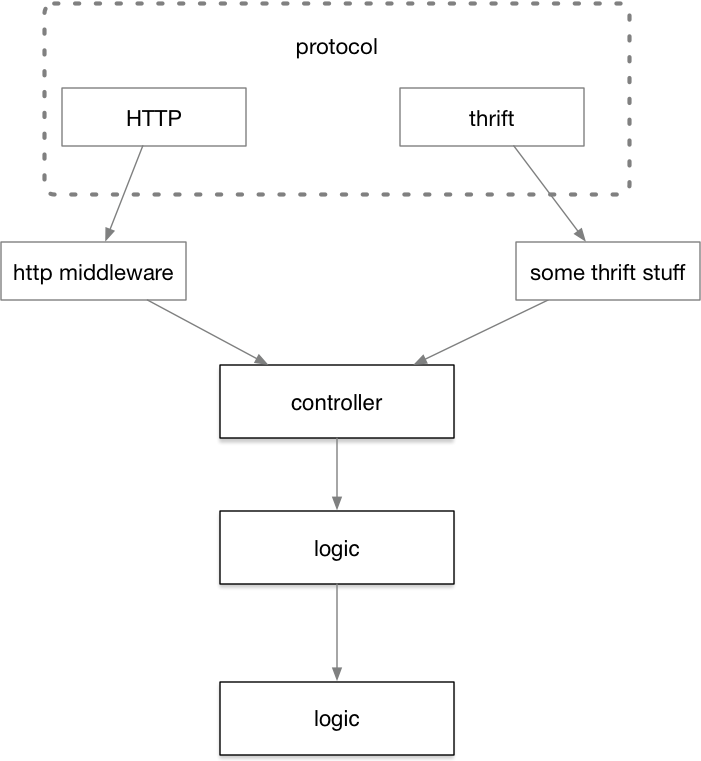

# 5.7 layout 常见大型 Web 项目分层

流行的Web框架大多数是MVC框架，MVC这个概念最早由Trygve Reenskaug在1978年提出，为了能够对GUI类型的应用进行方便扩展，将程序划分为：

1. 控制器（Controller）- 负责转发请求，对请求进行处理。
2. 视图（View） - 界面设计人员进行图形界面设计。
3. 模型（Model） - 程序员编写程序应有的功能（实现算法等等）、数据库专家进行数据管理和数据库设计（可以实现具体的功能）。

随着时代的发展，前端也变成了越来越复杂的工程，为了更好地工程化，现在更为流行的一般是前后分离的架构。可以认为前后分离是把V层从MVC中抽离单独成为项目。这样一个后端项目一般就只剩下 M和C层了。前后端之间通过ajax来交互，有时候要解决跨域的问题，但也已经有了较为成熟的方案。*图 5-13* 是一个前后分离的系统的简易交互图。



*图 5-13 前后分离交互图*

图里的Vue和React是现在前端界比较流行的两个框架，因为我们的重点不在这里，所以前端项目内的组织我们就不强调了。事实上，即使是简单的项目，业界也并没有完全遵守MVC框架提出者对于M和C所定义的分工。有很多公司的项目会在Controller层塞入大量的逻辑，在Model层就只管理数据的存储。这往往来源于对于model层字面含义的某种擅自引申理解。认为字面意思，这一层就是处理某种建模，而模型是什么？就是数据呗！

这种理解显然是有问题的，业务流程也算是一种“模型”，是对真实世界用户行为或者既有流程的一种建模，并非只有按格式组织的数据才能叫模型。不过按照MVC的创始人的想法，我们如果把和数据打交道的代码还有业务流程全部塞进MVC里的M层的话，这个M层又会显得有些过于臃肿。对于复杂的项目，一个C和一个M层显然是不够用的，现在比较流行的纯后端API模块一般采用下述划分方法：

1. Controller，与上述类似，服务入口，负责处理路由，参数校验，请求转发。
2. Logic/Service，逻辑（服务）层，一般是业务逻辑的入口，可以认为从这里开始，所有的请求参数一定是合法的。业务逻辑和业务流程也都在这一层中。常见的设计中会将该层称为 Business Rules。
3. DAO/Repository，这一层主要负责和数据、存储打交道。将下层存储以更简单的函数、接口形式暴露给 Logic 层来使用。负责数据的持久化工作。

每一层都会做好自己的工作，然后用请求当前的上下文构造下一层工作所需要的结构体或其它类型参数，然后调用下一层的函数。在工作完成之后，再把处理结果一层层地传出到入口，如*图 5-14所示*。



*图 5-14 请求处理流程*

划分为CLD三层之后，在C层之前我们可能还需要同时支持多种协议。本章前面讲到的thrift、gRPC和http并不是一定只选择其中一种，有时我们需要支持其中的两种，比如同一个接口，我们既需要效率较高的thrift，也需要方便debug的http入口。即除了CLD之外，还需要一个单独的protocol层，负责处理各种交互协议的细节。这样请求的流程会变成*图 5-15* 所示。



*图 5-15 多协议示意图*

这样我们Controller中的入口函数就变成了下面这样：

```go
func CreateOrder(ctx context.Context, req *CreateOrderStruct) (
	*CreateOrderRespStruct, error,
) {
	// ...
}
```

CreateOrder有两个参数，ctx用来传入trace_id一类的需要串联请求的全局参数，req里存储了我们创建订单所需要的所有输入信息。返回结果是一个响应结构体和错误。可以认为，我们的代码运行到Controller层之后，就没有任何与“协议”相关的代码了。在这里你找不到`http.Request`，也找不到`http.ResponseWriter`，也找不到任何与thrift或者gRPC相关的字眼。

在协议(Protocol)层，处理http协议的大概代码如下：

```go
// defined in protocol layer
type CreateOrderRequest struct {
	OrderID int64 `json:"order_id"`
	// ...
}

// defined in controller
type CreateOrderParams struct {
	OrderID int64
}

func HTTPCreateOrderHandler(wr http.ResponseWriter, r *http.Request) {
	var req CreateOrderRequest
	var params CreateOrderParams
	ctx := context.TODO()
	// bind data to req
	bind(r, &req)
	// map protocol binded to protocol-independent
	map(req, params)
	logicResp,err := controller.CreateOrder(ctx, &params)
	if err != nil {}
	// ...
}
```

理论上我们可以用同一个请求结构体组合上不同的tag，来达到一个结构体来给不同的协议复用的目的。不过遗憾的是在thrift中，请求结构体也是通过IDL生成的，其内容在自动生成的ttypes.go文件中，我们还是需要在thrift的入口将这个自动生成的结构体映射到我们logic入口所需要的结构体上。gRPC也是类似。这部分代码还是需要的。

聪明的读者可能已经可以看出来了，协议细节处理这一层有大量重复劳动，每一个接口在协议这一层的处理，无非是把数据从协议特定的结构体(例如`http.Request`，thrift的被包装过了) 读出来，再绑定到我们协议无关的结构体上，再把这个结构体映射到Controller入口的结构体上，这些代码长得都差不多。差不多的代码都遵循着某种模式，那么我们可以对这些模式进行简单的抽象，用代码生成的方式，把繁复的协议处理代码从工作内容中抽离出去。

先来看看HTTP对应的结构体、thrift对应的结构体和我们协议无关的结构体分别长什么样子：

```go
// http 请求结构体
type CreateOrder struct {
	OrderID   int64  `json:"order_id" validate:"required"`
	UserID    int64  `json:"user_id" validate:"required"`
	ProductID int    `json:"prod_id" validate:"required"`
	Addr      string `json:"addr" validate:"required"`
}

// thrift 请求结构体
type FeatureSetParams struct {
	DriverID  int64  `thrift:"driverID,1,required"`
	OrderID   int64  `thrift:"OrderID,2,required"`
	UserID    int64  `thrift:"UserID,3,required"`
	ProductID int    `thrift:"ProductID,4,required"`
	Addr      string `thrift:"Addr,5,required"`
}

// controller input struct
type CreateOrderParams struct {
	OrderID int64
	UserID int64
	ProductID int
	Addr string
}

```

我们需要通过一个源结构体来生成我们需要的HTTP和thrift入口代码。再观察一下上面定义的三种结构体，我们只要能用一个结构体生成thrift的IDL，以及HTTP服务的“IDL（只要能包含json或form相关tag的结构体定义信息）” 就可以了。这个初始的结构体我们可以把结构体上的HTTP的tag和thrift的tag揉在一起：

```go
type FeatureSetParams struct {
	DriverID  int64  `thrift:"driverID,1,required" json:"driver_id"`
	OrderID   int64  `thrift:"OrderID,2,required" json:"order_id"`
	UserID    int64  `thrift:"UserID,3,required" json:"user_id"`
	ProductID int    `thrift:"ProductID,4,required" json:"prod_id"`
	Addr      string `thrift:"Addr,5,required" json:"addr"`
}
```

然后通过代码生成把thrift的IDL和HTTP的请求结构体都生成出来，如*图 5-16所示*



*图 5-16 通过Go代码定义结构体生成项目入口*

至于用什么手段来生成，你可以通过Go语言内置的Parser读取文本文件中的Go源代码，然后根据AST来生成目标代码，也可以简单地把这个源结构体和Generator的代码放在一起编译，让结构体作为Generator的输入参数（这样会更简单一些），都是可以的。

当然这种思路并不是唯一选择，我们还可以通过解析thrift的IDL，生成一套HTTP接口的结构体。如果你选择这么做，那整个流程就变成了*图 5-17*所示。



*图 5-17 也可以从thrift生成其它部分*

看起来比之前的图顺畅一点，不过如果你选择了这么做，你需要自行对thrift的IDL进行解析，也就是相当于可能要手写一个thrift的IDL的Parser，虽然现在有Antlr或者peg能帮你简化这些Parser的书写工作，但在“解析”的这一步我们不希望引入太多的工作量，所以量力而行即可。

既然工作流已经成型，我们可以琢磨一下怎么让整个流程对用户更加友好。

比如在前面的生成环境引入Web页面，只要让用户点点鼠标就能生成SDK，这些就靠读者自己去探索了。

虽然我们成功地使自己的项目在入口支持了多种交互协议，但是还有一些问题没有解决。本节中所叙述的分层没有将中间件作为项目的分层考虑进去。如果我们考虑中间件的话，请求的流程是什么样的？见*图 5-18*所示。



*图 5-18 加入中间件后的控制流*

之前我们学习的中间件是和HTTP协议强相关的，遗憾的是在thrift中看起来没有和HTTP中对等的解决这些非功能性逻辑代码重复问题的中间件。所以我们在图上写`thrift stuff`。这些`stuff`可能需要你手写去实现，然后每次增加一个新的thrift接口，就需要去写一遍这些非功能性代码。

这也是很多企业项目所面临的真实问题，遗憾的是开源界并没有这样方便的多协议中间件解决方案。当然了，前面我们也说过，很多时候我们给自己保留的HTTP接口只是用来做调试，并不会暴露给外人用。这种情况下，这些非功能性的代码只要在thrift的代码中完成即可。
