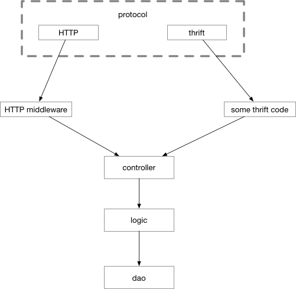

# 5.7 layout Common large web project layering

Most popular web frameworks are MVC frameworks. The concept of MVC was first proposed by Trygve Reenskaug in 1978. In order to facilitate the extension of GUI type applications, the program is divided into:

1. Controller - Responsible for forwarding requests and processing requests.
2. View - The interface designer makes the graphical interface design.
3. Model - The programmer should write the functions (implementation algorithms, etc.), database experts for data management and database design (can achieve specific functions).

With the development of the times, the front end has become an increasingly complex project. In order to better engineer, the more popular ones are generally separated architectures. It can be considered that the separation before and after is to separate the V layer from the MVC into a separate item. Such a back-end project generally leaves only the M and C layers. The front and back ends interact with each other through ajax. Sometimes it is necessary to solve the cross-domain problem, but there are already more mature solutions. *Figure 5-13* is a simple interaction diagram of a system separated from front to back.

![Separate before and after] (../images/ch6-08-frontend-backend.png)

*Figure 5-13 Separation interaction diagram before and after*

Vue and React in the picture are two popular frameworks in the front-end world, because our focus is not here, so the organization within the front-end project is not emphasized. In fact, even for simple projects, the industry does not fully comply with the division of labor defined by the MVC framework proposers for M and C. There are many companies that project a lot of logic in the Controller layer, and only manage the storage of data in the Model layer. This often comes from some kind of arbitrarily extended understanding of the literal meaning of the model layer. Think of the literal meaning, this layer is to deal with some kind of modeling, and what is the model? It’s the data!

This kind of understanding is obviously problematic. A business process is also a kind of "model". It is a model of real-world user behavior or existing processes. It is not only the data organized by format can be called a model. However, according to the idea of ​​the founder of MVC, if we put the code that deals with the data and the business process all into the M layer in MVC, the M layer will appear too bloated. For complex projects, a C and an M layer are obviously not enough. The more popular pure backend API modules generally use the following partitioning methods:

1. Controller, similar to the above, service entry, responsible for processing routing, parameter verification, request forwarding.
2. Logic/Service, the logical (service) layer, is generally the entry point of the business logic, it can be considered that from here on, all request parameters must be legal. Business logic and business processes are also in this layer. This layer is called Business Rules in a common design.
3. DAO/Repository, this layer is mainly responsible for dealing with data and storage. The underlying storage is exposed to the Logic layer for use in a simpler function, interface form. Responsible for data persistence.

Each layer will do its job, then construct the structure or other type parameters needed for the next layer of work by requesting the current context, and then call the function of the next layer. After the work is completed, the processing results are transmitted to the portal layer by layer, as shown in Figure 5-14.


*Figure 5-14 Request Processing Flow*

After being divided into three layers of CLD, we may need to support multiple protocols at the same time before the C layer. The thrift, gRPC, and http mentioned earlier in this chapter are not necessarily only one of them. Sometimes we need to support two of them, such as the same interface. We need both efficient thrift and http hooks for debugging. That is, in addition to CLD, a separate protocol layer is required to handle the details of various interactive protocols. The process of this request will become *Figure 5-15*.


*Figure 5-15 Multi-Protocol Schematic*

So the entry function in our Controller becomes like this:

```go
Func CreateOrder(ctx context.Context, req *CreateOrderStruct) (
*CreateOrderRespStruct, error,
) {
// ...
}
```

CreateOrder has two parameters. ctx is used to pass in global parameters such as trace_id that require a serial request. Req stores all the input information we need to create an order. The result returned is a response structure and an error. It can be argued that after our code runs into the Controller layer, there is no code associated with the "protocol". You can't find `http.Request` here, you can't find `http.ResponseWriter`, and you can't find any words related to thrift or gRPC.

At the protocol layer, the approximate code for handling the http protocol is as follows:

```go
//defined in protocol layer
Type CreateOrderRequest struct {
OrderID int64 `json:"order_id"`
// ...
}

//defined in controller
Type CreateOrderParams struct {
OrderID int64
}

Func HTTPCreateOrderHandler(wr http.ResponseWriter, r *http.Request) {
Var req CreateOrderRequest
Var params CreateOrderParams
Ctx := context.TODO()
// bind data to req
Bind(r, &req)
// map protocol binded to protocol-independent
Map(req, params)
logicResp, err := controller.CreateOrder(ctx, &params)
If err != nil {}
// ...
}
```

In theory, we can use the same request structure to combine different tags to achieve a structure to reuse different protocols. Unfortunately, in thrift, the request structure is also generated by IDL. The content is in the automatically generated ttypes.go file. We still need to map this automatically generated structure to our logic entry at the entrance of thrift. On the structure. gRPC is similar. This part of the code is still needed.

Smart readers may already be able to see that the protocol details handle this layer with a lot of repetitive work. The processing of each interface in the protocol layer is nothing more than data from the protocol-specific structure (for example, `http.Request`, Thrift is packaged.) Read out, bind to our protocol-independent structure, and map the structure to the structure of the Controller entry. The code looks similar. Almost the code follows a certain pattern, then we can simply abstract these patterns and use the code generation method to extract the complicated protocol processing code from the work content.

Let's take a look at the structure of the HTTP corresponding structure, the structure corresponding to thrift, and the structure of our protocol-independent structure.

```go
// http request structure
Type CreateOrder struct {
OrderID int64 `json:"order_id" validate:"required"`
UserID int64 `json:"user_id" validate:"required"`
ProductID int `json:"prod_id" validate:"required"`
Addr string `json:"addr" validate:"required"`
}

// thrift request structure
Type FeatureSetParams struct {
DriverID int64 `thrift:"driverID,1,required"
OrderID int64 `thrift:"OrderID,2,required"
UserID int64 `thrift:"UserID,3,required"`
ProductID int `thrift:"ProductID,4,required"
Addr string `thrift:"Addr,5,required"`
}

// controller input struct
Type CreateOrderParams struct {
OrderID int64
UserID int64
ProductID int
Addr string
}

```

We need to generate the HTTP and thrift entry code we need through a source structure. Looking at the three structures defined above, we can use a structure to generate the IDL of thrift, and the "IDL of the HTTP service (as long as it can contain the structure definition information of the json or form related tags)". This initial structure we can put the HTTP tag on the structure and the thrift tag together:

```go
Type FeatureSetParams struct {
DriverID int64 `thrift:"driverID,1,required" json:"driver_id"`
OrderID int64 `thrift:"OrderID,2,required" json:"order_id"`
UserID int64 `thrift:"UserID,3,required" json:"user_id"`
ProductID int `thrift:"ProductID,4,required" json:"prod_id"`
Addr string `thrift:"Addr,5,required" json:"addr"`
}
```

Then generate the IDL and HTTP request structure of thrift through code generation, as shown in Figure 5-16.


*Figure 5-16 Creating a project entry through the Go code definition structure *

As for the means to generate, you can read the Go source code in the text file through the Parser built in the Go language, and then generate the target code according to the AST, or simply compile the source structure and the Generator code together. It is ok to have the structure as the input parameter to the Generator (which will be simpler).

Of course, this idea is not the only option. We can also generate a set of HTTP interface structures by parsing the IDL of thrift. If you choose to do this, the entire process becomes *Figure 5-17*.


*Figure 5-17 can also generate other parts from thrift*

It looks a bit smoother than the previous one, but if you choose to do this, you need to parse the IDL of thrift yourself, which is equivalent to the Parser that may have to handwritten a thrift IDL, although Antlr or peg can help you now. Simplify the writing of these Parser, but in the "parsing" step we don't want to introduce too much work, so we can do it.

Now that the workflow has taken shape, we can figure out how to make the whole process more user-friendly.

For example, in the previous generation environment to introduce Web pages, as long as the user can generate the SDK with a click of the mouse, these are explored by the readers themselves.

Although we have successfully enabled our projects to support multiple interactive protocols at the portal, there are still some issues that remain unresolved. The layering described in this section does not take middleware into account as a layering of the project. If we consider middleware, what is the process of requesting? See *Figure 5-18*.



*Figure 5-18 Control flow after adding middleware*

The middleware we learned before is strongly related to the HTTP protocol. Unfortunately, there is no middleware in thrift that solves these non-functional logic code duplication problems with HTTP. So we write `thrift on the map Stuff`. These `stuff`s may need to be handwritten to implement, and each time you add a new thrift interface, you need to write these non-functional code.

This is also a real problem faced by many enterprise projects. Unfortunately, the open source community does not have such a convenient multi-protocol middleware solution. Of course, as we said before, in many cases, the HTTP interface we reserved for ourselves is only used for debugging, and will not be exposed to outsiders. In this case, these non-functional code can be completed in the thrift code.