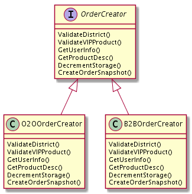

# 5.8 接口和表驱动开发

在Web项目中经常会遇到外部依赖环境的变化，比如：

1. 公司的老存储系统年久失修，现在已经没有人维护了，新的系统上线也没有考虑平滑迁移，但最后通牒已下，要求N天之内迁移完毕。
2. 平台部门的老用户系统年久失修，现在已经没有人维护了，真是悲伤的故事。新系统上线没有考虑兼容老接口，但最后通牒已下，要求N个月之内迁移完毕。
3. 公司的老消息队列人走茶凉，年久失修，新来的技术精英们没有考虑向前兼容，但最后通牒已下，要求半年之内迁移完毕。

嗯，所以你看到了，我们的外部依赖总是为了自己爽而不断地做升级，且不想做向前兼容，然后来给我们下最后通牒。如果我们的部门工作饱和，领导强势，那么有时候也可以倒逼依赖方来做兼容。但世事不一定如人愿，即使我们的领导强势，读者朋友的领导也还是可能认怂的。

我们可以思考一下怎么缓解这个问题。

## 5.8.1 业务系统的发展过程

互联网公司只要可以活过三年，工程方面面临的首要问题就是代码膨胀。系统的代码膨胀之后，可以将系统中与业务本身流程无关的部分做拆解和异步化。什么算是业务无关呢，比如一些统计、反作弊、营销发券、价格计算、用户状态更新等等需求。这些需求往往依赖于主流程的数据，但又只是挂在主流程上的旁支，自成体系。

这时候我们就可以把这些旁支拆解出去，作为独立的系统来部署、开发以及维护。这些旁支流程的时延如若非常敏感，比如用户在界面上点了按钮，需要立刻返回（价格计算、支付），那么需要与主流程系统进行RPC通信，并且在通信失败时，要将结果直接返回给用户。如果时延不敏感，比如抽奖系统，结果稍后公布的这种，或者非实时的统计类系统，那么就没有必要在主流程里为每一套系统做一套RPC流程。我们只要将下游需要的数据打包成一条消息，传入消息队列，之后的事情与主流程一概无关（当然，与用户的后续交互流程还是要做的）。

通过拆解和异步化虽然解决了一部分问题，但并不能解决所有问题。随着业务发展，单一职责的模块也会变得越来越复杂，这是必然的趋势。一件事情本身变的复杂的话，这时候拆解和异步化就不灵了。我们还是要对事情本身进行一定程度的封装抽象。

## 5.8.2 使用函数封装业务流程

最基本的封装过程，我们把相似的行为放在一起，然后打包成一个一个的函数，让自己杂乱无章的代码变成下面这个样子：

```go
func BusinessProcess(ctx context.Context, params Params) (resp, error){
	ValidateLogin()
	ValidateParams()
	AntispamCheck()
	GetPrice()
	CreateOrder()
	UpdateUserStatus()
	NotifyDownstreamSystems()
}
```

不管是多么复杂的业务，系统内的逻辑都是可以分解为`step1 -> step2 -> step3 ...`这样的流程的。

每一个步骤内部也会有复杂的流程，比如：

```go
func CreateOrder() {
	ValidateDistrict()    // 判断是否是地区限定商品
	ValidateVIPProduct()  // 检查是否是只提供给 vip 的商品
	GetUserInfo()         // 从用户系统获取更详细的用户信息
	GetProductDesc()      // 从商品系统中获取商品在该时间点的详细信息
	DecrementStorage()    // 扣减库存
	CreateOrderSnapshot() // 创建订单快照
	return CreateSuccess
}
```

在阅读业务流程代码时，我们只要阅读其函数名就能知晓在该流程中完成了哪些操作，如果需要修改细节，那么就继续深入到每一个业务步骤去看具体的流程。写得稀烂的业务流程代码则会将所有过程都堆积在少数的几个函数中，从而导致几百甚至上千行的函数。这种意大利面条式的代码阅读和维护都会非常痛苦。在开发的过程中，一旦有条件应该立即进行类似上面这种方式的简单封装。

## 5.8.3 使用接口来做抽象

业务发展的早期，是不适宜引入接口（interface）的，很多时候业务流程变化很大，过早引入接口会使业务系统本身增加很多不必要的分层，从而导致每次修改几乎都要全盘否定之前的工作。

当业务发展到一定阶段，主流程稳定之后，就可以适当地使用接口来进行抽象了。这里的稳定，是指主流程的大部分业务步骤已经确定，即使再进行修改，也不会进行大规模的变动，而只是小修小补，或者只是增加或删除少量业务步骤。

如果我们在开发过程中，已经对业务步骤进行了良好的封装，这时候进行接口抽象化就会变的非常容易，伪代码：

```go
// OrderCreator 创建订单流程
type OrderCreator interface {
	ValidateDistrict()    // 判断是否是地区限定商品
	ValidateVIPProduct()  // 检查是否是只提供给 vip 的商品
	GetUserInfo()         // 从用户系统获取更详细的用户信息
	GetProductDesc()      // 从商品系统中获取商品在该时间点的详细信息
	DecrementStorage()    // 扣减库存
	CreateOrderSnapshot() // 创建订单快照
}
```

我们只要把之前写过的步骤函数签名都提到一个接口中，就可以完成抽象了。

在进行抽象之前，我们应该想明白的一点是，引入接口对我们的系统本身是否有意义，这是要按照场景去进行分析的。假如我们的系统只服务一条产品线，并且内部的代码只是针对很具体的场景进行定制化开发，那么引入接口是不会带来任何收益的。至于说是否方便测试，这一点我们会在之后的章节来讲。

如果我们正在做的是平台系统，需要由平台来定义统一的业务流程和业务规范，那么基于接口的抽象就是有意义的。举个例子：



*图 5-19 实现公有的接口*

平台需要服务多条业务线，但数据定义需要统一，所以希望都能走平台定义的流程。作为平台方，我们可以定义一套类似上文的接口，然后要求接入方的业务必须将这些接口都实现。如果接口中有其不需要的步骤，那么只要返回`nil`，或者忽略就好。

在业务进行迭代时，平台的代码是不用修改的，这样我们便把这些接入业务当成了平台代码的插件（plugin）引入进来了。如果没有接口的话，我们会怎么做？

```go
import (
	"sample.com/travelorder"
	"sample.com/marketorder"
)

func CreateOrder() {
	switch businessType {
	case TravelBusiness:
		travelorder.CreateOrder()
	case MarketBusiness:
		marketorder.CreateOrderForMarket()
	default:
		return errors.New("not supported business")
	}
}

func ValidateUser() {
	switch businessType {
	case TravelBusiness:
		travelorder.ValidateUserVIP()
	case MarketBusiness:
		marketorder.ValidateUserRegistered()
	default:
		return errors.New("not supported business")
	}
}

// ...
switch ...
switch ...
switch ...
```

没错，就是无穷无尽的`switch`，和没完没了的垃圾代码。引入了接口之后，我们的`switch`只需要在业务入口做一次。

```go
type BusinessInstance interface {
	ValidateLogin()
	ValidateParams()
	AntispamCheck()
	GetPrice()
	CreateOrder()
	UpdateUserStatus()
	NotifyDownstreamSystems()
}

func entry() {
	var bi BusinessInstance
	switch businessType {
		case TravelBusiness:
			bi = travelorder.New()
		case MarketBusiness:
			bi = marketorder.New()
		default:
			return errors.New("not supported business")
	}
}

func BusinessProcess(bi BusinessInstance) {
	bi.ValidateLogin()
	bi.ValidateParams()
	bi.AntispamCheck()
	bi.GetPrice()
	bi.CreateOrder()
	bi.UpdateUserStatus()
	bi.NotifyDownstreamSystems()
}
```

面向接口编程，不用关心具体的实现。如果对应的业务在迭代中发生了修改，所有的逻辑对平台方来说也是完全透明的。

## 5.8.4 接口的优缺点

Go被人称道的最多的地方是其接口设计的正交性，模块之间不需要知晓相互的存在，A模块定义接口，B模块实现这个接口就可以。如果接口中没有A模块中定义的数据类型，那B模块中甚至都不用`import A`。比如标准库中的`io.Writer`：

```go
type Writer interface {
	Write(p []byte) (n int, err error)
}
```

我们可以在自己的模块中实现`io.Writer`接口：

```go
type MyType struct {}

func (m MyType) Write(p []byte) (n int, err error) {
	return 0, nil
}
```

那么我们就可以把我们自己的`MyType`传给任何使用`io.Writer`作为参数的函数来使用了，比如：

```go
package log

func SetOutput(w io.Writer) {
	output = w
}
```

然后：

```go
package my-business

import "xy.com/log"

func init() {
	log.SetOutput(MyType)
}
```

在`MyType`定义的地方，不需要`import "io"`就可以直接实现 `io.Writer`接口，我们还可以随意地组合很多函数，以实现各种类型的接口，同时接口实现方和接口定义方都不用建立import产生的依赖关系。因此很多人认为Go的这种正交是一种很优秀的设计。

但这种“正交”性也会给我们带来一些麻烦。当我们接手了一个几十万行的系统时，如果看到定义了很多接口，例如订单流程的接口，我们希望能直接找到这些接口都被哪些对象实现了。但直到现在，这个简单的需求也就只有Goland实现了，并且体验尚可。Visual Studio Code则需要对项目进行全局扫描，来看到底有哪些结构体实现了该接口的全部函数。那些显式实现接口的语言，对于IDE的接口查找来说就友好多了。另一方面，我们看到一个结构体，也希望能够立刻知道这个结构体实现了哪些接口，但也有着和前面提到的相同的问题。

虽有不便，接口带给我们的好处也是不言而喻的：一是依赖反转，这是接口在大多数语言中对软件项目所能产生的影响，在Go的正交接口的设计场景下甚至可以去除依赖；二是由编译器来帮助我们在编译期就能检查到类似“未完全实现接口”这样的错误，如果业务未实现某个流程，但又将其实例作为接口强行来使用的话：

```go
package main

type OrderCreator interface {
	ValidateUser()
	CreateOrder()
}

type BookOrderCreator struct{}

func (boc BookOrderCreator) ValidateUser() {}

func createOrder(oc OrderCreator) {
	oc.ValidateUser()
	oc.CreateOrder()
}

func main() {
	createOrder(BookOrderCreator{})
}
```

会报出下述错误。

```shell
# command-line-arguments
./a.go:18:30: cannot use BookOrderCreator literal (type BookOrderCreator) as type OrderCreator in argument to createOrder:
	BookOrderCreator does not implement OrderCreator (missing CreateOrder method)
```

所以接口也可以认为是一种编译期进行检查的保证类型安全的手段。

## 5.8.5 表驱动开发

熟悉开源lint工具的同学应该见到过圈复杂度的说法，在函数中如果有`if`和`switch`的话，会使函数的圈复杂度上升，所以有强迫症的同学即使在入口一个函数中有`switch`，还是想要干掉这个`switch`，有没有什么办法呢？当然有，用表驱动的方式来存储我们需要实例：

```go
func entry() {
	var bi BusinessInstance
	switch businessType {
	case TravelBusiness:
		bi = travelorder.New()
	case MarketBusiness:
		bi = marketorder.New()
	default:
		return errors.New("not supported business")
	}
}
```

可以修改为：

```go
var businessInstanceMap = map[int]BusinessInstance {
	TravelBusiness : travelorder.New(),
	MarketBusiness : marketorder.New(),
}

func entry() {
	bi := businessInstanceMap[businessType]
}
```

表驱动的设计方式，很多设计模式相关的书籍并没有把它作为一种设计模式来讲，但我认为这依然是一种非常重要的帮助我们来简化代码的手段。在日常的开发工作中可以多多思考，哪些不必要的`switch case`可以用一个字典和一行代码就可以轻松搞定。

当然，表驱动也不是缺点，因为需要对输入`key`计算哈希，在性能敏感的场合，需要多加斟酌。
