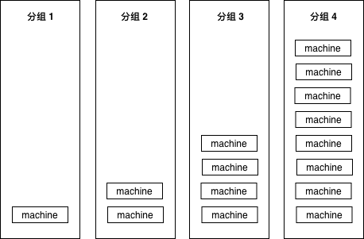
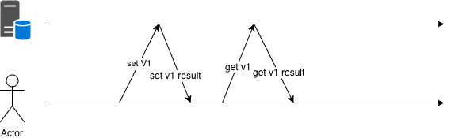
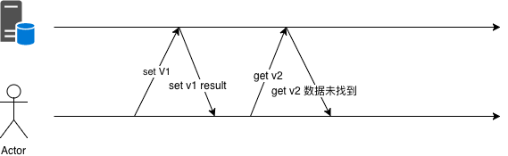

# 5.9 灰度发布和 A/B test

中型的互联网公司往往有着以百万计的用户，而大型互联网公司的系统则可能要服务千万级甚至亿级的用户需求。大型系统的请求流入往往是源源不断的，任何风吹草动，都一定会有最终用户感受得到。例如你的系统在上线途中会拒绝一些上游过来的请求，而这时候依赖你的系统没有做任何容错，那么这个错误就会一直向上抛出，直到触达最终用户。形成一次对用户切切实实的伤害。这种伤害可能是在用户的APP上弹出一个让用户摸不着头脑的诡异字符串，用户只要刷新一下页面就可以忘记这件事。但也可能会让正在心急如焚地和几万竞争对手同时抢夺秒杀商品的用户，因为代码上的小问题，丧失掉了先发优势，与自己蹲了几个月的心仪产品失之交臂。对用户的伤害有多大，取决于你的系统对于你的用户来说有多重要。

不管怎么说，在大型系统中容错是重要的，能够让系统按百分比，分批次到达最终用户，也是很重要的。虽然当今的互联网公司系统，名义上会说自己上线前都经过了充分慎重严格的测试，但就算它们真得做到了，代码的bug总是在所难免的。即使代码没有bug，分布式服务之间的协作也是可能出现“逻辑”上的非技术问题的。

这时候，灰度发布就显得非常重要了，灰度发布也称为金丝雀发布，传说17世纪的英国矿井工人发现金丝雀对瓦斯气体非常敏感，瓦斯达到一定浓度时，金丝雀即会死亡，但金丝雀的致死量瓦斯对人并不致死，因此金丝雀被用来当成他们的瓦斯检测工具。互联网系统的灰度发布一般通过两种方式实现：

1. 通过分批次部署实现灰度发布
2. 通过业务规则进行灰度发布

在对系统的旧功能进行升级迭代时，第一种方式用的比较多。新功能上线时，第二种方式用的比较多。当然，对比较重要的老功能进行较大幅度的修改时，一般也会选择按业务规则来进行发布，因为直接全量开放给所有用户风险实在太大。

## 5.9.1 通过分批次部署实现灰度发布

假如服务部署在15个实例（可能是物理机，也可能是容器）上，我们把这15个实例分为四组，按照先后顺序，分别有1-2-4-8台机器，保证每次扩展时大概都是二倍的关系。



*图 5-20 分组部署*

为什么要用2倍？这样能够保证我们不管有多少台机器，都不会把组划分得太多。例如1024台机器，也就只需要1-2-4-8-16-32-64-128-256-512部署十次就可以全部部署完毕。

这样我们上线最开始影响到的用户在整体用户中占的比例也不大，比如1000台机器的服务，我们上线后如果出现问题，也只影响1/1000的用户。如果10组完全平均分，那一上线立刻就会影响1/10的用户，1/10的业务出问题，那可能对于公司来说就已经是一场不可挽回的事故了。

在上线时，最有效的观察手法是查看程序的错误日志，如果较明显的逻辑错误，一般错误日志的滚动速度都会有肉眼可见的增加。这些错误也可以通过metrics一类的系统上报给公司内的监控系统，所以在上线过程中，也可以通过观察监控曲线，来判断是否有异常发生。

如果有异常情况，首先要做的自然就是回滚了。

## 5.9.2 通过业务规则进行灰度发布

常见的灰度策略有多种，较为简单的需求，例如我们的策略是要按照千分比来发布，那么我们可以用用户id、手机号、用户设备信息，等等，来生成一个简单的哈希值，然后再求模，用伪代码表示一下：

```go
// pass 3/1000
func passed() bool {
	key := hashFunctions(userID) % 1000
	if key <= 2 {
		return true
	}

	return false
}
```

### 5.9.2.1 可选规则

常见的灰度发布系统会有下列规则提供选择：

1. 按城市发布
2. 按概率发布
3. 按百分比发布
4. 按白名单发布
5. 按业务线发布
6. 按UA发布(APP、Web、PC)
7. 按分发渠道发布

因为和公司的业务相关，所以城市、业务线、UA、分发渠道这些都可能会被直接编码在系统里，不过功能其实大同小异。

按白名单发布比较简单，功能上线时，可能我们希望只有公司内部的员工和测试人员可以访问到新功能，会直接把账号、邮箱写入到白名单，拒绝其它任何账号的访问。

按概率发布则是指实现一个简单的函数：

```go
func isTrue() bool {
	return true/false according to the rate provided by user
}
```

其可以按照用户指定的概率返回`true`或者`false`，当然，`true`的概率加`false`的概率应该是100%。这个函数不需要任何输入。

按百分比发布，是指实现下面这样的函数：

```go
func isTrue(phone string) bool {
	if hash of phone matches {
		return true
	}

	return false
}
```

这种情况可以按照指定的百分比，返回对应的`true`和`false`，和上面的单纯按照概率的区别是这里我们需要调用方提供给我们一个输入参数，我们以该输入参数作为源来计算哈希，并以哈希后的结果来求模，并返回结果。这样可以保证同一个用户的返回结果多次调用是一致的，在下面这种场景下，必须使用这种结果可预期的灰度算法，见*图 5-21*所示。



*图 5-21 先set然后马上get*

如果采用随机策略，可能会出现像*图 5-22*这样的问题：



*图 5-22 先set然后马上get*

举个具体的例子，网站的注册环节，可能有两套API，按照用户ID进行灰度，分别是不同的存取逻辑。如果存储时使用了V1版本的API而获取时使用V2版本的API，那么就可能出现用户注册成功后反而返回注册失败消息的诡异问题。

## 5.9.3 如何实现一套灰度发布系统

前面也提到了，提供给用户的接口大概可以分为和业务绑定的简单灰度判断逻辑。以及输入稍微复杂一些的哈希灰度。我们来分别看看怎么实现这样的灰度系统（函数）。

### 5.9.3.1 业务相关的简单灰度

公司内一般都会有公共的城市名字和id的映射关系，如果业务只涉及中国国内，那么城市数量不会特别多，且id可能都在10000范围以内。那么我们只要开辟一个一万大小左右的bool数组，就可以满足需求了：

```go
var cityID2Open = [12000]bool{}

func init() {
	readConfig()
	for i:=0;i<len(cityID2Open);i++ {
		if city i is opened in configs {
			cityID2Open[i] = true
		}
	}
}

func isPassed(cityID int) bool {
	return cityID2Open[cityID]
}
```

如果公司给cityID赋的值比较大，那么我们可以考虑用map来存储映射关系，map的查询比数组稍慢，但扩展会灵活一些：

```go
var cityID2Open = map[int]struct{}{}

func init() {
	readConfig()
	for _, city := range openCities {
		cityID2Open[city] = struct{}{}
	}
}

func isPassed(cityID int) bool {
	if _, ok := cityID2Open[cityID]; ok {
		return true
	}

	return false
}
```

按白名单、按业务线、按UA、按分发渠道发布，本质上和按城市发布是一样的，这里就不再赘述了。

按概率发布稍微特殊一些，不过不考虑输入实现起来也很简单：

```go

func init() {
	rand.Seed(time.Now().UnixNano())
}

// rate 为 0~100
func isPassed(rate int) bool {
	if rate >= 100 {
		return true
	}

	if rate > 0 && rand.Int(100) > rate {
		return true
	}

	return false
}
```

注意初始化种子。

### 5.9.3.2 哈希算法

求哈希可用的算法非常多，比如md5，crc32，sha1等等，但我们这里的目的只是为了给这些数据做个映射，并不想要因为计算哈希消耗过多的cpu，所以现在业界使用较多的算法是murmurhash，下面是我们对这些常见的hash算法的简单benchmark。

下面使用了标准库的md5，sha1和开源的murmur3实现来进行对比。

```go
package main

import (
	"crypto/md5"
	"crypto/sha1"

	"github.com/spaolacci/murmur3"
)

var str = "hello world"

func md5Hash() [16]byte {
	return md5.Sum([]byte(str))
}

func sha1Hash() [20]byte {
	return sha1.Sum([]byte(str))
}

func murmur32() uint32 {
	return murmur3.Sum32([]byte(str))
}

func murmur64() uint64 {
	return murmur3.Sum64([]byte(str))
}
```

为这些算法写一个基准测试：

```go
package main

import "testing"

func BenchmarkMD5(b *testing.B) {
	for i := 0; i < b.N; i++ {
		md5Hash()
	}
}

func BenchmarkSHA1(b *testing.B) {
	for i := 0; i < b.N; i++ {
		sha1Hash()
	}
}

func BenchmarkMurmurHash32(b *testing.B) {
	for i := 0; i < b.N; i++ {
		murmur32()
	}
}

func BenchmarkMurmurHash64(b *testing.B) {
	for i := 0; i < b.N; i++ {
		murmur64()
	}
}

```

然后看看运行效果：

```shell
~/t/g/hash_bench git:master ❯❯❯ go test -bench=.
goos: darwin
goarch: amd64
BenchmarkMD5-4          10000000 180 ns/op
BenchmarkSHA1-4         10000000 211 ns/op
BenchmarkMurmurHash32-4 50000000  25.7 ns/op
BenchmarkMurmurHash64-4 20000000  66.2 ns/op
PASS
ok _/Users/caochunhui/test/go/hash_bench 7.050s
```

可见murmurhash相比其它的算法有三倍以上的性能提升。显然做负载均衡的话，用murmurhash要比md5和sha1都要好，这些年社区里还有另外一些更高效的哈希算法涌现，感兴趣的读者可以自行调研。

### 5.9.3.3 分布是否均匀

对于哈希算法来说，除了性能方面的问题，还要考虑哈希后的值是否分布均匀。如果哈希后的值分布不均匀，那也自然就起不到均匀灰度的效果了。

以murmur3为例，我们先以15810000000开头，造一千万个和手机号类似的数字，然后将计算后的哈希值分十个桶，并观察计数是否均匀：

```go
package main

import (
	"fmt"

	"github.com/spaolacci/murmur3"
)

var bucketSize = 10

func main() {
	var bucketMap = map[uint64]int{}
	for i := 15000000000; i < 15000000000+10000000; i++ {
		hashInt := murmur64(fmt.Sprint(i)) % uint64(bucketSize)
		bucketMap[hashInt]++
	}
	fmt.Println(bucketMap)
}

func murmur64(p string) uint64 {
	return murmur3.Sum64([]byte(p))
}
```

看看执行结果：

```shell
map[7:999475 5:1000359 1:999945 6:1000200 3:1000193 9:1000765 2:1000044 \
4:1000343 8:1000823 0:997853]
```

偏差都在1/100以内，可以接受。读者在调研其它算法，并判断是否可以用来做灰度发布时，也应该从本节中提到的性能和均衡度两方面出发，对其进行考察。
