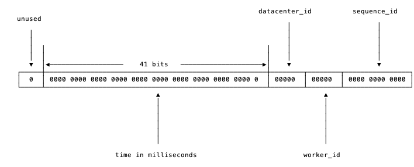
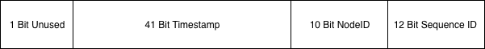
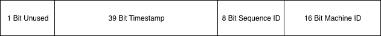

# 6.1 分布式 id 生成器

有时我们需要能够生成类似 MySQL 自增 ID 这样不断增大，同时又不会重复的 id。以支持业务中的高并发场景。比较典型的，电商促销时，短时间内会有大量的订单涌入到系统，比如每秒 10w+。明星出轨时，会有大量热情的粉丝发微博以表心意，同样会在短时间内产生大量的消息。

在插入数据库之前，我们需要给这些消息、订单先打上一个 ID，然后再插入到我们的数据库。对这个 id 的要求是希望其中能带有一些时间信息，这样即使我们后端的系统对消息进行了分库分表，也能够以时间顺序对这些消息进行排序。

Twitter 的 snowflake 算法是这种场景下的一个典型解法。先来看看 snowflake 是怎么一回事，见 *图 6-1*：



*图 6-1 snowflake 中的比特位分布*

首先确定我们的数值是 64 位，int64 类型，被划分为四部分，不含开头的第一个 bit，因为这个 bit 是符号位。用 41 位来表示收到请求时的时间戳，单位为毫秒，然后五位来表示数据中心的 id，然后再五位来表示机器的实例 id，最后是 12 位的循环自增 id（到达 1111,1111,1111 后会归 0）。

这样的机制可以支持我们在同一台机器上，同一毫秒内产生 `2 ^ 12 = 4096` 条消息。一秒共 409.6 万条消息。从值域上来讲完全够用了。

数据中心加上实例 id 共有 10 位，可以支持我们每数据中心部署 32 台机器，所有数据中心共 1024 台实例。

表示 `timestamp` 的 41 位，可以支持我们使用 69 年。当然，我们的时间毫秒计数不会真的从 1970 年开始记，那样我们的系统跑到 `2039/9/7 23:47:35` 就不能用了，所以这里的 `timestamp` 只是相对于某个时间的增量，比如我们的系统上线是 2018-08-01，那么我们可以把这个 timestamp 当作是从 `2018-08-01 00:00:00.000` 的偏移量。

## 6.1.1 worker_id 分配

`timestamp`，`datacenter_id`，`worker_id` 和 `sequence_id` 这四个字段中，`timestamp` 和 `sequence_id` 是由程序在运行期生成的。但 `datacenter_id` 和 `worker_id` 需要我们在部署阶段就能够获取得到，并且一旦程序启动之后，就是不可更改的了（想想，如果可以随意更改，可能被不慎修改，造成最终生成的 id 有冲突）。

一般不同数据中心的机器，会提供对应的获取数据中心 id 的 API，所以 `datacenter_id` 我们可以在部署阶段轻松地获取到。而 worker_id 是我们逻辑上给机器分配的一个 id，这个要怎么办呢？比较简单的想法是由能够提供这种自增 id 功能的工具来支持，比如 MySQL:

```shell
mysql> insert into a (ip) values("10.1.2.101");
Query OK, 1 row affected (0.00 sec)

mysql> select last_insert_id();
+------------------+
| last_insert_id() |
+------------------+
|                2 |
+------------------+
1 row in set (0.00 sec)
```

从 MySQL 中获取到 `worker_id` 之后，就把这个 `worker_id` 直接持久化到本地，以避免每次上线时都需要获取新的 `worker_id`。让单实例的 `worker_id` 可以始终保持不变。

当然，使用 MySQL 相当于给我们简单的 id 生成服务增加了一个外部依赖。依赖越多，我们的服务的可运维性就越差。

考虑到集群中即使有单个 id 生成服务的实例挂了，也就是损失一段时间的一部分 id，所以我们也可以更简单暴力一些，把 `worker_id` 直接写在 worker 的配置中，上线时，由部署脚本完成 `worker_id` 字段替换。

## 6.1.2 开源实例

### 6.1.2.1 标准 snowflake 实现

`github.com/bwmarrin/snowflake` 是一个相当轻量化的 snowflake 的 Go 实现。其文档对各位使用的定义见 *图 6-2* 所示。



*图 6-2 snowflake 库*

和标准的 snowflake 完全一致。使用上比较简单：

```go
package main

import (
	"fmt"
	"os"

	"github.com/bwmarrin/snowflake"
)

func main() {
	n, err := snowflake.NewNode(1)
	if err != nil {
		println(err)
		os.Exit(1)
	}

	for i := 0; i < 3; i++ {
		id := n.Generate()
		fmt.Println("id", id)
		fmt.Println(
			"node:", id.Node(),
			"step:", id.Step(),
			"time:", id.Time(),
			"\n",
		)
	}
}
```

当然，这个库也给我们留好了定制的后路，其中预留了一些可定制字段：

```go
	// Epoch is set to the twitter snowflake epoch of Nov 04 2010 01:42:54 UTC
	// You may customize this to set a different epoch for your application.
	Epoch int64 = 1288834974657

	// Number of bits to use for Node
	// Remember, you have a total 22 bits to share between Node/Step
	NodeBits uint8 = 10

	// Number of bits to use for Step
	// Remember, you have a total 22 bits to share between Node/Step
	StepBits uint8 = 12
```

`Epoch` 就是本节开头讲的起始时间，`NodeBits` 指的是机器编号的位长，`StepBits` 指的是自增序列的位长。

### 6.1.2.2 sonyflake

sonyflake 是 Sony 公司的一个开源项目，基本思路和 snowflake 差不多，不过位分配上稍有不同，见 *图 6-3*：



*图 6-3 sonyflake*

这里的时间只用了 39 个 bit，但时间的单位变成了 10ms，所以理论上比 41 位表示的时间还要久 (174 年)。

`Sequence ID` 和之前的定义一致，`Machine ID` 其实就是节点 id。`sonyflake` 与众不同的地方在于其在启动阶段的配置参数：

```go
func NewSonyflake(st Settings) *Sonyflake
```

`Settings` 数据结构如下：

```go
type Settings struct {
	StartTime      time.Time
	MachineID      func() (uint16, error)
	CheckMachineID func(uint16) bool
}
```

`StartTime` 选项和我们之前的 `Epoch` 差不多，如果不设置的话，默认是从 `2014-09-01 00:00:00 +0000 UTC` 开始。

`MachineID` 可以由用户自定义的函数，如果用户不定义的话，会默认将本机 IP 的低 16 位作为 `machine id`。

`CheckMachineID` 是由用户提供的检查 `MachineID` 是否冲突的函数。这里的设计还是比较巧妙的，如果有另外的中心化存储并支持检查重复的存储，那我们就可以按照自己的想法随意定制这个检查 `MachineID` 是否冲突的逻辑。如果公司有现成的 Redis 集群，那么我们可以很轻松地用 Redis 的集合类型来检查冲突。

```shell
redis 127.0.0.1:6379> SADD base64_encoding_of_last16bits MzI0Mgo=
(integer) 1
redis 127.0.0.1:6379> SADD base64_encoding_of_last16bits MzI0Mgo=
(integer) 0
```

使用起来也比较简单，有一些逻辑简单的函数就略去实现了：

```go
package main

import (
	"fmt"
	"os"
	"time"

	"github.com/sony/sonyflake"
)

func getMachineID() (uint16, error) {
	var machineID uint16
	var err error
	machineID = readMachineIDFromLocalFile()
	if machineID == 0 {
		machineID, err = generateMachineID()
		if err != nil {
			return 0, err
		}
	}

	return machineID, nil
}

func checkMachineID(machineID uint16) bool {
	saddResult, err := saddMachineIDToRedisSet()
	if err != nil || saddResult == 0 {
		return true
	}

	err := saveMachineIDToLocalFile(machineID)
	if err != nil {
		return true
	}

	return false
}

func main() {
	t, _ := time.Parse("2006-01-02", "2018-01-01")
	settings := sonyflake.Settings{
		StartTime:      t,
		MachineID:      getMachineID,
		CheckMachineID: checkMachineID,
	}

	sf := sonyflake.NewSonyflake(settings)
	id, err := sf.NextID()
	if err != nil {
		fmt.Println(err)
		os.Exit(1)
	}

	fmt.Println(id)
}
```
