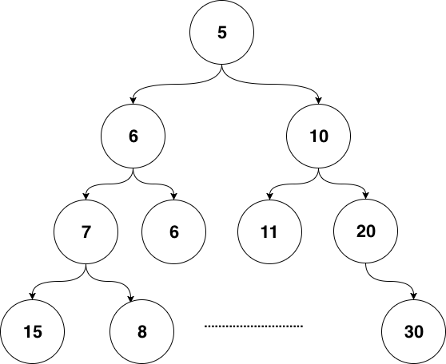
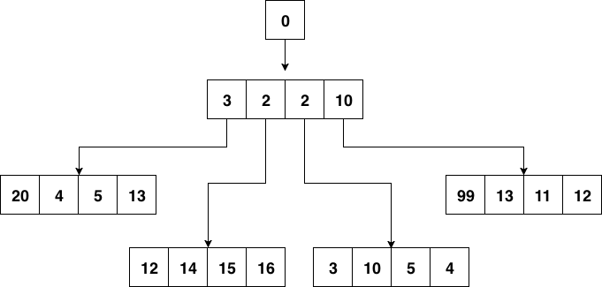
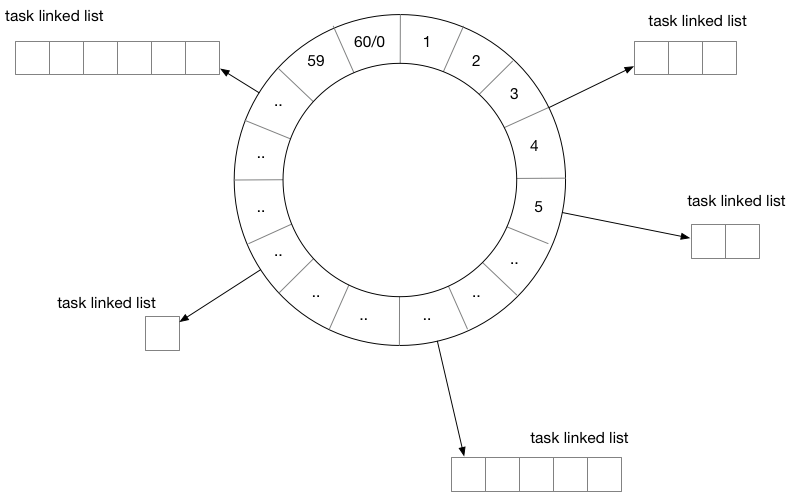
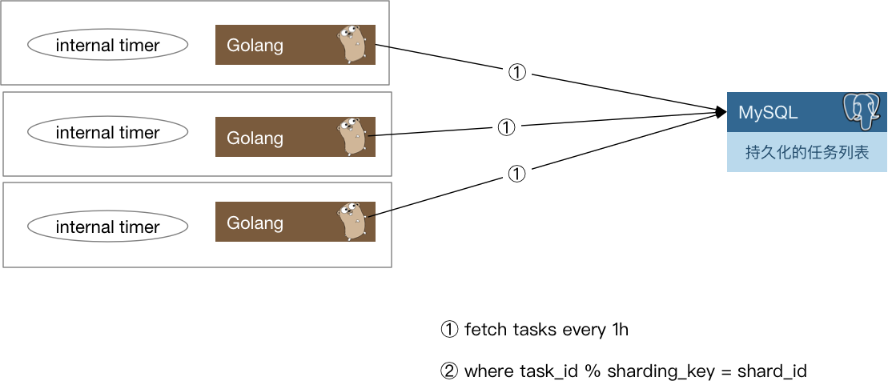
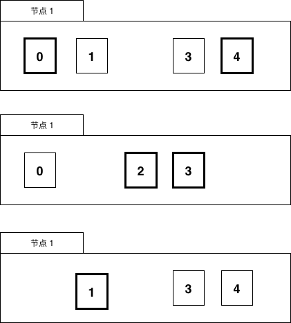
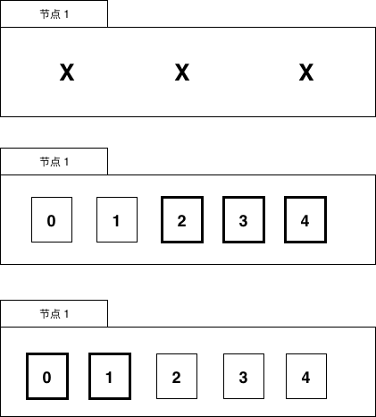

# 6.3 延时任务系统

我们在做系统时，很多时候是处理实时的任务，请求来了马上就处理，然后立刻给用户以反馈。但有时也会遇到非实时的任务，比如确定的时间点发布重要公告。或者需要在用户做了一件事情的X分钟/Y小时后，对其特定动作，比如通知、发券等等。

如果业务规模比较小，有时我们也可以通过数据库配合轮询来对这种任务进行简单处理，但上了规模的公司，自然会寻找更为普适的解决方案来解决这一类问题。

一般有两种思路来解决这个问题：

1. 实现一套类似crontab的分布式定时任务管理系统。
2. 实现一个支持定时发送消息的消息队列。

两种思路进而衍生出了一些不同的系统，但其本质是差不多的。都是需要实现一个定时器（timer）。在单机的场景下定时器其实并不少见，例如我们在和网络库打交道的时候经常会调用`SetReadDeadline()`函数，就是在本地创建了一个定时器，在到达指定的时间后，我们会收到定时器的通知，告诉我们时间已到。这时候如果读取还没有完成的话，就可以认为发生了网络问题，从而中断读取。

下面我们从定时器开始，探究延时任务系统的实现。

## 6.3.1 定时器的实现

定时器（timer）的实现在工业界已经是有解的问题了。常见的就是时间堆和时间轮。

### 6.3.1.1 时间堆

最常见的时间堆一般用小顶堆实现，小顶堆其实就是一种特殊的二叉树，见*图6-4*

*图 6-4 二叉堆结构*

小顶堆的好处是什么呢？对于定时器来说，如果堆顶元素比当前的时间还要大，那么说明堆内所有元素都比当前时间大。进而说明这个时刻我们还没有必要对时间堆进行任何处理。定时检查的时间复杂度是`O(1)`。

当我们发现堆顶的元素小于当前时间时，那么说明可能已经有一批事件已经开始过期了，这时进行正常的弹出和堆调整操作就好。每一次堆调整的时间复杂度都是`O(LgN)`。

Go自身的内置定时器就是用时间堆来实现的，不过并没有使用二叉堆，而是使用了扁平一些的四叉堆。在最近的版本中，还加了一些优化，我们先不说优化，先来看看四叉的小顶堆长什么样：

*图 6-5 四叉堆结构*

小顶堆的性质，父节点比其4个子节点都小，子节点之间没有特别的大小关系要求。

四叉堆中元素超时和堆调整与二叉堆没有什么本质区别。

### 6.3.1.2 时间轮

*图 6-6 时间轮*

用时间轮来实现定时器时，我们需要定义每一个格子的“刻度”，可以将时间轮想像成一个时钟，中心有秒针顺时针转动。每次转动到一个刻度时，我们就需要去查看该刻度挂载的任务列表是否有已经到期的任务。

从结构上来讲，时间轮和哈希表很相似，如果我们把哈希算法定义为：触发时间%时间轮元素大小。那么这就是一个简单的哈希表。在哈希冲突时，采用链表挂载哈希冲突的定时器。

除了这种单层时间轮，业界也有一些时间轮采用多层实现，这里就不再赘述了。

## 6.3.2 任务分发

有了基本的定时器实现方案，如果我们开发的是单机系统，那么就可以撸起袖子开干了，不过本章我们讨论的是分布式，距离“分布式”还稍微有一些距离。

我们还需要把这些“定时”或是“延时”（本质也是定时）任务分发出去。下面是一种思路：

*图 6-7 分布式任务分发*

每一个实例每隔一小时，会去数据库里把下一个小时需要处理的定时任务捞出来，捞取的时候只要取那些`task_id % shard_count = shard_id`的那些任务即可。

当这些定时任务被触发之后需要通知用户侧，有两种思路：

1. 将任务被触发的信息封装为一条消息，发往消息队列，由用户侧对消息队列进行监听。
2. 对用户预先配置的回调函数进行调用。

两种方案各有优缺点，如果采用1，那么如果消息队列出故障会导致整个系统不可用，当然，现在的消息队列一般也会有自身的高可用方案，大多数时候我们不用担心这个问题。其次一般业务流程中间走消息队列的话会导致延时增加，定时任务若必须在触发后的几十毫秒到几百毫秒内完成，那么采用消息队列就会有一定的风险。如果采用2，会加重定时任务系统的负担。我们知道，单机的定时器执行时最害怕的就是回调函数执行时间过长，这样会阻塞后续的任务执行。在分布式场景下，这种忧虑依然是适用的。一个不负责任的业务回调可能就会直接拖垮整个定时任务系统。所以我们还要考虑在回调的基础上增加经过测试的超时时间设置，并且对由用户填入的超时时间做慎重的审核。

## 6.3.3 数据再平衡和幂等考量

当我们的任务执行集群有机器故障时，需要对任务进行重新分配。按照之前的求模策略，对这台机器还没有处理的任务进行重新分配就比较麻烦了。如果是实际运行的线上系统，还要在故障时的任务平衡方面花更多的心思。

下面给出一种思路：

我们可以参考Elasticsearch的数据分布设计，每份任务数据都有多个副本，这里假设两副本，如*图 6-8*所示：

*图 6-8 任务数据分布*

一份数据虽然有两个持有者，但持有者持有的副本会进行区分，比如持有的是主副本还是非主副本，主副本在图中为摸黑部分，非主副本为正常线条。

一个任务只会在持有主副本的节点上被执行。

当有机器故障时，任务数据需要进行数据再平衡的工作，比如节点1挂了，见*图 6-9*。

*图 6-9 故障时数据分布*

节点1的数据会被迁移到节点2和节点3上。

当然，也可以用稍微复杂一些的思路，比如对集群中的节点进行角色划分，由协调节点来做这种故障时的任务重新分配工作，考虑到高可用，协调节点可能也需要有1至2个备用节点以防不测。

之前提到我们会用消息队列触发对用户的通知，在使用消息队列时，很多队列是不支持`exactly once`的语义的，这种情况下我们需要让用户自己来负责消息的去重或者消费的幂等处理。
