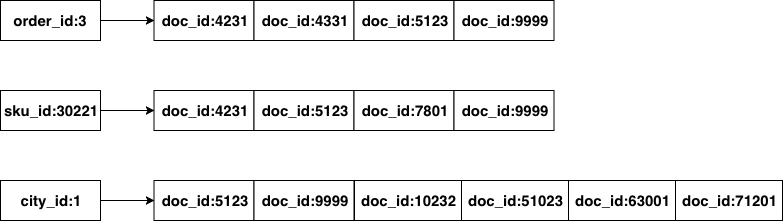
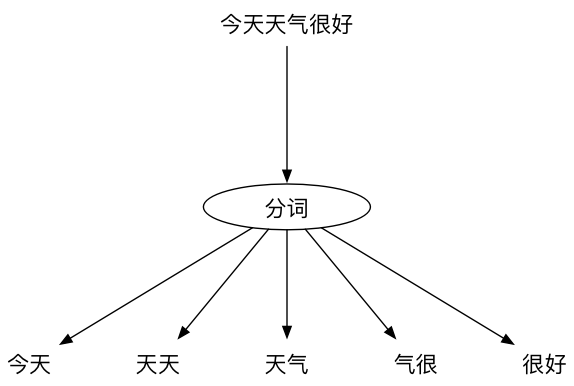
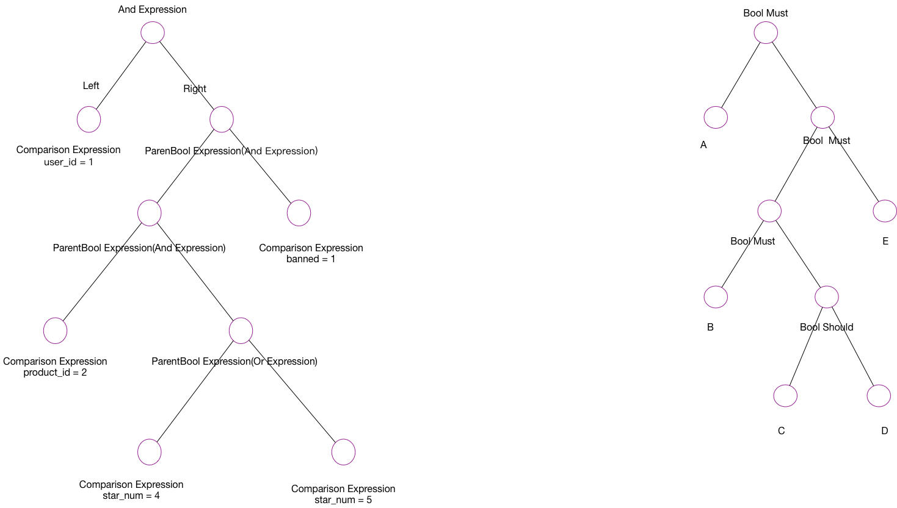
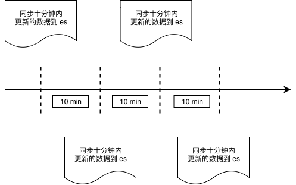
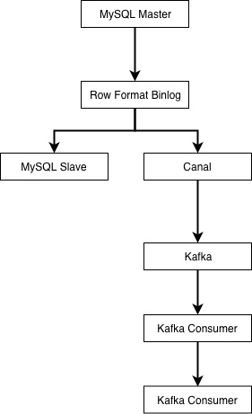

# 6.4 分布式搜索引擎

在Web一章中，我们提到MySQL很脆弱。数据库系统本身要保证实时和强一致性，所以其功能设计上都是为了满足这种一致性需求。比如write ahead log的设计，基于B+树实现的索引和数据组织，以及基于MVCC实现的事务等等。

关系型数据库一般被用于实现OLTP系统，所谓OLTP，援引wikipedia:

> 在线交易处理（OLTP, Online transaction processing）是指透过信息系统、电脑网络及数据库，以线上交易的方式处理一般即时性的作业数据，和更早期传统数据库系统大量批量的作业方式并不相同。OLTP通常被运用于自动化的数据处理工作，如订单输入、金融业务…等反复性的日常性交易活动。和其相对的是属于决策分析层次的联机分析处理（OLAP）。

在互联网的业务场景中，也有一些实时性要求不高(可以接受多秒的延迟)，但是查询复杂性却很高的场景。举个例子，在电商的WMS系统中，或者在大多数业务场景丰富的CRM或者客服系统中，可能需要提供几十个字段的随意组合查询功能。这种系统的数据维度天生众多，比如一个电商的WMS中对一件货物的描述，可能有下面这些字段：

> 仓库id，入库时间，库位分区id，储存货架id，入库操作员id，出库操作员id，库存数量，过期时间，SKU类型，产品品牌，产品分类，内件数量

除了上述信息，如果商品在仓库内有流转。可能还有有关联的流程 id，当前的流转状态等等。

想像一下，如果我们所经营的是一个大型电商，每天有千万级别的订单，那么在这个数据库中查询和建立合适的索引都是一件非常难的事情。

在CRM或客服类系统中，常常有根据关键字进行搜索的需求，大型互联网公司每天会接收数以万计的用户投诉。而考虑到事件溯源，用户的投诉至少要存2~3年。又是千万级甚至上亿的数据。根据关键字进行一次like查询，可能整个MySQL就直接挂掉了。

这时候我们就需要搜索引擎来救场了。

## 搜索引擎

Elasticsearch是开源分布式搜索引擎的霸主，其依赖于Lucene实现，在部署和运维方面做了很多优化。当今搭建一个分布式搜索引擎比起Sphinx的时代已经是容易很多很多了。只要简单配置客户端IP和端口就可以了。

### 倒排列表

虽然es是针对搜索场景来定制的，但如前文所言，实际应用中常常用es来作为database来使用，就是因为倒排列表的特性。可以用比较朴素的观点来理解倒排索引：



*图 6-10 倒排列表*

对Elasticsearch中的数据进行查询时，本质就是求多个排好序的序列求交集。非数值类型字段涉及到分词问题，大多数内部使用场景下，我们可以直接使用默认的bi-gram分词。什么是bi-gram分词呢：

即将所有`Ti`和`T(i+1)`组成一个词（在Elasticsearch中叫term），然后再编排其倒排列表，这样我们的倒排列表大概就是这样的：



*图 6-11 “今天天气很好”的分词结果*

当用户搜索'天气很好'时，其实就是求：天气、气很、很好三组倒排列表的交集，但这里的相等判断逻辑有些特殊，用伪代码表示一下：

```go
func equal() {
	if postEntry.docID of '天气' == postEntry.docID of '气很' &&
		postEntry.offset + 1 of '天气' == postEntry.offset of '气很' {
			return true
	}

	if postEntry.docID of '气很' == postEntry.docID of '很好' &&
		postEntry.offset + 1 of '气很' == postEntry.offset of '很好' {
		return true
	}

	if postEntry.docID of '天气' == postEntry.docID of '很好' &&
		postEntry.offset + 2 of '天气' == postEntry.offset of '很好' {
		return true
	}

	return false
}
```

多个有序列表求交集的时间复杂度是：`O(N * M)`，N为给定列表当中元素数最小的集合，M为给定列表的个数。

在整个算法中起决定作用的一是最短的倒排列表的长度，其次是词数总和，一般词数不会很大（想像一下，你会在搜索引擎里输入几百字来搜索么？），所以起决定性作用的，一般是所有倒排列表中，最短的那一个的长度。

因此，文档总数很多的情况下，搜索词的倒排列表最短的那一个不长时，搜索速度也是很快的。如果用关系型数据库，那就需要按照索引（如果有的话）来慢慢扫描了。

### 查询 DSL

es定义了一套查询DSL，当我们把es当数据库使用时，需要用到其bool查询。举个例子：

```json
{
  "query": {
    "bool": {
      "must": [
        {
          "match": {
            "field_1": {
              "query": "1",
              "type": "phrase"
            }
          }
        },
        {
          "match": {
            "field_2": {
              "query": "2",
              "type": "phrase"
            }
          }
        },
        {
          "match": {
            "field_3": {
              "query": "3",
              "type": "phrase"
            }
          }
        },
        {
          "match": {
            "field_4": {
              "query": "4",
              "type": "phrase"
            }
          }
        }
      ]
    }
  },
  "from": 0,
  "size": 1
}
```

看起来比较麻烦，但表达的意思很简单：

```go
if field_1 == 1 && field_2 == 2 && field_3 == 3 && field_4 == 4 {
    return true
}
```

用bool should query可以表示or的逻辑：

```json
{
  "query": {
    "bool": {
      "should": [
        {
          "match": {
            "field_1": {
              "query": "1",
              "type": "phrase"
            }
          }
        },
        {
          "match": {
            "field_2": {
              "query": "3",
              "type": "phrase"
            }
          }
        }
      ]
    }
  },
  "from": 0,
  "size": 1
}
```

这里表示的是类似：

```go
if field_1 == 1 || field_2 == 2 {
	return true
}
```

这些Go代码里`if`后面跟着的表达式在编程语言中有专有名词来表达`Boolean Expression`：

```go
4 > 1
5 == 2
3 < i && x > 10
```

es的`Bool Query`方案，就是用json来表达了这种程序语言中的Boolean Expression，为什么可以这么做呢？因为json本身是可以表达树形结构的，我们的程序代码在被编译器parse之后，也会变成AST，而AST抽象语法树，顾名思义，就是树形结构。理论上json能够完备地表达一段程序代码被parse之后的结果。这里的Boolean Expression被编译器Parse之后也会生成差不多的树形结构，而且只是整个编译器实现的一个很小的子集。

### 基于client SDK做开发

初始化：

```go
// 选用 elastic 版本时
// 注意与自己使用的 elasticsearch 要对应
import (
	elastic "gopkg.in/olivere/elastic.v3"
)

var esClient *elastic.Client

func initElasticsearchClient(host string, port string) {
	var err error
	esClient, err = elastic.NewClient(
		elastic.SetURL(fmt.Sprintf("http://%s:%s", host, port)),
		elastic.SetMaxRetries(3),
	)

	if err != nil {
		// log error
	}
}
```

插入：

```go
func insertDocument(db string, table string, obj map[string]interface{}) {

	id := obj["id"]

	var indexName, typeName string
	// 数据库中的 database/table 概念，可以简单映射到 es 的 index 和 type
	// 不过需要注意，因为 es 中的 _type 本质上只是 document 的一个字段
	// 所以单个 index 内容过多会导致性能问题
	// 在新版本中 type 已经废弃
	// 为了让不同表的数据落入不同的 index，这里我们用 table+name 作为 index 的名字
	indexName = fmt.Sprintf("%v_%v", db, table)
	typeName = table

	// 正常情况
	res, err := esClient.Index().Index(indexName).Type(typeName).Id(id).BodyJson(obj).Do()
	if err != nil {
		// handle error
	} else {
		// insert success
	}
}
```

获取：

```go
func query(indexName string, typeName string) (*elastic.SearchResult, error) {
	// 通过 bool must 和 bool should 添加 bool 查询条件
	q := elastic.NewBoolQuery().Must(elastic.NewMatchPhraseQuery("id", 1),
	elastic.NewBoolQuery().Must(elastic.NewMatchPhraseQuery("male", "m")))

	q = q.Should(
		elastic.NewMatchPhraseQuery("name", "alex"),
		elastic.NewMatchPhraseQuery("name", "xargin"),
	)

	searchService := esClient.Search(indexName).Type(typeName)
	res, err := searchService.Query(q).Do()
	if err != nil {
		// log error
		return nil, err
	}

	return res, nil
}
```

删除：

```go
func deleteDocument(
	indexName string, typeName string, obj map[string]interface{},
) {
	id := obj["id"]

	res, err := esClient.Delete().Index(indexName).Type(typeName).Id(id).Do()
	if err != nil {
		// handle error
	} else {
		// delete success
	}
}
```

因为Lucene的性质，本质上搜索引擎内的数据是不可变的，所以如果要对文档进行更新，Lucene内部是按照id进行完全覆盖(本质是取同一 id 最新的segment中的数据)的操作，所以与插入的情况是一样的。

使用es作为数据库使用时，需要注意，因为es有索引合并的操作，所以数据插入到es中到可以查询的到需要一段时间（由es的refresh_interval决定）。所以千万不要把es当成强一致的关系型数据库来使用。

### 将 sql 转换为 DSL

比如我们有一段bool表达式，`user_id = 1 and (product_id = 1 and (star_num = 4 or star_num = 5) and banned = 1)`，写成SQL是如下形式：

```sql
select * from xxx where user_id = 1 and (
	product_id = 1 and (star_num = 4 or star_num = 5) and banned = 1
)
```

写成es的DSL是如下形式：

```json
{
  "query": {
    "bool": {
      "must": [
        {
          "match": {
            "user_id": {
              "query": "1",
              "type": "phrase"
            }
          }
        },
        {
          "match": {
            "product_id": {
              "query": "1",
              "type": "phrase"
            }
          }
        },
        {
          "bool": {
            "should": [
              {
                "match": {
                  "star_num": {
                    "query": "4",
                    "type": "phrase"
                  }
                }
              },
              {
                "match": {
                  "star_num": {
                    "query": "5",
                    "type": "phrase"
                  }
                }
              }
            ]
          }
        },
        {
          "match": {
            "banned": {
              "query": "1",
              "type": "phrase"
            }
          }
        }
      ]
    }
  },
  "from": 0,
  "size": 1
}
```

es的DSL虽然很好理解，但是手写起来非常费劲。前面提供了基于SDK的方式来写，但也不足够灵活。

SQL的where部分就是boolean expression。我们之前提到过，这种bool表达式在被解析之后，和es的DSL的结构长得差不多，我们能不能直接通过这种“差不多”的猜测来直接帮我们把SQL转换成DSL呢？

当然可以，我们把SQL的where被Parse之后的结构和es的DSL的结构做个对比：



*图 6-12 AST和DSL之间的对应关系*

既然结构上完全一致，逻辑上我们就可以相互转换。我们以广度优先对AST树进行遍历，然后将二元表达式转换成json字符串，再拼装起来就可以了，限于篇幅，本文中就不给出示例了，读者朋友可以查看：

> github.com/cch123/elasticsql

来学习具体的实现。

## 异构数据同步

在实际应用中，我们很少直接向搜索引擎中写入数据。更为常见的方式是，将MySQL或其它关系型数据中的数据同步到搜索引擎中。而搜索引擎的使用方只能对数据进行查询，无法进行修改和删除。

常见的同步方案有两种：

### 通过时间戳进行增量数据同步



*图 6-13 基于时间戳的数据同步*

这种同步方式与业务强绑定，例如WMS系统中的出库单，我们并不需要非常实时，稍微有延迟也可以接受，那么我们可以每分钟从MySQL的出库单表中，把最近十分钟创建的所有出库单取出，批量存入es中，取数据的操作需要执行的逻辑可以表达为下面的SQL：

```sql
select * from wms_orders where update_time >= date_sub(now(), interval 10 minute);
```

当然，考虑到边界情况，我们可以让这个时间段的数据与前一次的有一些重叠：

```sql
select * from wms_orders where update_time >= date_sub(
	now(), interval 11 minute
);
```

取最近11分钟有变动的数据覆盖更新到es中。这种方案的缺点显而易见，我们必须要求业务数据严格遵守一定的规范。比如这里的，必须要有update_time字段，并且每次创建和更新都要保证该字段有正确的时间值。否则我们的同步逻辑就会丢失数据。

### 通过 binlog 进行数据同步



*图 6-13 基于binlog的数据同步*

业界使用较多的是阿里开源的Canal，来进行binlog解析与同步。canal会伪装成MySQL的从库，然后解析好行格式的binlog，再以更容易解析的格式（例如json）发送到消息队列。

由下游的Kafka消费者负责把上游数据表的自增主键作为es的文档的id进行写入，这样可以保证每次接收到binlog时，对应id的数据都被覆盖更新为最新。MySQL的Row格式的binlog会将每条记录的所有字段都提供给下游，所以在向异构数据目标同步数据时，不需要考虑数据是插入还是更新，只要一律按id进行覆盖即可。

这种模式同样需要业务遵守一条数据表规范，即表中必须有唯一主键id来保证我们进入es的数据不会发生重复。一旦不遵守该规范，那么就会在同步时导致数据重复。当然，你也可以为每一张需要的表去定制消费者的逻辑，这就不是通用系统讨论的范畴了。
