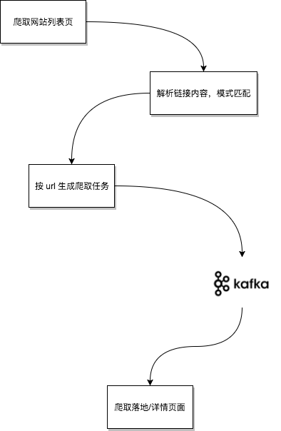
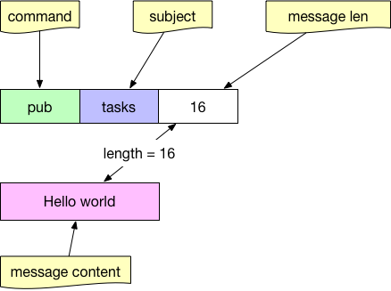
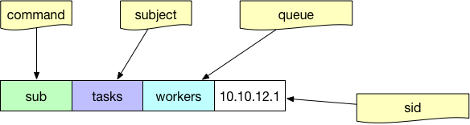

# 6.7 分布式爬虫

互联网时代的信息爆炸是很多人倍感头痛的问题，应接不暇的新闻、信息、视频，无孔不入地侵占着我们的碎片时间。但另一方面，在我们真正需要数据的时候，却感觉数据并不是那么容易获取的。比如我们想要分析现在人在讨论些什么，关心些什么。甚至有时候，可能我们只是暂时没有时间去一一阅览心仪的小说，但又想能用技术手段把它们存在自己的资料库里。哪怕是几个月或一年后再来回顾。再或者我们想要把互联网上这些稍纵即逝的有用信息保存起来，例如某个非常小的论坛中聚集的同好们的高质量讨论，在未来某个时刻，即使这些小众的聚集区无以为继时，依然能让我们从硬盘中翻出当初珍贵的观点来。

除去情怀需求，互联网上有大量珍贵的开放资料，近年来深度学习如雨后春笋一般火热起来，但机器学习很多时候并不是苦于我的模型是否建立得合适，我的参数是否调整得正确，而是苦于最初的起步阶段：没有数据。

作为收集数据的前置工作，有能力去写一个简单的或者复杂的爬虫，对于我们来说依然非常重要。

## 基于 colly 的单机爬虫

有很多程序员比较喜欢在 v2ex 上讨论问题，发表观点，有时候可能懒癌发作，我们希望能直接命令行爬到 v2ex 在 Go tag 下的新贴，只要简单写一个爬虫即可。

《Go 语言编程》一书给出了简单的爬虫示例，经过了多年的发展，现在使用 Go 语言写一个网站的爬虫要更加方便，比如用 colly 来实现爬取 v2ex 前十页内容：

```go
package main

import (
    "fmt"
    "regexp"
    "time"

    "github.com/gocolly/colly"
)

var visited = map[string]bool{}

func main() {
    // Instantiate default collector
    c := colly.NewCollector(
        colly.AllowedDomains("www.v2ex.com"),
        colly.MaxDepth(1),
    )

    detailRegex, _ := regexp.Compile(`/go/go\?p=\d+$`)
    listRegex, _ := regexp.Compile(`/t/\d+#\w+`)

    // On every a element which has href attribute call callback
    c.OnHTML("a[href]", func(e *colly.HTMLElement) {
        link := e.Attr("href")

        // 已访问过的详情页或列表页，跳过
        if visited[link] && (detailRegex.Match([]byte(link)) || listRegex.Match([]byte(link))) {
            return
        }

        // 匹配下列两种 url 模式的，才去 visit
        // https://www.v2ex.com/go/go?p=2
        // https://www.v2ex.com/t/472945#reply3
        if !detailRegex.Match([]byte(link)) && !listRegex.Match([]byte(link)) {
            println("not match", link)
            return
        }
        time.Sleep(time.Second)
        println("match", link)

        visited[link] = true

        time.Sleep(time.Millisecond * 2)
        c.Visit(e.Request.AbsoluteURL(link))
    })

    err := c.Visit("https://www.v2ex.com/go/go")
    if err != nil {
        fmt.Println(err)
    }
}

```

## 分布式爬虫

想像一下，你们的信息分析系统运行非常之快。获取信息的速度成为了瓶颈，虽然可以用上 Go 语言所有优秀的并发特性，将单机的 CPU 和网络带宽都用满，但还是希望能够加快爬虫的爬取速度。在很多场景下，速度是有意义的：

1. 对于价格战期间的电商们来说，希望能够在对手价格变动后第一时间获取到其最新价格，再靠机器自动调整本家的商品价格。
2. 对于类似头条之类的 feed 流业务，信息的时效性也非常重要。如果我们慢吞吞地爬到的新闻是昨天的新闻，那对于用户来说就没有任何意义。

所以我们需要分布式爬虫。从本质上来讲，分布式爬虫是一套任务分发和执行系统。而常见的任务分发，因为上下游存在速度不匹配问题，必然要借助消息队列。



上游的主要工作是根据预先配置好的起点来爬取所有的目标“列表页”，列表页的 html 内容中会包含有所有详情页的链接。详情页的数量一般是列表页的 10~100 倍，所以我们将这些详情页链接作为“任务”内容，通过 mq 分发出去。

针对页面爬取来说，在执行时是否偶尔会有重复其实不太重要，因为任务结果是幂等的(这里我们只爬页面内容，不考虑评论部分)。

本节我们来简单实现一个基于消息队列的爬虫，本节我们使用 nats 来做任务分发。实际开发中，应该针对自己的业务对消息本身的可靠性要求和公司的基础架构组件情况进行选型。

### nats 简介

nats 是 Go 实现的一个高性能分布式消息队列，适用于高并发高吞吐量的消息分发场景。早期的 nats 以速度为重，没有支持持久化。从 16 年开始，nats 通过 nats-streaming 支持基于日志的持久化，以及可靠的消息传输。为了演示方便，我们本节中只使用 nats。

nats 的服务端项目是 gnatsd，客户端与 gnatsd 的通信方式为基于 tcp 的文本协议，非常简单：

向 subject 为 task 发消息：



以 workers 的 queue 从 tasks subject 订阅消息：



其中的 queue 参数是可选的，如果希望在分布式的消费端进行任务的负载均衡，而不是所有人都收到同样的消息，那么就要给消费端指定相同的 queue 名字。

#### 基本消息生产

生产消息只要指定 subject 即可：

```go
nc, err := nats.Connect(nats.DefaultURL)
if err != nil {
    // log error
    return
}

// 指定 subject 为 tasks，消息内容随意
err = nc.Publish("tasks", []byte("your task content"))

nc.Flush()
```

#### 基本消息消费

直接使用 nats 的 subscribe api 并不能达到任务分发的目的，因为 pub sub 本身是广播性质的。所有消费者都会收到完全一样的所有消息。

除了普通的 subscribe 之外，nats 还提供了 queue subscribe 的功能。只要提供一个 queue group 名字(类似 kafka 中的 consumer group)，即可均衡地将任务分发给消费者。

```go
nc, err := nats.Connect(nats.DefaultURL)
if err != nil {
    // log error
    return
}

// queue subscribe 相当于在消费者之间进行任务分发的分支均衡
// 前提是所有消费者都使用 workers 这个 queue
// nats 中的 queue 概念上类似于 kafka 中的 consumer group
sub, err := nc.QueueSubscribeSync("tasks", "workers")
if err != nil {
    // log error
    return
}

var msg *nats.Msg
for {
    msg, err = sub.NextMsg(time.Hour * 10000)
    if err != nil {
        // log error
        break
    }
    // 正确地消费到了消息
    // 可用 nats.Msg 对象处理任务
}
```

#### 结合 colly 的消息生产

我们为每一个网站定制一个对应的 collector，并设置相应的规则，比如 v2ex，v2fx(虚构的)，再用简单的工厂方法来将该 collector 和其 host 对应起来：

```go
package main

import (
    "fmt"
    "net/url"

    "github.com/gocolly/colly"
)

var domain2Collector = map[string]*colly.Collector{}
var nc *nats.Conn
var maxDepth = 10
var natsURL = "nats://localhost:4222"

func factory(urlStr string) *colly.Collector {
    u, _ := url.Parse(urlStr)
    return domain2Collector[u.Host]
}

func initV2exCollector() *colly.Collector {
    c := colly.NewCollector(
        colly.AllowedDomains("www.v2ex.com"),
        colly.MaxDepth(maxDepth),
    )

    c.OnResponse(func(resp *colly.Response) {
        // 做一些爬完之后的善后工作
        // 比如页面已爬完的确认存进 MySQL
    })

    c.OnHTML("a[href]", func(e *colly.HTMLElement) {
        // 基本的反爬虫策略
        time.Sleep(time.Second * 2)

        // TODO, 正则 match 列表页的话，就 visit
        // TODO, 正则 match 落地页的话，就发消息队列
        c.Visit(e.Request.AbsoluteURL(link))
    })
    return c
}

func initV2fxCollector() *colly.Collector {
    c := colly.NewCollector(
        colly.AllowedDomains("www.v2fx.com"),
        colly.MaxDepth(maxDepth),
    )

    c.OnHTML("a[href]", func(e *colly.HTMLElement) {
    })

    return c
}

func init() {
    domain2Collector["www.v2ex.com"] = initV2exCollector()
    domain2Collector["www.v2fx.com"] = initV2fxCollector()

    var err error
    nc, err = nats.Connect(natsURL)
    if err != nil {
        // log fatal
        os.Exit(1)
    }
}

func main() {
    urls := []string{"https://www.v2ex.com", "https://www.v2fx.com"}
    for _, url := range urls {
        instance := factory(url)
        instance.Visit(url)
    }
}

```

#### 结合 colly 的消息消费

```go
package main

import (
    "fmt"
    "net/url"

    "github.com/gocolly/colly"
)

var domain2Collector = map[string]*colly.Collector{}
var nc *nats.Conn
var maxDepth = 10
var natsURL = "nats://localhost:4222"

func factory(urlStr string) *colly.Collector {
    u, _ := url.Parse(urlStr)
    return domain2Collector[u.Host]
}

func initV2exCollector() *colly.Collector {
    c := colly.NewCollector(
        colly.AllowedDomains("www.v2ex.com"),
        colly.MaxDepth(maxDepth),
    )

    return c
}

func initV2fxCollector() *colly.Collector {
    c := colly.NewCollector(
        colly.AllowedDomains("www.v2fx.com"),
        colly.MaxDepth(maxDepth),
    )

    return c
}

func init() {
    domain2Collector["www.v2ex.com"] = initV2exCollector()
    domain2Collector["www.v2fx.com"] = initV2fxCollector()

    var err error
    nc, err = nats.Connect(natsURL)
    if err != nil {
        // log fatal
        os.Exit(1)
    }
}

func startConsumer() {
    nc, err := nats.Connect(nats.DefaultURL)
    if err != nil {
        // log error
        return
    }

    sub, err := nc.QueueSubscribeSync("tasks", "workers")
    if err != nil {
        // log error
        return
    }

    var msg *nats.Msg
    for {
        msg, err = sub.NextMsg(time.Hour * 10000)
        if err != nil {
            // log error
            break
        }

        urlStr := string(msg.Data)
        ins := factory(urlStr)
        // 因为最下游拿到的一定是对应网站的落地页
        // 所以不用进行多余的判断了，直接爬内容即可
        ins.Visit(urlStr)
    }
}

func main() {
    startConsumer()
}

```

从代码层面上来讲，这里的生产者和消费者其实本质上差不多。如果日后我们要灵活地支持增加、减少各种网站的爬取的话，应该思考如何将这些爬虫的策略、参数尽量地配置化。

在本章的分布式配置一节中已经讲了一些配置系统的使用，读者可以自行进行尝试，这里就不再赘述了。
