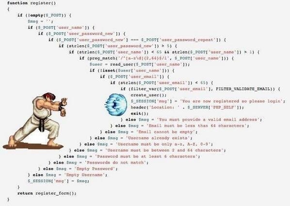

# 6.4. validator 请求校验

社区里曾经有人用这张图来嘲笑 PHP：



实际上这是一个语言无关的场景，需要进行字段校验的情况有很多，web 系统的 Form/json 提交只是一个典型的例子。我们用 go 来写一个类似上图的校验 demo。然后研究怎么一步步对其进行改进。假设我们的数据已经通过某个 binding 库绑定到了具体的 struct 上。

```go
```
