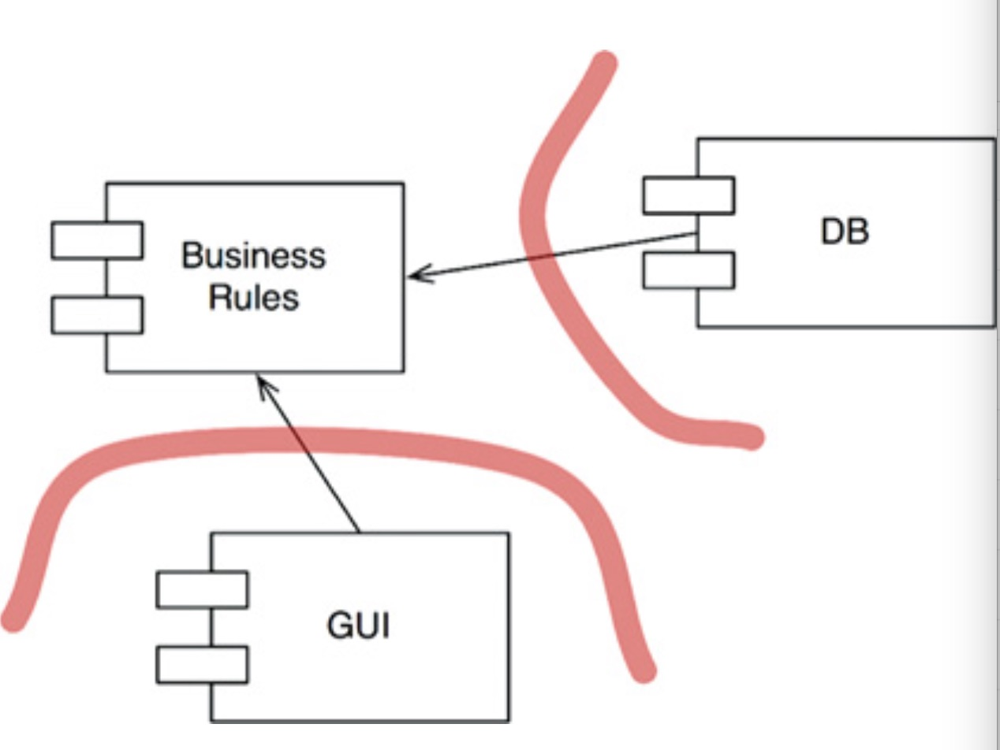

# 6.8. Protocol-free 协议无关的服务入口

我们在之前的小节中看到了如何编写一个 thrift/grpc 协议的服务。在更早的小节中，我们看到了如何编写一个 http 的服务。

如果对于我们的服务模块，提出了更进一步的要求，想要同时支持 http 和 thrift 协议。要怎么办。

在 Uncle Bob 的 《Clean Architecture》 中对插件化架构(plugin architecture) 的阐释能够给我们一些启示。我们先来看看什么是“插件化架构”。



上面这张图比较典型。 简单地来说，我们在 Business Rules 这一层定义了一些 interface，例如我们需要对数据进行存储，那么就有可能定义下面这样的接口：

```go
type RecordStore interface {
    func Save(r MyRecord) error
}
```

通过在业务逻辑层定义 interface 来对业务逻辑进行一定的保护。这样在周边的代码发生变动时，不会对业务逻辑产生任何影响。比较典型的应用，例如你们公司的服务原来是 C/S 架构，在 web 2.0 时代突然流行起了 B/S 架构，然后在移动互联网的浪潮下又开始流行 C/S 或者一些 hybrid app 架构，但是这些变化对于后端程序来说，大多数的代码应该能够做到置身事外。再比如你们公司之前因为技术升级，可能多次切换底层存储，但在存储迁移过程中，哪怕是 dao 层的相关代码要做一些修改，这些修改的影响也不应该侵入到业务逻辑层。

接口的最大好处，就是帮我们完成了这样的依赖反转。针对本节的处理协议的场景具体要怎么做呢？假如我们现在有一个下订单的需求，我们可以在 logic 层(或者叫 service 层) 定义一个 interface：

```go
// project/service/dto
type CreateOrderParams struct {
    OrderID int64
    ShopID int64
    ProductID int64
    CreateTime time.Time
}

// 对订单服务入口的定义
type Entry interface {
    GetCreateOrderParams() dto.CreateOrderParams
}

func CreateOrder(e Entry) error {
    params := e.GetCreateOrderParams()

    // do some thing to create order

    return nil
}

// project/controller
type ThriftGetOrderEntry struct{
    thriftRequestParams ThriftCreateOrderRequest
}

type HTTPGetOrderEntry struct{
    r *http.Request
}

func (te ThriftGetOrderEntry) GetCreateOrderParams() dto.CreateOrderParams {
    thriftRequestParams := te.thriftRequestParams
    return logic.CreateOrderParams{
        OrderID :    thriftRequestParams.OrderID,
        ShopID :     thriftRequestParams.ShopID,
        ProductID :  thriftRequestParams.ProductID,
        CreateTime : thriftRequestParams.CreateTime,
    }
}

func (he HTTPGetOrderEntry) GetCreateOrderParams() dto.CreateOrderParams {
    //r := he.r
    // get data
    err := json.Unmarshal(data, &req) // or read body or something

    return logic.CreateOrderParams{
        OrderID : req.OrderID,
        ShopID : req.ShopID,
        ProductID : req.ProductID,
        CreateTime : req.CreateTime,
    }
}

// thrift serve on 9000
func ThriftCreateOrderHandler(req ThriftCreateOrderRequest) (resp ThriftCreateOrderResp, error){
    thriftEntryInstance  := ThriftGetOrderEntry{
       thriftRequestParams : req,
    }

    logicResp,err := logic.CreateOrder(thriftEntryInstance)
    if err != nil {}
    // ...
}

// http serve on 8000
func HTTPGetOrderHandler(wr http.ResponseWriter, r *http.Request) {
    httpEntryInstance  := HTTPGetOrderEntry{
        r : r,
    }

    logicResp,err := logic.CreateOrder(thriftEntryInstance)
    if err != nil {}
    // ...
}

```
这样在对协议层进行修改时，就可以对 logic 层没有任何影响了。当然，如果完全按照 clean architecture 的设计来写代码着实有一些麻烦。