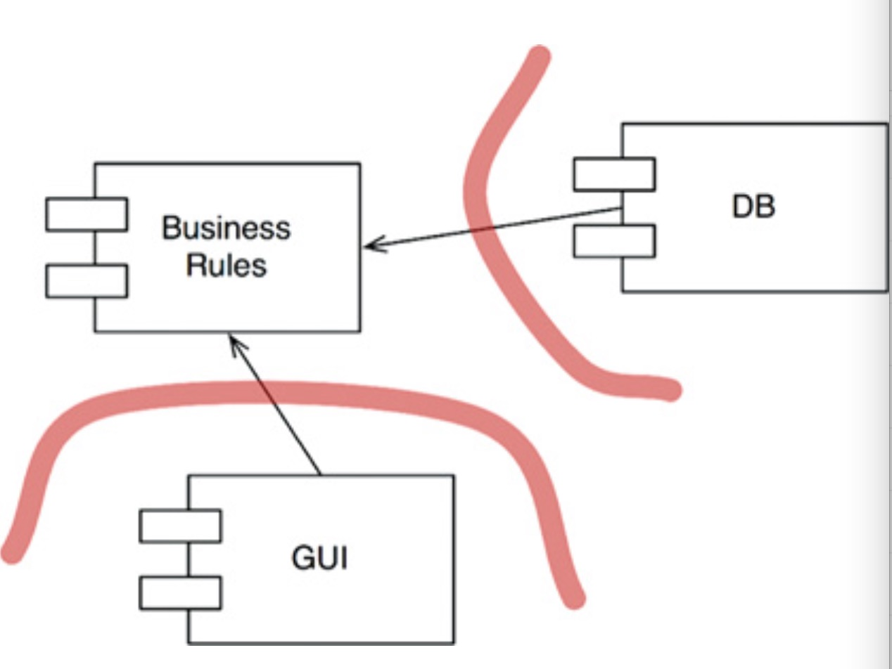

# 6.8. interface 和 web 编程

在项目中我们有可能遇到这样的场景：公司内的基础架构因为技术实力原因，最早是从别人那里借来的 kv 存储方案。随着公司的发展，渐渐有大牛加入，想要甩掉这个借来的包袱自研 kv 存储，但接口与之前的 kv 存储不兼容。接入时需要业务改动接入代码，怎么写代码才能让我的核心业务逻辑不受这些外部资源变化影响呢。

## interface 与依赖反转

学习 Golang 时一般对 interface 都会建立较基本的理解。从架构的角度上来讲，interface 解决的最大的问题是依赖方向问题。例如在一个典型的 web 程序中：

TODOTODO 这里有图，标明控制流的方向

我们的控制流方向是从 controller -> logic -> dao，在不使用 interface 的前提下，我们在 controller 中需要 import logic 的 package，然后在 logic 中需要 import dao 的 package。这种 import 关系和控制流的方向是一致的，因为我们需要用到 a.x 函数，那么 import a 就显得自然而然了。而 import 意味着依赖，也就是说我们的依赖方向与控制流的方向是完全一致的。

从架构的角度讲，这个控制流会给我们带来很多问题：

1. dao 的变动必然会引起 logic 的变动
2. 核心的业务逻辑 logic 代码变动会给我们带来较大的风险
3. 项目的依赖于大量的外部服务、组件，难以测试

本节主要解决 1 和 2 两个问题。

interface 这时候就成为了我们的救星，如果我们在 a->b 这个控制方向上不满意，不想让 b 的变化引起 a 的不适，那么我们就在 a 与 b 之间插入一层 interface。

```go
controller -> logic (interfaces defined in package a) <- dao
```

通过插入一层 interface，代码中的依赖方向发生了变化，如图：

TODOTODO，这里是控制流和依赖流的示意图。

这样就可以让 logic 摆脱了对 dao 的依赖，从而将 logic 的代码保护了起来。就像 Uncle Bob 所描述的那样：



dao(DB) 成为了 logic(business rules) 的 plugin(插件)。如果我们要把 dao 里的 kv 数据库从 rocksdb(假如) 替换为自研的 thrift 协议 kv 存储，那么新的 dao 实现也只要遵从之前定义好的 interface 就可以，logic 不需要任何变化。这就是所谓的插件化架构。

## 实例

稍微具体一点：

```go
// src/dto
type Order struct {
    OrderID int64
    UserID int64
    ProductID int64
    CreateTime time.Time
}

// src/logic
type OrderRep interface {
    func Save(r dto.Order) error
    func Get(orderID int64) (dto.Order, error)
}

// one of many dependencies
var orderService OrderRep

// init order dependency
func InitOrderService(os OrderRep) error {
    orderService = os
}

// api provided by logic
func CreateOrder(orderID int64, userID int64, productID int64, createTime time.Time) error {
    o := Order{
        OrderID : orderID,
        UserID  : userID,
        ProductID : productID,
        CreateTime : createTime,
    }

    err := orderService.Save(o)

    if err != nil {
        // do someth
        return err
    }
    return nil
}

// src/dao/order
type OrderService struct {}

func (od *OrderService) Save(r dto.Order) error {
    // save this order
    return nil
}

func (od *OrderService) Get(orderID int64) (dto.Order, error) {
    // save this order
    return nil
}

// src/main
func initAllDependencies() {
    // order service init
    orderService := orderdao.OrderService{}
    orderlogic.InitOrderService(orderService)
}

```

上面是一个简单将 order 的 dao 层和 logic 进行控制反转的例子。有了这种手段，我们可以将控制流中，logic 所有下层逻辑全部变成 logic 的插件。

用控制反转把我们的核心业务逻辑隔离出来的手段实际上也存在着一些争议，Uncle Bob 认为这是最佳实践，哪怕我们的项目模块没有那么复杂，也应该允许把这些内部的 interface 先设计好，并保留在项目中，以方便日后的扩展。但 interface 的引入多多少少会给项目带来一定程度的复杂性，而且有一部分 IDE 对 interface 的支持并不是非常好(比如非常流行的 vscode，在查找 interface 的 implementation 时就极其缓慢)。

总的来说，interface 依然是一种值得学习的方法，就算短时间内用不上。在未来某一天你被反复变动的下游逻辑恶心到的时候，大概会突然想起来可以用控制反转将变化控制在模块之内，那个时候自然对这种手段理解更为深刻了吧。
