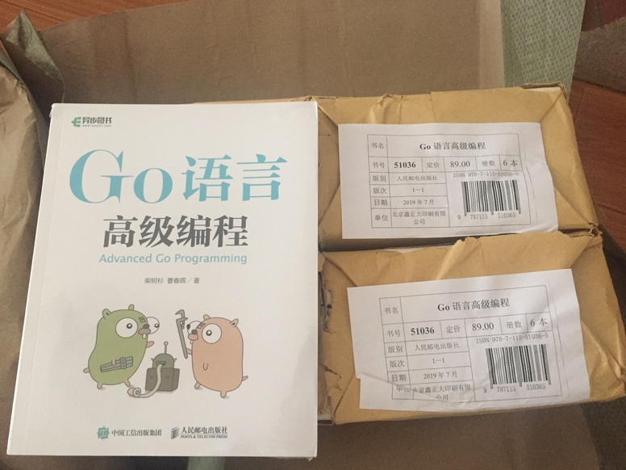
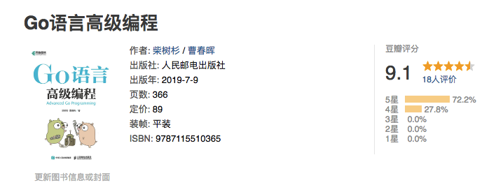
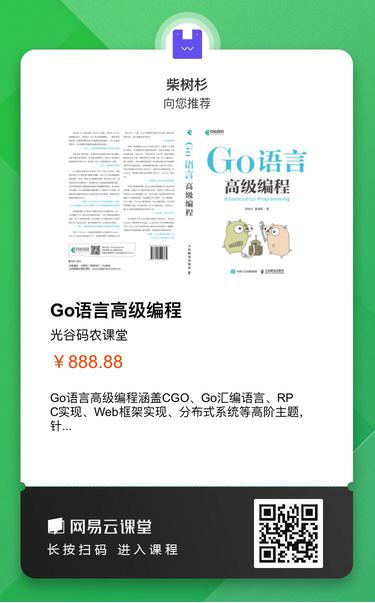

# Go语言高级编程(Advanced Go Programming)

本书涵盖CGO、Go汇编语言、RPC实现、Web框架实现、分布式系统等高阶主题，针对Go语言有一定经验想深入了解Go语言各种高级用法的开发人员。对于刚学习Go语言的读者，建议先从[《Go语言圣经》](https://github.com/golang-china/gopl-zh)开始系统学习Go语言的基础知识。如果希望了解Go2的最新动向，可以参考[《Go2编程指南》](https://github.com/chai2010/go2-book)。

- 作者：柴树杉，Github [@chai2010](https://github.com/chai2010)，Twitter [@chaishushan](https://twitter.com/chaishushan)
- 作者：曹春晖，Github [@cch123](https://github.com/cch123)
- 网址：https://github.com/chai2010/advanced-go-programming-book

购买链接：

- 京东：https://item.m.jd.com/product/12647494.html
- 异步：https://www.epubit.com/book/detail/40090

如果你喜欢本书，欢迎到豆瓣评论：

- https://book.douban.com/subject/34442131/

## 在线阅读

- https://chai2010.cn/advanced-go-programming-book/
- https://www.gitbook.com/book/chai2010/advanced-go-programming-book/

## 关注微信公众号 (guanggu-coder)

## 网易云课堂·光谷码农课堂

https://study.163.com/provider/480000001914454/index.htm

## 版权声明

 Go语言高级编程 由 <a xmlns:cc="http://creativecommons.org/ns#" href="https://github.com/chai2010/advanced-go-programming-book" property="cc:attributionName" rel="cc:attributionURL">柴树杉，曹春晖</a> 采用 <a rel="license" href="http://creativecommons.org/licenses/by-nc-nd/4.0/">知识共享 署名-非商业性使用-禁止演绎 4.0 国际 许可协议</a>进行许可。

严禁任何商业行为使用或引用该文档的全部或部分内容！

欢迎大家提供建议！

-------

# 序言

2009年11月，Google发布了Go语言，在世界范围内引发了轰动。2015年和2016年中国区的Go语言大会分别在上海和北京召开，来自Go语言团队的开发人员均作了相关的报告。纵观这几年来的发展趋势，Go语言已经成为云计算、云存储时代最重要的基础编程语言。

中国的Go语言社区是全球最大的Go语言社区，我们不仅仅从一开始就始终紧跟着Go语言的发展脚步，同时也为Go语言的发展作出了自己的巨大贡献。来自中国深圳的韦光京（vcc.163@gmail.com）在2010年前后，关于MinGW的工作奠定了Go语言对Windows平台的支持，同时也奠定了CGO对Windows平台的支持。同样来自中国的Minux（minux.ma@gmail.com）则作为Go语言核心团队的成员，他参与了大量的Go语言核心设计和开发评审工作。同时还有大量的国内Go语言爱好者积极参与了BUG的汇报和修复等工作（作者也是其中之一）。

截至2018年，中国出版的Go语言相关教程有近15本之多，内容主要涵盖Go语言基础编程、Web编程、并发编程和内部源码剖析等诸多领域。但作为Go语言的资深用户，作者关注的Go语言话题远远不止这些内容。其中CGO特性实现了Go语言对C语言和C++语言的支持，使得Go语言可以无缝继承C/C++世界数十年来积累的巨大软件资产。Go汇编语言更是提供了直接访问底层机器指令的方法，让我们可以无限压榨程序中热点代码的性能。目前国内互联网公司的新兴项目已经在逐渐向Go语言生态转移，大型分布式系统的开发实战经验也是大家关心的。这些高阶或前沿特性都是作者和本书所关注的话题。

本书针对有一定Go语言经验，想深入了解Go语言各种高级用法的开发人员。对于Go语言新手，在阅读本书前建议先熟读D&K的[《The Go Programming Language》](https://gopl.io/)。最后，希望这本书能够帮助大家更深入地了解Go语言。

chai2010 - 2018年 8 月 于 武汉

# 致谢

首先感谢Go语言之父和每一个为Go语言提交过补丁的朋友。感谢fango的第一本以Go语言为主题的网络小说《胡文Go.ogle》和第一本中文Go语言图书《Go语言·云动力》，是你的分享让带起了大家学习Go语言的热情。感谢韦光京对Windows平台CGO的开创性工作，不然本书可能不会有专门的CGO章节。感谢为本书提交过issue或PR的朋友（特别是fuwensun、lewgun等），你们的关注和支持是作者写作的最大动力。

谢谢大家！
